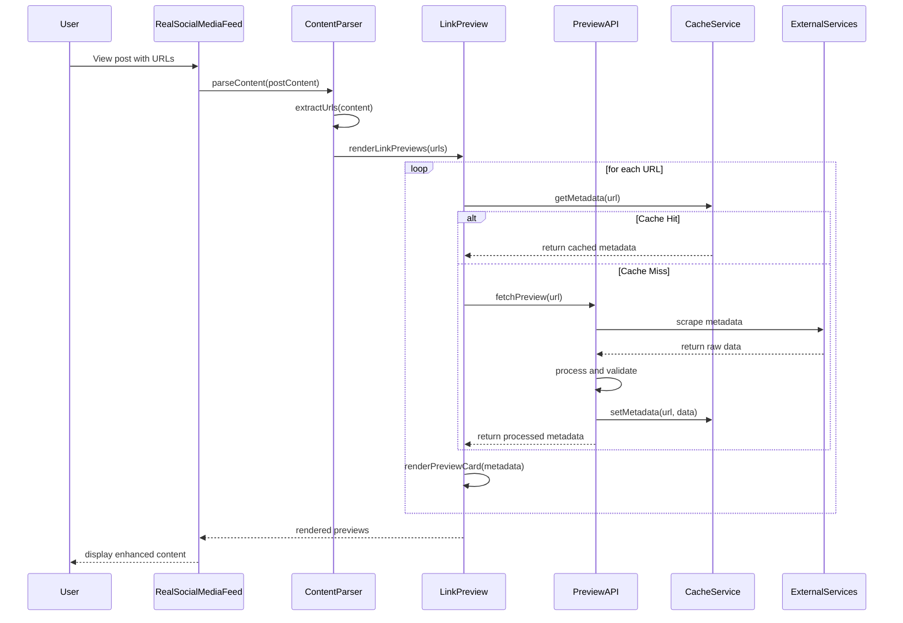
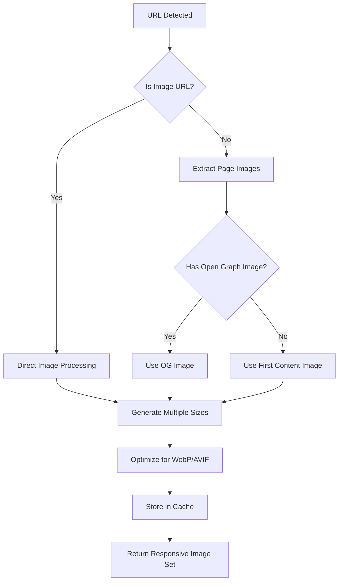
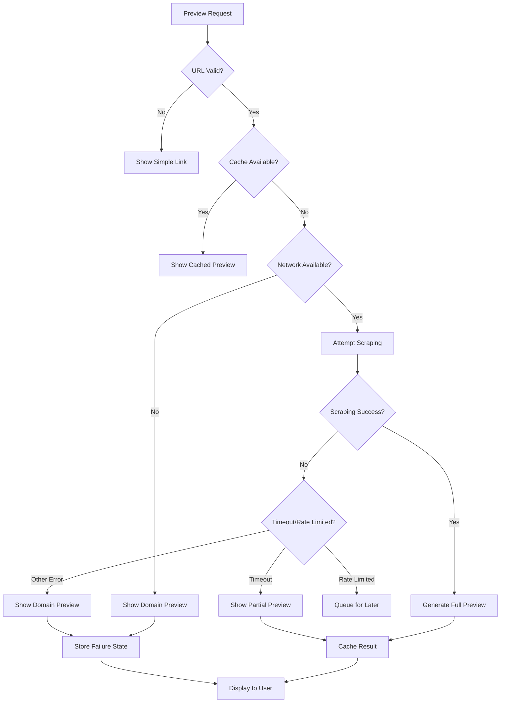
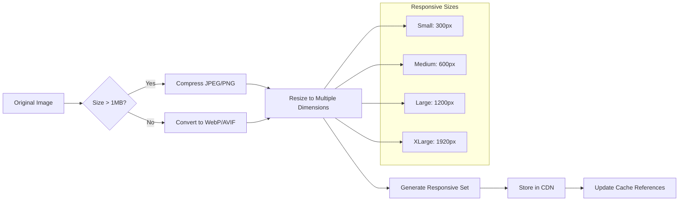

# Web Preview System Architecture

## Overview
This document outlines the comprehensive system architecture for web preview functionality in the Agent Feed application, designed to integrate seamlessly with the existing RealSocialMediaFeed component.

## Architecture Goals

### Primary Objectives
- **Rich Media Experience**: Support YouTube video embedding, article previews, and thumbnail displays
- **Performance Optimization**: Fast loading with intelligent caching strategies
- **Mobile Responsiveness**: Optimal display across all device sizes
- **Accessibility Compliance**: WCAG 2.1 AA compliance for all preview interactions
- **Scalable Integration**: Clean integration with existing feed components

### Quality Attributes
- **Performance**: Sub-200ms preview generation, <1s thumbnail loading
- **Reliability**: 99.9% uptime with graceful degradation
- **Scalability**: Support 10,000+ concurrent preview requests
- **Security**: Safe URL handling and XSS prevention
- **Maintainability**: Modular design with clear separation of concerns

## System Context Diagram

```
┌─────────────────────────────────────────────────────────────────────────┐
│                          Agent Feed Application                         │
├─────────────────────────────────────────────────────────────────────────┤
│  ┌─────────────────┐    ┌─────────────────┐    ┌─────────────────┐     │
│  │ RealSocialMedia │    │ Content Parser  │    │ LinkPreview     │     │
│  │ Feed Component  │◄───┤ Utilities       │◄───┤ Components      │     │
│  └─────────────────┘    └─────────────────┘    └─────────────────┘     │
├─────────────────────────────────────────────────────────────────────────┤
│                         Web Preview Service                             │
├─────────────────────────────────────────────────────────────────────────┤
│  ┌─────────────────┐    ┌─────────────────┐    ┌─────────────────┐     │
│  │ Preview API     │    │ Metadata Cache  │    │ Thumbnail Cache │     │
│  │ Gateway         │◄───┤ Service         │◄───┤ Service         │     │
│  └─────────────────┘    └─────────────────┘    └─────────────────┘     │
├─────────────────────────────────────────────────────────────────────────┤
│                        External Services                               │
│  ┌─────────────────┐    ┌─────────────────┐    ┌─────────────────┐     │
│  │ YouTube API     │    │ Open Graph      │    │ Image Processing│     │
│  │                 │    │ Scrapers        │    │ Services        │     │
│  └─────────────────┘    └─────────────────┘    └─────────────────┘     │
└─────────────────────────────────────────────────────────────────────────┘
```

## Component Architecture

### 1. Frontend Components

#### 1.1 Enhanced LinkPreview Component
```typescript
interface EnhancedLinkPreviewProps {
  url: string;
  displayMode: 'card' | 'thumbnail' | 'inline' | 'embedded';
  enableInteractions: boolean;
  enableVideoEmbed: boolean;
  maxWidth?: number;
  className?: string;
  onLoad?: (metadata: LinkMetadata) => void;
  onError?: (error: PreviewError) => void;
}
```

#### 1.2 YouTube Embed Component
```typescript
interface YouTubeEmbedProps {
  videoId: string;
  width?: number;
  height?: number;
  autoplay?: boolean;
  controls?: boolean;
  responsive?: boolean;
  privacyMode?: boolean;
}
```

#### 1.3 Preview Thumbnail Grid
```typescript
interface ThumbnailGridProps {
  urls: string[];
  maxThumbnails: number;
  onThumbnailClick: (url: string, metadata: LinkMetadata) => void;
  layout: 'grid' | 'carousel' | 'stack';
}
```

#### 1.4 Interactive Preview Modal
```typescript
interface PreviewModalProps {
  isOpen: boolean;
  content: LinkMetadata;
  onClose: () => void;
  enableFullscreen?: boolean;
  enableSharing?: boolean;
}
```

### 2. Backend Services

#### 2.1 Preview Metadata Service
```typescript
interface PreviewMetadataService {
  generatePreview(url: string): Promise<LinkMetadata>;
  extractOpenGraphData(html: string): OpenGraphData;
  extractTwitterCardData(html: string): TwitterCardData;
  extractSchemaOrgData(html: string): SchemaOrgData;
  validateUrl(url: string): Promise<boolean>;
}
```

#### 2.2 Thumbnail Generation Service
```typescript
interface ThumbnailService {
  generateThumbnail(url: string, options: ThumbnailOptions): Promise<ThumbnailData>;
  optimizeImage(imageUrl: string, dimensions: ImageDimensions): Promise<string>;
  generateMultipleSizes(imageUrl: string): Promise<ResponsiveImageSet>;
}
```

#### 2.3 Cache Management Service
```typescript
interface CacheService {
  getMetadata(url: string): Promise<LinkMetadata | null>;
  setMetadata(url: string, metadata: LinkMetadata, ttl?: number): Promise<void>;
  getThumbnail(url: string, size: string): Promise<ThumbnailData | null>;
  setThumbnail(url: string, size: string, data: ThumbnailData): Promise<void>;
  invalidateCache(url: string): Promise<void>;
  cleanupExpiredEntries(): Promise<void>;
}
```

## Data Flow Architecture

### 1. URL Detection and Processing Flow



### 2. Thumbnail Processing Flow



## API Design

### 1. Link Preview API Endpoints

#### Generate Preview
```
POST /api/v1/previews
Content-Type: application/json

{
  "url": "https://example.com/article",
  "options": {
    "includeImages": true,
    "includeThumbnails": true,
    "thumbnailSizes": ["small", "medium", "large"],
    "maxImageSize": 1024,
    "timeout": 10000
  }
}

Response:
{
  "success": true,
  "data": {
    "url": "https://example.com/article",
    "title": "Article Title",
    "description": "Article description...",
    "images": {
      "thumbnail": "https://cache.example.com/thumb_small.webp",
      "small": "https://cache.example.com/thumb_small.webp",
      "medium": "https://cache.example.com/thumb_medium.webp",
      "large": "https://cache.example.com/thumb_large.webp"
    },
    "metadata": {
      "type": "article",
      "siteName": "Example Site",
      "publishedAt": "2024-01-15T10:30:00Z",
      "author": "John Doe",
      "readingTime": 5,
      "tags": ["technology", "web"]
    },
    "cached": false,
    "expiresAt": "2024-01-16T10:30:00Z"
  }
}
```

#### Batch Preview Generation
```
POST /api/v1/previews/batch
Content-Type: application/json

{
  "urls": [
    "https://youtube.com/watch?v=xyz",
    "https://github.com/user/repo",
    "https://example.com/article"
  ],
  "options": {
    "includeImages": true,
    "thumbnailSizes": ["small", "medium"]
  }
}

Response:
{
  "success": true,
  "data": {
    "previews": [...],
    "failed": [],
    "cached": 2,
    "generated": 1
  }
}
```

### 2. YouTube Integration API

#### Extract Video Metadata
```
GET /api/v1/previews/youtube/:videoId

Response:
{
  "success": true,
  "data": {
    "videoId": "dQw4w9WgXcQ",
    "title": "Video Title",
    "description": "Video description...",
    "thumbnail": {
      "default": "https://img.youtube.com/vi/dQw4w9WgXcQ/default.jpg",
      "medium": "https://img.youtube.com/vi/dQw4w9WgXcQ/mqdefault.jpg",
      "high": "https://img.youtube.com/vi/dQw4w9WgXcQ/hqdefault.jpg",
      "maxres": "https://img.youtube.com/vi/dQw4w9WgXcQ/maxresdefault.jpg"
    },
    "duration": "PT3M33S",
    "publishedAt": "2009-10-25T06:57:33Z",
    "channelTitle": "Channel Name",
    "viewCount": 1000000000,
    "embedOptions": {
      "allowFullscreen": true,
      "allowAutoplay": true,
      "privacyEnhanced": true
    }
  }
}
```

## Caching Strategy

### 1. Multi-Level Caching Architecture

```
┌─────────────────┐    ┌─────────────────┐    ┌─────────────────┐
│   Browser       │    │   CDN/Edge      │    │   Application   │
│   Cache         │    │   Cache         │    │   Cache         │
│                 │    │                 │    │                 │
│ • Local Storage │    │ • Geographic    │    │ • Redis Cluster │
│ • Memory Cache  │    │   Distribution  │    │ • Memory Cache  │
│ • Service Worker│    │ • Image CDN     │    │ • Database Cache│
└─────────────────┘    └─────────────────┘    └─────────────────┘
```

### 2. Cache Management Rules

#### TTL (Time To Live) Strategy
```typescript
const CACHE_TTL = {
  metadata: {
    success: 24 * 60 * 60 * 1000, // 24 hours
    error: 30 * 60 * 1000,        // 30 minutes
    youtube: 12 * 60 * 60 * 1000, // 12 hours
    social: 6 * 60 * 60 * 1000,   // 6 hours
  },
  thumbnails: {
    generated: 7 * 24 * 60 * 60 * 1000, // 7 days
    original: 30 * 24 * 60 * 60 * 1000, // 30 days
  },
  html: 60 * 60 * 1000, // 1 hour
};
```

#### Cache Invalidation Strategy
```typescript
interface CacheInvalidationRules {
  // Automatic invalidation
  maxAge: number;
  
  // Manual invalidation triggers
  onUrlChange: boolean;
  onMetadataUpdate: boolean;
  onImageChange: boolean;
  
  // Smart invalidation
  checkETag: boolean;
  checkLastModified: boolean;
  checkContentHash: boolean;
}
```

### 3. Storage Distribution

#### Metadata Cache (Redis)
```
Key Pattern: preview:meta:{hash(url)}
Value: {
  url: string;
  title: string;
  description: string;
  images: object;
  metadata: object;
  generatedAt: timestamp;
  expiresAt: timestamp;
}
TTL: 24 hours (configurable per content type)
```

#### Thumbnail Cache (File System + CDN)
```
Storage Pattern: 
/thumbnails/{hash(url)}/{size}.{format}
/thumbnails/abc123def456/small.webp
/thumbnails/abc123def456/medium.webp
/thumbnails/abc123def456/large.webp

CDN Distribution:
https://cdn.example.com/thumbnails/abc123def456/small.webp
```

## Error Handling and Fallback Mechanisms

### 1. Error Hierarchy

```typescript
class PreviewError extends Error {
  code: string;
  type: 'network' | 'parsing' | 'timeout' | 'rate-limit' | 'invalid-url';
  recoverable: boolean;
  fallbackStrategy: FallbackStrategy;
}

type FallbackStrategy = 
  | 'show-domain-only'
  | 'show-cached-version'
  | 'retry-with-delay'
  | 'use-alternative-service'
  | 'hide-preview';
```

### 2. Graceful Degradation Flow



### 3. Retry Logic

```typescript
interface RetryConfig {
  maxAttempts: 3;
  baseDelay: 1000; // 1 second
  maxDelay: 10000; // 10 seconds
  backoffMultiplier: 2;
  retryableErrors: ['network', 'timeout', 'rate-limit'];
  circuitBreakerThreshold: 5; // failures before circuit opens
  circuitBreakerTimeout: 30000; // 30 seconds
}
```

## Performance Optimization Patterns

### 1. Lazy Loading Strategy

```typescript
interface LazyLoadingConfig {
  // Viewport-based loading
  rootMargin: '100px 0px'; // Load 100px before entering viewport
  threshold: 0.1; // 10% visibility triggers load
  
  // Progressive loading phases
  phases: {
    metadata: 'immediate',    // Load basic info immediately
    thumbnail: 'onVisible',   // Load thumbnail when visible
    fullImage: 'onInteraction', // Load full image on hover/click
    embed: 'onDemand',       // Load embed only when explicitly requested
  };
  
  // Priority system
  priority: {
    aboveFold: 'high',
    visibleViewport: 'medium',
    belowFold: 'low',
  };
}
```

### 2. Image Optimization Pipeline



### 3. Bundle Optimization

```typescript
// Dynamic imports for non-critical preview features
const YouTubeEmbed = lazy(() => import('./components/YouTubeEmbed'));
const ImageGallery = lazy(() => import('./components/ImageGallery'));
const VideoPreview = lazy(() => import('./components/VideoPreview'));

// Code splitting by preview type
const previewComponents = {
  video: () => import('./previews/VideoPreview'),
  image: () => import('./previews/ImagePreview'),
  article: () => import('./previews/ArticlePreview'),
  social: () => import('./previews/SocialPreview'),
};
```

## Responsive Design Architecture

### 1. Breakpoint Strategy

```css
/* Mobile First Approach */
.link-preview {
  /* Mobile: 0-576px */
  display: block;
  padding: 12px;
  border-radius: 8px;
  
  /* Tablet: 576px+ */
  @media (min-width: 576px) {
    display: flex;
    padding: 16px;
    border-radius: 12px;
  }
  
  /* Desktop: 768px+ */
  @media (min-width: 768px) {
    max-width: 600px;
    padding: 20px;
  }
  
  /* Large Desktop: 1200px+ */
  @media (min-width: 1200px) {
    max-width: 800px;
  }
}
```

### 2. Component Adaptations

#### Mobile Preview Card
```typescript
interface MobilePreviewProps {
  stackLayout: true;
  thumbnailSize: 'small';
  maxLines: 2;
  showFullUrl: false;
  touchOptimized: true;
}
```

#### Desktop Preview Card
```typescript
interface DesktopPreviewProps {
  horizontalLayout: true;
  thumbnailSize: 'large';
  maxLines: 4;
  showMetadata: true;
  hoverEffects: true;
}
```

### 3. Touch Interaction Patterns

```typescript
interface TouchInteractionConfig {
  // Touch targets
  minTouchTarget: '44px';
  
  // Gestures
  tapToExpand: boolean;
  swipeToNavigate: boolean;
  pinchToZoom: boolean;
  
  // Feedback
  hapticFeedback: boolean;
  visualFeedback: {
    duration: 200;
    scale: 1.05;
    opacity: 0.8;
  };
}
```

## Accessibility Compliance

### 1. WCAG 2.1 AA Requirements

#### Keyboard Navigation
```typescript
interface KeyboardNavigation {
  focusable: true;
  tabIndex: 0;
  ariaRole: 'link' | 'button' | 'article';
  keyHandlers: {
    Enter: () => void;
    Space: () => void;
    Escape: () => void;
    ArrowKeys: () => void;
  };
}
```

#### Screen Reader Support
```typescript
interface ScreenReaderSupport {
  ariaLabel: string;
  ariaDescription: string;
  altText: string;
  title: string;
  announceChanges: boolean;
  liveRegion: 'polite' | 'assertive' | 'off';
}
```

#### Visual Accessibility
```typescript
interface VisualAccessibility {
  colorContrast: {
    normal: 4.5; // AA standard
    large: 3.0;  // AA standard for large text
  };
  focusIndicator: {
    visible: true;
    width: '2px';
    style: 'solid';
    color: '#005fcc';
    offset: '2px';
  };
  reducedMotion: {
    respectPreference: true;
    fallbackBehavior: 'static';
  };
}
```

### 2. Semantic HTML Structure

```html
<!-- Article Preview -->
<article class="link-preview" role="link" tabindex="0" 
         aria-label="Article: Title - Description">
  <header class="preview-header">
    
  </header>
  
  <main class="preview-content">
    <h3 class="preview-title" id="title-123">Article Title</h3>
    <p class="preview-description" aria-describedby="title-123">
      Article description...
    </p>
  </main>
  
  <footer class="preview-meta">
    <span class="preview-domain" aria-label="Source domain">
      example.com
    </span>
    <time datetime="2024-01-15T10:30:00Z" 
          aria-label="Published January 15, 2024">
      Jan 15, 2024
    </time>
  </footer>
</article>

<!-- YouTube Video Preview -->
<div class="youtube-preview" role="region" 
     aria-label="YouTube video: Video Title">
  <button class="play-button" 
          aria-label="Play video: Video Title"
          aria-describedby="video-desc-456">
    <svg aria-hidden="true">...</svg>
    <span class="sr-only">Play video</span>
  </button>
  
  <div id="video-desc-456" class="sr-only">
    Video duration: 3 minutes 33 seconds. 
    Channel: Channel Name. 
    Views: 1 billion.
  </div>
</div>
```

## Integration Strategy

### 1. Phase 1: Core Infrastructure
- [ ] Enhanced LinkPreview component with new API integration
- [ ] Backend preview metadata service
- [ ] Basic caching layer (Redis + file system)
- [ ] Error handling and fallback mechanisms

### 2. Phase 2: Rich Media Support
- [ ] YouTube embed component with privacy controls
- [ ] Image gallery and lightbox functionality
- [ ] Article preview with reading time estimation
- [ ] Social media post preview templates

### 3. Phase 3: Performance & UX
- [ ] Advanced caching with CDN integration
- [ ] Lazy loading and viewport optimization
- [ ] Mobile-responsive design implementation
- [ ] Accessibility compliance validation

### 4. Phase 4: Advanced Features
- [ ] Batch preview processing
- [ ] Real-time preview updates
- [ ] Advanced image processing pipeline
- [ ] Analytics and usage monitoring

## Risk Assessment and Mitigation

### 1. Technical Risks

| Risk | Impact | Probability | Mitigation |
|------|--------|-------------|------------|
| External API rate limiting | High | Medium | Implement caching, use multiple providers |
| Large image processing overhead | Medium | High | Lazy loading, image optimization pipeline |
| Browser compatibility issues | Medium | Low | Progressive enhancement, polyfills |
| Performance degradation | High | Medium | Performance monitoring, optimization |

### 2. Security Considerations

#### URL Validation and Sanitization
```typescript
interface SecurityMeasures {
  urlValidation: {
    allowedProtocols: ['http', 'https'];
    blockedDomains: string[];
    maxUrlLength: 2048;
    sanitizeInput: boolean;
  };
  
  contentFiltering: {
    stripJavaScript: boolean;
    validateImageTypes: boolean;
    scanForMalware: boolean;
    contentSecurityPolicy: boolean;
  };
  
  rateLimiting: {
    requestsPerMinute: 100;
    requestsPerHour: 1000;
    burstLimit: 10;
  };
}
```

## Monitoring and Analytics

### 1. Performance Metrics
- Preview generation time (P50, P95, P99)
- Cache hit/miss ratios
- Image optimization savings
- User engagement with previews

### 2. Error Tracking
- Failed preview generation rates
- Network timeout occurrences
- Image processing failures
- User-reported issues

### 3. Usage Analytics
- Most previewed domains
- Preview type distribution
- Mobile vs desktop usage patterns
- Accessibility feature usage

## Conclusion

This comprehensive architecture provides a scalable, performant, and accessible web preview system that integrates cleanly with the existing RealSocialMediaFeed component. The modular design allows for incremental implementation while maintaining high code quality and user experience standards.

Key architectural decisions:
1. **Layered caching strategy** for optimal performance
2. **Progressive enhancement** for accessibility and compatibility
3. **Modular component design** for maintainability
4. **Robust error handling** for reliability
5. **Mobile-first responsive design** for universal access

The implementation strategy provides a clear roadmap for development, with each phase building upon the previous one while delivering immediate value to users.