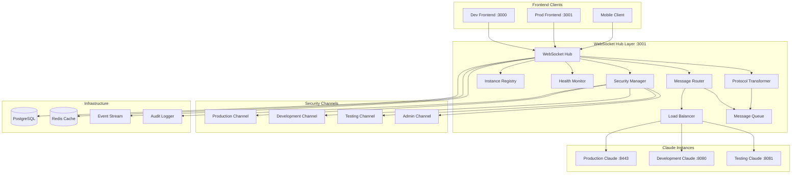
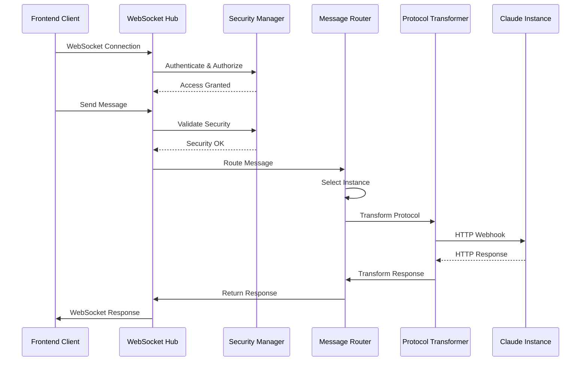
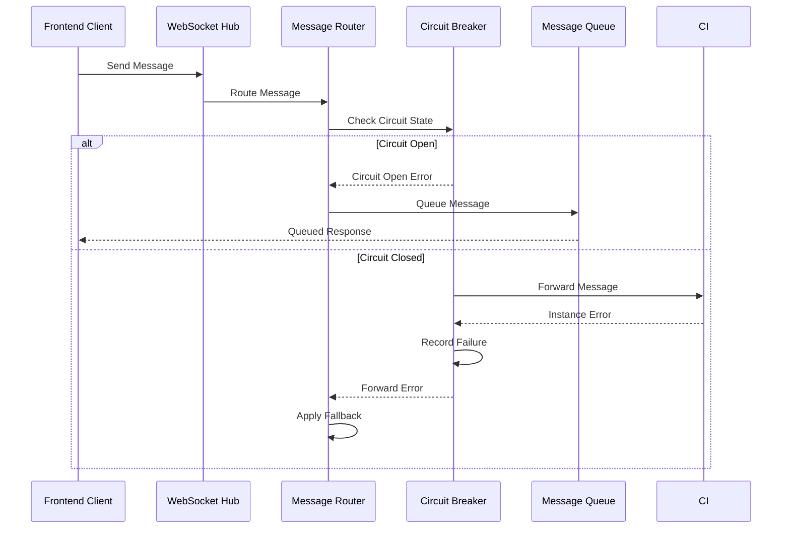

# WebSocket Hub Architecture - SPARC Architecture

## Phase 3: System Architecture and Component Design

This document defines the detailed system architecture for the WebSocket Hub, including component relationships, data flows, security layers, and deployment topologies.

## 3.1 High-Level Architecture Overview



## 3.2 Core Components Architecture

### 3.2.1 WebSocket Hub Core
```typescript
interface WebSocketHubCore {
  // Core Hub Properties
  server: SocketIOServer;
  port: number;
  connections: Map<string, ClientConnection>;
  
  // Component Dependencies
  securityManager: SecurityManager;
  messageRouter: MessageRouter;
  protocolTransformer: ProtocolTransformer;
  instanceRegistry: InstanceRegistry;
  healthMonitor: HealthMonitor;
  
  // Configuration
  config: HubConfiguration;
  
  // Lifecycle Methods
  initialize(): Promise<void>;
  start(): Promise<void>;
  stop(): Promise<void>;
  
  // Connection Management
  handleConnection(socket: Socket): void;
  handleDisconnection(socketId: string): void;
  
  // Message Processing
  processMessage(message: Message, context: Context): Promise<void>;
  broadcastMessage(channel: string, message: Message): void;
}

interface HubConfiguration {
  port: number;
  cors: CORSConfig;
  security: SecurityConfig;
  instances: InstanceConfig[];
  channels: ChannelConfig[];
  performance: PerformanceConfig;
  monitoring: MonitoringConfig;
}
```

### 3.2.2 Security Manager Architecture
```typescript
interface SecurityManager {
  // Channel Management
  channels: Map<string, SecurityChannel>;
  
  // Authentication & Authorization
  tokenValidator: JWTValidator;
  rbacManager: RBACManager;
  mfaValidator: MFAValidator;
  
  // Security Policies
  accessPolicies: Map<string, AccessPolicy>;
  encryptionManager: EncryptionManager;
  auditLogger: AuditLogger;
  
  // Channel Operations
  validateChannelAccess(user: User, channel: string): Promise<boolean>;
  createSecureChannel(config: ChannelConfig): SecurityChannel;
  enforceSecurityPolicies(message: Message): Promise<void>;
  
  // Production-Specific Security
  validateProductionAccess(user: User): Promise<boolean>;
  enforceTimeBasedAccess(user: User): boolean;
  validateIPWhitelist(ipAddress: string): boolean;
  
  // Audit & Compliance
  logSecurityEvent(event: SecurityEvent): void;
  generateSecurityReport(): SecurityReport;
}

interface SecurityChannel {
  id: string;
  name: string;
  securityLevel: 'low' | 'medium' | 'high' | 'critical';
  requiredRoles: string[];
  encryptionRequired: boolean;
  mfaRequired: boolean;
  ipWhitelist?: string[];
  timeRestrictions?: TimeWindow[];
  maxConnections: number;
  sessionTimeout: number;
}
```

### 3.2.3 Message Router Architecture
```typescript
interface MessageRouter {
  // Routing Configuration
  routingTable: Map<string, Route>;
  loadBalancer: LoadBalancer;
  circuitBreakers: Map<string, CircuitBreaker>;
  
  // Routing Strategies
  strategies: {
    production: ProductionRoutingStrategy;
    development: DevelopmentRoutingStrategy;
    testing: TestingRoutingStrategy;
  };
  
  // Routing Operations
  routeMessage(message: Message, context: Context): Promise<RoutingResult>;
  selectTargetInstance(message: Message, context: Context): ClaudeInstance;
  applyFallbackStrategy(message: Message, context: Context): ClaudeInstance;
  
  // Route Management
  addRoute(route: Route): void;
  removeRoute(routeId: string): void;
  updateRoute(routeId: string, route: Route): void;
  
  // Health Integration
  handleInstanceHealthChange(instanceId: string, health: HealthStatus): void;
}

interface Route {
  id: string;
  pattern: MessagePattern;
  targetInstance: string;
  priority: number;
  conditions: RoutingCondition[];
  fallbackRoutes: string[];
  enabled: boolean;
}

interface RoutingResult {
  success: boolean;
  targetInstance: ClaudeInstance;
  routeUsed: string;
  fallbackApplied: boolean;
  latency: number;
  error?: Error;
}
```

### 3.2.4 Protocol Transformer Architecture
```typescript
interface ProtocolTransformer {
  // Transformation Engines
  wsToWebhookTransformer: WSToWebhookTransformer;
  webhookToWSTransformer: WebhookToWSTransformer;
  messageValidator: MessageValidator;
  
  // Content Processors
  encryptionProcessor: EncryptionProcessor;
  compressionProcessor: CompressionProcessor;
  serializationProcessor: SerializationProcessor;
  
  // Transformation Operations
  transformToWebhook(message: WebSocketMessage): Promise<WebhookPayload>;
  transformFromWebhook(response: WebhookResponse): Promise<WebSocketMessage>;
  
  // Validation & Sanitization
  validateMessage(message: Message): ValidationResult;
  sanitizePayload(payload: any): any;
  
  // Configuration
  transformationRules: Map<string, TransformationRule>;
  instanceConfigs: Map<string, InstanceConfig>;
}

interface TransformationRule {
  id: string;
  sourceType: 'websocket' | 'webhook';
  targetType: 'websocket' | 'webhook';
  conditions: TransformationCondition[];
  processors: TransformationProcessor[];
  priority: number;
}
```

## 3.3 Instance Registry Architecture

### 3.3.1 Dynamic Registration System
```typescript
interface InstanceRegistry {
  // Instance Storage
  instances: Map<string, ClaudeInstance>;
  healthStatuses: Map<string, HealthStatus>;
  
  // Registration Management
  registrationQueue: Queue<RegistrationRequest>;
  discoveryService: ServiceDiscovery;
  
  // Instance Operations
  registerInstance(request: RegistrationRequest): Promise<string>;
  deregisterInstance(instanceId: string): Promise<void>;
  updateInstanceStatus(instanceId: string, status: InstanceStatus): void;
  
  // Discovery & Lookup
  discoverInstances(): Promise<ClaudeInstance[]>;
  getInstanceById(instanceId: string): ClaudeInstance | null;
  getInstancesByType(type: InstanceType): ClaudeInstance[];
  getHealthyInstances(): ClaudeInstance[];
  
  // Health Integration
  performHealthCheck(instanceId: string): Promise<HealthStatus>;
  handleUnhealthyInstance(instanceId: string): Promise<void>;
}

interface ClaudeInstance {
  id: string;
  type: 'production' | 'development' | 'testing';
  endpoint: string;
  port: number;
  version: string;
  capabilities: string[];
  metadata: InstanceMetadata;
  
  // Status Information
  status: 'active' | 'inactive' | 'degraded' | 'maintenance';
  registeredAt: Date;
  lastHeartbeat: Date;
  healthScore: number;
  
  // Configuration
  maxConnections: number;
  timeout: number;
  retries: number;
  
  // Security
  authenticationRequired: boolean;
  certificateFingerprint?: string;
  allowedOrigins: string[];
}
```

### 3.3.2 Service Discovery Integration
```typescript
interface ServiceDiscovery {
  // Discovery Methods
  consul?: ConsulDiscovery;
  etcd?: EtcdDiscovery;
  kubernetes?: KubernetesDiscovery;
  
  // Discovery Operations
  discoverServices(): Promise<ServiceInstance[]>;
  watchServices(callback: (instances: ServiceInstance[]) => void): void;
  registerService(instance: ServiceInstance): Promise<void>;
  deregisterService(instanceId: string): Promise<void>;
  
  // Health Checks
  performHealthCheck(instance: ServiceInstance): Promise<boolean>;
  updateHealthStatus(instanceId: string, status: HealthStatus): Promise<void>;
}
```

## 3.4 Health Monitoring Architecture

### 3.4.1 Multi-Layer Health Monitoring
```typescript
interface HealthMonitor {
  // Monitoring Components
  instanceMonitors: Map<string, InstanceMonitor>;
  systemMonitor: SystemMonitor;
  networkMonitor: NetworkMonitor;
  
  // Health Checking
  checkInterval: number;
  healthThresholds: HealthThresholds;
  
  // Monitoring Operations
  startMonitoring(): void;
  stopMonitoring(): void;
  performHealthCheck(instanceId: string): Promise<HealthStatus>;
  generateHealthReport(): HealthReport;
  
  // Event Handling
  onInstanceHealthChange(callback: HealthChangeCallback): void;
  handleHealthAlert(alert: HealthAlert): void;
  
  // Recovery Actions
  triggerRecoveryAction(instanceId: string, action: RecoveryAction): Promise<void>;
  scheduleMaintenanceMode(instanceId: string, duration: number): void;
}

interface HealthStatus {
  instanceId: string;
  status: 'healthy' | 'degraded' | 'unhealthy' | 'unknown';
  lastCheck: Date;
  responseTime: number;
  consecutiveFailures: number;
  
  // Detailed Metrics
  metrics: {
    cpu: number;
    memory: number;
    disk: number;
    network: number;
    connections: number;
  };
  
  // Error Information
  errors: HealthError[];
  warnings: HealthWarning[];
  
  // Performance Indicators
  throughput: number;
  errorRate: number;
  availability: number;
}
```

## 3.5 Load Balancing Architecture

### 3.5.1 Intelligent Load Balancer
```typescript
interface LoadBalancer {
  // Balancing Strategies
  strategies: {
    roundRobin: RoundRobinStrategy;
    weightedRoundRobin: WeightedRoundRobinStrategy;
    leastConnections: LeastConnectionsStrategy;
    responseTime: ResponseTimeStrategy;
    hash: HashStrategy;
  };
  
  // Current Strategy
  activeStrategy: LoadBalancingStrategy;
  
  // Instance Management
  availableInstances: Set<string>;
  instanceWeights: Map<string, number>;
  connectionCounts: Map<string, number>;
  responseMetrics: Map<string, ResponseMetrics>;
  
  // Load Balancing Operations
  selectInstance(message: Message, context: Context): ClaudeInstance;
  updateInstanceWeight(instanceId: string, weight: number): void;
  removeInstanceFromPool(instanceId: string): void;
  addInstanceToPool(instanceId: string): void;
  
  // Strategy Management
  setStrategy(strategy: LoadBalancingStrategy): void;
  getStrategyMetrics(): StrategyMetrics;
}

interface LoadBalancingStrategy {
  name: string;
  description: string;
  
  // Strategy Implementation
  selectInstance(
    instances: ClaudeInstance[],
    context: SelectionContext
  ): ClaudeInstance;
  
  // Weight Calculation
  calculateWeight(instance: ClaudeInstance): number;
  updateWeights(instances: ClaudeInstance[]): void;
  
  // Configuration
  config: StrategyConfig;
}
```

## 3.6 Message Queue Architecture

### 3.6.1 Persistent Message Queue
```typescript
interface MessageQueue {
  // Queue Storage
  queues: Map<string, Queue<QueuedMessage>>;
  persistence: MessagePersistence;
  deadLetterQueue: Queue<DeadLetterMessage>;
  
  // Queue Configuration
  maxQueueSize: number;
  retryPolicy: RetryPolicy;
  ttl: number;
  
  // Queue Operations
  enqueueMessage(channelId: string, message: Message): Promise<void>;
  dequeueMessage(channelId: string): Promise<QueuedMessage | null>;
  processQueue(channelId: string): Promise<void>;
  
  // Retry Management
  requeueMessage(message: QueuedMessage, delay: number): Promise<void>;
  moveToDeadLetter(message: QueuedMessage, reason: string): Promise<void>;
  
  // Queue Monitoring
  getQueueMetrics(channelId: string): QueueMetrics;
  purgeQueue(channelId: string): Promise<void>;
  
  // Persistence
  persistMessage(message: QueuedMessage): Promise<void>;
  restoreMessages(): Promise<void>;
}

interface QueuedMessage {
  id: string;
  originalMessage: Message;
  channelId: string;
  
  // Queue Metadata
  queuedAt: Date;
  attempts: number;
  maxRetries: number;
  nextRetryAt?: Date;
  
  // Processing State
  status: 'pending' | 'processing' | 'completed' | 'failed';
  error?: Error;
  
  // Priority
  priority: number;
  timeoutAt?: Date;
}
```

## 3.7 Event-Driven Architecture

### 3.7.1 Event System Design
```typescript
interface EventSystem {
  // Event Management
  eventBus: EventBus;
  eventStore: EventStore;
  eventHandlers: Map<string, EventHandler[]>;
  
  // Event Operations
  emit(eventType: string, data: any, metadata?: EventMetadata): Promise<void>;
  subscribe(eventType: string, handler: EventHandler): void;
  unsubscribe(eventType: string, handler: EventHandler): void;
  
  // Event Processing
  processEvent(event: Event): Promise<void>;
  processEventBatch(events: Event[]): Promise<void>;
  
  // Event Persistence
  storeEvent(event: Event): Promise<void>;
  getEventHistory(filter: EventFilter): Promise<Event[]>;
  
  // Event Replay
  replayEvents(fromTimestamp: Date, toTimestamp: Date): Promise<void>;
}

interface Event {
  id: string;
  type: string;
  data: any;
  metadata: EventMetadata;
  timestamp: Date;
  version: number;
}

interface EventMetadata {
  source: string;
  correlationId?: string;
  causationId?: string;
  userId?: string;
  sessionId?: string;
}
```

## 3.8 Security Architecture Layers

### 3.8.1 Multi-Layer Security Model
```
┌─────────────────────────────────────────┐
│           Transport Security            │
│     TLS 1.3, Certificate Pinning       │
├─────────────────────────────────────────┤
│          Authentication Layer           │
│    JWT, OAuth 2.0, Multi-Factor        │
├─────────────────────────────────────────┤
│          Authorization Layer            │
│      RBAC, ABAC, Channel Policies       │
├─────────────────────────────────────────┤
│            Message Security             │
│    Encryption, Signing, Validation      │
├─────────────────────────────────────────┤
│           Network Security              │
│    Firewalls, IP Filtering, VPC         │
├─────────────────────────────────────────┤
│         Infrastructure Security         │
│   Container Security, Host Hardening    │
└─────────────────────────────────────────┘
```

### 3.8.2 Channel Isolation Architecture
```typescript
interface ChannelIsolation {
  // Isolation Mechanisms
  networkIsolation: NetworkIsolation;
  processIsolation: ProcessIsolation;
  dataIsolation: DataIsolation;
  
  // Channel Configurations
  channels: {
    production: ProductionChannel;
    development: DevelopmentChannel;
    testing: TestingChannel;
    admin: AdminChannel;
  };
  
  // Isolation Operations
  enforceChannelBoundaries(message: Message, context: Context): Promise<void>;
  validateCrossChannelAccess(request: CrossChannelRequest): Promise<boolean>;
  
  // Monitoring
  monitorChannelActivity(channelId: string): void;
  detectSecurityViolations(): SecurityViolation[];
}

interface ProductionChannel extends SecurityChannel {
  // Production-Specific Security
  mfaRequired: true;
  encryptionRequired: true;
  auditRequired: true;
  
  // Access Controls
  ipWhitelist: string[];
  timeRestrictions: ProductionTimeWindow[];
  maxConcurrentSessions: number;
  
  // Additional Validations
  certificateValidation: boolean;
  deviceRegistration: boolean;
  geolocationRestrictions: boolean;
}
```

## 3.9 Data Flow Architecture

### 3.9.1 Message Flow Patterns


### 3.9.2 Error Flow Patterns


## 3.10 Deployment Architecture

### 3.10.1 Container Deployment
```yaml
# docker-compose.yml for WebSocket Hub
version: '3.8'
services:
  websocket-hub:
    image: websocket-hub:latest
    ports:
      - "3001:3001"
    environment:
      - NODE_ENV=production
      - HUB_PORT=3001
      - REDIS_URL=redis://redis:6379
      - DATABASE_URL=postgres://user:pass@db:5432/agentfeed
    depends_on:
      - redis
      - postgres
      - consul
    networks:
      - hub-network
      - claude-network

  security-manager:
    image: security-manager:latest
    environment:
      - ENCRYPTION_KEY_PATH=/secrets/encryption.key
      - JWT_SECRET_PATH=/secrets/jwt.secret
    volumes:
      - ./secrets:/secrets:ro
    networks:
      - hub-network

  instance-registry:
    image: instance-registry:latest
    environment:
      - CONSUL_URL=consul:8500
      - HEALTH_CHECK_INTERVAL=30s
    networks:
      - hub-network
      - claude-network

networks:
  hub-network:
    driver: bridge
  claude-network:
    driver: bridge
    ipam:
      config:
        - subnet: 172.20.0.0/16
```

### 3.10.2 Kubernetes Deployment
```yaml
apiVersion: apps/v1
kind: Deployment
metadata:
  name: websocket-hub
  namespace: agent-feed
spec:
  replicas: 3
  selector:
    matchLabels:
      app: websocket-hub
  template:
    metadata:
      labels:
        app: websocket-hub
    spec:
      containers:
      - name: websocket-hub
        image: websocket-hub:1.0.0
        ports:
        - containerPort: 3001
        env:
        - name: HUB_PORT
          value: "3001"
        - name: NODE_ENV
          value: "production"
        resources:
          requests:
            memory: "256Mi"
            cpu: "250m"
          limits:
            memory: "512Mi"
            cpu: "500m"
        livenessProbe:
          httpGet:
            path: /health
            port: 3001
          initialDelaySeconds: 30
          periodSeconds: 10
        readinessProbe:
          httpGet:
            path: /ready
            port: 3001
          initialDelaySeconds: 5
          periodSeconds: 5
---
apiVersion: v1
kind: Service
metadata:
  name: websocket-hub-service
  namespace: agent-feed
spec:
  selector:
    app: websocket-hub
  ports:
  - protocol: TCP
    port: 3001
    targetPort: 3001
  type: LoadBalancer
```

## Next Phase: Refinement

The next phase will focus on:
1. Performance optimization strategies
2. Error handling and recovery mechanisms
3. Monitoring and alerting systems
4. Security hardening measures
5. Scalability improvements

---

*Document Version: 1.0*
*Last Updated: 2025-08-21*
*Author: WebSocket Hub Architecture Team*