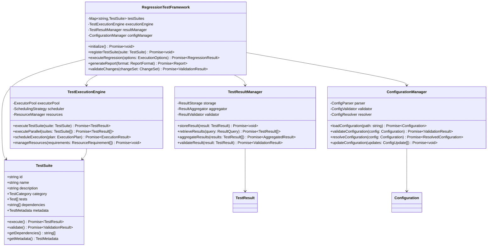
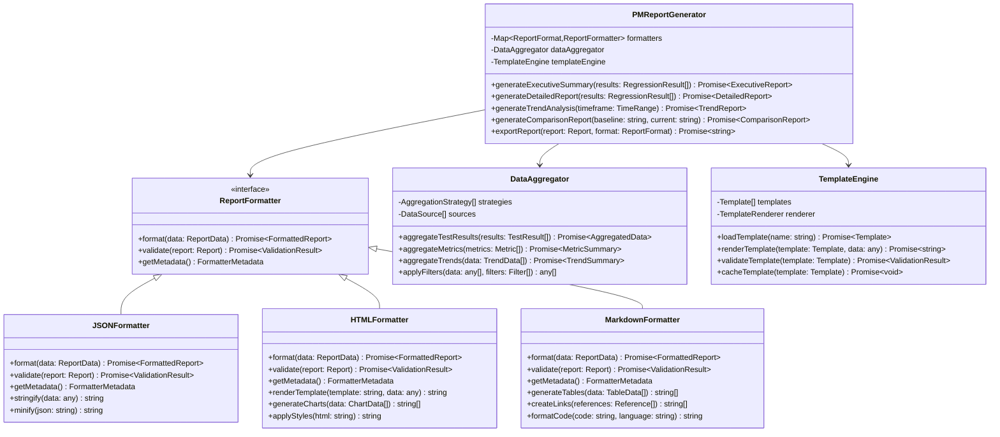
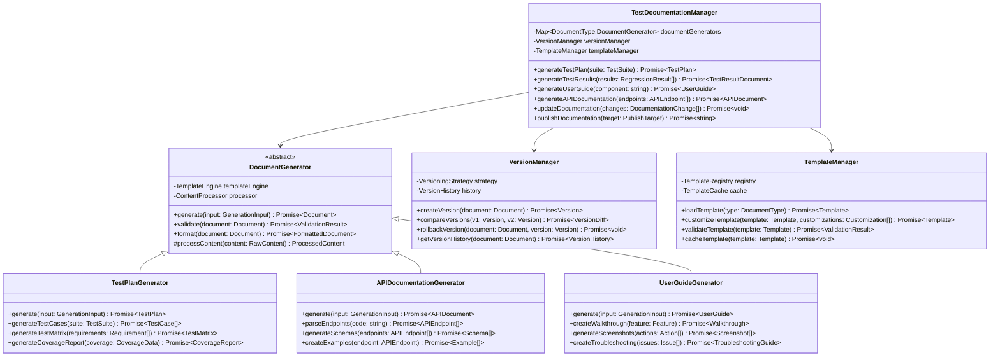
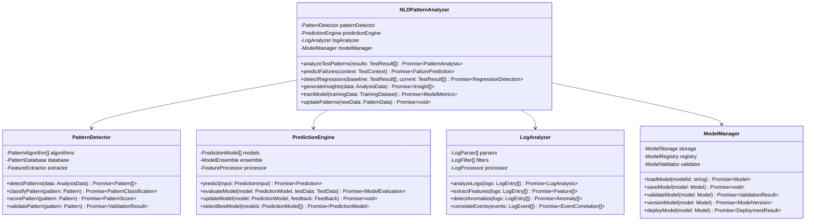
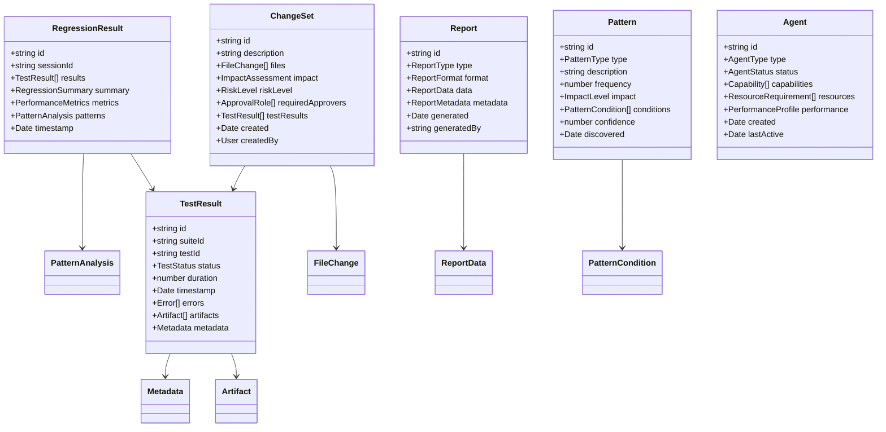

# Regression Testing System - Class Diagrams

## Core Class Hierarchies

### 1. RegressionTestFramework Class Hierarchy

### 2. PMReportGenerator Class Hierarchy

### 3. TestDocumentationManager Class Hierarchy

### 4. ChangeVerificationSystem Class Hierarchy

```mermaid
classDiagram
    class ChangeVerificationSystem {
        -WorkflowEngine workflowEngine
        -NotificationService notificationService
        -ApprovalManager approvalManager
        -ValidationRuleEngine validationRules
        +submitForVerification(changeSet: ChangeSet) Promise~VerificationRequest~
        +processVerificationRequest(request: VerificationRequest) Promise~void~
        +approveChanges(requestId: string, approver: User) Promise~ApprovalResult~
        +rejectChanges(requestId: string, reason: string) Promise~RejectionResult~
        +getVerificationStatus(requestId: string) Promise~VerificationStatus~
        +generateVerificationReport(requestId: string) Promise~VerificationReport~
    }
    
    class WorkflowEngine {
        -WorkflowDefinition[] workflows
        -WorkflowExecutor executor
        -StateManager stateManager
        +executeWorkflow(workflow: WorkflowDefinition, context: WorkflowContext) Promise~WorkflowResult~
        +pauseWorkflow(workflowId: string) Promise~void~
        +resumeWorkflow(workflowId: string) Promise~void~
        +getWorkflowState(workflowId: string) Promise~WorkflowState~
        +handleWorkflowEvent(event: WorkflowEvent) Promise~void~
    }
    
    class NotificationService {
        -NotificationChannel[] channels
        -NotificationTemplateManager templateManager
        -NotificationQueue queue
        +sendNotification(notification: Notification) Promise~void~
        +scheduleNotification(notification: Notification, schedule: Schedule) Promise~void~
        +cancelNotification(notificationId: string) Promise~void~
        +getNotificationStatus(notificationId: string) Promise~NotificationStatus~
    }
    
    class ApprovalManager {
        -ApprovalPolicy[] policies
        -ApprovalWorkflow[] workflows
        -ApprovalHistory history
        +requestApproval(request: ApprovalRequest) Promise~ApprovalProcess~
        +processApproval(approvalId: string, decision: ApprovalDecision) Promise~void~
        +escalateApproval(approvalId: string) Promise~void~
        +getApprovalStatus(approvalId: string) Promise~ApprovalStatus~
        +getApprovalHistory(requestId: string) Promise~ApprovalHistory~
    }
    
    class ValidationRuleEngine {
        -ValidationRule[] rules
        -RuleExecutor executor
        -RuleRegistry registry
        +validateChangeSet(changeSet: ChangeSet) Promise~ValidationResult~
        +addRule(rule: ValidationRule) Promise~void~
        +removeRule(ruleId: string) Promise~void~
        +executeRule(rule: ValidationRule, context: ValidationContext) Promise~RuleResult~
        +getRules(category: RuleCategory) Promise~ValidationRule[]~
    }
    
    ChangeVerificationSystem --> WorkflowEngine
    ChangeVerificationSystem --> NotificationService
    ChangeVerificationSystem --> ApprovalManager
    ChangeVerificationSystem --> ValidationRuleEngine
```

### 5. NLDPatternAnalyzer Class Hierarchy

### 6. TestOrchestrator Class Hierarchy

```mermaid
classDiagram
    class TestOrchestrator {
        -SwarmManager swarmManager
        -AgentCoordinator agentCoordinator
        -TaskDistributor taskDistributor
        -ResultCollector resultCollector
        +initializeSwarm(topology: SwarmTopology) Promise~SwarmInstance~
        +distributeTests(testSuite: TestSuite, agents: Agent[]) Promise~TaskDistribution~
        +coordinateExecution(distribution: TaskDistribution) Promise~ExecutionCoordination~
        +collectResults(coordination: ExecutionCoordination) Promise~AggregatedResults~
        +optimizePerformance(metrics: PerformanceMetrics) Promise~OptimizationResult~
        +handleFailures(failures: ExecutionFailure[]) Promise~RecoveryResult~
    }
    
    class SwarmManager {
        -SwarmTopology topology
        -SwarmConfiguration configuration
        -SwarmMonitor monitor
        +createSwarm(config: SwarmConfiguration) Promise~SwarmInstance~
        +scaleSwarm(swarm: SwarmInstance, scale: ScaleOperation) Promise~void~
        +monitorSwarm(swarm: SwarmInstance) Promise~SwarmMetrics~
        +destroySwarm(swarmId: string) Promise~void~
    }
    
    class AgentCoordinator {
        -Agent[] agents
        -CoordinationStrategy strategy
        -CommunicationManager communication
        +spawnAgent(agentType: AgentType, config: AgentConfig) Promise~Agent~
        +coordinateAgents(agents: Agent[], task: CoordinationTask) Promise~CoordinationResult~
        +monitorAgents(agents: Agent[]) Promise~AgentMetrics[]~
        +terminateAgent(agentId: string) Promise~void~
    }
    
    class TaskDistributor {
        -DistributionStrategy strategy
        -LoadBalancer balancer
        -TaskQueue queue
        +distributeTask(task: Task, agents: Agent[]) Promise~TaskAssignment[]~
        +balanceLoad(assignments: TaskAssignment[]) Promise~BalancedAssignments~
        +queueTask(task: Task) Promise~void~
        +getTaskStatus(taskId: string) Promise~TaskStatus~
    }
    
    class ResultCollector {
        -ResultAggregator aggregator
        -ResultProcessor processor
        -ResultStorage storage
        +collectResults(sources: ResultSource[]) Promise~CollectedResults~
        +aggregateResults(results: TestResult[]) Promise~AggregatedResults~
        +processResults(results: TestResult[]) Promise~ProcessedResults~
        +storeResults(results: TestResult[]) Promise~void~
    }
    
    TestOrchestrator --> SwarmManager
    TestOrchestrator --> AgentCoordinator
    TestOrchestrator --> TaskDistributor
    TestOrchestrator --> ResultCollector
```

## Integration Interfaces

### 7. External System Integration Interfaces

```mermaid
classDiagram
    class PlaywrightAdapter {
        +executeTestSuite(suite: TestSuite) Promise~PlaywrightResults~
        +configureEnvironment(config: EnvironmentConfig) Promise~void~
        +collectArtifacts(testRun: TestRun) Promise~Artifact[]~
        +generateReport(results: PlaywrightResults) Promise~PlaywrightReport~
    }
    
    class ClaudeFlowAdapter {
        +initializeSwarm(config: SwarmConfig) Promise~SwarmInstance~
        +deployAgents(agents: AgentDefinition[]) Promise~DeploymentResult~
        +orchestrateTests(testPlan: TestPlan) Promise~OrchestrationResult~
        +collectMetrics(swarm: SwarmInstance) Promise~SwarmMetrics~
    }
    
    class NLDAdapter {
        +analyzeLogs(logs: LogData[]) Promise~LogAnalysis~
        +detectPatterns(data: AnalysisData) Promise~Pattern[]~
        +predictOutcomes(context: PredictionContext) Promise~Prediction~
        +updateModels(feedback: ModelFeedback) Promise~ModelUpdateResult~
    }
    
    class GitAdapter {
        +trackChanges(commits: Commit[]) Promise~ChangeSet[]~
        +triggerTests(trigger: TestTrigger) Promise~TestExecution~
        +updateBranch(results: TestResults) Promise~BranchUpdate~
        +createPullRequest(changes: ChangeSet) Promise~PullRequest~
    }
    
    class WebSocketAdapter {
        +establishConnection(config: WSConfig) Promise~WSConnection~
        +sendMessage(connection: WSConnection, message: WSMessage) Promise~void~
        +receiveMessages(connection: WSConnection) Promise~WSMessage[]~
        +closeConnection(connection: WSConnection) Promise~void~
    }
    
    RegressionTestFramework --> PlaywrightAdapter
    TestOrchestrator --> ClaudeFlowAdapter
    NLDPatternAnalyzer --> NLDAdapter
    ChangeVerificationSystem --> GitAdapter
    ChangeVerificationSystem --> WebSocketAdapter
```

## Data Models

### 8. Core Data Models

## Relationship Matrix

### 9. Component Interaction Matrix

| Component | RTF | PMR | TDM | CVS | NLD | TO |
|-----------|-----|-----|-----|-----|-----|----| 
| **RegressionTestFramework** | - | Uses | Uses | Notifies | Feeds | Coordinates |
| **PMReportGenerator** | Consumes | - | Integrates | References | Consumes | Monitors |
| **TestDocumentationManager** | Documents | Formats | - | Archives | References | Tracks |
| **ChangeVerificationSystem** | Triggers | Reports | Updates | - | Validates | Orchestrates |
| **NLDPatternAnalyzer** | Analyzes | Insights | Patterns | Predicts | - | Optimizes |
| **TestOrchestrator** | Executes | Metrics | Logs | Workflows | Data | - |

This comprehensive class diagram architecture provides:

1. **Clear inheritance hierarchies** for each major component
2. **Well-defined interfaces** for external system integration
3. **Comprehensive data models** for all system entities
4. **Relationship mapping** between components
5. **Extensible design patterns** for future enhancements

The architecture supports the SPARC methodology by providing a solid foundation for systematic development, from specification through completion, with built-in orchestration and analysis capabilities.