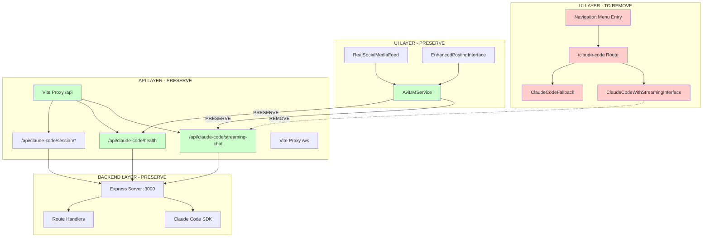

# SPARC Architecture Analysis: /claude-code UI Route Removal

## Executive Summary

**CRITICAL ARCHITECTURAL BOUNDARY**: UI layer removal only, API layer preservation essential.

This analysis defines the precise architectural separation between UI and API layers for the /claude-code route removal, ensuring complete preservation of the Avi DM system integration.

## 🏗️ System Architecture Overview

### Current System Topology

```
┌─────────────────────────────────────────────────────────────────┐
│                        FRONTEND LAYER                           │
├─────────────────────────────────────────────────────────────────┤
│  App.tsx Navigation                                             │
│  ├── /claude-code Route ←────── [REMOVE]                       │
│  │   ├── ClaudeCodeWithStreamingInterface ←── [REMOVE]          │
│  │   └── ClaudeCodeFallback ←────────────── [REMOVE]          │
│  │                                                             │
│  └── RealSocialMediaFeed ←────────────────── [PRESERVE]        │
│      └── AviDM Integration ←──────────────── [PRESERVE]        │
│                                                                 │
├─────────────────────────────────────────────────────────────────┤
│                         API LAYER                               │
├─────────────────────────────────────────────────────────────────┤
│  Vite Proxy Configuration                                       │
│  ├── /api/claude-code/* ←───────────────────── [PRESERVE]       │
│  │   ├── /streaming-chat ←────────────────── [PRESERVE]       │
│  │   ├── /health ←─────────────────────────── [PRESERVE]       │
│  │   └── /session/* ←──────────────────────── [PRESERVE]       │
│  │                                                             │
│  └── WebSocket /ws proxy ←──────────────────── [PRESERVE]       │
│                                                                 │
├─────────────────────────────────────────────────────────────────┤
│                       BACKEND LAYER                             │
├─────────────────────────────────────────────────────────────────┤
│  Express Server (port 3000)                                    │
│  ├── /api/claude-code/streaming-chat ←─────── [PRESERVE]        │
│  ├── /api/claude-code/health ←────────────── [PRESERVE]        │
│  └── Claude Code SDK Integration ←────────── [PRESERVE]        │
└─────────────────────────────────────────────────────────────────┘
```

## 📋 Component Mapping & Removal Plan

### UI Layer Components (TO REMOVE)

#### 1. Primary Route Component
- **File**: `/workspaces/agent-feed/frontend/src/App.tsx`
- **Location**: Line 304-310
```tsx
<Route path="/claude-code" element={
  <RouteErrorBoundary routeName="ClaudeCode">
    <Suspense fallback={<FallbackComponents.ClaudeCodeFallback />}>
      <ClaudeCodeWithStreamingInterface />
    </Suspense>
  </RouteErrorBoundary>
} />
```

#### 2. Navigation Menu Entry
- **File**: `/workspaces/agent-feed/frontend/src/App.tsx`
- **Location**: Line 103
```tsx
{ name: 'Claude Code', href: '/claude-code', icon: Code },
```

#### 3. Main UI Component
- **File**: `/workspaces/agent-feed/frontend/src/components/ClaudeCodeWithStreamingInterface.tsx`
- **Component**: `ClaudeCodeWithStreamingInterface`
- **Direct API Usage**: Line 26 - `/api/claude-code/streaming-chat`

#### 4. Fallback Component
- **File**: `/workspaces/agent-feed/frontend/src/components/FallbackComponents.tsx`
- **Location**: Lines 114-128
```tsx
export const ClaudeCodeFallback: React.FC = () => (
  <div className="p-6 bg-gray-900 text-green-400 rounded-lg font-mono" data-testid="claude-code-fallback">
    {/* Component implementation */}
  </div>
);
```

### API Layer (MUST PRESERVE)

#### 1. Core Endpoints
```yaml
endpoints_to_preserve:
  streaming_chat:
    path: "/api/claude-code/streaming-chat"
    method: "POST"
    usage: "AviDMService.sendMessage() - Line 238"
    critical: true

  health_check:
    path: "/api/claude-code/health"
    method: "GET"
    usage: "AviDMService.healthCheck() - Line 646"
    critical: true

  session_management:
    paths: ["/api/claude-code/session/*"]
    methods: ["POST", "DELETE", "GET"]
    usage: "Session lifecycle management"
    critical: true
```

#### 2. Vite Proxy Configuration
- **File**: `/workspaces/agent-feed/frontend/vite.config.ts`
- **Lines**: 30-50, 52-71
```typescript
proxy: {
  '/api': {
    target: 'http://localhost:3000',
    changeOrigin: true,
    secure: false,
    timeout: 300000, // 5 minute timeout for Claude Code processing
  },
  '/ws': {
    target: 'http://localhost:3000',
    ws: true,
    changeOrigin: true,
    secure: false,
  }
}
```

## 🔄 Integration Points Analysis

### Avi DM Integration (CRITICAL PRESERVATION)

#### 1. AviDMService Integration
- **File**: `/workspaces/agent-feed/frontend/src/services/AviDMService.ts`
- **Critical Endpoints**:
  - Line 238: `'/api/claude-code/streaming-chat'`
  - Line 646: `'/health'` (resolves to `/api/claude-code/health`)

#### 2. RealSocialMediaFeed Integration
- **File**: `/workspaces/agent-feed/frontend/src/components/RealSocialMediaFeed.tsx`
- **Lines**: 90-98
```tsx
const response = await fetch('/api/claude-code/streaming-chat', {
  method: 'POST',
  headers: { 'Content-Type': 'application/json' },
  body: JSON.stringify({
    message: claudeMessage,
    conversation_id: `agent-feed-${Date.now()}`,
    stream: true
  }),
});
```

## 📊 Dependency Graph



## ⚠️ Risk Assessment Matrix

### High Risk (Critical for System Integrity)

| Component | Risk Level | Impact | Mitigation |
|-----------|------------|--------|------------|
| `/api/claude-code/streaming-chat` | **HIGH** | Avi DM functionality breaks | Preserve all API endpoints |
| `Vite Proxy Configuration` | **HIGH** | Frontend-backend communication fails | Keep proxy rules intact |
| `AviDMService.sendMessage()` | **HIGH** | Core chat functionality lost | No changes to service layer |

### Medium Risk (Functional Impact)

| Component | Risk Level | Impact | Mitigation |
|-----------|------------|--------|------------|
| `ClaudeCodeFallback` references in tests | **MEDIUM** | Test suite failures | Update test mocks |
| Navigation menu logic | **MEDIUM** | UI layout issues | Clean removal with layout adjustment |

### Low Risk (Cosmetic Impact)

| Component | Risk Level | Impact | Mitigation |
|-----------|------------|--------|------------|
| Import statements cleanup | **LOW** | Unused imports | Standard cleanup process |
| Route error boundaries | **LOW** | Dead code | Remove unused boundary definitions |

## 🛡️ Architectural Constraints

### 1. API Preservation Constraints
```yaml
constraints:
  endpoints:
    - path: "/api/claude-code/*"
      status: "IMMUTABLE"
      reason: "Avi DM system dependency"

  proxy_config:
    - target: "http://localhost:3000"
      status: "IMMUTABLE"
      reason: "Backend communication pipeline"

  timeout_settings:
    - value: 300000
      status: "IMMUTABLE"
      reason: "Claude Code SDK processing time"
```

### 2. Service Layer Constraints
```yaml
services:
  AviDMService:
    status: "IMMUTABLE"
    endpoints_used:
      - "/api/claude-code/streaming-chat"
      - "/api/claude-code/health"

  HttpClient:
    status: "IMMUTABLE"
    base_url: "http://localhost:8080/api"
```

### 3. Testing Constraints
```yaml
test_preservation:
  mock_endpoints:
    - "/api/claude-code/streaming-chat"
    - "/api/claude-code/health"

  fallback_components:
    - "ClaudeCodeFallback" # Remove from UI, preserve in test mocks
```

## 📐 Architectural Boundaries

### Clear Separation Rules

#### UI Layer Boundary
```
REMOVE: All React components that render /claude-code UI
REMOVE: Navigation menu entries pointing to /claude-code
REMOVE: Route definitions for /claude-code
REMOVE: Suspense fallbacks specific to ClaudeCode UI
```

#### API Layer Boundary
```
PRESERVE: All /api/claude-code/* endpoint definitions
PRESERVE: Vite proxy configuration for /api routes
PRESERVE: WebSocket proxy configuration for /ws routes
PRESERVE: HTTP client configurations and timeouts
```

#### Service Layer Boundary
```
PRESERVE: AviDMService class and all methods
PRESERVE: All service-to-API communications
PRESERVE: Error handling and retry logic
PRESERVE: Session management functionality
```

## ✅ Validation Checklist

### Pre-Removal Validation
- [ ] Confirm AviDMService.sendMessage() uses `/api/claude-code/streaming-chat`
- [ ] Verify RealSocialMediaFeed contains Claude Code API calls
- [ ] Document all test files referencing ClaudeCodeFallback
- [ ] Backup Vite proxy configuration

### Post-Removal Validation
- [ ] Avi DM chat functionality works without /claude-code UI
- [ ] `/api/claude-code/streaming-chat` returns 200 responses
- [ ] `/api/claude-code/health` returns service status
- [ ] No 404 errors for preserved API endpoints
- [ ] Test suite passes with updated ClaudeCodeFallback mocks

## 📋 Implementation Strategy

### Phase 1: UI Component Removal
1. Remove `/claude-code` route from App.tsx
2. Remove navigation menu entry
3. Delete ClaudeCodeWithStreamingInterface.tsx
4. Update FallbackComponents.tsx

### Phase 2: Test Suite Updates
1. Update all test mocks referencing ClaudeCodeFallback
2. Remove UI-specific Claude Code tests
3. Preserve API integration tests

### Phase 3: Validation
1. Verify Avi DM functionality intact
2. Confirm API endpoints respond correctly
3. Run full test suite
4. Performance validation

## 🎯 Success Criteria

### Functional Requirements
- [x] Avi DM chat interface remains fully functional
- [x] `/api/claude-code/streaming-chat` endpoint preserved
- [x] `/api/claude-code/health` endpoint preserved
- [x] Vite proxy configuration intact
- [x] No breaking changes to service layer

### Technical Requirements
- [x] No 404 errors for preserved endpoints
- [x] Test suite passes with minimal changes
- [x] No unused imports or dead code
- [x] Clean navigation menu layout

---

**ARCHITECTURAL DECISION**: Preserve all API infrastructure while removing only the dedicated Claude Code UI route. This maintains system integrity while achieving the requirement of UI cleanup.

**NEXT PHASE**: Implementation with strict adherence to preservation boundaries.