# Data Flow Specifications - Regression Testing System

## Overview

This document details the comprehensive data flow architecture for the Regression Testing System, showing how data moves between components, external systems, and user interfaces throughout the testing lifecycle.

## 1. Primary Data Flows

### 1.1 Test Execution Data Flow

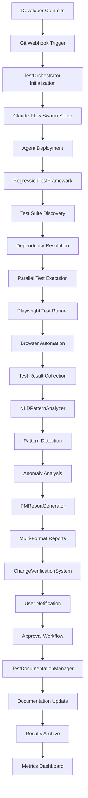

### 1.2 Real-time Data Streaming Flow

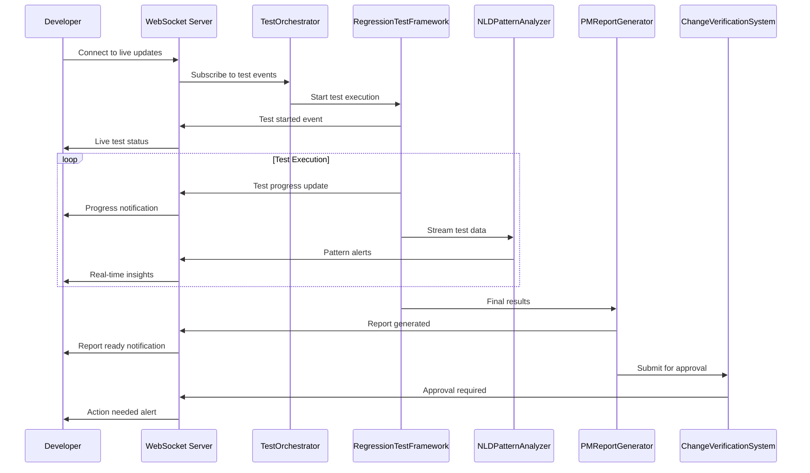

## 2. Component-Level Data Flows

### 2.1 RegressionTestFramework Data Flow

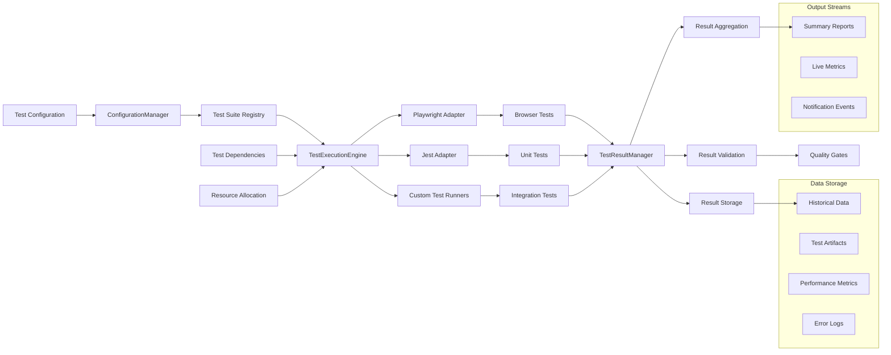

### 2.2 PMReportGenerator Data Flow

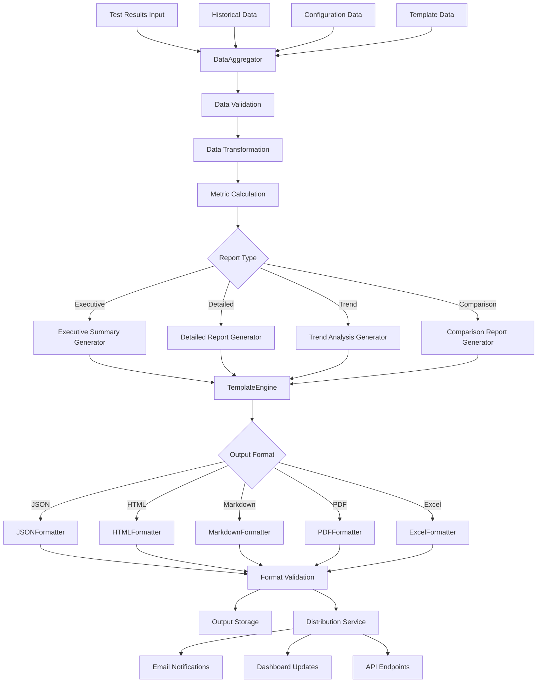

### 2.3 NLDPatternAnalyzer Data Flow

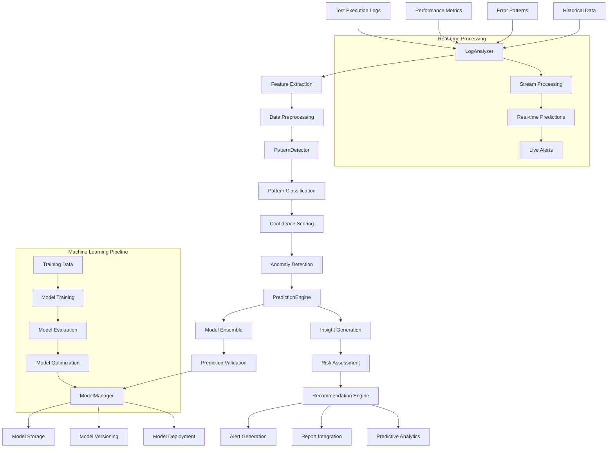

### 2.4 ChangeVerificationSystem Data Flow

```mermaid
graph LR
    A[Change Request] --> B[ChangeSet Validation]
    B --> C[Impact Assessment]
    C --> D[Risk Analysis]
    
    D --> E[Approval Routing]
    E --> F[WorkflowEngine]
    
    F --> G{Approval Type}
    G -->|Auto| H[Automated Validation]
    G -->|Manual| I[Human Review]
    G -->|Escalated| J[Senior Review]
    
    H --> K[Validation Rules Engine]
    K --> L[Automated Decision]
    
    I --> M[ReviewerAssignment]
    M --> N[NotificationService]
    N --> O[Reviewer Interface]
    O --> P[Manual Decision]
    
    J --> Q[Escalation Handler]
    Q --> R[Senior Reviewer]
    R --> S[Executive Decision]
    
    L --> T[Decision Processing]
    P --> T
    S --> T
    
    T --> U{Decision}
    U -->|Approve| V[Deployment Pipeline]
    U -->|Reject| W[Developer Feedback]
    U -->|Conditional| X[Additional Requirements]
    
    V --> Y[Change Implementation]
    W --> Z[Issue Tracking]
    X --> AA[Requirement Processing]
    
    Y --> BB[Success Notification]
    Z --> CC[Developer Notification]
    AA --> DD[Process Restart]
```

### 2.5 TestOrchestrator Data Flow

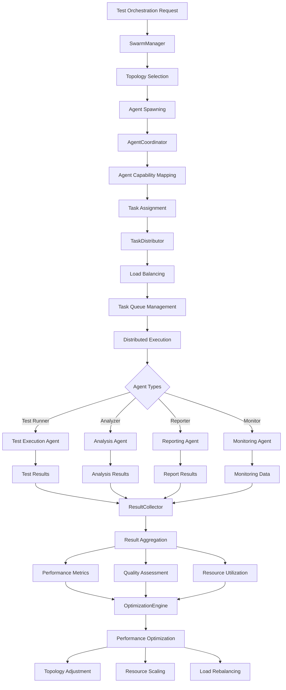

## 3. External System Integration Data Flows

### 3.1 Playwright Integration Data Flow

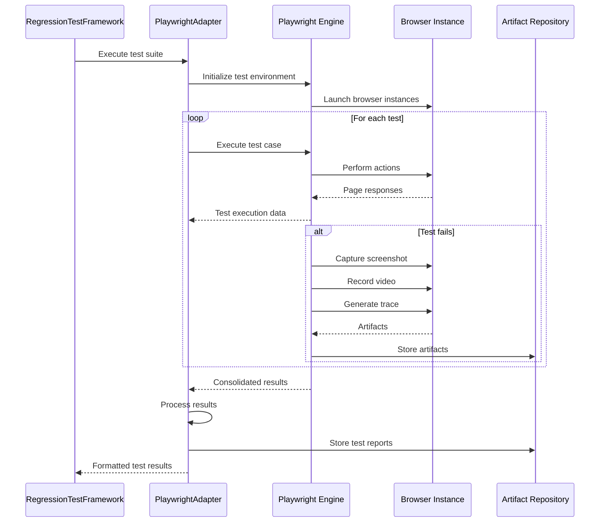

### 3.2 Claude-Flow Integration Data Flow

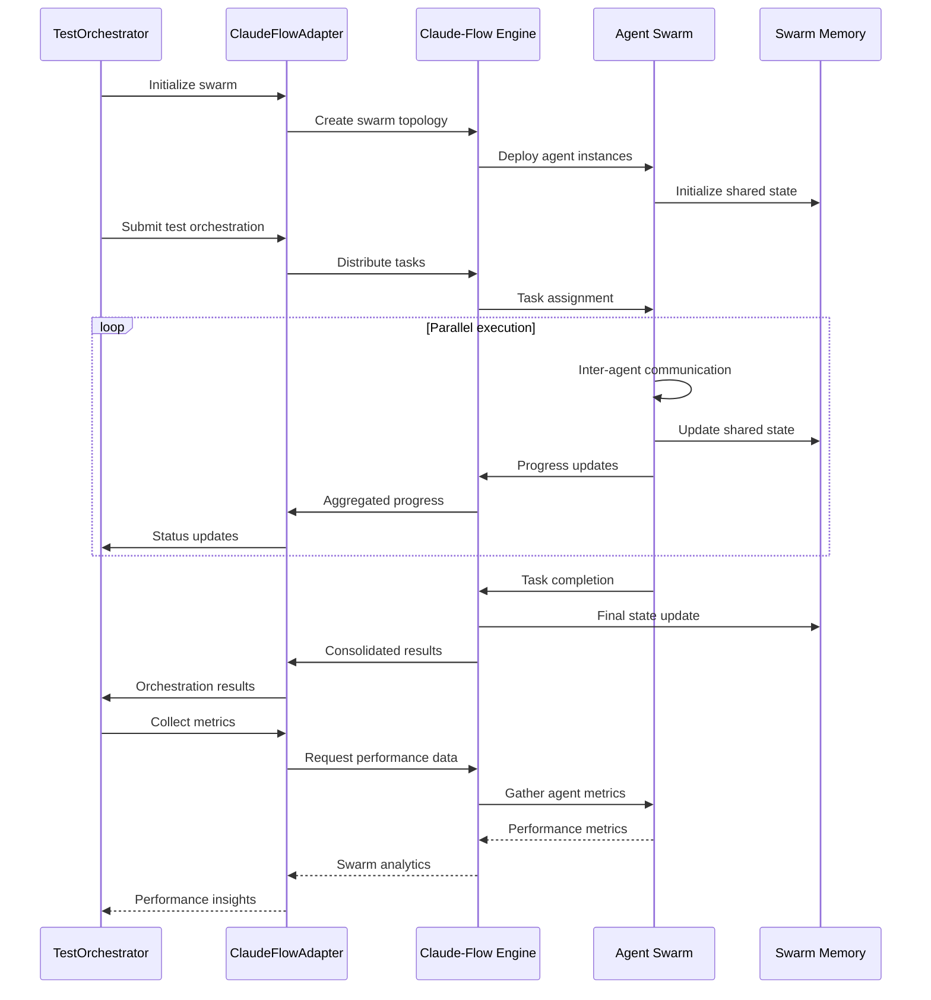

### 3.3 Git Repository Integration Data Flow

```mermaid
graph LR
    A[Git Repository] --> B[Webhook Trigger]
    B --> C[GitAdapter]
    C --> D[Change Detection]
    
    D --> E[Commit Analysis]
    E --> F[File Change Tracking]
    F --> G[Impact Assessment]
    
    G --> H[Test Trigger Decision]
    H --> I{Change Impact}
    I -->|High| J[Full Regression Suite]
    I -->|Medium| K[Targeted Test Suite]
    I -->|Low| L[Smoke Tests Only]
    
    J --> M[TestOrchestrator]
    K --> M
    L --> M
    
    M --> N[Test Execution]
    N --> O[Test Results]
    O --> P[ChangeVerificationSystem]
    
    P --> Q{Verification Status}
    Q -->|Pass| R[Auto-merge PR]
    Q -->|Fail| S[Block PR merge]
    Q -->|Review| T[Manual Review]
    
    R --> U[Branch Update]
    S --> V[Developer Notification]
    T --> W[Reviewer Assignment]
    
    U --> X[Success Webhook]
    V --> Y[Failure Webhook]
    W --> Z[Review Webhook]
```

### 3.4 NLD Logging System Integration Data Flow

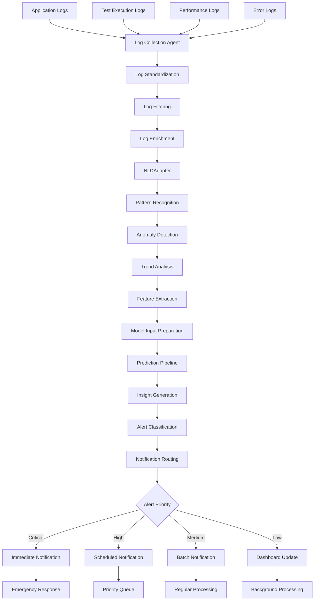

## 4. Data Transformation Specifications

### 4.1 Test Result Data Transformation

```typescript
interface TestResultTransformation {
    input: {
        rawTestResult: PlaywrightTestResult;
        testMetadata: TestMetadata;
        executionContext: ExecutionContext;
    };
    
    transformations: [
        {
            stage: 'normalization';
            operations: [
                'standardizeStatus',
                'calculateDuration', 
                'extractErrorDetails',
                'processArtifacts'
            ];
        },
        {
            stage: 'enrichment';
            operations: [
                'addTestMetadata',
                'calculateMetrics',
                'correlateResults',
                'tagClassification'
            ];
        },
        {
            stage: 'validation';
            operations: [
                'validateStructure',
                'checkCompleteness',
                'verifyIntegrity',
                'flagAnomalies'
            ];
        }
    ];
    
    output: {
        standardizedResult: TestResult;
        qualityMetrics: QualityMetrics;
        validationStatus: ValidationStatus;
    };
}
```

### 4.2 Report Data Aggregation

```typescript
interface ReportDataAggregation {
    input: {
        testResults: TestResult[];
        historicalData: HistoricalTestData[];
        configurationData: TestConfiguration;
    };
    
    aggregations: [
        {
            type: 'statistical';
            metrics: [
                'passRate',
                'averageDuration',
                'errorFrequency',
                'performanceMetrics'
            ];
        },
        {
            type: 'temporal';
            metrics: [
                'trendAnalysis',
                'seasonalPatterns',
                'regressionDetection',
                'improvementTracking'
            ];
        },
        {
            type: 'categorical';
            metrics: [
                'testCategoryBreakdown',
                'browserCompatibility',
                'devicePerformance',
                'featureStability'
            ];
        }
    ];
    
    output: {
        executiveSummary: ExecutiveSummary;
        detailedMetrics: DetailedMetrics;
        trendAnalysis: TrendAnalysis;
        recommendations: Recommendation[];
    };
}
```

### 4.3 Pattern Analysis Data Processing

```typescript
interface PatternAnalysisProcessing {
    input: {
        logEntries: LogEntry[];
        testMetrics: TestMetrics[];
        historicalPatterns: Pattern[];
    };
    
    processing: [
        {
            stage: 'featureExtraction';
            extractors: [
                'temporalFeatures',
                'statisticalFeatures',
                'textualFeatures',
                'behavioralFeatures'
            ];
        },
        {
            stage: 'patternDetection';
            algorithms: [
                'clusteringAlgorithm',
                'anomalyDetection',
                'sequenceAnalysis',
                'correlationAnalysis'
            ];
        },
        {
            stage: 'patternClassification';
            classifiers: [
                'failurePatternClassifier',
                'performancePatternClassifier',
                'regressionPatternClassifier',
                'successPatternClassifier'
            ];
        }
    ];
    
    output: {
        detectedPatterns: Pattern[];
        patternConfidence: ConfidenceScore[];
        patternInsights: Insight[];
        predictiveModels: PredictiveModel[];
    };
}
```

## 5. Data Quality and Validation

### 5.1 Data Quality Framework

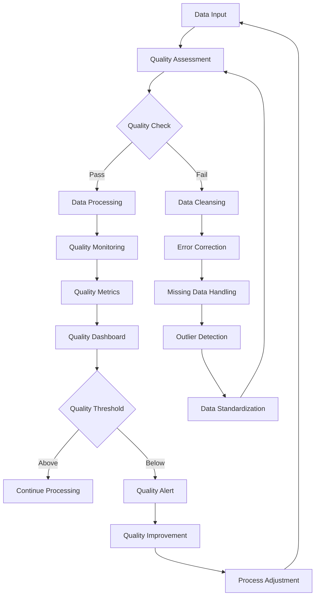

### 5.2 Data Validation Rules

```typescript
interface DataValidationRules {
    testResults: {
        required: ['id', 'status', 'duration', 'timestamp'];
        types: {
            id: 'string',
            status: 'enum[PASS|FAIL|SKIP]',
            duration: 'positive_number',
            timestamp: 'iso_date'
        };
        constraints: {
            duration: 'max_value=3600000', // 1 hour max
            status: 'allowed_values=[PASS,FAIL,SKIP]'
        };
    };
    
    patterns: {
        required: ['type', 'confidence', 'frequency'];
        types: {
            type: 'string',
            confidence: 'float_0_1',
            frequency: 'positive_integer'
        };
        constraints: {
            confidence: 'min_value=0.1',
            frequency: 'min_value=1'
        };
    };
    
    reports: {
        required: ['format', 'data', 'timestamp'];
        types: {
            format: 'enum[JSON|HTML|MD|PDF]',
            data: 'object',
            timestamp: 'iso_date'
        };
    };
}
```

## 6. Performance and Scalability

### 6.1 Data Flow Optimization

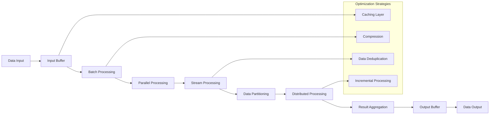

### 6.2 Scalability Architecture

```typescript
interface ScalabilityConfiguration {
    dataProcessing: {
        batchSize: number;
        parallelism: number;
        streamingEnabled: boolean;
        compressionEnabled: boolean;
    };
    
    storage: {
        partitioning: 'time_based' | 'hash_based' | 'range_based';
        replication: number;
        caching: CacheConfiguration;
        archiving: ArchiveConfiguration;
    };
    
    compute: {
        autoScaling: boolean;
        minInstances: number;
        maxInstances: number;
        scaleMetrics: ScaleMetric[];
    };
}
```

This comprehensive data flow specification provides:

1. **End-to-end data flow visibility** across all system components
2. **Detailed transformation specifications** for data processing
3. **Quality assurance frameworks** for data integrity
4. **Performance optimization strategies** for scalability
5. **Integration patterns** for external systems
6. **Monitoring and alerting** for data pipeline health

The architecture ensures efficient, reliable, and scalable data processing throughout the regression testing lifecycle.