# Deployment and Scaling Architecture - Regression Testing System

## Overview

This document outlines the comprehensive deployment and scaling architecture for the Regression Testing System, covering containerization, orchestration, auto-scaling, monitoring, and operational excellence practices.

## 1. Deployment Architecture Overview

### 1.1 High-Level Deployment Diagram

```mermaid
graph TB
    subgraph "Load Balancer Tier"
        LB[Application Load Balancer]
        CDN[CloudFront CDN]
    end
    
    subgraph "Application Tier"
        subgraph "Kubernetes Cluster"
            subgraph "Testing Namespace"
                RTF[RegressionTestFramework Pods]
                TO[TestOrchestrator Pods]
                PMR[PMReportGenerator Pods]
            end
            
            subgraph "Analysis Namespace"
                NLD[NLDPatternAnalyzer Pods]
                TDM[TestDocumentationManager Pods]
                CVS[ChangeVerificationSystem Pods]
            end
            
            subgraph "Infrastructure Namespace"
                API_GW[API Gateway Pods]
                WS[WebSocket Server Pods]
                CACHE[Redis Cache Pods]
            end
        end
    end
    
    subgraph "Data Tier"
        subgraph "Primary Storage"
            POSTGRES[(PostgreSQL Cluster)]
            REDIS[(Redis Cluster)]
        end
        
        subgraph "Object Storage"
            S3[S3 Compatible Storage]
            BACKUP[Backup Storage]
        end
        
        subgraph "Analytics Storage"
            TSDB[Time Series DB]
            SEARCH[Elasticsearch]
        end
    end
    
    subgraph "External Services"
        PLAYWRIGHT[Playwright Grid]
        CLAUDE_FLOW[Claude-Flow Cluster]
        GIT[Git Repository]
        NOTIF[Notification Services]
    end
    
    CDN --> LB
    LB --> API_GW
    API_GW --> RTF
    API_GW --> TO
    API_GW --> PMR
    
    RTF --> POSTGRES
    RTF --> REDIS
    RTF --> PLAYWRIGHT
    
    TO --> CLAUDE_FLOW
    TO --> CACHE
    
    NLD --> TSDB
    NLD --> SEARCH
    
    CVS --> GIT
    CVS --> NOTIF
    
    TDM --> S3
    PMR --> BACKUP
```



### 1.2 Deployment Strategy

```yaml
apiVersion: argoproj.io/v1alpha1
kind: Application
metadata:
  name: regression-testing-system
  namespace: argocd
spec:
  project: default
  source:
    repoURL: https://github.com/agent-feed/regression-testing-system
    targetRevision: HEAD
    path: k8s/manifests
  destination:
    server: https://kubernetes.default.svc
    namespace: regression-testing
  syncPolicy:
    automated:
      prune: true
      selfHeal: true
    syncOptions:
    - CreateNamespace=true
    - PrunePropagationPolicy=foreground
  revisionHistoryLimit: 10
```

## 2. Container Architecture

### 2.1 Multi-Stage Dockerfile Strategy

```dockerfile
# Base image with Node.js and common dependencies
FROM node:18-alpine AS base
RUN apk add --no-cache \
    git \
    python3 \
    make \
    g++ \
    && npm install -g npm@latest

# Dependencies stage
FROM base AS dependencies
WORKDIR /app
COPY package*.json ./
RUN npm ci --only=production --ignore-scripts
RUN npm cache clean --force

# Development dependencies stage
FROM base AS dev-dependencies
WORKDIR /app
COPY package*.json ./
RUN npm ci --ignore-scripts

# Build stage
FROM dev-dependencies AS build
COPY . .
RUN npm run build
RUN npm run test:unit

# Playwright test runner image
FROM mcr.microsoft.com/playwright:v1.40.0-focal AS playwright-runner
WORKDIR /tests
COPY --from=build /app/dist ./dist
COPY --from=build /app/tests ./tests
COPY --from=dependencies /app/node_modules ./node_modules
RUN npx playwright install-deps
CMD ["npx", "playwright", "test"]

# Production image for RegressionTestFramework
FROM base AS rtf-production
WORKDIR /app
COPY --from=dependencies /app/node_modules ./node_modules
COPY --from=build /app/dist ./dist
COPY --from=build /app/package*.json ./
EXPOSE 3000
HEALTHCHECK --interval=30s --timeout=10s --start-period=60s --retries=3 \
  CMD curl -f http://localhost:3000/health || exit 1
USER node
CMD ["node", "dist/rtf/index.js"]

# Production image for TestOrchestrator
FROM base AS orchestrator-production
WORKDIR /app
COPY --from=dependencies /app/node_modules ./node_modules
COPY --from=build /app/dist ./dist
COPY --from=build /app/package*.json ./
EXPOSE 3001
HEALTHCHECK --interval=30s --timeout=10s --start-period=60s --retries=3 \
  CMD curl -f http://localhost:3001/health || exit 1
USER node
CMD ["node", "dist/orchestrator/index.js"]

# Production image for NLDPatternAnalyzer
FROM python:3.11-slim AS nld-production
WORKDIR /analyzer
COPY requirements.txt ./
RUN pip install --no-cache-dir -r requirements.txt
COPY --from=build /app/dist/nld ./
EXPOSE 8000
HEALTHCHECK --interval=30s --timeout=10s --start-period=60s --retries=3 \
  CMD curl -f http://localhost:8000/health || exit 1
CMD ["python", "app.py"]
```

### 2.2 Container Security Configuration

```yaml
apiVersion: v1
kind: SecurityContext
spec:
  securityContext:
    runAsNonRoot: true
    runAsUser: 1001
    runAsGroup: 1001
    fsGroup: 1001
    seccompProfile:
      type: RuntimeDefault
    capabilities:
      drop:
      - ALL
      add:
      - NET_BIND_SERVICE
  containerSecurityContext:
    allowPrivilegeEscalation: false
    readOnlyRootFilesystem: true
    privileged: false
    capabilities:
      drop:
      - ALL
```

## 3. Kubernetes Manifests

### 3.1 RegressionTestFramework Deployment

```yaml
apiVersion: apps/v1
kind: Deployment
metadata:
  name: regression-test-framework
  labels:
    app: regression-test-framework
    version: v1.0.0
spec:
  replicas: 3
  strategy:
    type: RollingUpdate
    rollingUpdate:
      maxSurge: 1
      maxUnavailable: 1
  selector:
    matchLabels:
      app: regression-test-framework
  template:
    metadata:
      labels:
        app: regression-test-framework
        version: v1.0.0
      annotations:
        prometheus.io/scrape: "true"
        prometheus.io/port: "3000"
        prometheus.io/path: "/metrics"
    spec:
      serviceAccountName: regression-testing-sa
      securityContext:
        runAsNonRoot: true
        runAsUser: 1001
        fsGroup: 1001
      containers:
      - name: rtf
        image: regression-test-framework:latest
        imagePullPolicy: IfNotPresent
        ports:
        - name: http
          containerPort: 3000
          protocol: TCP
        - name: metrics
          containerPort: 9090
          protocol: TCP
        env:
        - name: NODE_ENV
          value: "production"
        - name: DATABASE_URL
          valueFrom:
            secretKeyRef:
              name: postgres-secret
              key: url
        - name: REDIS_URL
          valueFrom:
            secretKeyRef:
              name: redis-secret
              key: url
        - name: LOG_LEVEL
          valueFrom:
            configMapKeyRef:
              name: rtf-config
              key: log-level
        resources:
          requests:
            memory: "512Mi"
            cpu: "250m"
            ephemeral-storage: "1Gi"
          limits:
            memory: "1Gi"
            cpu: "500m"
            ephemeral-storage: "2Gi"
        livenessProbe:
          httpGet:
            path: /health/live
            port: http
          initialDelaySeconds: 30
          periodSeconds: 10
          timeoutSeconds: 5
          failureThreshold: 3
        readinessProbe:
          httpGet:
            path: /health/ready
            port: http
          initialDelaySeconds: 5
          periodSeconds: 5
          timeoutSeconds: 3
          failureThreshold: 3
        volumeMounts:
        - name: tmp
          mountPath: /tmp
        - name: logs
          mountPath: /app/logs
        - name: config
          mountPath: /app/config
          readOnly: true
      volumes:
      - name: tmp
        emptyDir: {}
      - name: logs
        emptyDir: {}
      - name: config
        configMap:
          name: rtf-config
      nodeSelector:
        node-type: compute
      tolerations:
      - key: "compute-node"
        operator: "Equal"
        value: "true"
        effect: "NoSchedule"
      affinity:
        podAntiAffinity:
          preferredDuringSchedulingIgnoredDuringExecution:
          - weight: 100
            podAffinityTerm:
              labelSelector:
                matchExpressions:
                - key: app
                  operator: In
                  values: ["regression-test-framework"]
              topologyKey: kubernetes.io/hostname
---
apiVersion: v1
kind: Service
metadata:
  name: regression-test-framework
  labels:
    app: regression-test-framework
spec:
  selector:
    app: regression-test-framework
  ports:
  - name: http
    port: 80
    targetPort: http
    protocol: TCP
  - name: metrics
    port: 9090
    targetPort: metrics
    protocol: TCP
  type: ClusterIP
```

### 3.2 Auto-scaling Configuration

```yaml
apiVersion: autoscaling/v2
kind: HorizontalPodAutoscaler
metadata:
  name: rtf-hpa
spec:
  scaleTargetRef:
    apiVersion: apps/v1
    kind: Deployment
    name: regression-test-framework
  minReplicas: 3
  maxReplicas: 20
  metrics:
  - type: Resource
    resource:
      name: cpu
      target:
        type: Utilization
        averageUtilization: 70
  - type: Resource
    resource:
      name: memory
      target:
        type: Utilization
        averageUtilization: 80
  - type: Pods
    pods:
      metric:
        name: test_execution_queue_length
      target:
        type: AverageValue
        averageValue: "5"
  behavior:
    scaleDown:
      stabilizationWindowSeconds: 300
      policies:
      - type: Percent
        value: 50
        periodSeconds: 60
      - type: Pods
        value: 2
        periodSeconds: 60
      selectPolicy: Min
    scaleUp:
      stabilizationWindowSeconds: 0
      policies:
      - type: Percent
        value: 100
        periodSeconds: 15
      - type: Pods
        value: 4
        periodSeconds: 15
      selectPolicy: Max
---
apiVersion: autoscaling/v2
kind: VerticalPodAutoscaler
metadata:
  name: rtf-vpa
spec:
  targetRef:
    apiVersion: apps/v1
    kind: Deployment
    name: regression-test-framework
  updatePolicy:
    updateMode: "Auto"
  resourcePolicy:
    containerPolicies:
    - containerName: rtf
      controlledResources: ["cpu", "memory"]
      minAllowed:
        cpu: 100m
        memory: 256Mi
      maxAllowed:
        cpu: 2
        memory: 4Gi
      controlledValues: RequestsAndLimits
```

### 3.3 Network Policies

```yaml
apiVersion: networking.k8s.io/v1
kind: NetworkPolicy
metadata:
  name: regression-testing-network-policy
spec:
  podSelector:
    matchLabels:
      app: regression-test-framework
  policyTypes:
  - Ingress
  - Egress
  ingress:
  - from:
    - namespaceSelector:
        matchLabels:
          name: ingress-nginx
    - podSelector:
        matchLabels:
          app: api-gateway
    ports:
    - protocol: TCP
      port: 3000
  - from:
    - namespaceSelector:
        matchLabels:
          name: monitoring
    - podSelector:
        matchLabels:
          app: prometheus
    ports:
    - protocol: TCP
      port: 9090
  egress:
  - to:
    - podSelector:
        matchLabels:
          app: postgres
    ports:
    - protocol: TCP
      port: 5432
  - to:
    - podSelector:
        matchLabels:
          app: redis
    ports:
    - protocol: TCP
      port: 6379
  - to: []
    ports:
    - protocol: TCP
      port: 53
    - protocol: UDP
      port: 53
  - to: []
    ports:
    - protocol: TCP
      port: 443
```

## 4. Infrastructure as Code (IaC)

### 4.1 Terraform Configuration

```hcl
# main.tf
terraform {
  required_version = ">= 1.0"
  required_providers {
    aws = {
      source  = "hashicorp/aws"
      version = "~> 5.0"
    }
    kubernetes = {
      source  = "hashicorp/kubernetes"
      version = "~> 2.0"
    }
    helm = {
      source  = "hashicorp/helm"
      version = "~> 2.0"
    }
  }
  
  backend "s3" {
    bucket         = "regression-testing-terraform-state"
    key            = "infrastructure/terraform.tfstate"
    region         = "us-west-2"
    encrypt        = true
    dynamodb_table = "terraform-lock"
  }
}

# EKS Cluster
module "eks" {
  source = "terraform-aws-modules/eks/aws"
  version = "~> 19.0"

  cluster_name    = var.cluster_name
  cluster_version = "1.28"

  cluster_endpoint_config = {
    private_access = true
    public_access  = true
    public_access_cidrs = var.allowed_cidr_blocks
  }

  vpc_id     = module.vpc.vpc_id
  subnet_ids = module.vpc.private_subnets

  # EKS Managed Node Groups
  eks_managed_node_groups = {
    compute = {
      name = "compute-nodes"
      
      instance_types = ["m5.xlarge", "m5.2xlarge"]
      capacity_type  = "ON_DEMAND"
      
      min_size     = 3
      max_size     = 20
      desired_size = 6
      
      k8s_labels = {
        node-type = "compute"
      }
      
      taints = [
        {
          key    = "compute-node"
          value  = "true"
          effect = "NO_SCHEDULE"
        }
      ]
    }
    
    testing = {
      name = "testing-nodes"
      
      instance_types = ["c5.2xlarge", "c5.4xlarge"]
      capacity_type  = "SPOT"
      
      min_size     = 2
      max_size     = 50
      desired_size = 5
      
      k8s_labels = {
        node-type = "testing"
      }
      
      taints = [
        {
          key    = "testing-node"
          value  = "true"
          effect = "NO_SCHEDULE"
        }
      ]
    }
  }

  # Cluster access entry
  access_entries = {
    admin = {
      kubernetes_groups = []
      principal_arn     = "arn:aws:iam::${data.aws_caller_identity.current.account_id}:role/AdminRole"
      
      policy_associations = {
        admin = {
          policy_arn = "arn:aws:eks::aws:cluster-access-policy/AmazonEKSClusterAdminPolicy"
          access_scope = {
            type = "cluster"
          }
        }
      }
    }
  }

  tags = local.common_tags
}

# RDS PostgreSQL
resource "aws_db_instance" "postgres" {
  identifier = "regression-testing-postgres"

  engine         = "postgres"
  engine_version = "15.4"
  instance_class = "db.r6g.xlarge"

  allocated_storage     = 100
  max_allocated_storage = 1000
  storage_type         = "gp3"
  storage_encrypted    = true

  db_name  = "regression_testing"
  username = var.db_username
  password = var.db_password

  vpc_security_group_ids = [aws_security_group.postgres.id]
  db_subnet_group_name   = aws_db_subnet_group.postgres.name

  backup_retention_period = 7
  backup_window          = "03:00-04:00"
  maintenance_window     = "sun:04:00-sun:05:00"

  monitoring_interval    = 60
  monitoring_role_arn   = aws_iam_role.rds_monitoring.arn
  performance_insights_enabled = true

  deletion_protection = true
  skip_final_snapshot = false
  final_snapshot_identifier = "regression-testing-postgres-final-snapshot"

  tags = local.common_tags
}

# ElastiCache Redis
resource "aws_elasticache_replication_group" "redis" {
  replication_group_id         = "regression-testing-redis"
  description                  = "Redis cluster for regression testing system"

  port               = 6379
  parameter_group_name = "default.redis7"
  
  num_cache_clusters = 3
  node_type         = "cache.r6g.large"
  
  subnet_group_name  = aws_elasticache_subnet_group.redis.name
  security_group_ids = [aws_security_group.redis.id]

  at_rest_encryption_enabled = true
  transit_encryption_enabled = true
  auth_token                = var.redis_auth_token

  automatic_failover_enabled = true
  multi_az_enabled          = true

  log_delivery_configuration {
    destination      = aws_cloudwatch_log_group.redis_slow.name
    destination_type = "cloudwatch-logs"
    log_format      = "text"
    log_type        = "slow-log"
  }

  tags = local.common_tags
}
```

### 4.2 Helm Charts Configuration

```yaml
# values.yaml for regression-testing-system
global:
  imageRegistry: "your-registry.com"
  imageTag: "v1.0.0"
  pullPolicy: "IfNotPresent"
  
  monitoring:
    enabled: true
    namespace: "monitoring"
  
  security:
    podSecurityPolicy:
      enabled: true
    networkPolicies:
      enabled: true

regressionTestFramework:
  enabled: true
  replicaCount: 3
  
  image:
    repository: "regression-test-framework"
    tag: ""  # defaults to global.imageTag
  
  service:
    type: ClusterIP
    port: 80
    targetPort: 3000
  
  ingress:
    enabled: true
    className: "nginx"
    annotations:
      nginx.ingress.kubernetes.io/rate-limit: "100"
      nginx.ingress.kubernetes.io/rate-limit-window: "1m"
    hosts:
    - host: "rtf.example.com"
      paths:
      - path: /
        pathType: Prefix
    tls:
    - secretName: rtf-tls
      hosts:
      - "rtf.example.com"
  
  resources:
    limits:
      cpu: 500m
      memory: 1Gi
    requests:
      cpu: 250m
      memory: 512Mi
  
  autoscaling:
    enabled: true
    minReplicas: 3
    maxReplicas: 20
    targetCPUUtilizationPercentage: 70
    targetMemoryUtilizationPercentage: 80

testOrchestrator:
  enabled: true
  replicaCount: 2
  
  image:
    repository: "test-orchestrator"
  
  claudeFlow:
    endpoint: "http://claude-flow-service:8080"
    maxAgents: 50
    topology: "hierarchical"
  
  resources:
    limits:
      cpu: 1
      memory: 2Gi
    requests:
      cpu: 500m
      memory: 1Gi

nldPatternAnalyzer:
  enabled: true
  replicaCount: 2
  
  image:
    repository: "nld-pattern-analyzer"
  
  python:
    version: "3.11"
  
  ml:
    modelStorage: "s3://models-bucket"
    trainingSchedule: "0 2 * * *"  # Daily at 2 AM
  
  resources:
    limits:
      cpu: 2
      memory: 4Gi
      nvidia.com/gpu: 1
    requests:
      cpu: 1
      memory: 2Gi

postgresql:
  enabled: false  # Using external RDS
  external:
    host: "regression-testing-postgres.cluster-xyz.us-west-2.rds.amazonaws.com"
    port: 5432
    database: "regression_testing"
    existingSecret: "postgres-secret"

redis:
  enabled: false  # Using external ElastiCache
  external:
    host: "regression-testing-redis.xyz.cache.amazonaws.com"
    port: 6379
    existingSecret: "redis-secret"

monitoring:
  prometheus:
    enabled: true
    serviceMonitor:
      enabled: true
      interval: "30s"
  
  grafana:
    enabled: true
    dashboards:
      enabled: true
      label: grafana_dashboard
  
  alertmanager:
    enabled: true
    config:
      route:
        group_by: ['alertname', 'severity']
        group_wait: 10s
        group_interval: 10s
        repeat_interval: 1h
        receiver: 'default'
      receivers:
      - name: 'default'
        slack_configs:
        - api_url: '${SLACK_WEBHOOK_URL}'
          channel: '#alerts'
          title: 'Regression Testing System Alert'
```

## 5. Auto-scaling Strategies

### 5.1 Horizontal Pod Autoscaling (HPA)

```yaml
apiVersion: autoscaling/v2
kind: HorizontalPodAutoscaler
metadata:
  name: comprehensive-hpa
spec:
  scaleTargetRef:
    apiVersion: apps/v1
    kind: Deployment
    name: regression-test-framework
  minReplicas: 3
  maxReplicas: 50
  metrics:
  # CPU-based scaling
  - type: Resource
    resource:
      name: cpu
      target:
        type: Utilization
        averageUtilization: 70
  
  # Memory-based scaling
  - type: Resource
    resource:
      name: memory
      target:
        type: Utilization
        averageUtilization: 80
  
  # Custom metrics scaling
  - type: Pods
    pods:
      metric:
        name: test_execution_queue_length
      target:
        type: AverageValue
        averageValue: "10"
  
  - type: Object
    object:
      metric:
        name: test_failure_rate
      describedObject:
        apiVersion: v1
        kind: Service
        name: regression-test-framework
      target:
        type: Value
        value: "0.1"
  
  # External metrics scaling
  - type: External
    external:
      metric:
        name: sqs_queue_length
      target:
        type: AverageValue
        averageValue: "30"
  
  behavior:
    scaleDown:
      stabilizationWindowSeconds: 300
      policies:
      - type: Percent
        value: 50
        periodSeconds: 60
      - type: Pods
        value: 2
        periodSeconds: 60
      selectPolicy: Min
    scaleUp:
      stabilizationWindowSeconds: 0
      policies:
      - type: Percent
        value: 100
        periodSeconds: 15
      - type: Pods
        value: 4
        periodSeconds: 15
      selectPolicy: Max
```

### 5.2 Vertical Pod Autoscaling (VPA)

```yaml
apiVersion: autoscaling.k8s.io/v1
kind: VerticalPodAutoscaler
metadata:
  name: comprehensive-vpa
spec:
  targetRef:
    apiVersion: apps/v1
    kind: Deployment
    name: regression-test-framework
  updatePolicy:
    updateMode: "Auto"
    minReplicas: 2
  resourcePolicy:
    containerPolicies:
    - containerName: rtf
      controlledResources: ["cpu", "memory"]
      minAllowed:
        cpu: 100m
        memory: 256Mi
      maxAllowed:
        cpu: 4
        memory: 8Gi
      controlledValues: RequestsAndLimits
      mode: Auto
```

### 5.3 Cluster Autoscaling

```yaml
apiVersion: v1
kind: ConfigMap
metadata:
  name: cluster-autoscaler-status
  namespace: kube-system
data:
  nodes.max: "100"
  nodes.min: "3"
  scale-down-delay-after-add: "10m"
  scale-down-delay-after-delete: "10s"
  scale-down-delay-after-failure: "3m"
  scale-down-unneeded-time: "10m"
  scale-down-utilization-threshold: "0.5"
  skip-nodes-with-local-storage: "false"
  skip-nodes-with-system-pods: "false"
---
apiVersion: apps/v1
kind: Deployment
metadata:
  name: cluster-autoscaler
  namespace: kube-system
spec:
  replicas: 1
  selector:
    matchLabels:
      app: cluster-autoscaler
  template:
    metadata:
      labels:
        app: cluster-autoscaler
      annotations:
        prometheus.io/scrape: 'true'
        prometheus.io/port: '8085'
    spec:
      serviceAccount: cluster-autoscaler
      containers:
      - image: registry.k8s.io/autoscaling/cluster-autoscaler:v1.28.2
        name: cluster-autoscaler
        resources:
          limits:
            cpu: 100m
            memory: 600Mi
          requests:
            cpu: 100m
            memory: 600Mi
        command:
        - ./cluster-autoscaler
        - --v=4
        - --stderrthreshold=info
        - --cloud-provider=aws
        - --skip-nodes-with-local-storage=false
        - --expander=least-waste
        - --node-group-auto-discovery=asg:tag=k8s.io/cluster-autoscaler/enabled,k8s.io/cluster-autoscaler/regression-testing-cluster
        - --balance-similar-node-groups
        - --scale-down-enabled=true
        - --scale-down-delay-after-add=10m
        - --scale-down-unneeded-time=10m
        - --scale-down-utilization-threshold=0.5
        - --max-node-provision-time=15m
        env:
        - name: AWS_REGION
          value: us-west-2
        volumeMounts:
        - name: ssl-certs
          mountPath: /etc/ssl/certs/ca-certificates.crt
          readOnly: true
      volumes:
      - name: ssl-certs
        hostPath:
          path: "/etc/ssl/certs/ca-bundle.crt"
      nodeSelector:
        kubernetes.io/os: linux
```

## 6. Performance and Resource Management

### 6.1 Resource Quotas and Limits

```yaml
apiVersion: v1
kind: ResourceQuota
metadata:
  name: regression-testing-quota
  namespace: regression-testing
spec:
  hard:
    requests.cpu: "20"
    requests.memory: 40Gi
    limits.cpu: "50"
    limits.memory: 100Gi
    requests.nvidia.com/gpu: "10"
    persistentvolumeclaims: "20"
    pods: "50"
    services: "10"
    secrets: "20"
    configmaps: "20"
---
apiVersion: v1
kind: LimitRange
metadata:
  name: regression-testing-limits
  namespace: regression-testing
spec:
  limits:
  - type: Container
    default:
      cpu: 500m
      memory: 1Gi
    defaultRequest:
      cpu: 100m
      memory: 256Mi
    max:
      cpu: 4
      memory: 8Gi
    min:
      cpu: 50m
      memory: 128Mi
  - type: Pod
    max:
      cpu: 8
      memory: 16Gi
  - type: PersistentVolumeClaim
    max:
      storage: 100Gi
    min:
      storage: 1Gi
```

### 6.2 Pod Disruption Budgets

```yaml
apiVersion: policy/v1
kind: PodDisruptionBudget
metadata:
  name: rtf-pdb
spec:
  minAvailable: 2
  selector:
    matchLabels:
      app: regression-test-framework
---
apiVersion: policy/v1
kind: PodDisruptionBudget
metadata:
  name: orchestrator-pdb
spec:
  maxUnavailable: 1
  selector:
    matchLabels:
      app: test-orchestrator
```

### 6.3 Quality of Service Classes

```yaml
# Guaranteed QoS - Critical services
apiVersion: apps/v1
kind: Deployment
metadata:
  name: critical-service
spec:
  template:
    spec:
      containers:
      - name: app
        resources:
          limits:
            cpu: 1
            memory: 2Gi
          requests:
            cpu: 1
            memory: 2Gi
        # This ensures Guaranteed QoS class

---
# Burstable QoS - Normal services
apiVersion: apps/v1
kind: Deployment
metadata:
  name: normal-service
spec:
  template:
    spec:
      containers:
      - name: app
        resources:
          limits:
            cpu: 2
            memory: 4Gi
          requests:
            cpu: 500m
            memory: 1Gi
        # This ensures Burstable QoS class

---
# BestEffort QoS - Background services
apiVersion: apps/v1
kind: Deployment
metadata:
  name: background-service
spec:
  template:
    spec:
      containers:
      - name: app
        # No resource limits/requests = BestEffort QoS class
        resources: {}
```

## 7. Monitoring and Observability

### 7.1 Prometheus Configuration

```yaml
apiVersion: v1
kind: ConfigMap
metadata:
  name: prometheus-config
data:
  prometheus.yml: |
    global:
      scrape_interval: 15s
      evaluation_interval: 15s
    
    rule_files:
    - "regression_testing_rules.yml"
    
    alerting:
      alertmanagers:
      - static_configs:
        - targets:
          - alertmanager:9093
    
    scrape_configs:
    - job_name: 'regression-test-framework'
      static_configs:
      - targets: ['regression-test-framework:9090']
      scrape_interval: 30s
      metrics_path: /metrics
      
    - job_name: 'test-orchestrator'
      static_configs:
      - targets: ['test-orchestrator:9090']
      
    - job_name: 'nld-pattern-analyzer'
      static_configs:
      - targets: ['nld-pattern-analyzer:9090']
      
    - job_name: 'kubernetes-apiservers'
      kubernetes_sd_configs:
      - role: endpoints
      scheme: https
      tls_config:
        ca_file: /var/run/secrets/kubernetes.io/serviceaccount/ca.crt
      bearer_token_file: /var/run/secrets/kubernetes.io/serviceaccount/token
      relabel_configs:
      - source_labels: [__meta_kubernetes_namespace, __meta_kubernetes_service_name, __meta_kubernetes_endpoint_port_name]
        action: keep
        regex: default;kubernetes;https
        
    - job_name: 'kubernetes-nodes'
      kubernetes_sd_configs:
      - role: node
      scheme: https
      tls_config:
        ca_file: /var/run/secrets/kubernetes.io/serviceaccount/ca.crt
      bearer_token_file: /var/run/secrets/kubernetes.io/serviceaccount/token
      relabel_configs:
      - action: labelmap
        regex: __meta_kubernetes_node_label_(.+)
      - target_label: __address__
        replacement: kubernetes.default.svc:443
      - source_labels: [__meta_kubernetes_node_name]
        regex: (.+)
        target_label: __metrics_path__
        replacement: /api/v1/nodes/${1}/proxy/metrics
        
    - job_name: 'kubernetes-pods'
      kubernetes_sd_configs:
      - role: pod
      relabel_configs:
      - source_labels: [__meta_kubernetes_pod_annotation_prometheus_io_scrape]
        action: keep
        regex: true
      - source_labels: [__meta_kubernetes_pod_annotation_prometheus_io_path]
        action: replace
        target_label: __metrics_path__
        regex: (.+)
  
  regression_testing_rules.yml: |
    groups:
    - name: regression_testing_alerts
      rules:
      - alert: HighTestFailureRate
        expr: rate(test_failures_total[5m]) > 0.1
        for: 2m
        labels:
          severity: warning
        annotations:
          summary: "High test failure rate detected"
          description: "Test failure rate is {{ $value }} failures per second"
          
      - alert: TestExecutionTimeout
        expr: test_execution_duration_seconds > 3600
        for: 0m
        labels:
          severity: critical
        annotations:
          summary: "Test execution taking too long"
          description: "Test {{ $labels.test_name }} has been running for {{ $value }} seconds"
          
      - alert: LowTestCoverage
        expr: test_coverage_percentage < 80
        for: 5m
        labels:
          severity: warning
        annotations:
          summary: "Test coverage below threshold"
          description: "Test coverage is {{ $value }}%, below the 80% threshold"
```

### 7.2 Grafana Dashboards

```json
{
  "dashboard": {
    "id": null,
    "title": "Regression Testing System",
    "tags": ["regression-testing", "performance"],
    "timezone": "browser",
    "panels": [
      {
        "id": 1,
        "title": "Test Execution Rate",
        "type": "graph",
        "targets": [
          {
            "expr": "rate(test_executions_total[5m])",
            "legendFormat": "Test Executions/sec"
          }
        ],
        "yAxes": [
          {
            "label": "Tests per second",
            "min": 0
          }
        ]
      },
      {
        "id": 2,
        "title": "Test Success Rate",
        "type": "stat",
        "targets": [
          {
            "expr": "rate(test_successes_total[5m]) / rate(test_executions_total[5m]) * 100",
            "legendFormat": "Success Rate %"
          }
        ],
        "fieldConfig": {
          "defaults": {
            "unit": "percent",
            "min": 0,
            "max": 100,
            "thresholds": {
              "steps": [
                {"color": "red", "value": 0},
                {"color": "yellow", "value": 80},
                {"color": "green", "value": 95}
              ]
            }
          }
        }
      },
      {
        "id": 3,
        "title": "Resource Utilization",
        "type": "graph",
        "targets": [
          {
            "expr": "avg(rate(container_cpu_usage_seconds_total[5m])) by (pod)",
            "legendFormat": "CPU - {{ pod }}"
          },
          {
            "expr": "avg(container_memory_usage_bytes) by (pod) / 1024 / 1024",
            "legendFormat": "Memory MB - {{ pod }}"
          }
        ]
      }
    ],
    "time": {
      "from": "now-1h",
      "to": "now"
    },
    "refresh": "30s"
  }
}
```

## 8. Disaster Recovery and Backup

### 8.1 Backup Strategy

```yaml
apiVersion: v1
kind: ConfigMap
metadata:
  name: backup-config
data:
  backup.sh: |
    #!/bin/bash
    set -e
    
    # Database backup
    pg_dump -h $DB_HOST -U $DB_USER -d regression_testing | \
      gzip > /backup/postgres_$(date +%Y%m%d_%H%M%S).sql.gz
    
    # Upload to S3
    aws s3 cp /backup/ s3://regression-testing-backups/postgres/ --recursive
    
    # Kubernetes resources backup
    kubectl get all -n regression-testing -o yaml > /backup/k8s_resources_$(date +%Y%m%d_%H%M%S).yaml
    aws s3 cp /backup/k8s_resources_*.yaml s3://regression-testing-backups/kubernetes/
    
    # Clean old local backups
    find /backup -name "*.gz" -mtime +7 -delete
    find /backup -name "*.yaml" -mtime +7 -delete
---
apiVersion: batch/v1
kind: CronJob
metadata:
  name: backup-job
spec:
  schedule: "0 2 * * *"  # Daily at 2 AM
  jobTemplate:
    spec:
      template:
        spec:
          containers:
          - name: backup
            image: postgres:15-alpine
            command: ["/bin/bash", "/scripts/backup.sh"]
            env:
            - name: DB_HOST
              value: "postgres-service"
            - name: DB_USER
              valueFrom:
                secretKeyRef:
                  name: postgres-secret
                  key: username
            - name: PGPASSWORD
              valueFrom:
                secretKeyRef:
                  name: postgres-secret
                  key: password
            volumeMounts:
            - name: backup-scripts
              mountPath: /scripts
            - name: backup-storage
              mountPath: /backup
          volumes:
          - name: backup-scripts
            configMap:
              name: backup-config
              defaultMode: 0755
          - name: backup-storage
            emptyDir: {}
          restartPolicy: OnFailure
```

### 8.2 Disaster Recovery Plan

```yaml
apiVersion: argoproj.io/v1alpha1
kind: Application
metadata:
  name: disaster-recovery
spec:
  project: default
  source:
    repoURL: https://github.com/agent-feed/disaster-recovery
    targetRevision: HEAD
    path: k8s
  destination:
    server: https://dr-kubernetes.default.svc
    namespace: regression-testing
  syncPolicy:
    automated:
      prune: false
      selfHeal: false
    syncOptions:
    - CreateNamespace=true
  revisionHistoryLimit: 3

---
apiVersion: v1
kind: ConfigMap
metadata:
  name: dr-procedures
data:
  recovery.md: |
    # Disaster Recovery Procedures
    
    ## RTO: 4 hours
    ## RPO: 24 hours
    
    ### Step 1: Assess the situation
    - Determine the scope of the outage
    - Identify affected services
    - Estimate recovery time
    
    ### Step 2: Activate DR site
    - Switch DNS to DR cluster
    - Restore data from latest backup
    - Verify all services are healthy
    
    ### Step 3: Validate functionality
    - Run smoke tests
    - Verify data integrity
    - Check integrations
    
    ### Step 4: Communicate status
    - Notify stakeholders
    - Update status page
    - Document lessons learned
```

This comprehensive deployment and scaling architecture provides:

1. **Production-ready containerization** with multi-stage builds and security
2. **Kubernetes orchestration** with auto-scaling and resource management
3. **Infrastructure as Code** using Terraform and Helm
4. **Comprehensive monitoring** with Prometheus and Grafana
5. **Disaster recovery** planning and backup strategies
6. **Performance optimization** through proper resource allocation
7. **Security best practices** throughout the deployment pipeline

The architecture ensures high availability, scalability, and operational excellence for the regression testing system.