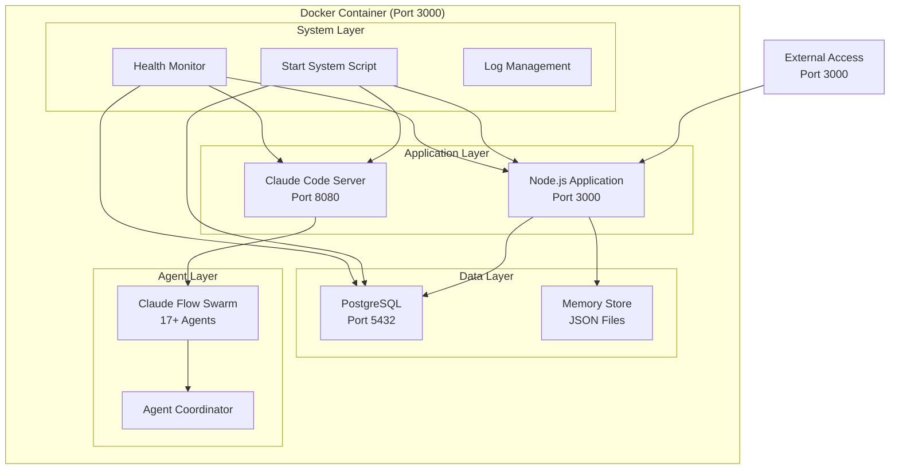

# Infrastructure Architecture
## Claude Code + AgentLink Development Environment

### System Overview

The infrastructure is designed as a single, self-contained Docker container that provides a complete development environment for the Claude Code + AgentLink system. The architecture follows microservices principles within a monolithic container for simplicity and portability.

### Container Architecture



### Internal Networking

#### Port Strategy
- **External Port**: 3000 (HTTP/WebSocket access)
- **Internal Ports**: 
  - 8080 (Claude Code server)
  - 5432 (PostgreSQL database)
  - All internal communication via localhost

#### Network Security
- No external access to internal ports
- Container isolation with bridge networking
- Security-optimized PostgreSQL configuration
- Non-root user execution

### Volume Mounting Strategy

#### Development Environment
```yaml
volumes:
  # Hot reload capabilities
  - ../src:/app/src:ro
  - ../frontend/src:/app/frontend/src:ro
  
  # Persistent data
  - postgres_data:/var/lib/postgresql/data
  - claude_config:/app/.claude
  - logs:/app/logs
  - memory:/app/memory
  
  # Development tools
  - ../.git:/app/.git:ro
  - ../docs:/app/docs:rw
  - ../tests:/app/tests:rw
```

#### Production Environment
```yaml
volumes:
  # Persistent production data
  - postgres_data_prod:/var/lib/postgresql/data
  - claude_config_prod:/app/.claude
  - logs_prod:/app/logs
  - memory_prod:/app/memory
  - backup_data:/app/backups
```

### Service Orchestration

#### Startup Sequence
1. **Memory Check**: Adjust PostgreSQL settings based on available memory
2. **PostgreSQL Start**: Initialize and start database service
3. **Claude Code Setup**: Configure and start Claude Code server
4. **Application Start**: Launch Node.js application with hot reload
5. **Swarm Initialize**: Spawn 17+ specialized agents
6. **Health Monitor**: Start continuous health monitoring

#### Graceful Shutdown
1. Stop health monitoring
2. Terminate agent swarm
3. Stop Node.js application
4. Stop Claude Code server
5. Stop PostgreSQL with smart shutdown

### Agent Coordination

#### Specialized Agents (17+ Types)
- **Core Development**: coder, reviewer, tester, planner, researcher
- **Swarm Coordination**: hierarchical-coordinator, mesh-coordinator
- **Performance**: perf-analyzer, performance-benchmarker
- **GitHub Integration**: pr-manager, code-review-swarm, issue-tracker
- **SPARC Methodology**: specification, pseudocode, architecture, refinement
- **Testing**: tdd-london-swarm, production-validator

#### Agent Communication
- Internal message passing via Claude Flow
- Shared memory store for coordination
- Event-driven workflow orchestration

### Memory Optimization

#### Resource Limits
- **Total Memory**: <2GB container limit
- **PostgreSQL**: 64MB shared buffers (128MB max cache)
- **Node.js**: Heap limit 1GB
- **Claude Code**: 256MB allocated
- **Agent Swarm**: 512MB total for all agents

#### Memory Monitoring
- Continuous memory usage tracking
- Automatic garbage collection tuning
- Low memory mode adjustments
- Alert system for high usage

### Security Architecture

#### Container Security
- Non-root user execution (appuser:appuser)
- Read-only filesystem where possible
- Minimal attack surface
- Security-optimized package installation

#### Database Security
- Local-only PostgreSQL access
- Restricted connection limits (50 max)
- No external database access
- Secure password handling

#### Application Security
- Environment variable protection
- Input validation middleware
- CORS protection
- Rate limiting

### Health Monitoring

#### Health Check Components
1. **PostgreSQL**: `pg_isready` connectivity check
2. **Node.js**: HTTP health endpoint verification
3. **Claude Code**: Server responsiveness check
4. **Memory**: Usage threshold monitoring
5. **Disk**: Available space verification

#### Monitoring Intervals
- **Development**: 30s interval, 10s timeout
- **Production**: 60s interval, 15s timeout
- **Startup**: 120s grace period
- **Retries**: 3-5 attempts before failure

### Development Workflow

#### Hot Reload Implementation
- Source code volume mounting
- Nodemon for automatic restarts
- Frontend hot module replacement
- Database schema migration detection

#### DevContainer Integration
- VSCode extension recommendations
- Automatic port forwarding
- Git integration
- Debugging configuration

### Deployment Strategies

#### Local Development
```bash
make dev          # Start with hot reload
make shell        # Access container shell
make logs         # Monitor system logs
make health       # Check system status
```

#### Production Deployment
```bash
make prod         # Start production environment
make backup       # Create system backup
make monitor      # System monitoring
make scale        # Performance optimization
```

#### Codespace Deployment
- Automatic container initialization
- Pre-configured development environment
- Claude authentication handling
- Persistent workspace configuration

### Performance Optimization

#### Database Optimization
- Connection pooling
- Query optimization
- Index management
- Memory-tuned configuration

#### Application Optimization
- Asset bundling and minification
- API response caching
- WebSocket connection management
- Static file serving

#### Agent Optimization
- Lazy agent spawning
- Resource-aware task allocation
- Intelligent load balancing
- Memory-efficient communication

### Backup and Recovery

#### Automated Backups
- Daily database dumps
- Configuration file backups
- Memory store persistence
- Log rotation management

#### Recovery Procedures
- Database restoration from dumps
- Configuration rollback capabilities
- Agent state recovery
- System state snapshots

### Monitoring and Logging

#### Log Management
- Structured JSON logging
- Log rotation (10MB max, 3 files)
- Centralized log aggregation
- Error tracking and alerting

#### Metrics Collection
- System resource usage
- Application performance metrics
- Agent coordination statistics
- User interaction analytics

### Scalability Considerations

#### Horizontal Scaling
- Multi-container deployment support
- Load balancer integration
- Database replication readiness
- Shared session management

#### Vertical Scaling
- Dynamic resource allocation
- Memory usage optimization
- CPU utilization management
- Storage expansion capabilities

This architecture provides a robust, secure, and scalable foundation for the Claude Code + AgentLink development environment while maintaining simplicity through single-container deployment.