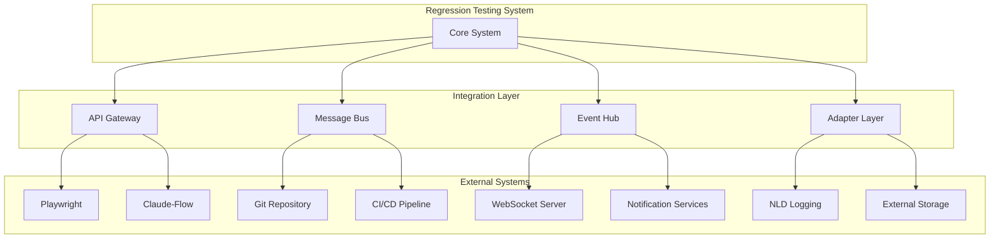
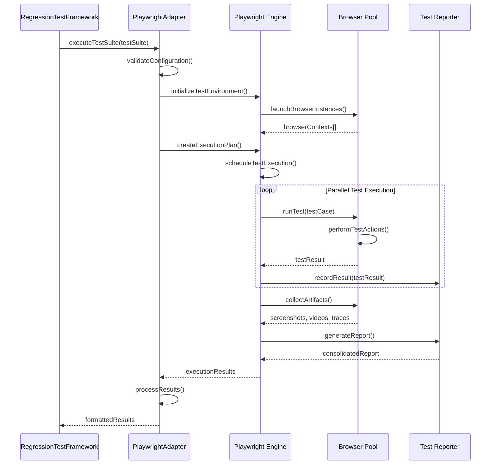

# Integration Specifications - Regression Testing System

## Overview

This document provides detailed integration specifications for connecting the Regression Testing System with external systems, APIs, and third-party services within the Agent Feed ecosystem.

## 1. System Integration Architecture

### 1.1 Integration Layer Overview



### 1.2 Integration Patterns

```typescript
interface IntegrationPattern {
    name: string;
    type: 'synchronous' | 'asynchronous' | 'event-driven' | 'streaming';
    reliability: 'at-least-once' | 'at-most-once' | 'exactly-once';
    errorHandling: ErrorHandlingStrategy;
    retryPolicy: RetryPolicy;
    circuitBreaker: CircuitBreakerConfig;
    monitoring: MonitoringConfig;
}

enum ErrorHandlingStrategy {
    FAIL_FAST = 'fail_fast',
    RETRY_WITH_BACKOFF = 'retry_with_backoff',
    DEAD_LETTER_QUEUE = 'dead_letter_queue',
    CIRCUIT_BREAKER = 'circuit_breaker',
    GRACEFUL_DEGRADATION = 'graceful_degradation'
}
```

## 2. Playwright Integration Specification

### 2.1 Playwright Adapter Implementation

```typescript
class PlaywrightAdapter implements TestFrameworkAdapter {
    private config: PlaywrightConfig;
    private connectionPool: ConnectionPool;
    private resultProcessor: ResultProcessor;
    
    constructor(config: PlaywrightConfig) {
        this.config = config;
        this.connectionPool = new ConnectionPool(config.poolSize);
        this.resultProcessor = new ResultProcessor();
    }
    
    async executeTestSuite(suite: TestSuite): Promise<PlaywrightResults> {
        const connection = await this.connectionPool.acquire();
        try {
            const context = await this.createTestContext(suite);
            const results = await this.runTests(context, suite.tests);
            return await this.processResults(results);
        } finally {
            await this.connectionPool.release(connection);
        }
    }
    
    private async createTestContext(suite: TestSuite): Promise<PlaywrightContext> {
        return {
            browsers: await this.launchBrowsers(suite.browserConfig),
            devices: this.configureDevices(suite.deviceConfig),
            environment: await this.setupEnvironment(suite.environmentConfig),
            reporters: this.setupReporters(suite.reportingConfig)
        };
    }
    
    private async runTests(context: PlaywrightContext, tests: Test[]): Promise<RawTestResult[]> {
        const executionPlan = this.createExecutionPlan(tests, context);
        const executor = new ParallelTestExecutor(this.config.parallelism);
        return await executor.execute(executionPlan);
    }
}

interface PlaywrightConfig {
    browsers: BrowserConfig[];
    devices: DeviceConfig[];
    parallelism: {
        workers: number;
        sharding: boolean;
        fullyParallel: boolean;
    };
    timeouts: {
        test: number;
        expect: number;
        navigation: number;
    };
    retry: {
        count: number;
        strategy: 'linear' | 'exponential';
    };
    artifacts: {
        screenshots: 'on' | 'off' | 'only-on-failure';
        videos: 'on' | 'off' | 'retain-on-failure';
        traces: 'on' | 'off' | 'on-first-retry';
    };
    reporting: {
        formats: ReportFormat[];
        outputDir: string;
        open: 'always' | 'never' | 'on-failure';
    };
}

interface BrowserConfig {
    name: 'chromium' | 'firefox' | 'webkit';
    channel?: string;
    headless: boolean;
    slowMo?: number;
    args?: string[];
    ignoreDefaultArgs?: boolean;
    proxy?: ProxyConfig;
    downloads?: string;
    viewport?: ViewportConfig;
}
```

### 2.2 Test Execution Integration



### 2.3 Configuration Management

```typescript
interface PlaywrightIntegrationConfig {
    connection: {
        endpoint: string;
        authentication: AuthenticationConfig;
        timeout: number;
        poolSize: number;
        keepAlive: boolean;
    };
    
    execution: {
        strategy: 'parallel' | 'sequential' | 'hybrid';
        maxConcurrency: number;
        resourceLimits: ResourceLimits;
        queueTimeout: number;
    };
    
    resultHandling: {
        streaming: boolean;
        compression: boolean;
        encryption: boolean;
        retention: RetentionPolicy;
    };
    
    errorHandling: {
        retryPolicy: RetryPolicy;
        fallbackStrategy: FallbackStrategy;
        errorReporting: ErrorReportingConfig;
    };
}
```

## 3. Claude-Flow Integration Specification

### 3.1 Claude-Flow Adapter Implementation

```typescript
class ClaudeFlowAdapter implements OrchestrationAdapter {
    private mcpClient: MCPClient;
    private swarmManager: SwarmManager;
    private agentRegistry: AgentRegistry;
    private taskCoordinator: TaskCoordinator;
    
    constructor(config: ClaudeFlowConfig) {
        this.mcpClient = new MCPClient(config.mcpEndpoint);
        this.swarmManager = new SwarmManager(config.swarm);
        this.agentRegistry = new AgentRegistry();
        this.taskCoordinator = new TaskCoordinator(config.coordination);
    }
    
    async initializeSwarm(topology: SwarmTopology): Promise<SwarmInstance> {
        const swarmConfig = this.buildSwarmConfig(topology);
        const swarmId = await this.mcpClient.call('swarm_init', swarmConfig);
        
        const agents = await this.spawnAgents(topology.agentDefinitions);
        const swarmInstance = new SwarmInstance(swarmId, agents, topology);
        
        await this.establishAgentCommunication(swarmInstance);
        return swarmInstance;
    }
    
    async orchestrateTestExecution(testPlan: TestPlan, swarm: SwarmInstance): Promise<OrchestrationResult> {
        const taskDistribution = await this.distributeTestTasks(testPlan, swarm);
        const coordinationPlan = await this.createCoordinationPlan(taskDistribution);
        
        const executionPromise = this.coordineateExecution(coordinationPlan);
        const monitoringPromise = this.monitorExecution(coordinationPlan);
        
        const [executionResult, monitoringData] = await Promise.all([
            executionPromise,
            monitoringPromise
        ]);
        
        return {
            results: executionResult,
            metrics: monitoringData,
            swarmState: await this.captureSwarmState(swarm)
        };
    }
    
    private async distributeTestTasks(testPlan: TestPlan, swarm: SwarmInstance): Promise<TaskDistribution> {
        const availableAgents = swarm.getAvailableAgents();
        const taskAnalysis = await this.analyzeTestComplexity(testPlan.tests);
        
        return await this.taskCoordinator.distribute({
            tasks: this.createTaskDefinitions(testPlan.tests),
            agents: availableAgents,
            strategy: this.selectDistributionStrategy(taskAnalysis),
            constraints: testPlan.constraints
        });
    }
}

interface ClaudeFlowConfig {
    mcpEndpoint: string;
    swarm: {
        topology: SwarmTopologyConfig;
        agents: AgentConfig[];
        communication: CommunicationConfig;
        resilience: ResilienceConfig;
    };
    coordination: {
        strategy: CoordinationStrategy;
        loadBalancing: LoadBalancingConfig;
        faultTolerance: FaultToleranceConfig;
    };
    monitoring: {
        metricsCollection: boolean;
        performanceTracking: boolean;
        resourceMonitoring: boolean;
        alerting: AlertingConfig;
    };
}

interface SwarmTopology {
    type: 'hierarchical' | 'mesh' | 'ring' | 'star' | 'hybrid';
    maxAgents: number;
    agentDefinitions: AgentDefinition[];
    communicationPattern: CommunicationPattern;
    failoverStrategy: FailoverStrategy;
}
```

### 3.2 Agent Communication Protocol

```typescript
interface AgentCommunicationProtocol {
    messageFormat: {
        version: string;
        type: MessageType;
        source: AgentId;
        target: AgentId | 'broadcast';
        timestamp: timestamp;
        payload: MessagePayload;
        signature?: string;
    };
    
    messageTypes: {
        TASK_ASSIGNMENT: 'task_assignment';
        TASK_STATUS: 'task_status';
        TASK_RESULT: 'task_result';
        COORDINATION: 'coordination';
        HEARTBEAT: 'heartbeat';
        ERROR: 'error';
        SHUTDOWN: 'shutdown';
    };
    
    communicationChannels: {
        direct: DirectChannel;
        broadcast: BroadcastChannel;
        multicast: MulticastChannel;
        persistent: PersistentChannel;
    };
    
    reliability: {
        acknowledgment: boolean;
        retry: RetryConfig;
        duplicateDetection: boolean;
        ordering: boolean;
    };
}

class AgentCommunicationManager {
    private channels: Map<string, CommunicationChannel>;
    private messageQueue: MessageQueue;
    private protocolHandler: ProtocolHandler;
    
    async sendMessage(message: AgentMessage): Promise<MessageResult> {
        const channel = this.selectChannel(message);
        const serializedMessage = await this.protocolHandler.serialize(message);
        
        try {
            const result = await channel.send(serializedMessage);
            await this.messageQueue.acknowledge(message.id);
            return result;
        } catch (error) {
            await this.handleCommunicationError(message, error);
            throw error;
        }
    }
    
    async receiveMessage(): Promise<AgentMessage> {
        const rawMessage = await this.messageQueue.receive();
        const message = await this.protocolHandler.deserialize(rawMessage);
        
        if (await this.validateMessage(message)) {
            await this.processMessage(message);
            return message;
        } else {
            throw new InvalidMessageError('Message validation failed');
        }
    }
}
```

### 3.3 MCP Integration Specification

```typescript
interface MCPIntegration {
    tools: {
        swarm_init: {
            parameters: SwarmInitParams;
            returns: SwarmInstance;
        };
        agent_spawn: {
            parameters: AgentSpawnParams;
            returns: AgentInstance;
        };
        task_orchestrate: {
            parameters: TaskOrchestrationParams;
            returns: OrchestrationResult;
        };
        swarm_status: {
            parameters: SwarmStatusParams;
            returns: SwarmStatus;
        };
        neural_train: {
            parameters: NeuralTrainingParams;
            returns: TrainingResult;
        };
        memory_usage: {
            parameters: MemoryUsageParams;
            returns: MemoryMetrics;
        };
    };
    
    resources: {
        swarmMetrics: SwarmMetricsResource;
        agentLogs: AgentLogsResource;
        taskResults: TaskResultsResource;
        performanceData: PerformanceDataResource;
    };
    
    prompts: {
        testAnalysis: TestAnalysisPrompt;
        resultSummary: ResultSummaryPrompt;
        optimizationSuggestions: OptimizationPrompt;
    };
}

class MCPClient {
    private connection: MCPConnection;
    private toolRegistry: ToolRegistry;
    private resourceManager: ResourceManager;
    
    async call(toolName: string, parameters: any): Promise<any> {
        const tool = this.toolRegistry.get(toolName);
        if (!tool) {
            throw new ToolNotFoundError(`Tool ${toolName} not found`);
        }
        
        const validatedParams = await tool.validateParameters(parameters);
        const request = this.buildRequest(toolName, validatedParams);
        
        try {
            const response = await this.connection.send(request);
            return await this.processResponse(response);
        } catch (error) {
            await this.handleError(error, toolName, parameters);
            throw error;
        }
    }
    
    async getResource(resourceUri: string): Promise<ResourceContent> {
        const resource = await this.resourceManager.get(resourceUri);
        return await this.connection.getResource(resource);
    }
}
```

## 4. Git Repository Integration Specification

### 4.1 Git Webhook Integration

```typescript
class GitWebhookHandler {
    private webhookValidator: WebhookValidator;
    private eventProcessor: GitEventProcessor;
    private triggerManager: TestTriggerManager;
    
    async handleWebhook(request: WebhookRequest): Promise<WebhookResponse> {
        try {
            await this.webhookValidator.validate(request);
            const gitEvent = await this.parseGitEvent(request);
            const triggerDecision = await this.evaluateTriggerConditions(gitEvent);
            
            if (triggerDecision.shouldTrigger) {
                await this.triggerTestExecution(triggerDecision);
            }
            
            return { status: 'success', message: 'Webhook processed successfully' };
        } catch (error) {
            await this.handleWebhookError(error, request);
            return { status: 'error', message: error.message };
        }
    }
    
    private async evaluateTriggerConditions(event: GitEvent): Promise<TriggerDecision> {
        const conditions = await this.triggerManager.getConditions(event.repository);
        const evaluator = new ConditionEvaluator();
        
        return evaluator.evaluate({
            event,
            conditions,
            context: {
                branch: event.branch,
                changes: event.changes,
                author: event.author,
                timestamp: event.timestamp
            }
        });
    }
}

interface GitEvent {
    type: 'push' | 'pull_request' | 'tag' | 'branch_created' | 'branch_deleted';
    repository: RepositoryInfo;
    branch: string;
    commits: Commit[];
    changes: FileChange[];
    author: Author;
    timestamp: timestamp;
    metadata: EventMetadata;
}

interface TriggerCondition {
    name: string;
    type: 'file_pattern' | 'branch_pattern' | 'author_pattern' | 'custom';
    pattern: string | RegExp;
    action: 'include' | 'exclude';
    priority: number;
    testSuite?: string;
}
```

### 4.2 Change Impact Analysis

```typescript
class ChangeImpactAnalyzer {
    private fileAnalyzer: FileChangeAnalyzer;
    private dependencyTracker: DependencyTracker;
    private testMapper: TestToCodeMapper;
    
    async analyzeChanges(changes: FileChange[]): Promise<ImpactAnalysis> {
        const fileImpacts = await Promise.all(
            changes.map(change => this.analyzeFileChange(change))
        );
        
        const dependencyImpacts = await this.analyzeDependencyImpacts(changes);
        const testImpacts = await this.analyzeTestImpacts(changes);
        
        return {
            riskLevel: this.calculateRiskLevel(fileImpacts, dependencyImpacts),
            affectedComponents: this.identifyAffectedComponents(fileImpacts),
            recommendedTests: this.recommendTests(testImpacts),
            impactScore: this.calculateImpactScore(fileImpacts, dependencyImpacts),
            metadata: {
                analysisTimestamp: new Date(),
                confidence: this.calculateConfidence(fileImpacts)
            }
        };
    }
    
    private async analyzeFileChange(change: FileChange): Promise<FileImpact> {
        const fileType = this.identifyFileType(change.path);
        const changeType = this.categorizeChangeType(change);
        const complexity = await this.calculateChangeComplexity(change);
        
        return {
            file: change.path,
            type: fileType,
            changeType,
            complexity,
            riskFactors: await this.identifyRiskFactors(change),
            affectedFeatures: await this.identifyAffectedFeatures(change)
        };
    }
}

interface ImpactAnalysis {
    riskLevel: 'low' | 'medium' | 'high' | 'critical';
    affectedComponents: ComponentImpact[];
    recommendedTests: TestRecommendation[];
    impactScore: number;
    metadata: AnalysisMetadata;
}

interface ComponentImpact {
    component: string;
    impactLevel: 'low' | 'medium' | 'high';
    reason: string;
    affectedFunctionality: string[];
    testCoverage: number;
}
```

### 4.3 Branch Management Integration

```typescript
class GitBranchManager {
    private gitClient: GitClient;
    private branchPolicies: BranchPolicyManager;
    private mergeController: MergeController;
    
    async manageBranchWorkflow(event: GitEvent): Promise<BranchWorkflowResult> {
        const branch = await this.gitClient.getBranch(event.branch);
        const policies = await this.branchPolicies.getPolicies(branch);
        
        switch (event.type) {
            case 'push':
                return await this.handlePushEvent(branch, policies, event);
            case 'pull_request':
                return await this.handlePullRequestEvent(branch, policies, event);
            default:
                return { status: 'ignored', reason: 'Event type not handled' };
        }
    }
    
    private async handlePullRequestEvent(
        branch: Branch, 
        policies: BranchPolicy[], 
        event: GitEvent
    ): Promise<BranchWorkflowResult> {
        const prValidation = await this.validatePullRequest(event.pullRequest);
        if (!prValidation.isValid) {
            return { status: 'blocked', reason: prValidation.reason };
        }
        
        const testExecution = await this.executeMandatoryTests(branch, policies);
        const approvalStatus = await this.checkApprovalRequirements(event.pullRequest, policies);
        
        if (testExecution.passed && approvalStatus.approved) {
            return await this.mergeController.attemptMerge(event.pullRequest);
        }
        
        return {
            status: 'pending',
            requirements: [
                ...testExecution.pendingTests,
                ...approvalStatus.pendingApprovals
            ]
        };
    }
}

interface BranchPolicy {
    name: string;
    branch: string | RegExp;
    requirements: {
        minimumReviewers: number;
        requiredTests: string[];
        blockingTests: string[];
        statusChecks: StatusCheck[];
        restrictPushes: boolean;
        requireSignedCommits: boolean;
    };
    enforcement: {
        adminOverride: boolean;
        skipForBots: boolean;
        gracePeriod?: number;
    };
}
```

## 5. NLD Logging System Integration Specification

### 5.1 Log Collection and Processing

```typescript
class NLDLogIntegrator {
    private logCollector: LogCollector;
    private logProcessor: LogProcessor;
    private patternEngine: PatternEngine;
    private predictionService: PredictionService;
    
    async integrateWithNLD(config: NLDIntegrationConfig): Promise<NLDIntegration> {
        const logStreams = await this.setupLogStreams(config.logSources);
        const processors = await this.initializeProcessors(config.processing);
        const patterns = await this.loadPatternModels(config.patterns);
        
        return new NLDIntegration({
            streams: logStreams,
            processors,
            patterns,
            config
        });
    }
    
    async processTestExecutionLogs(testExecution: TestExecution): Promise<LogAnalysisResult> {
        const logs = await this.logCollector.collectLogs({
            source: 'test_execution',
            timeRange: testExecution.timeRange,
            filters: this.buildLogFilters(testExecution)
        });
        
        const processedLogs = await this.logProcessor.process(logs);
        const patterns = await this.patternEngine.analyze(processedLogs);
        const predictions = await this.predictionService.predict(patterns);
        
        return {
            logs: processedLogs,
            patterns,
            predictions,
            insights: await this.generateInsights(patterns, predictions),
            anomalies: await this.detectAnomalies(processedLogs)
        };
    }
}

interface NLDIntegrationConfig {
    logSources: LogSourceConfig[];
    processing: LogProcessingConfig;
    patterns: PatternAnalysisConfig;
    prediction: PredictionConfig;
    realtime: RealtimeConfig;
}

interface LogSourceConfig {
    name: string;
    type: 'file' | 'stream' | 'api' | 'database';
    endpoint: string;
    format: 'json' | 'text' | 'structured' | 'custom';
    filters: LogFilter[];
    retention: RetentionPolicy;
    compression: boolean;
}

class LogStreamProcessor {
    async processStream(stream: LogStream): Promise<ProcessedLogStream> {
        return stream
            .pipe(new LogParser(stream.format))
            .pipe(new LogEnricher())
            .pipe(new LogFilter(stream.filters))
            .pipe(new LogAggregator())
            .pipe(new PatternDetector())
            .pipe(new AnomalyDetector());
    }
}
```

### 5.2 Pattern Recognition Integration

```typescript
class NLDPatternRecognition {
    private modelManager: ModelManager;
    private featureExtractor: FeatureExtractor;
    private patternClassifier: PatternClassifier;
    
    async recognizePatterns(data: AnalysisData): Promise<PatternRecognitionResult> {
        const features = await this.featureExtractor.extract(data);
        const patterns = await this.patternClassifier.classify(features);
        const confidence = await this.calculateConfidence(patterns, features);
        
        return {
            patterns,
            confidence,
            recommendations: await this.generateRecommendations(patterns),
            alerts: await this.generateAlerts(patterns, confidence)
        };
    }
    
    async updatePatternModels(feedback: PatternFeedback): Promise<ModelUpdateResult> {
        const currentModel = await this.modelManager.getCurrentModel();
        const trainingData = await this.prepareTrainingData(feedback);
        
        const updatedModel = await this.trainModel(currentModel, trainingData);
        const evaluation = await this.evaluateModel(updatedModel);
        
        if (evaluation.score > currentModel.score) {
            await this.modelManager.deployModel(updatedModel);
            return { status: 'updated', improvement: evaluation.score - currentModel.score };
        }
        
        return { status: 'retained', reason: 'No improvement detected' };
    }
}

interface PatternRecognitionConfig {
    models: {
        failurePatterns: ModelConfig;
        performancePatterns: ModelConfig;
        regressionPatterns: ModelConfig;
        anomalyPatterns: ModelConfig;
    };
    
    features: {
        temporal: TemporalFeatureConfig;
        statistical: StatisticalFeatureConfig;
        textual: TextualFeatureConfig;
        behavioral: BehavioralFeatureConfig;
    };
    
    classification: {
        algorithms: ClassificationAlgorithm[];
        ensembleMethod: EnsembleMethod;
        confidenceThreshold: number;
        feedbackIncorporation: boolean;
    };
}
```

## 6. WebSocket Real-time Integration

### 6.1 WebSocket Connection Management

```typescript
class WebSocketIntegrator {
    private connectionManager: WSConnectionManager;
    private messageRouter: MessageRouter;
    private eventBroadcaster: EventBroadcaster;
    private stateManager: StateManager;
    
    async establishConnection(config: WSConfig): Promise<WSConnection> {
        const connection = await this.connectionManager.connect({
            endpoint: config.endpoint,
            protocols: config.protocols,
            authentication: config.authentication,
            reconnection: config.reconnection
        });
        
        await this.setupMessageHandlers(connection);
        await this.initializeSubscriptions(connection, config.subscriptions);
        
        return connection;
    }
    
    async broadcastTestUpdate(update: TestUpdate): Promise<BroadcastResult> {
        const subscribers = await this.getSubscribers(update.type);
        const message = await this.formatMessage(update);
        
        const results = await Promise.allSettled(
            subscribers.map(subscriber => 
                this.sendMessage(subscriber, message)
            )
        );
        
        return {
            sent: results.filter(r => r.status === 'fulfilled').length,
            failed: results.filter(r => r.status === 'rejected').length,
            totalSubscribers: subscribers.length
        };
    }
    
    private async setupMessageHandlers(connection: WSConnection): Promise<void> {
        connection.on('message', async (message) => {
            const parsed = await this.parseMessage(message);
            await this.messageRouter.route(parsed);
        });
        
        connection.on('close', async (event) => {
            await this.handleDisconnection(connection, event);
        });
        
        connection.on('error', async (error) => {
            await this.handleConnectionError(connection, error);
        });
    }
}

interface WSConfig {
    endpoint: string;
    protocols?: string[];
    authentication: {
        type: 'bearer' | 'basic' | 'custom';
        credentials: any;
    };
    reconnection: {
        enabled: boolean;
        maxAttempts: number;
        backoffStrategy: 'linear' | 'exponential';
        initialDelay: number;
    };
    subscriptions: SubscriptionConfig[];
    heartbeat: {
        enabled: boolean;
        interval: number;
        timeout: number;
    };
}

interface SubscriptionConfig {
    topic: string;
    filters?: MessageFilter[];
    qos: 'at-most-once' | 'at-least-once' | 'exactly-once';
    persistent: boolean;
}
```

### 6.2 Real-time Event Broadcasting

```typescript
class RealtimeEventBroadcaster {
    private eventQueue: EventQueue;
    private subscribers: SubscriberManager;
    private messageFormatter: MessageFormatter;
    
    async broadcastEvent(event: SystemEvent): Promise<void> {
        const formattedEvent = await this.messageFormatter.format(event);
        const subscribers = await this.subscribers.getSubscribers(event.type);
        
        await this.eventQueue.enqueue({
            event: formattedEvent,
            subscribers,
            priority: event.priority,
            timestamp: new Date()
        });
    }
    
    async processEventQueue(): Promise<void> {
        while (true) {
            const queuedEvent = await this.eventQueue.dequeue();
            if (!queuedEvent) {
                await this.sleep(100);
                continue;
            }
            
            await this.deliverEvent(queuedEvent);
        }
    }
    
    private async deliverEvent(queuedEvent: QueuedEvent): Promise<void> {
        const deliveryPromises = queuedEvent.subscribers.map(async (subscriber) => {
            try {
                await this.sendToSubscriber(subscriber, queuedEvent.event);
                await this.recordDelivery(subscriber.id, queuedEvent.event.id, 'success');
            } catch (error) {
                await this.recordDelivery(subscriber.id, queuedEvent.event.id, 'failed');
                await this.handleDeliveryError(subscriber, queuedEvent.event, error);
            }
        });
        
        await Promise.allSettled(deliveryPromises);
    }
}

interface SystemEvent {
    id: string;
    type: EventType;
    source: EventSource;
    payload: any;
    priority: EventPriority;
    timestamp: Date;
    metadata: EventMetadata;
}

enum EventType {
    TEST_STARTED = 'test_started',
    TEST_COMPLETED = 'test_completed',
    TEST_FAILED = 'test_failed',
    REGRESSION_DETECTED = 'regression_detected',
    PATTERN_DISCOVERED = 'pattern_discovered',
    APPROVAL_REQUIRED = 'approval_required',
    DEPLOYMENT_READY = 'deployment_ready'
}
```

## 7. CI/CD Pipeline Integration

### 7.1 Pipeline Integration Architecture

```typescript
class CICDIntegrator {
    private pipelineClient: PipelineClient;
    private stageManager: StageManager;
    private artifactManager: ArtifactManager;
    private notificationService: NotificationService;
    
    async integratePipeline(config: PipelineConfig): Promise<PipelineIntegration> {
        const pipeline = await this.pipelineClient.createPipeline({
            name: config.name,
            triggers: config.triggers,
            stages: config.stages,
            environment: config.environment
        });
        
        await this.registerTestingStages(pipeline, config.testingStages);
        await this.setupArtifactHandling(pipeline, config.artifacts);
        await this.configureNotifications(pipeline, config.notifications);
        
        return new PipelineIntegration(pipeline, this);
    }
    
    async executeTestingStage(stage: TestingStage): Promise<StageResult> {
        try {
            await this.stageManager.prepare(stage);
            const testResult = await this.executeTests(stage);
            const artifacts = await this.collectArtifacts(stage, testResult);
            
            await this.artifactManager.store(artifacts);
            await this.publishResults(stage, testResult);
            
            return {
                status: testResult.success ? 'passed' : 'failed',
                testResult,
                artifacts: artifacts.map(a => a.id),
                duration: stage.duration
            };
        } catch (error) {
            await this.handleStageError(stage, error);
            throw error;
        }
    }
}

interface PipelineConfig {
    name: string;
    triggers: PipelineTrigger[];
    stages: PipelineStage[];
    environment: EnvironmentConfig;
    testingStages: TestingStageConfig[];
    artifacts: ArtifactConfig;
    notifications: NotificationConfig;
}

interface TestingStageConfig {
    name: string;
    type: 'unit' | 'integration' | 'e2e' | 'performance' | 'security';
    dependsOn: string[];
    testSuite: string;
    environment: string;
    parallelism: number;
    timeout: number;
    retries: number;
    artifacts: string[];
    gates: QualityGate[];
}

interface QualityGate {
    name: string;
    metric: string;
    operator: 'gt' | 'gte' | 'lt' | 'lte' | 'eq';
    threshold: number;
    action: 'block' | 'warn' | 'continue';
}
```

### 7.2 Deployment Gate Integration

```typescript
class DeploymentGateManager {
    private qualityAnalyzer: QualityAnalyzer;
    private riskAssessor: RiskAssessor;
    private approvalManager: ApprovalManager;
    
    async evaluateDeploymentReadiness(deployment: DeploymentRequest): Promise<GateEvaluation> {
        const qualityMetrics = await this.qualityAnalyzer.analyze(deployment.testResults);
        const riskAssessment = await this.riskAssessor.assess(deployment.changes);
        const approvalStatus = await this.approvalManager.getStatus(deployment.id);
        
        const gates = await this.getDeploymentGates(deployment.environment);
        const evaluations = await Promise.all(
            gates.map(gate => this.evaluateGate(gate, {
                quality: qualityMetrics,
                risk: riskAssessment,
                approvals: approvalStatus
            }))
        );
        
        const overallStatus = this.determineOverallStatus(evaluations);
        
        return {
            status: overallStatus,
            evaluations,
            recommendations: await this.generateRecommendations(evaluations),
            metadata: {
                evaluatedAt: new Date(),
                evaluator: 'DeploymentGateManager'
            }
        };
    }
    
    private async evaluateGate(gate: DeploymentGate, context: EvaluationContext): Promise<GateEvaluation> {
        const result = await gate.evaluate(context);
        
        return {
            gate: gate.name,
            status: result.passed ? 'passed' : 'failed',
            score: result.score,
            threshold: gate.threshold,
            details: result.details,
            action: result.passed ? 'continue' : gate.failureAction
        };
    }
}

interface DeploymentGate {
    name: string;
    type: 'quality' | 'security' | 'performance' | 'approval' | 'custom';
    threshold: number;
    weight: number;
    required: boolean;
    failureAction: 'block' | 'warn' | 'manual_review';
    evaluate(context: EvaluationContext): Promise<GateResult>;
}
```

## 8. Monitoring and Observability Integration

### 8.1 Metrics Collection Integration

```typescript
class MetricsCollector {
    private metricsClient: MetricsClient;
    private aggregator: MetricsAggregator;
    private alertManager: AlertManager;
    
    async collectSystemMetrics(): Promise<SystemMetrics> {
        const testMetrics = await this.collectTestMetrics();
        const performanceMetrics = await this.collectPerformanceMetrics();
        const resourceMetrics = await this.collectResourceMetrics();
        const businessMetrics = await this.collectBusinessMetrics();
        
        return {
            test: testMetrics,
            performance: performanceMetrics,
            resources: resourceMetrics,
            business: businessMetrics,
            timestamp: new Date()
        };
    }
    
    async setupMetricsCollection(config: MetricsConfig): Promise<void> {
        await this.metricsClient.configure(config.collection);
        await this.aggregator.configure(config.aggregation);
        await this.alertManager.configure(config.alerting);
        
        // Start periodic collection
        setInterval(async () => {
            const metrics = await this.collectSystemMetrics();
            await this.processMetrics(metrics);
        }, config.collectionInterval);
    }
    
    private async processMetrics(metrics: SystemMetrics): Promise<void> {
        await this.metricsClient.send(metrics);
        await this.aggregator.aggregate(metrics);
        await this.evaluateAlerts(metrics);
    }
}

interface MetricsConfig {
    collection: {
        interval: number;
        sources: MetricSource[];
        retention: RetentionPolicy;
    };
    aggregation: {
        strategy: 'time_series' | 'histogram' | 'counter' | 'gauge';
        windows: AggregationWindow[];
        rollup: RollupConfig;
    };
    alerting: {
        rules: AlertRule[];
        channels: AlertChannel[];
        escalation: EscalationPolicy;
    };
}
```

This comprehensive integration specification provides:

1. **Detailed adapter implementations** for each external system
2. **Communication protocols** and message formats
3. **Error handling and resilience** patterns
4. **Configuration management** for all integrations
5. **Real-time event processing** capabilities
6. **CI/CD pipeline integration** with quality gates
7. **Comprehensive monitoring** and observability

The architecture ensures robust, scalable, and maintainable integrations with all external systems while providing flexibility for future enhancements.