# @ Mention System - Component Diagrams & Data Flow

## 1. Component Hierarchy Diagram

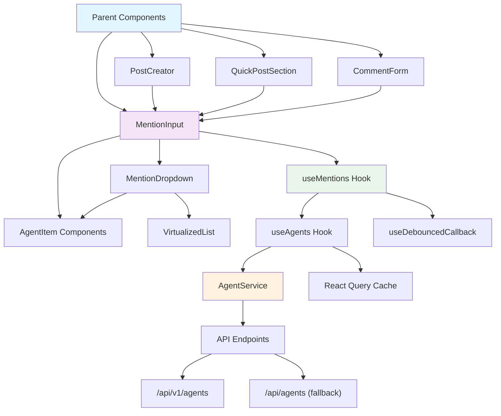

## 2. Data Flow Architecture

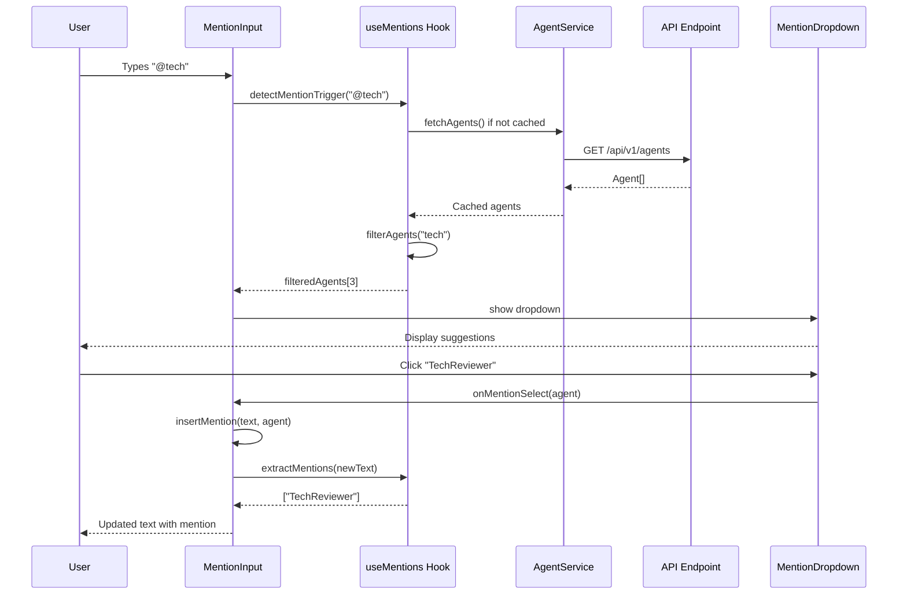

## 3. State Management Flow

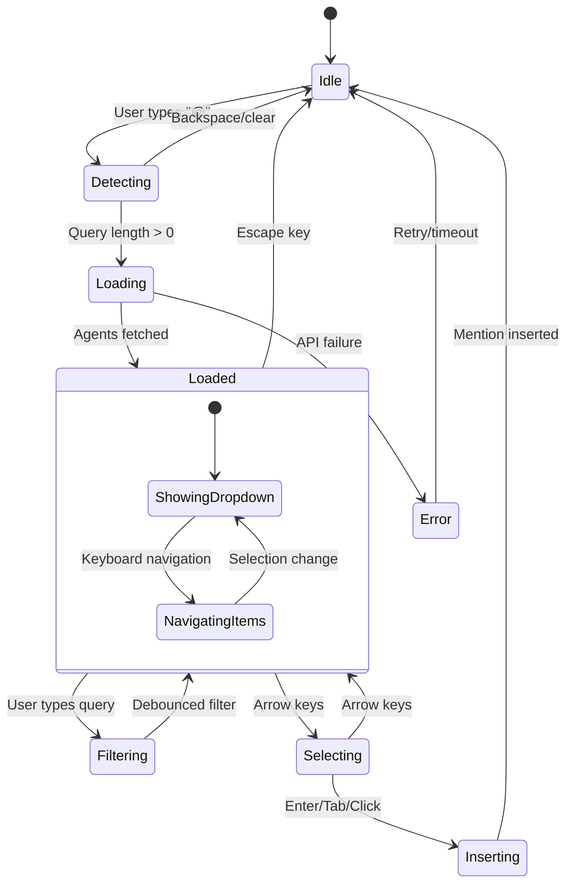

## 4. Component Integration Pattern

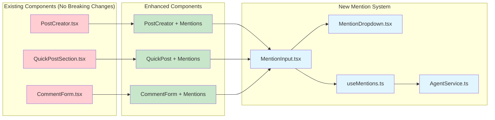

## 5. API Integration Architecture

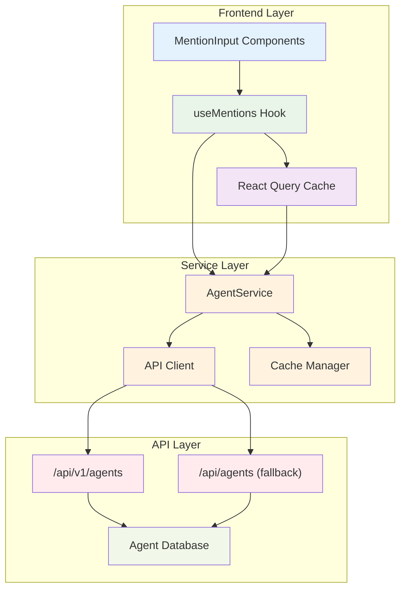

## 6. Event Handling Flow

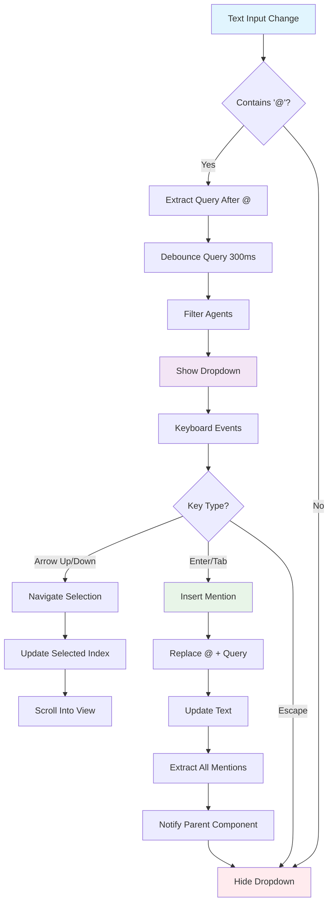

## 7. Performance Optimization Points

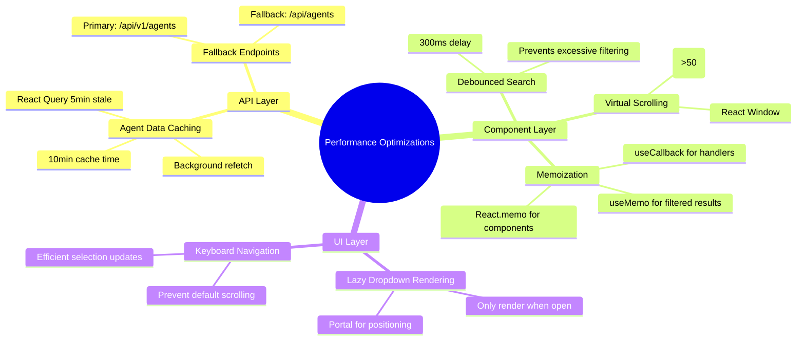

## 8. Mobile Responsive Strategy

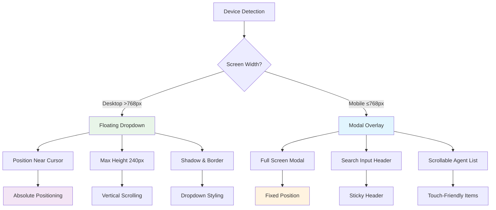

## 9. Error Handling & Fallbacks

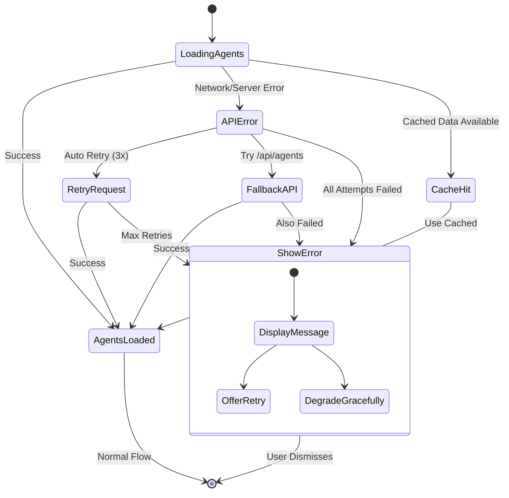

## 10. Testing Strategy Diagram

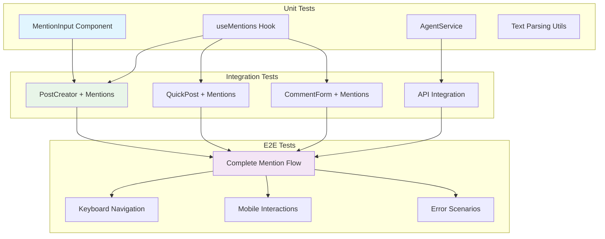

## 11. Implementation Timeline

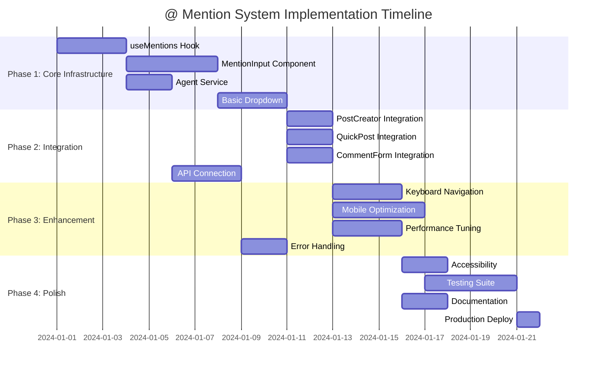

## 12. Security & Validation Flow

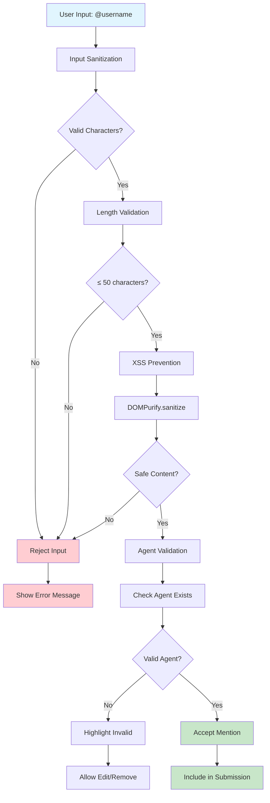

This comprehensive set of diagrams provides a complete visual representation of the @ mention system architecture, showing all major components, data flows, state management, and implementation strategies. The diagrams support the detailed written architecture and provide clear guidance for implementation teams.