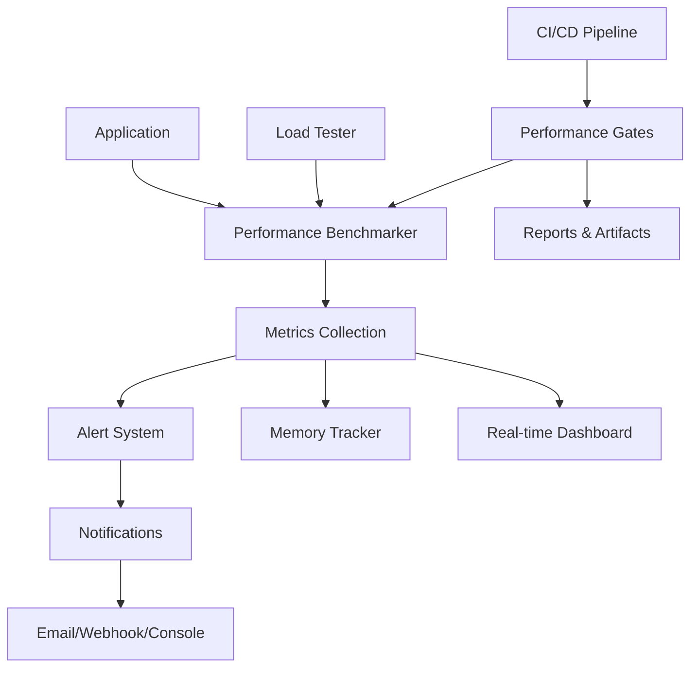

# Claude AI Performance Monitoring & Benchmarking System

## Overview

This comprehensive performance monitoring system provides real-time performance tracking, automated benchmarking, and CI/CD integration for the Claude AI response system. The system monitors key performance metrics, detects regressions, and ensures optimal performance across all deployments.

## 🎯 Key Features

### Performance Monitoring
- **Real-time metrics collection** for Claude response times, SSE delivery, and memory usage
- **Automated alerting** with configurable thresholds and notification channels
- **Performance regression detection** with baseline comparison
- **Memory leak detection** and resource usage optimization

### Benchmarking & Load Testing
- **Concurrent user simulation** with configurable scenarios
- **Stress testing** for maximum capacity determination
- **Memory pressure testing** for resource optimization
- **Performance trend analysis** and reporting

### CI/CD Integration
- **Performance gates** that fail builds on regression
- **Automated baseline updates** from successful deployments
- **GitHub Actions integration** with PR comments and issue creation
- **Artifact storage** for performance reports and trends

## 📊 Monitored Metrics

### Core Performance Metrics

| Metric | Baseline | Warning | Critical | Description |
|--------|----------|---------|----------|-------------|
| **Claude Response Time** | 1.2s | 2s | 5s | Time from query to response |
| **SSE Delivery Time** | 45ms | 100ms | 500ms | Server-sent event latency |
| **Memory per Instance** | 25MB | 50MB | 100MB | Memory consumption per Claude instance |
| **Error Rate** | 0.5% | 1% | 5% | Percentage of failed requests |
| **Throughput** | 120 req/min | 100 req/min | 50 req/min | Successful requests per minute |

### System Resource Metrics
- CPU utilization and load averages
- Network I/O throughput and latency
- Disk I/O operations and queue length
- Active connections and file descriptors
- Garbage collection frequency and duration

## 🏗️ Architecture

### Core Components

```
monitoring/
├── performance-benchmarks.js     # Main benchmarking engine
├── memory-usage-tracking.js      # Memory monitoring system
├── alerts/
│   └── performance-alerts.js     # Alerting and notification system
├── dashboards/
│   └── performance-metrics.html  # Real-time dashboard
└── tests/
    ├── claude-response-latency.test.js
    └── sse-delivery-performance.test.js

scripts/
├── load-testing/
│   └── concurrent-users.js       # Load testing framework
└── ci-cd/
    └── performance-gates.js      # CI/CD integration

ci-config/
└── performance-gates.json        # Performance thresholds configuration
```

### Data Flow



## 🚀 Quick Start

### 1. Install Dependencies

```bash
npm install
```

### 2. Start Performance Monitoring

```bash
# Start the monitoring system
npm run monitor

# View real-time dashboard
npm run dashboard
```

### 3. Run Load Tests

```bash
# Basic load test
npm run load-test:basic

# Stress test
npm run load-test:stress

# Full test suite
npm run load-test:all
```

### 4. Execute Performance Gates

```bash
# Quick smoke test
npm run performance-gates:smoke

# Full CI/CD gates
npm run performance-gates:config
```

## 🔧 Configuration

### Performance Thresholds

Edit `ci-config/performance-gates.json`:

```json
{
  "gates": {
    "claudeResponseTime": {
      "baseline": 1200,        // Baseline value in ms
      "maxRegression": 0.25,   // 25% regression tolerance
      "critical": 4000         // Critical threshold
    }
  }
}
```

### Alert Configuration

Configure alerting in your monitoring initialization:

```javascript
const alertSystem = new PerformanceAlertSystem({
  notificationChannels: {
    email: {
      smtp: {
        host: 'smtp.example.com',
        port: 587,
        user: 'alerts@example.com',
        password: 'your-password'
      },
      from: 'alerts@example.com',
      to: 'team@example.com'
    },
    webhook: {
      url: 'https://hooks.slack.com/your-webhook',
      headers: { 'Content-Type': 'application/json' }
    }
  }
});
```

## 📈 Usage Examples

### Basic Performance Monitoring

```javascript
const PerformanceBenchmarker = require('./monitoring/performance-benchmarks');

const benchmarker = new PerformanceBenchmarker({
  metricsDir: './metrics',
  alertThresholds: {
    claudeResponseTime: 2000,
    sseDeliveryTime: 100
  }
});

await benchmarker.startMonitoring();

// Benchmark Claude response
const result = await benchmarker.benchmarkClaudeResponse('instance-1', {
  id: 'test-message',
  content: 'Hello Claude!'
});

console.log(`Response time: ${result.totalLatency}ms`);
```

### Memory Usage Tracking

```javascript
const MemoryUsageTracker = require('./monitoring/memory-usage-tracking');

const memoryTracker = new MemoryUsageTracker();
await memoryTracker.startTracking();

// Track specific instance
memoryTracker.trackInstance('claude-instance-1');

// Track operation memory impact
await memoryTracker.trackOperation('claude-instance-1', 'message_processing', async () => {
  // Your Claude operation here
  return await processMessage(message);
});

const report = memoryTracker.generateInstanceReport('claude-instance-1');
console.log('Memory usage report:', report);
```

### Load Testing

```javascript
const ConcurrentUserLoadTester = require('./scripts/load-testing/concurrent-users');

const loadTester = new ConcurrentUserLoadTester({
  maxConcurrentUsers: 20,
  testDuration: 60000, // 1 minute
  messagesPerUser: 10
});

const report = await loadTester.runLoadTest(['basic_load', 'stress_test']);
console.log('Load test results:', report.summary);
```

## 🔍 Test Scenarios

### Smoke Tests (30 seconds, 3-5 users)
- Basic functionality validation
- Quick regression detection
- Pre-deployment sanity checks

### Regression Tests (90 seconds, 5-8 users)
- Performance comparison with baseline
- Feature stability under normal load
- Memory usage validation

### Stress Tests (3-5 minutes, 10-20 users)
- Maximum capacity determination
- Error handling under load
- Resource exhaustion detection

### Endurance Tests (30+ minutes, sustained load)
- Memory leak detection
- Long-term stability validation
- Performance degradation over time

## 📊 Dashboard Features

The real-time performance dashboard provides:

### Live Metrics
- **Response Time Trends** with average and P95 percentiles
- **Memory Usage Charts** showing RSS and heap utilization
- **SSE Delivery Performance** with throughput metrics
- **System Resource Utilization** including CPU and connections

### Alert Management
- **Active Alerts** with severity levels
- **Alert History** with filtering and search
- **Threshold Visualization** with color-coded status

### Interactive Controls
- **Time Range Selection** (5m, 15m, 1h, 6h, 24h)
- **Load Test Triggers** for on-demand testing
- **Metric Filtering** and customization

## 🔔 Alerting System

### Alert Types

#### Threshold Alerts
- **Warning**: Performance degradation detected
- **Critical**: Severe performance issues requiring immediate attention

#### Regression Alerts
- **Performance Regression**: Significant deviation from baseline
- **Memory Leak**: Sustained memory growth patterns

#### System Alerts
- **High Resource Usage**: CPU, memory, or network saturation
- **Connection Issues**: SSE disconnections or timeouts

### Notification Channels

#### Console Notifications
```
🚨 PERFORMANCE ALERT 🚨
Level: CRITICAL
Metric: claudeResponseTime
Message: Claude response time critical: 5234ms > 5000ms threshold
Timestamp: 2024-01-15T10:30:45Z
Alert ID: claudeResponseTime_critical_immediate
```

#### Email Notifications
- HTML formatted alerts with detailed metrics
- Severity-based color coding
- Direct links to dashboard and reports

#### Webhook Integration
- Slack, Discord, or custom webhook support
- JSON payload with alert details
- Configurable retry logic

## 🏭 CI/CD Integration

### GitHub Actions Workflow

The performance CI/CD pipeline includes:

1. **Smoke Tests** on every PR and push
2. **Full Performance Tests** on main branch
3. **Load Testing** on releases
4. **Performance Monitoring** with trend analysis

### Performance Gates

Gates that can fail your build:

- **Response Time Regression** > 25% from baseline
- **Memory Usage Increase** > 40% from baseline
- **Error Rate Increase** > 100% from baseline
- **Throughput Decrease** > 25% from baseline

### Automated Actions

- **PR Comments** with performance test results
- **Issue Creation** for performance regressions
- **Baseline Updates** on successful deployments
- **Performance Badge Updates** for README

## 📋 Best Practices

### Monitoring Setup

1. **Start monitoring early** in your application lifecycle
2. **Set realistic baselines** based on production requirements
3. **Configure appropriate thresholds** to avoid alert fatigue
4. **Monitor trends** rather than just point-in-time values

### Performance Testing

1. **Run tests consistently** in similar environments
2. **Use realistic test data** and scenarios
3. **Test under various load conditions**
4. **Include negative testing** for error scenarios

### CI/CD Integration

1. **Use performance gates** to catch regressions early
2. **Maintain performance baselines** for accurate comparison
3. **Review performance trends** regularly
4. **Act on performance alerts** promptly

### Troubleshooting

Common performance issues and solutions:

#### High Response Times
- Check Claude API rate limits
- Verify network connectivity
- Review message complexity and size
- Monitor concurrent request handling

#### Memory Leaks
- Review instance lifecycle management
- Check for unreleased event listeners
- Validate cleanup in error scenarios
- Monitor garbage collection patterns

#### SSE Delivery Issues
- Verify connection stability
- Check network latency
- Review message serialization overhead
- Monitor concurrent connection limits

## 📚 API Reference

### PerformanceBenchmarker

```javascript
class PerformanceBenchmarker {
  constructor(config)
  async startMonitoring()
  async stopMonitoring()
  async benchmarkClaudeResponse(instanceId, messageData)
  async benchmarkSSEDelivery(connectionId, messageData)
  async benchmarkInstanceLifecycle(operation, instanceData)
  getPerformanceSummary()
}
```

### MemoryUsageTracker

```javascript
class MemoryUsageTracker {
  constructor(config)
  async startTracking()
  async stopTracking()
  trackInstance(instanceId, initialData)
  async trackOperation(instanceId, operationType, operation)
  generateInstanceReport(instanceId)
  getMemorySummary()
}
```

### ConcurrentUserLoadTester

```javascript
class ConcurrentUserLoadTester {
  constructor(config)
  async runLoadTest(scenarios)
  async runBasicLoadTest()
  async runStressTest()
  async runSpikeTest()
}
```

### PerformanceGates

```javascript
class PerformanceGates {
  constructor(config)
  async runPerformanceGates()
  async loadBaseline()
  async runTestSuites()
  async evaluateGates()
  async generateReports()
}
```

## 🤝 Contributing

### Adding New Metrics

1. Define the metric in the benchmarker
2. Add threshold configuration
3. Update dashboard visualization
4. Include in CI/CD gates
5. Document in this guide

### Performance Test Scenarios

1. Create test scenario in load tester
2. Add scenario configuration
3. Update CLI interface
4. Include in CI/CD pipeline
5. Document expected behavior

## 📄 License

This performance monitoring system is part of the Claude AI Instance Management System and is licensed under MIT License.

## 🔗 Related Documentation

- [Claude AI Integration Guide](./claude-integration.md)
- [SSE Implementation Details](./sse-implementation.md)
- [Memory Management Best Practices](./memory-management.md)
- [CI/CD Pipeline Configuration](./cicd-configuration.md)