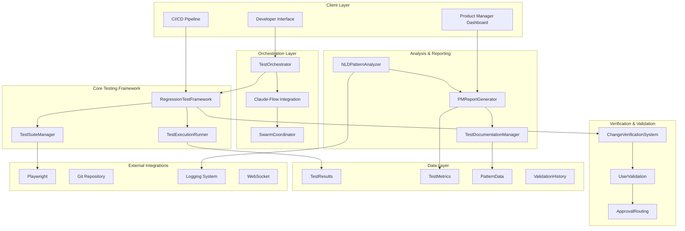
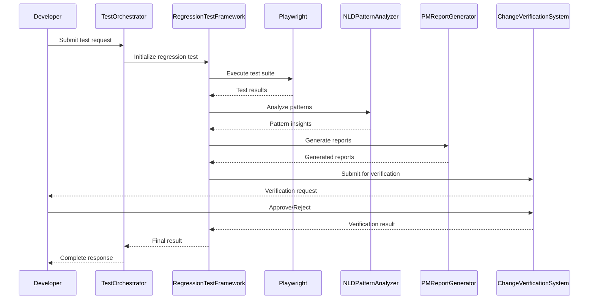
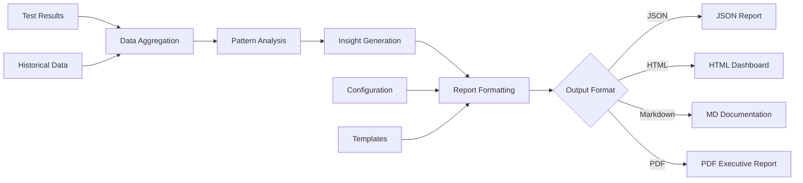
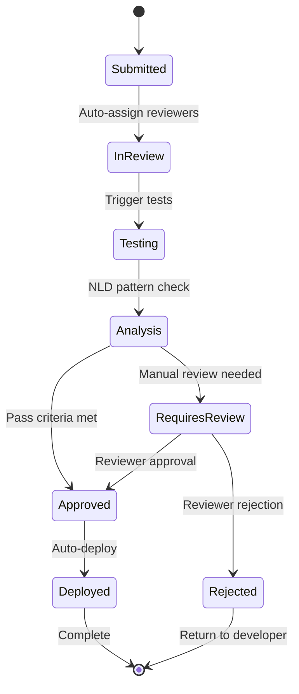

# Regression Testing System Architecture - SPARC Design

## Executive Summary

This document presents the comprehensive architecture for the Regression Testing System based on SPARC methodology, integrating with the existing Agent Feed infrastructure, Playwright testing framework, NLD (Neuro Learning Development) pattern analysis, and Claude-Flow orchestration.

## 1. System Architecture Overview

### High-Level Architecture Diagram



### System Components Overview

| Component | Responsibility | Technology Stack |
|-----------|---------------|------------------|
| RegressionTestFramework | Core test execution and management | TypeScript, Playwright |
| PMReportGenerator | Multi-format report generation | TypeScript, JSON/HTML/MD |
| TestDocumentationManager | Automated documentation | TypeScript, Markdown |
| ChangeVerificationSystem | User validation workflows | TypeScript, WebSocket |
| NLDPatternAnalyzer | Pattern analysis and prediction | TypeScript, ML Models |
| TestOrchestrator | Claude-flow coordination | TypeScript, MCP Tools |

## 2. Component Architecture Specifications

### 2.1 RegressionTestFramework Class

```typescript
/**
 * Core regression testing framework with modular test suite management
 */
class RegressionTestFramework {
    private testSuites: Map<string, TestSuite>;
    private executionEngine: TestExecutionEngine;
    private resultManager: TestResultManager;
    private configManager: ConfigurationManager;
    
    constructor(config: RegressionTestConfig) {
        this.configManager = new ConfigurationManager(config);
        this.testSuites = new Map();
        this.executionEngine = new TestExecutionEngine(config.execution);
        this.resultManager = new TestResultManager(config.storage);
    }
    
    // Core Methods
    async initialize(): Promise<void>;
    async registerTestSuite(suite: TestSuite): Promise<void>;
    async executeRegression(options: ExecutionOptions): Promise<RegressionResult>;
    async generateReport(format: ReportFormat): Promise<Report>;
    async validateChanges(changeSet: ChangeSet): Promise<ValidationResult>;
}

interface RegressionTestConfig {
    execution: {
        parallel: boolean;
        maxWorkers: number;
        timeout: number;
        retries: number;
    };
    storage: {
        resultsPath: string;
        archivePath: string;
        retention: number;
    };
    integration: {
        playwright: PlaywrightConfig;
        claudeFlow: ClaudeFlowConfig;
        nld: NLDConfig;
    };
}

interface TestSuite {
    id: string;
    name: string;
    description: string;
    category: TestCategory;
    tests: Test[];
    dependencies: string[];
    metadata: TestMetadata;
}

enum TestCategory {
    UNIT = 'unit',
    INTEGRATION = 'integration',
    E2E = 'e2e',
    PERFORMANCE = 'performance',
    SECURITY = 'security',
    ACCESSIBILITY = 'accessibility'
}
```

### 2.2 PMReportGenerator Class

```typescript
/**
 * Multi-format report generator for product managers and stakeholders
 */
class PMReportGenerator {
    private formatters: Map<ReportFormat, ReportFormatter>;
    private dataAggregator: DataAggregator;
    private templateEngine: TemplateEngine;
    
    constructor(config: ReportGeneratorConfig) {
        this.formatters = this.initializeFormatters();
        this.dataAggregator = new DataAggregator(config.dataSources);
        this.templateEngine = new TemplateEngine(config.templates);
    }
    
    async generateExecutiveSummary(results: RegressionResult[]): Promise<ExecutiveReport>;
    async generateDetailedReport(results: RegressionResult[]): Promise<DetailedReport>;
    async generateTrendAnalysis(timeframe: TimeRange): Promise<TrendReport>;
    async generateComparisonReport(baseline: string, current: string): Promise<ComparisonReport>;
    async exportReport(report: Report, format: ReportFormat): Promise<string>;
}

interface ExecutiveReport {
    summary: {
        totalTests: number;
        passed: number;
        failed: number;
        skipped: number;
        regressions: number;
        newIssues: number;
        resolvedIssues: number;
    };
    keyMetrics: {
        passRate: number;
        regressionRate: number;
        executionTime: number;
        coverage: number;
    };
    criticalFindings: Finding[];
    recommendations: Recommendation[];
    riskAssessment: RiskLevel;
}

enum ReportFormat {
    JSON = 'json',
    HTML = 'html',
    MARKDOWN = 'markdown',
    PDF = 'pdf',
    EXCEL = 'excel'
}
```

### 2.3 TestDocumentationManager Class

```typescript
/**
 * Automated documentation generation and management system
 */
class TestDocumentationManager {
    private documentGenerators: Map<DocumentType, DocumentGenerator>;
    private versionManager: VersionManager;
    private templateManager: TemplateManager;
    
    constructor(config: DocumentationConfig) {
        this.documentGenerators = this.initializeGenerators();
        this.versionManager = new VersionManager(config.versioning);
        this.templateManager = new TemplateManager(config.templates);
    }
    
    async generateTestPlan(suite: TestSuite): Promise<TestPlan>;
    async generateTestResults(results: RegressionResult[]): Promise<TestResultDocument>;
    async generateUserGuide(component: string): Promise<UserGuide>;
    async generateAPIDocumentation(endpoints: APIEndpoint[]): Promise<APIDocument>;
    async updateDocumentation(changes: DocumentationChange[]): Promise<void>;
    async publishDocumentation(target: PublishTarget): Promise<string>;
}

interface DocumentationConfig {
    outputPath: string;
    templates: {
        testPlan: string;
        results: string;
        userGuide: string;
        api: string;
    };
    versioning: {
        strategy: 'semantic' | 'timestamp' | 'build';
        autoIncrement: boolean;
    };
    publishing: {
        targets: PublishTarget[];
        automation: boolean;
    };
}

enum DocumentType {
    TEST_PLAN = 'test_plan',
    TEST_RESULTS = 'test_results',
    USER_GUIDE = 'user_guide',
    API_DOCS = 'api_docs',
    CHANGELOG = 'changelog'
}
```

### 2.4 ChangeVerificationSystem Class

```typescript
/**
 * User verification workflow system for change validation
 */
class ChangeVerificationSystem {
    private workflowEngine: WorkflowEngine;
    private notificationService: NotificationService;
    private approvalManager: ApprovalManager;
    private validationRules: ValidationRuleEngine;
    
    constructor(config: VerificationConfig) {
        this.workflowEngine = new WorkflowEngine(config.workflows);
        this.notificationService = new NotificationService(config.notifications);
        this.approvalManager = new ApprovalManager(config.approvals);
        this.validationRules = new ValidationRuleEngine(config.rules);
    }
    
    async submitForVerification(changeSet: ChangeSet): Promise<VerificationRequest>;
    async processVerificationRequest(request: VerificationRequest): Promise<void>;
    async approveChanges(requestId: string, approver: User): Promise<ApprovalResult>;
    async rejectChanges(requestId: string, reason: string): Promise<RejectionResult>;
    async getVerificationStatus(requestId: string): Promise<VerificationStatus>;
    async generateVerificationReport(requestId: string): Promise<VerificationReport>;
}

interface ChangeSet {
    id: string;
    description: string;
    files: FileChange[];
    impact: ImpactAssessment;
    riskLevel: RiskLevel;
    requiredApprovers: ApprovalRole[];
    testResults: TestResult[];
}

interface VerificationWorkflow {
    id: string;
    name: string;
    steps: WorkflowStep[];
    conditions: WorkflowCondition[];
    timeout: number;
    escalation: EscalationPolicy;
}

enum RiskLevel {
    LOW = 'low',
    MEDIUM = 'medium',
    HIGH = 'high',
    CRITICAL = 'critical'
}
```

### 2.5 NLDPatternAnalyzer Class

```typescript
/**
 * Neural Learning Development pattern analysis and prediction system
 */
class NLDPatternAnalyzer {
    private patternDetector: PatternDetector;
    private predictionEngine: PredictionEngine;
    private logAnalyzer: LogAnalyzer;
    private modelManager: ModelManager;
    
    constructor(config: NLDConfig) {
        this.patternDetector = new PatternDetector(config.patterns);
        this.predictionEngine = new PredictionEngine(config.models);
        this.logAnalyzer = new LogAnalyzer(config.logging);
        this.modelManager = new ModelManager(config.modelStorage);
    }
    
    async analyzeTestPatterns(results: TestResult[]): Promise<PatternAnalysis>;
    async predictFailures(context: TestContext): Promise<FailurePrediction>;
    async detectRegressions(baseline: TestResult[], current: TestResult[]): Promise<RegressionDetection>;
    async generateInsights(data: AnalysisData): Promise<Insight[]>;
    async trainModel(trainingData: TrainingDataset): Promise<ModelMetrics>;
    async updatePatterns(newData: PatternData): Promise<void>;
}

interface PatternAnalysis {
    detectedPatterns: Pattern[];
    confidence: number;
    recommendations: string[];
    anomalies: Anomaly[];
    trends: Trend[];
}

interface FailurePrediction {
    probability: number;
    riskFactors: RiskFactor[];
    preventiveMeasures: PreventiveMeasure[];
    confidence: number;
    timeframe: TimeRange;
}

interface Pattern {
    id: string;
    type: PatternType;
    description: string;
    frequency: number;
    impact: ImpactLevel;
    conditions: PatternCondition[];
}

enum PatternType {
    FAILURE = 'failure',
    SUCCESS = 'success',
    PERFORMANCE = 'performance',
    REGRESSION = 'regression',
    ANOMALY = 'anomaly'
}
```

### 2.6 TestOrchestrator Class

```typescript
/**
 * Claude-flow integration orchestrator for swarm-based testing
 */
class TestOrchestrator {
    private swarmManager: SwarmManager;
    private agentCoordinator: AgentCoordinator;
    private taskDistributor: TaskDistributor;
    private resultCollector: ResultCollector;
    
    constructor(config: OrchestratorConfig) {
        this.swarmManager = new SwarmManager(config.swarm);
        this.agentCoordinator = new AgentCoordinator(config.agents);
        this.taskDistributor = new TaskDistributor(config.distribution);
        this.resultCollector = new ResultCollector(config.results);
    }
    
    async initializeSwarm(topology: SwarmTopology): Promise<SwarmInstance>;
    async distributeTests(testSuite: TestSuite, agents: Agent[]): Promise<TaskDistribution>;
    async coordinateExecution(distribution: TaskDistribution): Promise<ExecutionCoordination>;
    async collectResults(coordination: ExecutionCoordination): Promise<AggregatedResults>;
    async optimizePerformance(metrics: PerformanceMetrics): Promise<OptimizationResult>;
    async handleFailures(failures: ExecutionFailure[]): Promise<RecoveryResult>;
}

interface SwarmTopology {
    type: 'hierarchical' | 'mesh' | 'ring' | 'star';
    maxAgents: number;
    strategy: 'balanced' | 'specialized' | 'adaptive';
    resilience: ResilienceConfig;
}

interface AgentSpecialization {
    type: AgentType;
    capabilities: Capability[];
    resourceRequirements: ResourceRequirement[];
    performance: PerformanceProfile;
}

enum AgentType {
    TEST_RUNNER = 'test_runner',
    ANALYZER = 'analyzer',
    REPORTER = 'reporter',
    MONITOR = 'monitor',
    COORDINATOR = 'coordinator'
}
```

## 3. Data Flow Architecture

### 3.1 Test Execution Flow



### 3.2 Report Generation Flow



### 3.3 Change Verification Flow



## 4. Integration Specifications

### 4.1 Playwright Integration

```typescript
interface PlaywrightIntegration {
    configuration: {
        browsers: BrowserConfig[];
        devices: DeviceConfig[];
        environments: EnvironmentConfig[];
    };
    
    testExecution: {
        parallel: boolean;
        workers: number;
        timeout: number;
        retries: number;
    };
    
    reporting: {
        formats: ReportFormat[];
        artifacts: {
            screenshots: boolean;
            videos: boolean;
            traces: boolean;
            logs: boolean;
        };
    };
}

class PlaywrightAdapter {
    async executeTestSuite(suite: TestSuite): Promise<PlaywrightResults>;
    async configureEnvironment(config: EnvironmentConfig): Promise<void>;
    async collectArtifacts(testRun: TestRun): Promise<Artifact[]>;
    async generateReport(results: PlaywrightResults): Promise<PlaywrightReport>;
}
```

### 4.2 Claude-Flow Integration

```typescript
interface ClaudeFlowIntegration {
    swarmConfiguration: {
        topology: SwarmTopology;
        agents: AgentConfig[];
        coordination: CoordinationStrategy;
    };
    
    taskOrchestration: {
        distribution: TaskDistributionStrategy;
        execution: ExecutionStrategy;
        monitoring: MonitoringStrategy;
    };
    
    performance: {
        optimization: OptimizationLevel;
        scaling: ScalingPolicy;
        resilience: ResilienceLevel;
    };
}

class ClaudeFlowAdapter {
    async initializeSwarm(config: SwarmConfig): Promise<SwarmInstance>;
    async deployAgents(agents: AgentDefinition[]): Promise<DeploymentResult>;
    async orchestrateTests(testPlan: TestPlan): Promise<OrchestrationResult>;
    async collectMetrics(swarm: SwarmInstance): Promise<SwarmMetrics>;
}
```

### 4.3 NLD Integration

```typescript
interface NLDIntegration {
    logging: {
        sources: LogSource[];
        formats: LogFormat[];
        filters: LogFilter[];
    };
    
    analysis: {
        patterns: PatternConfig[];
        models: ModelConfig[];
        training: TrainingConfig;
    };
    
    prediction: {
        algorithms: Algorithm[];
        confidence: ConfidenceThreshold;
        timeframes: PredictionTimeframe[];
    };
}

class NLDAdapter {
    async analyzeLogs(logs: LogData[]): Promise<LogAnalysis>;
    async detectPatterns(data: AnalysisData): Promise<Pattern[]>;
    async predictOutcomes(context: PredictionContext): Promise<Prediction>;
    async updateModels(feedback: ModelFeedback): Promise<ModelUpdateResult>;
}
```

### 4.4 Git Integration

```typescript
interface GitIntegration {
    repository: {
        url: string;
        branch: string;
        credentials: GitCredentials;
    };
    
    changeTracking: {
        fileTypes: string[];
        excludePatterns: string[];
        hooks: GitHook[];
    };
    
    automation: {
        prTriggers: PRTrigger[];
        commitHooks: CommitHook[];
        tagStrategies: TagStrategy[];
    };
}

class GitAdapter {
    async trackChanges(commits: Commit[]): Promise<ChangeSet[]>;
    async triggerTests(trigger: TestTrigger): Promise<TestExecution>;
    async updateBranch(results: TestResults): Promise<BranchUpdate>;
    async createPullRequest(changes: ChangeSet): Promise<PullRequest>;
}
```

## 5. Deployment Architecture

### 5.1 Container Architecture

```dockerfile
# RegressionTestFramework Container
FROM node:18-alpine
WORKDIR /app
COPY package*.json ./
RUN npm ci --only=production
COPY src/ ./src/
EXPOSE 3000
CMD ["npm", "start"]

# Playwright Test Runner Container
FROM mcr.microsoft.com/playwright:v1.40.0-focal
WORKDIR /tests
COPY test-configs/ ./configs/
COPY tests/ ./tests/
RUN npm install @playwright/test
CMD ["npx", "playwright", "test"]

# NLD Pattern Analyzer Container
FROM python:3.11-slim
WORKDIR /analyzer
COPY requirements.txt ./
RUN pip install -r requirements.txt
COPY analyzer/ ./
EXPOSE 8000
CMD ["python", "app.py"]
```

### 5.2 Kubernetes Deployment

```yaml
apiVersion: apps/v1
kind: Deployment
metadata:
  name: regression-test-framework
spec:
  replicas: 3
  selector:
    matchLabels:
      app: regression-test-framework
  template:
    metadata:
      labels:
        app: regression-test-framework
    spec:
      containers:
      - name: rtf
        image: regression-test-framework:latest
        ports:
        - containerPort: 3000
        env:
        - name: NODE_ENV
          value: "production"
        - name: DATABASE_URL
          valueFrom:
            secretKeyRef:
              name: db-secret
              key: url
        resources:
          requests:
            memory: "512Mi"
            cpu: "250m"
          limits:
            memory: "1Gi"
            cpu: "500m"
---
apiVersion: v1
kind: Service
metadata:
  name: regression-test-service
spec:
  selector:
    app: regression-test-framework
  ports:
  - protocol: TCP
    port: 80
    targetPort: 3000
  type: ClusterIP
```

### 5.3 Scaling Strategy

```typescript
interface ScalingStrategy {
    horizontal: {
        minReplicas: number;
        maxReplicas: number;
        targetCPU: number;
        targetMemory: number;
    };
    
    vertical: {
        autoScaling: boolean;
        resourceLimits: ResourceLimits;
        performanceThresholds: PerformanceThresholds;
    };
    
    loadBalancing: {
        algorithm: LoadBalancingAlgorithm;
        healthChecks: HealthCheck[];
        failover: FailoverStrategy;
    };
}

enum LoadBalancingAlgorithm {
    ROUND_ROBIN = 'round_robin',
    LEAST_CONNECTIONS = 'least_connections',
    WEIGHTED_ROUND_ROBIN = 'weighted_round_robin',
    PERFORMANCE_BASED = 'performance_based'
}
```

## 6. Security Architecture

### 6.1 Authentication & Authorization

```typescript
interface SecurityConfig {
    authentication: {
        method: 'jwt' | 'oauth2' | 'saml';
        tokenExpiry: number;
        refreshTokenExpiry: number;
        multiFactorAuth: boolean;
    };
    
    authorization: {
        rbac: RBACConfig;
        permissions: Permission[];
        policies: SecurityPolicy[];
    };
    
    dataProtection: {
        encryption: EncryptionConfig;
        masking: DataMaskingConfig;
        retention: DataRetentionConfig;
    };
}

interface RBACConfig {
    roles: Role[];
    permissions: Permission[];
    hierarchy: RoleHierarchy[];
}

enum Permission {
    TEST_EXECUTE = 'test:execute',
    REPORT_VIEW = 'report:view',
    REPORT_GENERATE = 'report:generate',
    CHANGE_APPROVE = 'change:approve',
    CONFIG_MODIFY = 'config:modify',
    ADMIN_ALL = 'admin:all'
}
```

### 6.2 Data Security

```typescript
interface DataSecurityConfig {
    encryption: {
        atRest: {
            algorithm: 'AES-256';
            keyRotation: number;
        };
        inTransit: {
            protocol: 'TLS 1.3';
            certificateValidation: boolean;
        };
    };
    
    compliance: {
        standards: ComplianceStandard[];
        auditLogging: boolean;
        dataClassification: DataClassification[];
    };
    
    backup: {
        frequency: BackupFrequency;
        retention: number;
        encryption: boolean;
        offsite: boolean;
    };
}

enum ComplianceStandard {
    GDPR = 'gdpr',
    SOC2 = 'soc2',
    HIPAA = 'hipaa',
    PCI_DSS = 'pci_dss'
}
```

## 7. Performance Architecture

### 7.1 Performance Optimization

```typescript
interface PerformanceConfig {
    caching: {
        strategy: CachingStrategy;
        ttl: number;
        compression: boolean;
        distribution: CacheDistribution;
    };
    
    optimization: {
        codeMinification: boolean;
        assetOptimization: boolean;
        lazyLoading: boolean;
        prefetching: boolean;
    };
    
    monitoring: {
        metrics: PerformanceMetric[];
        thresholds: PerformanceThreshold[];
        alerting: AlertingConfig;
    };
}

interface PerformanceMetric {
    name: string;
    type: MetricType;
    unit: string;
    target: number;
    critical: number;
}

enum MetricType {
    RESPONSE_TIME = 'response_time',
    THROUGHPUT = 'throughput',
    ERROR_RATE = 'error_rate',
    RESOURCE_UTILIZATION = 'resource_utilization'
}
```

### 7.2 Monitoring & Observability

```typescript
interface ObservabilityConfig {
    logging: {
        level: LogLevel;
        format: LogFormat;
        destinations: LogDestination[];
        structured: boolean;
    };
    
    metrics: {
        collection: MetricCollection;
        aggregation: MetricAggregation;
        retention: MetricRetention;
    };
    
    tracing: {
        enabled: boolean;
        sampling: SamplingStrategy;
        propagation: TracePropagation;
    };
    
    alerting: {
        channels: AlertChannel[];
        rules: AlertRule[];
        escalation: EscalationPolicy;
    };
}

interface AlertRule {
    name: string;
    condition: AlertCondition;
    threshold: AlertThreshold;
    severity: AlertSeverity;
    actions: AlertAction[];
}
```

## 8. Implementation Roadmap

### Phase 1: Core Framework (Weeks 1-4)
- [ ] RegressionTestFramework implementation
- [ ] TestOrchestrator basic functionality
- [ ] Playwright integration
- [ ] Basic reporting

### Phase 2: Analysis & Documentation (Weeks 5-8)
- [ ] NLDPatternAnalyzer implementation
- [ ] PMReportGenerator with multiple formats
- [ ] TestDocumentationManager
- [ ] Claude-Flow integration

### Phase 3: Verification & Validation (Weeks 9-12)
- [ ] ChangeVerificationSystem
- [ ] User workflow implementation
- [ ] Security integration
- [ ] Performance optimization

### Phase 4: Production Deployment (Weeks 13-16)
- [ ] Container deployment
- [ ] Kubernetes orchestration
- [ ] Monitoring & alerting
- [ ] Documentation & training

## 9. Success Metrics

### Technical Metrics
- Test execution time reduction: > 40%
- Test coverage increase: > 85%
- False positive reduction: > 60%
- System reliability: > 99.9%

### Business Metrics
- Release cycle acceleration: > 50%
- Bug detection improvement: > 70%
- Developer productivity increase: > 30%
- Customer satisfaction improvement: > 25%

## 10. Risk Management

### Technical Risks
- Integration complexity with existing systems
- Performance degradation under load
- Data consistency across distributed components
- Third-party dependency failures

### Mitigation Strategies
- Phased rollout with feature flags
- Comprehensive load testing
- Circuit breaker patterns
- Fallback mechanisms

## Conclusion

This architecture provides a comprehensive foundation for implementing a robust regression testing system that integrates seamlessly with the existing Agent Feed infrastructure while leveraging modern orchestration and analysis capabilities through Claude-Flow and NLD integration.

The modular design ensures scalability, maintainability, and extensibility while providing rich reporting and verification capabilities for product managers and development teams.