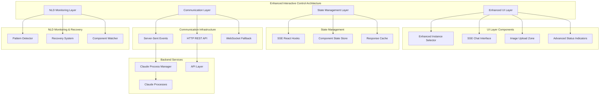

# SPARC Architecture Design
## Feature Migration: /claude-instances → /interactive-control

### Phase 3: ARCHITECTURE

## System Architecture Overview

### 3.1 High-Level Architecture



### 3.2 Component Architecture

```typescript
// Component Hierarchy
InteractiveControlEnhanced/
├── EnhancedInstanceSelector/
│   ├── InstanceDropdown
│   ├── QuickLaunchTemplates
│   ├── InstanceStatusBadges
│   └── SearchAndFilter
├── SSEChatInterface/
│   ├── MessageHistory
│   ├── StreamingIndicator
│   ├── InputArea
│   └── ImageAttachment
├── ImageUploadZone/
│   ├── DragDropArea
│   ├── ImagePreviews
│   ├── ProgressTracking
│   └── ValidationSystem
└── AdvancedStatusIndicator/
    ├── RealTimeMetrics
    ├── ConnectionHealth
    ├── PerformanceStats
    └── ErrorDisplay
```

### 3.3 Data Flow Architecture

```typescript
interface ArchitecturalDataFlow {
  // User Interaction Flow
  userAction: UserInteraction => ComponentEvent => StateUpdate => UIRender;
  
  // SSE Communication Flow  
  sseEvent: SSEMessage => EventHandler => StateTransformation => ComponentUpdate;
  
  // Image Upload Flow
  imageUpload: FileSelection => Validation => ChunkedUpload => ProgressUpdate => Completion;
  
  // Error Recovery Flow
  errorDetection: PatternDetection => RecoveryStrategy => SystemHealing => StateRestoration;
}
```

## 3.4 Interface Contracts

### SSE Event Interface
```typescript
interface SSEEventContract {
  // Core Events (Existing)
  'terminal:output': { instanceId: string; data: string; timestamp: number };
  'terminal:input': { instanceId: string; command: string; timestamp: number };
  'instance:status': { instanceId: string; status: InstanceStatus; metrics?: InstanceMetrics };
  
  // Enhanced Events (New)
  'instance:metrics:realtime': { instanceId: string; cpu: number; memory: number; uptime: number };
  'image:upload:progress': { uploadId: string; progress: number; instanceId: string };
  'image:upload:complete': { uploadId: string; imageId: string; url: string };
  'chat:message:stream': { instanceId: string; messageId: string; chunk: string; done: boolean };
  'nld:pattern:detected': { patternId: string; severity: string; component: string };
  'system:health:update': { score: number; issues: string[]; timestamp: number };
}
```

### Component Interface Contract
```typescript
interface ComponentContracts {
  // Enhanced Instance Selector
  EnhancedInstanceSelector: {
    props: {
      instances: ClaudeInstance[];
      onSelect: (instance: ClaudeInstance | null) => void;
      onQuickLaunch: (template: LaunchTemplate) => Promise<void>;
      filterBy?: InstanceFilter;
      groupBy?: InstanceGrouping;
    };
    events: {
      onSelectionChange: (instance: ClaudeInstance) => void;
      onInstanceCreate: (instance: ClaudeInstance) => void;
      onError: (error: Error) => void;
    };
  };
  
  // SSE Chat Interface
  SSEChatInterface: {
    props: {
      instance: ClaudeInstance;
      messages: ChatMessage[];
      onSendMessage: (content: string, images?: ImageFile[]) => Promise<void>;
      enableImageUpload: boolean;
      enableStreaming: boolean;
    };
    events: {
      onMessageSent: (message: ChatMessage) => void;
      onMessageReceived: (message: ChatMessage) => void;
      onStreamingUpdate: (messageId: string, chunk: string) => void;
    };
  };
}
```

### Hook Architecture
```typescript
interface HookArchitecture {
  // Core SSE Hook (Enhanced)
  useSSEClaudeInstance: {
    input: SSEConnectionConfig;
    output: {
      connection: SSEConnection;
      instances: ClaudeInstance[];
      messages: ChatMessage[];
      sendMessage: (instanceId: string, content: string) => Promise<void>;
      uploadImage: (instanceId: string, files: File[]) => Promise<ImageResult[]>;
    };
  };
  
  // Image Upload Hook
  useSSEImageUpload: {
    input: ImageUploadConfig;
    output: {
      images: ImageFile[];
      progress: UploadProgress;
      addImages: (files: File[]) => Promise<void>;
      removeImage: (imageId: string) => void;
      uploadStatus: UploadStatus;
    };
  };
  
  // NLD Monitoring Hook
  useNLDMonitoring: {
    input: { componentName: string; enabled: boolean };
    output: {
      health: ComponentHealth;
      patterns: NLDPattern[];
      recordEvent: (event: NLDEvent) => void;
      isRecovering: boolean;
    };
  };
}
```

## 3.5 State Management Architecture

### Component State Structure
```typescript
interface ComponentStateArchitecture {
  // Global State
  global: {
    sseConnection: SSEConnectionState;
    systemHealth: SystemHealthState;
    nldPatterns: NLDPatternState;
  };
  
  // Component-Specific State
  components: {
    instanceSelector: {
      selectedInstance: ClaudeInstance | null;
      availableInstances: ClaudeInstance[];
      quickLaunchTemplates: LaunchTemplate[];
      filterState: FilterState;
      searchTerm: string;
    };
    
    chatInterface: {
      messages: Map<string, ChatMessage[]>; // keyed by instanceId
      streamingMessages: Map<string, StreamingMessage>;
      inputBuffer: string;
      attachedImages: ImageFile[];
    };
    
    imageUpload: {
      activeUploads: Map<string, UploadProgress>;
      uploadQueue: UploadJob[];
      completedUploads: Map<string, ImageResult>;
    };
    
    statusIndicator: {
      instanceMetrics: Map<string, InstanceMetrics>;
      connectionHealth: ConnectionHealth;
      performanceStats: PerformanceStats;
    };
  };
}
```

### State Synchronization Patterns
```typescript
interface StateSynchronization {
  // SSE -> State Updates
  sseToState: {
    pattern: "Event-Driven Updates";
    flow: "SSE Event → Reducer → State Update → Component Re-render";
    debouncing: "100ms for rapid updates";
    batching: "Multiple updates in single render cycle";
  };
  
  // User Action -> State Updates  
  userToState: {
    pattern: "Action-Reducer Pattern";
    flow: "User Action → Validation → State Mutation → SSE Message";
    optimisticUpdates: "UI updates immediately, rollback on error";
    validation: "Client-side validation before server communication";
  };
  
  // Cross-Component State Sharing
  crossComponent: {
    pattern: "Context + Hooks";
    implementation: "React Context for global state, local state for component-specific";
    boundaries: "Clear separation between global and local concerns";
  };
}
```

## 3.6 Security Architecture

### Input Validation & Sanitization
```typescript
interface SecurityArchitecture {
  // Input Validation
  validation: {
    userInput: {
      terminalCommands: "Whitelist approved commands";
      imageFiles: "MIME type validation, size limits, malware scanning";
      textInput: "XSS prevention, length limits";
    };
    
    sseMessages: {
      origin: "Verify message origin and authentication";
      structure: "Schema validation for all incoming messages";
      rateLimit: "Prevent message flooding";
    };
  };
  
  // Output Sanitization
  sanitization: {
    terminalOutput: "Strip ANSI codes, escape HTML";
    userContent: "HTML sanitization, markdown safe rendering";
    errorMessages: "Sanitize stack traces for production";
  };
  
  // Authentication & Authorization
  auth: {
    sseConnection: "Token-based authentication";
    instanceAccess: "User-specific instance isolation";
    fileUpload: "Authenticated upload endpoints";
  };
}
```

### Error Boundaries & Fault Isolation
```typescript
interface FaultIsolationArchitecture {
  errorBoundaries: {
    global: "Top-level application error boundary";
    component: "Individual component error boundaries";
    async: "Promise rejection handling";
  };
  
  faultIsolation: {
    componentFailure: "Isolated component failure doesn't affect others";
    sseConnection: "Connection failure doesn't break entire UI";
    imageUpload: "Upload failure doesn't break chat interface";
  };
  
  gracefulDegradation: {
    sseFailure: "Fallback to HTTP polling";
    imageUploadFailure: "Continue with text-only chat";
    componentCrash: "Show fallback UI with recovery options";
  };
}
```

## 3.7 Performance Architecture

### Rendering Optimization
```typescript
interface PerformanceArchitecture {
  rendering: {
    virtualization: "Virtual scrolling for large message lists";
    memoization: "React.memo for expensive components";
    lazyLoading: "Code splitting and lazy component loading";
    debouncing: "User input debouncing (300ms)";
  };
  
  memory: {
    messageHistory: "LRU cache with 1000 message limit per instance";
    imageBuffers: "Automatic cleanup of image object URLs";
    componentCache: "Weak references for component instances";
  };
  
  network: {
    bundling: "Bundle size optimization (<2MB total)";
    caching: "HTTP caching for static assets";
    compression: "Gzip/Brotli compression for text assets";
    prefetching: "Prefetch likely-to-be-used components";
  };
}
```

### SSE Performance Optimization
```typescript
interface SSEPerformanceArchitecture {
  connectionManagement: {
    pooling: "Connection pooling for multiple instances";
    keepalive: "Heartbeat mechanism every 30 seconds";
    reconnection: "Exponential backoff (1s, 2s, 4s, 8s, 16s max)";
  };
  
  messageProcessing: {
    batching: "Batch multiple rapid messages";
    prioritization: "High priority for user-visible updates";
    filtering: "Client-side filtering of irrelevant messages";
  };
  
  memoryManagement: {
    bufferLimits: "Max 10MB SSE message buffer per connection";
    cleanup: "Automatic cleanup of old messages";
    compression: "Compress stored message history";
  };
}
```

## 3.8 Deployment Architecture

### Build & Bundle Architecture
```typescript
interface DeploymentArchitecture {
  bundling: {
    strategy: "Code splitting by route and feature";
    chunks: {
      vendor: "React, utilities (cached long-term)";
      common: "Shared components between features";
      feature: "Feature-specific components";
      async: "Dynamically imported components";
    };
  };
  
  assets: {
    images: "WebP with JPEG fallback";
    icons: "SVG sprite sheets";
    fonts: "WOFF2 with WOFF fallback";
    styles: "CSS modules with postcss optimization";
  };
  
  caching: {
    strategy: "Cache-first for assets, network-first for API";
    serviceWorker: "Progressive Web App capabilities";
    cdn: "CDN distribution for static assets";
  };
}
```

### Environment Configuration
```typescript
interface EnvironmentArchitecture {
  development: {
    hotReload: "Fast refresh for component changes";
    sourceMap: "Detailed source maps for debugging";
    devtools: "Redux DevTools, React DevTools integration";
    mockData: "Mock SSE server for offline development";
  };
  
  staging: {
    minification: "Partial minification for debugging";
    sourceMap: "Production source maps";
    analytics: "Usage analytics and error tracking";
    testing: "Automated E2E test execution";
  };
  
  production: {
    optimization: "Full minification and tree shaking";
    monitoring: "Performance monitoring and alerting";
    logging: "Structured logging with correlation IDs";
    security: "Content Security Policy, HTTPS enforcement";
  };
}
```

## 3.9 Integration Patterns

### Backward Compatibility
```typescript
interface BackwardCompatibilityArchitecture {
  apiVersioning: {
    strategy: "Versioned API endpoints (/api/v1/, /api/v2/)";
    deprecation: "Graceful deprecation with warning headers";
    migration: "Automatic migration utilities";
  };
  
  stateCompatibility: {
    localStorage: "Version-aware state migration";
    sessionStorage: "Backward-compatible session data";
    urlParams: "URL parameter backward compatibility";
  };
  
  featureToggling: {
    implementation: "Feature flags for gradual rollout";
    fallbacks: "Graceful fallback to legacy behavior";
    monitoring: "Usage metrics for feature adoption";
  };
}
```

### Testing Architecture
```typescript
interface TestingArchitecture {
  unitTesting: {
    framework: "Jest + React Testing Library";
    coverage: "90% minimum code coverage";
    mocking: "MSW for API mocking, custom SSE mocks";
  };
  
  integrationTesting: {
    framework: "Jest + Playwright";
    scenarios: "End-to-end user workflows";
    environments: "Multi-browser and device testing";
  };
  
  performanceTesting: {
    tools: "Lighthouse CI, Web Vitals monitoring";
    metrics: "Core Web Vitals, custom performance metrics";
    benchmarks: "Automated performance regression testing";
  };
  
  nldTesting: {
    simulation: "Failure scenario simulation";
    recovery: "Recovery mechanism validation";
    patterns: "Pattern detection accuracy testing";
  };
}
```

---

**Status**: SPARC Phase 3 (Architecture) Complete  
**Next Phase**: Refinement & TDD Implementation  
**Dependencies**: All architectural components defined and ready for implementation