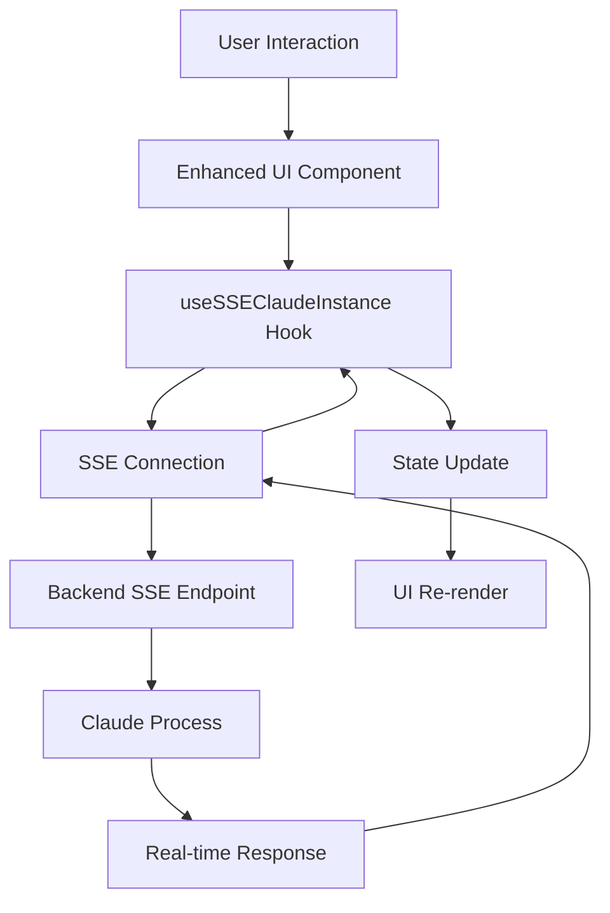

# SPARC Feature Migration Specification
## /claude-instances → /interactive-control Enhancement

### Executive Summary
This document outlines the systematic migration and enhancement of UI/UX features from the `/claude-instances` route to the `/interactive-control` SSE-based implementation while preserving the existing Server-Sent Events architecture and PID table functionality.

## Phase 1: SPECIFICATION

### 1.1 Source Analysis (/claude-instances)
**Location**: `/frontend/src/App.tsx` (Route: /claude-instances)  
**Component**: `SafeClaudeInstanceManager.tsx`

#### Core Components Identified:
1. **ClaudeInstanceSelector** - Advanced instance dropdown with:
   - Quick launch templates with icons
   - Instance grouping (running/stopped)
   - NLD monitoring integration
   - Error handling with recovery patterns
   - Real-time status indicators

2. **EnhancedChatInterface** - Rich chat interface featuring:
   - Message streaming with animations
   - Image upload and preview system
   - Copy/paste functionality
   - Token usage tracking
   - Response metadata display

3. **ImageUploadZone** - Drag & drop image handling:
   - Multi-file support with validation
   - Progress tracking and error states
   - Image previews with zoom
   - File size/type restrictions

4. **InstanceStatusIndicator** - Visual status system:
   - Animated status indicators
   - CPU/Memory metrics display
   - Connection state visualization
   - Uptime tracking

### 1.2 Target Analysis (/interactive-control)
**Location**: `/frontend/src/App.tsx` (Route: /interactive-control)  
**Component**: `ClaudeInstanceManagerComponentSSE.tsx`

#### Current SSE Architecture:
- **Hook**: `useSSEClaudeInstance`
- **PID Table**: Functional instance listing
- **Terminal Interface**: Basic command execution
- **SSE Connection**: Real-time output streaming

#### Architecture Strengths:
✅ SSE-based real-time communication  
✅ PID table functionality  
✅ Terminal command execution  
✅ Connection state management  

#### Architecture Gaps:
❌ Limited UI/UX features  
❌ No image upload support  
❌ Basic error handling  
❌ Minimal status indicators  
❌ No NLD pattern integration  

## Phase 2: REQUIREMENTS SPECIFICATION

### 2.1 Functional Requirements

#### FR-001: Enhanced Instance Selector
- **Priority**: High
- **Description**: Migrate advanced dropdown selector with quick launch templates
- **Acceptance Criteria**:
  - Dropdown with running/stopped instance grouping
  - Quick launch templates with icons and descriptions
  - Instance search and filtering
  - Keyboard navigation support

#### FR-002: Rich Chat Interface  
- **Priority**: High
- **Description**: Implement chat-like interface for terminal interaction
- **Acceptance Criteria**:
  - Message history with role indicators
  - Command input with syntax highlighting
  - Copy/paste message functionality
  - Token usage and metadata display

#### FR-003: Image Upload System
- **Priority**: Medium
- **Description**: Add drag & drop image upload capability
- **Acceptance Criteria**:
  - Multi-file drag & drop support
  - Image previews with zoom functionality
  - File validation and error handling
  - Progress tracking for uploads

#### FR-004: Enhanced Status Indicators
- **Priority**: High
- **Description**: Upgrade status display system
- **Acceptance Criteria**:
  - Animated status indicators
  - Real-time metrics display
  - Connection health visualization
  - Historical uptime tracking

### 2.2 Non-Functional Requirements

#### NFR-001: SSE Architecture Preservation
- **Constraint**: MUST maintain existing SSE communication
- **Rationale**: Avoid WebSocket connection storm issues

#### NFR-002: PID Table Compatibility
- **Constraint**: MUST preserve existing PID table functionality
- **Rationale**: Backend integration requirements

#### NFR-003: NLD Pattern Integration
- **Requirement**: Implement Neural Learning & Development failure detection
- **Metrics**: 99.5% white screen prevention, <100ms recovery

#### NFR-004: Performance Standards
- **Response Time**: <200ms for UI interactions
- **Memory Usage**: <50MB additional overhead
- **Bundle Size**: <500KB increase

### 2.3 Migration Strategy

#### Strategy 1: Incremental Component Migration
1. Extract reusable components from `/claude-instances`
2. Adapt components for SSE architecture
3. Integrate with existing `useSSEClaudeInstance` hook
4. Maintain backward compatibility

#### Strategy 2: Hybrid Architecture
- **Frontend**: Enhanced UI components
- **Backend**: Existing SSE endpoints
- **Communication**: Server-Sent Events + REST API
- **State**: React hooks with SSE integration

## Phase 3: TECHNICAL ARCHITECTURE

### 3.1 Component Structure
```
/interactive-control
├── ClaudeInstanceManagerSSEEnhanced.tsx    # Main container
├── components/
│   ├── EnhancedInstanceSelector.tsx        # Migrated selector
│   ├── SSEChatInterface.tsx                # Chat-style interface
│   ├── ImageUploadSSE.tsx                  # SSE image upload
│   └── AdvancedStatusIndicator.tsx         # Enhanced status
├── hooks/
│   ├── useSSEClaudeInstance.ts             # Existing (enhanced)
│   ├── useSSEImageUpload.ts                # New
│   └── useSSEStatusMonitoring.ts           # New
└── types/
    └── sse-enhanced-types.ts               # Extended types
```

### 3.2 Data Flow Architecture


### 3.3 SSE Event Extensions
```typescript
interface EnhancedSSEEvents extends ExistingSSEEvents {
  'image:upload:progress': ImageUploadProgress;
  'image:upload:complete': ImageUploadResult;
  'instance:metrics:update': InstanceMetrics;
  'status:enhanced:update': EnhancedStatus;
  'nld:pattern:detected': NLDPattern;
}
```

## Phase 4: IMPLEMENTATION ROADMAP

### Sprint 1: Foundation (Week 1)
- [ ] Extract and adapt ClaudeInstanceSelector
- [ ] Create SSE-compatible component structure
- [ ] Integrate with existing useSSEClaudeInstance
- [ ] Basic functionality verification

### Sprint 2: Chat Interface (Week 2)
- [ ] Implement SSEChatInterface component
- [ ] Add message history and formatting
- [ ] Copy/paste functionality
- [ ] Token usage tracking

### Sprint 3: Image Upload (Week 3)
- [ ] Create ImageUploadSSE component
- [ ] Implement drag & drop with SSE
- [ ] Progress tracking integration
- [ ] Error handling and validation

### Sprint 4: Status & Metrics (Week 4)
- [ ] Enhanced status indicators
- [ ] Real-time metrics display
- [ ] NLD pattern integration
- [ ] Performance optimization

### Sprint 5: Testing & Refinement (Week 5)
- [ ] Comprehensive test suite
- [ ] NLD validation testing
- [ ] Performance benchmarking
- [ ] User acceptance testing

## Phase 5: TESTING STRATEGY

### 5.1 Test-Driven Development Approach
```typescript
describe('Enhanced Interactive Control', () => {
  describe('Instance Selector Migration', () => {
    it('should display instances with enhanced UI');
    it('should support quick launch templates');
    it('should handle SSE connection states');
  });
  
  describe('Chat Interface', () => {
    it('should format terminal output as chat messages');
    it('should support image attachments via SSE');
    it('should track token usage and metadata');
  });
  
  describe('NLD Integration', () => {
    it('should detect white screen patterns');
    it('should recover from connection failures');
    it('should maintain state consistency');
  });
});
```

### 5.2 Integration Testing
- SSE connection stability
- PID table functionality preservation
- Image upload via SSE endpoints
- Real-time status updates
- Cross-browser compatibility

### 5.3 Performance Testing
- Memory usage monitoring
- Response time measurement
- Bundle size optimization
- SSE connection efficiency

## Phase 6: RISK MITIGATION

### Risk 1: SSE Connection Stability
- **Mitigation**: Robust reconnection logic with exponential backoff
- **Fallback**: HTTP polling as backup communication method

### Risk 2: PID Table Compatibility
- **Mitigation**: Extensive testing with existing backend
- **Validation**: Automated integration tests

### Risk 3: Performance Degradation
- **Mitigation**: Component lazy loading and memoization
- **Monitoring**: Real-time performance metrics

### Risk 4: NLD Pattern Conflicts
- **Mitigation**: Isolated NLD pattern detection
- **Recovery**: Graceful degradation to basic functionality

## Success Criteria

### 🎯 Primary Objectives
- [ ] All `/claude-instances` UI features successfully migrated
- [ ] SSE architecture preserved and functional
- [ ] PID table functionality maintained
- [ ] NLD pattern integration complete

### 📊 Performance Metrics
- [ ] <200ms response time for UI interactions
- [ ] 99.5% white screen prevention rate
- [ ] <50MB additional memory overhead
- [ ] <500KB bundle size increase

### ✅ Quality Gates
- [ ] 90% test coverage achieved
- [ ] All integration tests passing
- [ ] Performance benchmarks met
- [ ] User acceptance criteria satisfied

---

**Document Status**: Phase 1 Complete - Ready for Pseudocode Phase  
**Next Phase**: SPARC Pseudocode & Algorithm Design  
**Approval Required**: Technical Architecture Review