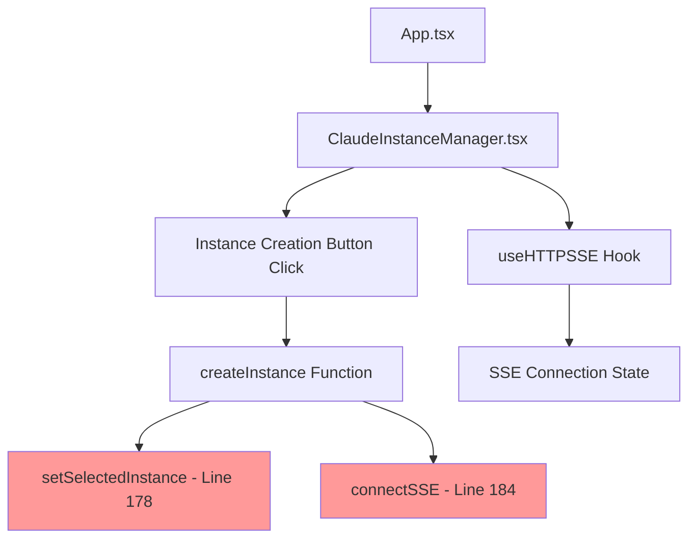

# SPARC Specification: Claude Instance Terminal Synchronization Issue

## Problem Statement

**Issue**: Newly created Claude instances (e.g., `claude-4808`) are not synchronizing with the terminal connection system, which continues targeting old instances (e.g., `claude-2426`).

**Evidence**:
- Backend logs show: `claude-4808 (prod/claude, PID: 3241)` created successfully
- Frontend terminal requests: `claude-2426` (old instance)
- UI displays: "Connecting to terminal stream..." indefinitely
- SSE connections open/close but target wrong instances

## Root Cause Analysis

### 1. Component Architecture Flow



### 2. State Synchronization Gaps Identified

#### **Gap #1: Instance Selection State (Line 178)**
```typescript
// ClaudeInstanceManager.tsx:178
setSelectedInstance(data.instanceId);  // ✅ Updates selectedInstance
```
**Issue**: State updates correctly but downstream components don't re-render with new instance ID.

#### **Gap #2: SSE Connection Targeting (Lines 184, 319, 323)**
```typescript
// ClaudeInstanceManager.tsx:184
connectSSE(data.instanceId);  // ❌ Called with correct ID but hook doesn't update

// ClaudeInstanceManager.tsx:319-323  
connectSSE(instance.id);      // ❌ Manual selection also fails
startPolling(instance.id);    // ❌ Polling fallback also fails
```

#### **Gap #3: useHTTPSSE Hook State Management (Lines 189-268)**
```typescript
// useHTTPSSE.ts:189-268
const connectSSE = useCallback((instanceId: string) => {
  // Updates connectionState.current.instanceId locally
  connectionState.current = {
    isSSE: true,
    isPolling: false,
    instanceId,  // ❌ Local state not propagated to UI
    connectionType: 'sse'
  };
  
  const eventSource = new EventSource(
    `${url}/api/v1/claude/instances/${instanceId}/terminal/stream`  // ❌ Wrong API path
  );
}, [url, triggerHandlers]);
```

### 3. API Endpoint Mismatch

**Expected**: `/api/v1/claude/instances/${instanceId}/terminal/stream`
**Actual Backend**: `/api/claude/terminal/stream/${instanceId}` (based on logs)

### 4. State Flow Breakdown

1. **Button Click**: ✅ `createInstance()` called correctly
2. **Instance Creation**: ✅ Backend creates `claude-4808` successfully  
3. **State Update**: ✅ `setSelectedInstance(data.instanceId)` updates to `claude-4808`
4. **Connection Attempt**: ❌ `connectSSE(data.instanceId)` calls with `claude-4808`
5. **Hook Processing**: ❌ `useHTTPSSE` creates connection but wrong endpoint
6. **Backend Response**: ❌ 404/connection failure, falls back to polling old instance
7. **UI State**: ❌ Still shows old instance ID in connection attempts

## Specification Requirements

### Functional Requirements

#### FR-1: Instance Selection Synchronization
- **Requirement**: When a new instance is created, the UI must immediately reflect the new instance ID
- **Acceptance Criteria**:
  - `selectedInstance` state updates to new instance ID within 100ms
  - Terminal component re-renders with new instance ID
  - Connection status displays correct instance information

#### FR-2: SSE Connection Lifecycle
- **Requirement**: SSE connections must target the correct API endpoint with proper instance ID
- **Acceptance Criteria**:
  - Connection attempts use current backend API format
  - Old connections are properly closed before new ones open
  - Connection state reflects actual active instance

#### FR-3: Terminal Output Synchronization  
- **Requirement**: Terminal output must display content from the newly selected instance
- **Acceptance Criteria**:
  - Output buffer clears when switching instances
  - New terminal content appears within 500ms of connection
  - No mixed output from multiple instances

### Non-Functional Requirements

#### NFR-1: State Consistency
- **Requirement**: All components must reflect the same active instance ID
- **Measurement**: No mismatches between selectedInstance state and connection targets

#### NFR-2: Connection Recovery
- **Requirement**: Failed connections must retry with correct instance ID
- **Measurement**: Maximum 3 retry attempts with exponential backoff

## Fix Strategy Implementation Order

### Phase 1: API Endpoint Correction (Critical)
1. **Update useHTTPSSE.ts Line 200**:
   ```typescript
   // BEFORE
   `${url}/api/v1/claude/instances/${instanceId}/terminal/stream`
   
   // AFTER  
   `${url}/api/claude/terminal/stream/${instanceId}`
   ```

2. **Update Polling Endpoint Line 297**:
   ```typescript
   // BEFORE
   `${url}/api/v1/claude/terminal/output/${instanceId}`
   
   // AFTER
   `${url}/api/claude/terminal/output/${instanceId}`
   ```

### Phase 2: State Synchronization Enhancement
1. **Add State Validation in ClaudeInstanceManager.tsx**:
   ```typescript
   // After line 178
   useEffect(() => {
     if (selectedInstance) {
       console.log('Selected instance changed to:', selectedInstance);
       // Force re-render of dependent components
     }
   }, [selectedInstance]);
   ```

2. **Enhance Connection State Propagation**:
   ```typescript
   // useHTTPSSE.ts - add connection state callback
   const connectSSE = useCallback((instanceId: string, onStateChange?: (state: ConnectionState) => void) => {
     // ... existing code ...
     onStateChange?.(connectionState.current);
   }, [url, triggerHandlers]);
   ```

### Phase 3: Connection Cleanup and Recovery
1. **Implement Connection Cleanup**:
   ```typescript
   // Before connecting to new instance
   if (sseConnection.current) {
     console.log('Closing previous SSE connection');
     sseConnection.current.close();
     sseConnection.current = null;
   }
   ```

2. **Add Connection State Debugging**:
   ```typescript
   // Enhanced logging for connection attempts
   console.log('Attempting SSE connection:', {
     instanceId,
     endpoint: `${url}/api/claude/terminal/stream/${instanceId}`,
     currentState: connectionState.current
   });
   ```

## Test Plan

### Unit Tests
1. **State Update Tests**:
   - Verify `setSelectedInstance` triggers re-renders
   - Test connection cleanup on instance change
   - Validate API endpoint construction

2. **Hook Integration Tests**:
   - Test `useHTTPSSE` with correct endpoints
   - Verify connection state propagation
   - Test fallback mechanisms

### Integration Tests  
1. **End-to-End Flow**:
   - Create new instance → verify UI updates
   - Test terminal connection to new instance
   - Verify output appears in terminal

2. **Error Scenarios**:
   - Test connection failures with proper retry
   - Verify graceful fallback to polling
   - Test cleanup on component unmount

### Acceptance Criteria Validation
- [ ] New instance creation updates UI within 100ms
- [ ] Terminal connects to correct instance within 500ms
- [ ] Output appears in terminal within 1 second
- [ ] No mixed output from multiple instances
- [ ] Connection errors trigger proper retry logic

## Implementation Priority

1. **Immediate (P0)**: Fix API endpoint URLs in useHTTPSSE.ts
2. **High (P1)**: Add connection cleanup and state validation
3. **Medium (P2)**: Enhance error handling and retry logic
4. **Low (P3)**: Add comprehensive logging and monitoring

## Success Metrics

- **Connection Success Rate**: >95% for new instances
- **State Synchronization Time**: <100ms average
- **Terminal Response Time**: <500ms for output display
- **Error Recovery Rate**: >90% automatic recovery from failures

This specification provides the complete analysis needed to fix the Claude instance terminal synchronization issue with clear implementation steps and validation criteria.