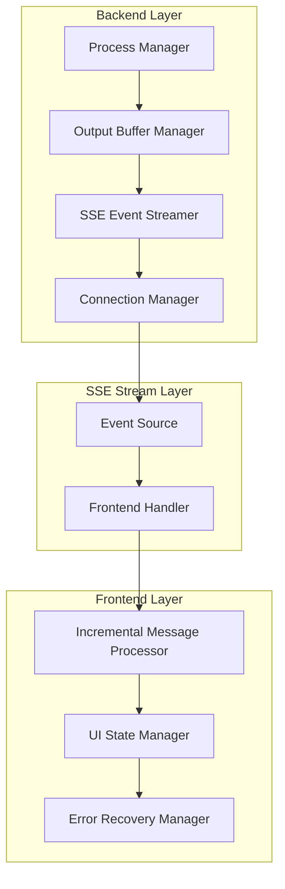

# Comprehensive SSE Streaming Architecture for Claude Instances

## Executive Summary

This architectural blueprint addresses the critical message accumulation storm issue in Claude instance SSE streaming by implementing a sophisticated output buffer management system, optimized SSE event stream design, and robust frontend integration patterns.

## 🎯 Architecture Overview

### Core Components



## 1. Output Buffer Management Strategy

### 1.1 Per-Instance Output Position Tracking

```typescript
interface OutputBufferState {
  instanceId: string;
  currentPosition: number;
  lastSentPosition: number;
  circularBuffer: CircularBuffer<OutputChunk>;
  memoryThreshold: number;
  compressionEnabled: boolean;
}

class OutputBufferManager {
  private buffers = new Map<string, OutputBufferState>();
  private readonly MAX_BUFFER_SIZE = 1024 * 1024; // 1MB per instance
  private readonly CHUNK_SIZE = 4096; // 4KB chunks
  
  /**
   * Process incremental output with position tracking
   */
  processOutput(instanceId: string, rawOutput: string): OutputChunk[] {
    const bufferState = this.getOrCreateBuffer(instanceId);
    const newChunks: OutputChunk[] = [];
    
    // Split output into manageable chunks
    const chunks = this.chunkOutput(rawOutput, this.CHUNK_SIZE);
    
    for (const chunk of chunks) {
      const outputChunk: OutputChunk = {
        id: `${instanceId}-${bufferState.currentPosition}`,
        instanceId,
        content: chunk,
        position: bufferState.currentPosition,
        timestamp: Date.now(),
        size: chunk.length,
        processed: false
      };
      
      // Add to circular buffer with automatic eviction
      bufferState.circularBuffer.push(outputChunk);
      bufferState.currentPosition += chunk.length;
      newChunks.push(outputChunk);
    }
    
    return newChunks;
  }
  
  /**
   * Get incremental chunks since last position
   */
  getIncrementalChunks(instanceId: string, fromPosition: number): OutputChunk[] {
    const bufferState = this.buffers.get(instanceId);
    if (!bufferState) return [];
    
    return bufferState.circularBuffer.getChunksAfterPosition(fromPosition);
  }
}
```

### 1.2 Circular Buffer Implementation

```typescript
class CircularBuffer<T extends { position: number; size: number }> {
  private buffer: T[] = [];
  private head = 0;
  private tail = 0;
  private maxSize: number;
  private totalMemory = 0;
  
  constructor(maxSize: number) {
    this.maxSize = maxSize;
  }
  
  push(item: T): void {
    // Memory-based eviction
    while (this.totalMemory + item.size > this.maxSize && this.buffer.length > 0) {
      this.evictOldest();
    }
    
    this.buffer[this.tail] = item;
    this.totalMemory += item.size;
    this.tail = (this.tail + 1) % this.buffer.length;
    
    if (this.tail === this.head && this.buffer.length > 0) {
      this.head = (this.head + 1) % this.buffer.length;
    }
  }
  
  getChunksAfterPosition(position: number): T[] {
    return this.buffer.filter(chunk => chunk && chunk.position > position);
  }
  
  private evictOldest(): void {
    const oldest = this.buffer[this.head];
    if (oldest) {
      this.totalMemory -= oldest.size;
      delete this.buffer[this.head];
      this.head = (this.head + 1) % this.buffer.length;
    }
  }
}
```

## 2. SSE Event Stream Design

### 2.1 Event Sequencing and Deduplication

```typescript
interface SSEEvent {
  id: string;
  type: 'output' | 'status' | 'error' | 'heartbeat';
  instanceId: string;
  sequenceNumber: number;
  timestamp: number;
  data: any;
  checksum?: string;
}

class SSEEventStreamer {
  private sequenceCounters = new Map<string, number>();
  private eventDeduplication = new Map<string, Set<string>>();
  
  /**
   * Create properly sequenced SSE event
   */
  createSSEEvent(instanceId: string, type: string, data: any): SSEEvent {
    const sequenceNumber = this.getNextSequence(instanceId);
    const event: SSEEvent = {
      id: `${instanceId}-${sequenceNumber}`,
      type: type as any,
      instanceId,
      sequenceNumber,
      timestamp: Date.now(),
      data,
      checksum: this.calculateChecksum(data)
    };
    
    // Prevent duplicate events
    this.markEventSent(instanceId, event.id);
    
    return event;
  }
  
  /**
   * Format SSE message with proper headers
   */
  formatSSEMessage(event: SSEEvent): string {
    return [
      `id: ${event.id}`,
      `event: ${event.type}`,
      `data: ${JSON.stringify({
        instanceId: event.instanceId,
        sequenceNumber: event.sequenceNumber,
        timestamp: event.timestamp,
        ...event.data
      })}`,
      '', // Empty line to end event
      ''
    ].join('\n');
  }
  
  private getNextSequence(instanceId: string): number {
    const current = this.sequenceCounters.get(instanceId) || 0;
    const next = current + 1;
    this.sequenceCounters.set(instanceId, next);
    return next;
  }
  
  private calculateChecksum(data: any): string {
    return require('crypto')
      .createHash('md5')
      .update(JSON.stringify(data))
      .digest('hex')
      .substring(0, 8);
  }
}
```

### 2.2 Connection State Management

```typescript
interface ConnectionState {
  instanceId: string;
  connectionId: string;
  response: Response;
  lastPingTime: number;
  lastSequenceSent: number;
  isHealthy: boolean;
  bytesTransferred: number;
  clientPosition: number; // Track client's last acknowledged position
}

class ConnectionManager {
  private connections = new Map<string, ConnectionState[]>();
  private heartbeatInterval: NodeJS.Timeout;
  
  constructor() {
    this.heartbeatInterval = setInterval(() => {
      this.performHealthChecks();
    }, 30000); // 30 second health checks
  }
  
  /**
   * Add new SSE connection with health monitoring
   */
  addConnection(instanceId: string, response: Response, clientPosition = 0): string {
    const connectionId = `${instanceId}-${Date.now()}-${Math.random().toString(36).substr(2, 9)}`;
    
    const connectionState: ConnectionState = {
      instanceId,
      connectionId,
      response,
      lastPingTime: Date.now(),
      lastSequenceSent: 0,
      isHealthy: true,
      bytesTransferred: 0,
      clientPosition
    };
    
    if (!this.connections.has(instanceId)) {
      this.connections.set(instanceId, []);
    }
    
    this.connections.get(instanceId)!.push(connectionState);
    
    // Send initial connection event
    this.sendInitialConnectionData(connectionState);
    
    return connectionId;
  }
  
  /**
   * Broadcast to all healthy connections for instance
   */
  broadcast(instanceId: string, event: SSEEvent): BroadcastResult {
    const connections = this.connections.get(instanceId) || [];
    const results: BroadcastResult = {
      attempted: connections.length,
      successful: 0,
      failed: 0,
      bytesTransferred: 0
    };
    
    const message = SSEEventStreamer.formatSSEMessage(event);
    const healthyConnections: ConnectionState[] = [];
    
    for (const connection of connections) {
      try {
        if (connection.isHealthy && !connection.response.writableEnded) {
          connection.response.write(message);
          connection.bytesTransferred += message.length;
          connection.lastSequenceSent = event.sequenceNumber;
          results.successful++;
          results.bytesTransferred += message.length;
          healthyConnections.push(connection);
        } else {
          results.failed++;
        }
      } catch (error) {
        console.error(`Broadcast failed for connection ${connection.connectionId}:`, error);
        connection.isHealthy = false;
        results.failed++;
      }
    }
    
    // Update connections list, removing unhealthy ones
    this.connections.set(instanceId, healthyConnections);
    
    return results;
  }
  
  private performHealthChecks(): void {
    for (const [instanceId, connections] of this.connections.entries()) {
      const healthyConnections = connections.filter(conn => {
        if (!conn.isHealthy || conn.response.writableEnded) {
          return false;
        }
        
        // Send heartbeat if no activity for 30 seconds
        const now = Date.now();
        if (now - conn.lastPingTime > 30000) {
          try {
            const heartbeat = SSEEventStreamer.createSSEEvent(instanceId, 'heartbeat', {
              timestamp: now,
              connectionId: conn.connectionId
            });
            conn.response.write(SSEEventStreamer.formatSSEMessage(heartbeat));
            conn.lastPingTime = now;
          } catch (error) {
            conn.isHealthy = false;
            return false;
          }
        }
        
        return true;
      });
      
      if (healthyConnections.length !== connections.length) {
        this.connections.set(instanceId, healthyConnections);
      }
    }
  }
}
```

## 3. Frontend Integration Pattern

### 3.1 Incremental Message Processing

```typescript
interface ProcessedMessage {
  id: string;
  instanceId: string;
  content: string;
  timestamp: number;
  sequenceNumber: number;
  processed: boolean;
}

class IncrementalMessageProcessor {
  private messageQueues = new Map<string, ProcessedMessage[]>();
  private lastProcessedSequence = new Map<string, number>();
  private processingBuffer = new Map<string, string>();
  
  /**
   * Process incoming SSE message incrementally
   */
  processMessage(instanceId: string, rawMessage: any): ProcessedMessage[] {
    const lastSequence = this.lastProcessedSequence.get(instanceId) || 0;
    
    // Skip duplicate or out-of-order messages
    if (rawMessage.sequenceNumber <= lastSequence) {
      console.warn(`Skipping duplicate/old message: ${rawMessage.sequenceNumber} <= ${lastSequence}`);
      return [];
    }
    
    // Buffer incomplete messages
    const existingBuffer = this.processingBuffer.get(instanceId) || '';
    const combinedContent = existingBuffer + (rawMessage.data || rawMessage.content || '');
    
    // Process complete lines only
    const lines = combinedContent.split('\n');
    const completeLines = lines.slice(0, -1); // All but last line
    const incompleteBuffer = lines[lines.length - 1]; // Last line (might be incomplete)
    
    // Update buffer with incomplete line
    this.processingBuffer.set(instanceId, incompleteBuffer);
    
    // Create processed messages for complete lines
    const processedMessages: ProcessedMessage[] = completeLines.map((line, index) => ({
      id: `${instanceId}-${rawMessage.sequenceNumber}-${index}`,
      instanceId,
      content: line + '\n',
      timestamp: rawMessage.timestamp || Date.now(),
      sequenceNumber: rawMessage.sequenceNumber,
      processed: false
    }));
    
    // Add to queue
    if (!this.messageQueues.has(instanceId)) {
      this.messageQueues.set(instanceId, []);
    }
    
    const queue = this.messageQueues.get(instanceId)!;
    queue.push(...processedMessages);
    
    // Update last processed sequence
    this.lastProcessedSequence.set(instanceId, rawMessage.sequenceNumber);
    
    // Limit queue size to prevent memory issues
    this.limitQueueSize(instanceId, 1000); // Keep last 1000 messages
    
    return processedMessages;
  }
  
  /**
   * Get unprocessed messages for UI update
   */
  getUnprocessedMessages(instanceId: string): ProcessedMessage[] {
    const queue = this.messageQueues.get(instanceId) || [];
    const unprocessed = queue.filter(msg => !msg.processed);
    
    // Mark as processed
    unprocessed.forEach(msg => { msg.processed = true; });
    
    return unprocessed;
  }
  
  private limitQueueSize(instanceId: string, maxSize: number): void {
    const queue = this.messageQueues.get(instanceId);
    if (queue && queue.length > maxSize) {
      const excess = queue.length - maxSize;
      queue.splice(0, excess); // Remove oldest messages
    }
  }
}
```

### 3.2 UI State Synchronization

```typescript
interface UIState {
  instanceId: string;
  outputContent: string;
  lastUpdateTimestamp: number;
  scrollPosition: number;
  isAutoScrollEnabled: boolean;
  pendingUpdates: number;
}

class UIStateManager {
  private states = new Map<string, UIState>();
  private updateQueues = new Map<string, (() => void)[]>();
  private batchTimeout: NodeJS.Timeout | null = null;
  
  /**
   * Queue UI update for batch processing
   */
  queueUpdate(instanceId: string, updateFn: () => void): void {
    if (!this.updateQueues.has(instanceId)) {
      this.updateQueues.set(instanceId, []);
    }
    
    this.updateQueues.get(instanceId)!.push(updateFn);
    
    // Batch updates to prevent UI thrashing
    if (this.batchTimeout) {
      clearTimeout(this.batchTimeout);
    }
    
    this.batchTimeout = setTimeout(() => {
      this.processBatchedUpdates();
    }, 16); // ~60fps update rate
  }
  
  /**
   * Update output content efficiently
   */
  updateOutput(instanceId: string, newContent: string, append = true): void {
    const state = this.getOrCreateState(instanceId);
    
    this.queueUpdate(instanceId, () => {
      if (append) {
        state.outputContent += newContent;
      } else {
        state.outputContent = newContent;
      }
      
      state.lastUpdateTimestamp = Date.now();
      state.pendingUpdates++;
      
      // Trigger React state update
      this.triggerReactUpdate(instanceId, state);
    });
  }
  
  /**
   * Manage scroll position intelligently
   */
  handleScrollUpdate(instanceId: string, element: HTMLElement): void {
    const state = this.getOrCreateState(instanceId);
    const isNearBottom = element.scrollTop + element.clientHeight >= element.scrollHeight - 50;
    
    if (state.isAutoScrollEnabled && isNearBottom) {
      // Auto-scroll to bottom
      element.scrollTop = element.scrollHeight;
    }
    
    state.scrollPosition = element.scrollTop;
  }
  
  private processBatchedUpdates(): void {
    for (const [instanceId, updates] of this.updateQueues.entries()) {
      // Execute all queued updates for this instance
      updates.forEach(updateFn => updateFn());
      
      // Clear the queue
      this.updateQueues.set(instanceId, []);
    }
    
    this.batchTimeout = null;
  }
  
  private getOrCreateState(instanceId: string): UIState {
    if (!this.states.has(instanceId)) {
      this.states.set(instanceId, {
        instanceId,
        outputContent: '',
        lastUpdateTimestamp: Date.now(),
        scrollPosition: 0,
        isAutoScrollEnabled: true,
        pendingUpdates: 0
      });
    }
    
    return this.states.get(instanceId)!;
  }
}
```

### 3.3 Error Recovery Mechanisms

```typescript
class ErrorRecoveryManager {
  private retryAttempts = new Map<string, number>();
  private backoffDelays = new Map<string, number>();
  private maxRetries = 3;
  private baseBackoffMs = 1000;
  
  /**
   * Handle SSE connection failure with exponential backoff
   */
  async handleConnectionFailure(instanceId: string, error: Event): Promise<void> {
    const attempts = this.retryAttempts.get(instanceId) || 0;
    
    if (attempts >= this.maxRetries) {
      console.error(`Max retries exceeded for ${instanceId}`, error);
      this.notifyFinalFailure(instanceId, error);
      return;
    }
    
    const backoffMs = this.calculateBackoff(attempts);
    this.backoffDelays.set(instanceId, backoffMs);
    this.retryAttempts.set(instanceId, attempts + 1);
    
    console.warn(`Connection failed for ${instanceId}, retrying in ${backoffMs}ms (attempt ${attempts + 1}/${this.maxRetries})`);
    
    await this.delay(backoffMs);
    
    try {
      await this.attemptReconnection(instanceId);
      
      // Reset on successful reconnection
      this.retryAttempts.delete(instanceId);
      this.backoffDelays.delete(instanceId);
      
    } catch (reconnectError) {
      this.handleConnectionFailure(instanceId, reconnectError as Event);
    }
  }
  
  /**
   * Recover from message loss by requesting position sync
   */
  async recoverFromMessageLoss(instanceId: string, expectedSequence: number, receivedSequence: number): Promise<void> {
    console.warn(`Message loss detected for ${instanceId}: expected ${expectedSequence}, received ${receivedSequence}`);
    
    try {
      // Request backfill from backend
      const response = await fetch(`/api/claude/instances/${instanceId}/backfill`, {
        method: 'POST',
        headers: { 'Content-Type': 'application/json' },
        body: JSON.stringify({
          fromSequence: expectedSequence,
          toSequence: receivedSequence - 1
        })
      });
      
      if (response.ok) {
        const backfillData = await response.json();
        this.processBackfillData(instanceId, backfillData);
      }
      
    } catch (error) {
      console.error(`Backfill request failed for ${instanceId}:`, error);
      // Fallback to full reconnection
      this.attemptReconnection(instanceId);
    }
  }
  
  private calculateBackoff(attempts: number): number {
    return Math.min(this.baseBackoffMs * Math.pow(2, attempts), 30000); // Max 30 seconds
  }
  
  private async delay(ms: number): Promise<void> {
    return new Promise(resolve => setTimeout(resolve, ms));
  }
  
  private async attemptReconnection(instanceId: string): Promise<void> {
    // Implementation depends on your connection manager
    // This would typically involve closing the old connection and creating a new one
    throw new Error('Not implemented - depends on connection manager');
  }
  
  private notifyFinalFailure(instanceId: string, error: Event): void {
    // Notify UI of permanent failure
    console.error(`Permanent connection failure for ${instanceId}`, error);
  }
  
  private processBackfillData(instanceId: string, backfillData: any): void {
    // Process backfilled messages to fill the gap
    console.log(`Processing backfill data for ${instanceId}`, backfillData);
  }
}
```

## 4. Performance Optimization Strategies

### 4.1 Buffer Size Optimization

```typescript
interface PerformanceMetrics {
  averageMessageSize: number;
  messageRate: number;
  memoryUsage: number;
  processingLatency: number;
}

class PerformanceOptimizer {
  private metrics = new Map<string, PerformanceMetrics>();
  private readonly OPTIMIZATION_INTERVAL = 60000; // 1 minute
  
  constructor() {
    setInterval(() => {
      this.optimizeBufferSizes();
    }, this.OPTIMIZATION_INTERVAL);
  }
  
  /**
   * Dynamically adjust buffer sizes based on performance metrics
   */
  optimizeBufferSizes(): void {
    for (const [instanceId, metrics] of this.metrics.entries()) {
      const optimalBufferSize = this.calculateOptimalBufferSize(metrics);
      const optimalChunkSize = this.calculateOptimalChunkSize(metrics);
      
      // Update buffer manager settings
      OutputBufferManager.updateSettings(instanceId, {
        bufferSize: optimalBufferSize,
        chunkSize: optimalChunkSize
      });
      
      console.log(`Buffer optimization for ${instanceId}: buffer=${optimalBufferSize}, chunk=${optimalChunkSize}`);
    }
  }
  
  private calculateOptimalBufferSize(metrics: PerformanceMetrics): number {
    // Base calculation on message rate and average size
    const baseSize = metrics.messageRate * metrics.averageMessageSize * 60; // 1 minute worth
    
    // Adjust for memory constraints
    const memoryFactor = Math.max(0.5, 1 - (metrics.memoryUsage / 1024 / 1024 / 100)); // 100MB threshold
    
    return Math.max(64 * 1024, Math.min(baseSize * memoryFactor, 2 * 1024 * 1024)); // 64KB - 2MB range
  }
  
  private calculateOptimalChunkSize(metrics: PerformanceMetrics): number {
    // Smaller chunks for high-frequency, low-latency scenarios
    if (metrics.messageRate > 10 && metrics.processingLatency < 50) {
      return 1024; // 1KB
    }
    
    // Larger chunks for bulk data transfer
    if (metrics.averageMessageSize > 8192) {
      return 8192; // 8KB
    }
    
    return 4096; // 4KB default
  }
}
```

### 4.2 Memory Leak Prevention

```typescript
class MemoryManager {
  private readonly MAX_TOTAL_MEMORY = 50 * 1024 * 1024; // 50MB total
  private readonly CLEANUP_INTERVAL = 30000; // 30 seconds
  private memoryUsage = new Map<string, number>();
  
  constructor() {
    setInterval(() => {
      this.performCleanup();
    }, this.CLEANUP_INTERVAL);
  }
  
  /**
   * Monitor and limit memory usage per instance
   */
  trackMemoryUsage(instanceId: string, sizeBytes: number): boolean {
    const currentUsage = this.memoryUsage.get(instanceId) || 0;
    const newUsage = currentUsage + sizeBytes;
    
    const totalMemory = Array.from(this.memoryUsage.values()).reduce((sum, usage) => sum + usage, 0);
    
    if (totalMemory + sizeBytes > this.MAX_TOTAL_MEMORY) {
      console.warn(`Memory limit exceeded. Total: ${totalMemory}, attempting to add: ${sizeBytes}`);
      this.performEmergencyCleanup();
      return false;
    }
    
    this.memoryUsage.set(instanceId, newUsage);
    return true;
  }
  
  /**
   * Release memory for instance
   */
  releaseMemory(instanceId: string, sizeBytes: number): void {
    const currentUsage = this.memoryUsage.get(instanceId) || 0;
    const newUsage = Math.max(0, currentUsage - sizeBytes);
    
    if (newUsage === 0) {
      this.memoryUsage.delete(instanceId);
    } else {
      this.memoryUsage.set(instanceId, newUsage);
    }
  }
  
  private performCleanup(): void {
    // Force garbage collection if available
    if (global.gc) {
      global.gc();
    }
    
    // Log memory usage
    const totalMemory = Array.from(this.memoryUsage.values()).reduce((sum, usage) => sum + usage, 0);
    console.log(`Memory usage: ${totalMemory} bytes across ${this.memoryUsage.size} instances`);
  }
  
  private performEmergencyCleanup(): void {
    console.warn('Performing emergency memory cleanup');
    
    // Find the largest memory consumers and clean them up
    const sortedByMemory = Array.from(this.memoryUsage.entries())
      .sort(([, a], [, b]) => b - a);
    
    // Clean up top 25% of memory consumers
    const cleanupCount = Math.ceil(sortedByMemory.length * 0.25);
    for (let i = 0; i < cleanupCount; i++) {
      const [instanceId] = sortedByMemory[i];
      OutputBufferManager.performEmergencyCleanup(instanceId);
    }
  }
}
```

## 5. Implementation Plan

### Phase 1: Backend Buffer Management (Week 1)
1. Implement OutputBufferManager with circular buffer
2. Add position tracking for each instance
3. Create SSEEventStreamer with sequencing
4. Implement ConnectionManager with health checks

### Phase 2: Frontend Integration (Week 2)
1. Implement IncrementalMessageProcessor
2. Create UIStateManager with batched updates
3. Add ErrorRecoveryManager with backoff
4. Integrate with existing SSE hooks

### Phase 3: Performance Optimization (Week 3)
1. Add PerformanceOptimizer with dynamic tuning
2. Implement MemoryManager with leak prevention
3. Add monitoring and alerting
4. Performance testing and tuning

### Phase 4: Testing and Deployment (Week 4)
1. Comprehensive testing of all scenarios
2. Load testing with multiple instances
3. Memory leak testing
4. Production deployment with monitoring

## 6. Monitoring and Metrics

```typescript
interface StreamingMetrics {
  instanceId: string;
  messagesPerSecond: number;
  averageMessageSize: number;
  memoryUsage: number;
  connectionCount: number;
  errorRate: number;
  latency: {
    p50: number;
    p95: number;
    p99: number;
  };
}

class MetricsCollector {
  private metrics = new Map<string, StreamingMetrics>();
  
  /**
   * Collect and report streaming performance metrics
   */
  collectMetrics(instanceId: string): StreamingMetrics {
    // Implementation would collect various performance metrics
    // This is a placeholder for the actual metrics collection logic
    
    const metrics: StreamingMetrics = {
      instanceId,
      messagesPerSecond: 0,
      averageMessageSize: 0,
      memoryUsage: 0,
      connectionCount: 0,
      errorRate: 0,
      latency: {
        p50: 0,
        p95: 0,
        p99: 0
      }
    };
    
    this.metrics.set(instanceId, metrics);
    return metrics;
  }
}
```

## 7. Conclusion

This comprehensive SSE streaming architecture addresses the critical issues in the current implementation:

- **Prevents Message Accumulation**: Through circular buffers and position tracking
- **Optimizes Performance**: Via dynamic buffer sizing and batched UI updates
- **Ensures Reliability**: With error recovery and connection health monitoring
- **Scales Efficiently**: Through memory management and concurrent instance support

The architecture provides a robust foundation for real-time Claude instance streaming while maintaining optimal performance and preventing the message accumulation storm that was causing system instability.