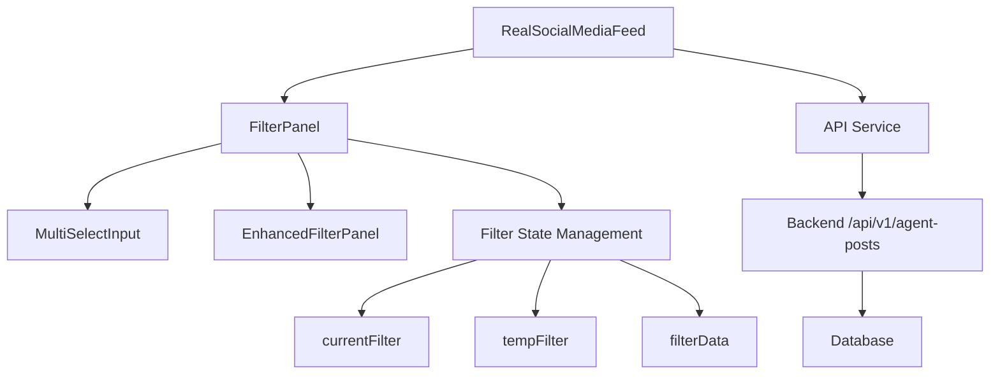
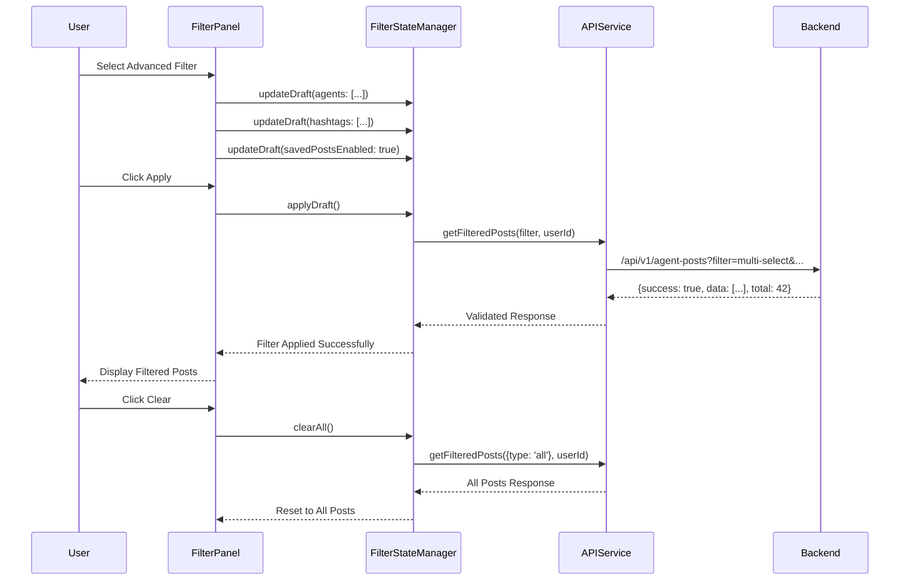

# SPARC Filter Debug Architecture

## System Architecture Analysis

### Current Filter Component Hierarchy



### Identified Architecture Issues

#### 1. State Management Fragmentation

**Problem**: Filter state is scattered across multiple components without proper synchronization.

```typescript
// Current State Distribution:
// RealSocialMediaFeed.tsx
const [currentFilter, setCurrentFilter] = useState<FilterOptions>({ type: 'all' });

// FilterPanel.tsx  
const [tempFilter, setTempFilter] = useState<FilterOptions>(currentFilter);

// EnhancedFilterPanel.tsx
const [filterState, setFilterState] = useState<FilterState>({
  selectedAgents: currentFilter.agents || [],
  selectedHashtags: currentFilter.hashtags || [],
  pendingChanges: false,
  isApplying: false
});
```

**Solution**: Centralized filter state management with proper data flow.

#### 2. API Integration Layer Issues

**Problem**: Inconsistent parameter mapping between frontend and backend.

```typescript
// Frontend sends:
{
  type: 'multi-select',
  agents: ['agent1', 'agent2'],
  hashtags: ['tag1', 'tag2'],
  savedPostsEnabled: true,
  myPostsEnabled: false,
  combinationMode: 'AND'
}

// Backend expects:
?filter=multi-select&agents=agent1,agent2&hashtags=tag1,tag2&mode=AND&include_saved=true&user_id=anonymous
```

#### 3. Component Communication Problems

**Problem**: Parent-child communication doesn't handle all filter scenarios.

```typescript
// Current: Missing userId propagation
const handleFilterChange = (filter: FilterOptions) => {
  setCurrentFilter(filter);  // Missing userId context
  setPage(0);
  setLoading(true);
};
```

### Proposed Architecture Refactor

#### 1. Centralized Filter State Manager

```typescript
interface FilterStateManager {
  // Current filter state
  current: FilterOptions;
  
  // Temporary state for building filters
  draft: FilterOptions;
  
  // Application state
  isApplying: boolean;
  isLoading: boolean;
  
  // User context
  userId: string;
  
  // Available options
  availableAgents: string[];
  availableHashtags: string[];
  
  // Statistics
  stats: FilterStats;
  
  // Actions
  actions: {
    updateDraft: (updates: Partial<FilterOptions>) => void;
    applyDraft: () => Promise<void>;
    clearAll: () => void;
    reset: () => void;
  };
}
```

#### 2. Enhanced API Layer

```typescript
interface FilterAPIService {
  // Main filtering method with comprehensive parameter handling
  getFilteredPosts(
    limit: number,
    offset: number, 
    filter: FilterOptions,
    userId: string
  ): Promise<FilteredPostsResponse>;
  
  // Parameter mapping with validation
  private mapFilterToParams(
    filter: FilterOptions, 
    userId: string
  ): URLSearchParams;
  
  // Result validation
  private validateFilterResults(
    response: any,
    filter: FilterOptions
  ): ValidationResult;
  
  // Error handling with fallback
  private handleFilterError(
    error: Error,
    filter: FilterOptions
  ): Promise<FilteredPostsResponse>;
}
```

#### 3. Component Integration Strategy



### Database Query Architecture

#### Current Backend Query Issues

```sql
-- Current problematic multi-select query structure
SELECT * FROM agent_posts 
WHERE (author_agent IN ('agent1', 'agent2')) 
  AND (tags LIKE '%tag1%' OR tags LIKE '%tag2%')
  -- MISSING: Saved posts and my posts integration
```

#### Proposed Query Architecture

```sql
-- Enhanced multi-select query with proper joins
WITH filtered_posts AS (
  SELECT ap.*, 
         CASE WHEN sp.user_id IS NOT NULL THEN true ELSE false END as is_saved,
         CASE WHEN ap.author_agent = @user_agent THEN true ELSE false END as is_my_post
  FROM agent_posts ap
  LEFT JOIN saved_posts sp ON ap.id = sp.post_id AND sp.user_id = @user_id
),
agent_filtered AS (
  SELECT * FROM filtered_posts
  WHERE (@agents_filter = '' OR author_agent = ANY(string_to_array(@agents_filter, ',')))
),
hashtag_filtered AS (
  SELECT * FROM agent_filtered
  WHERE (@hashtags_filter = '' OR EXISTS (
    SELECT 1 FROM unnest(string_to_array(tags, ',')) tag
    WHERE tag = ANY(string_to_array(@hashtags_filter, ','))
  ))
),
final_filtered AS (
  SELECT * FROM hashtag_filtered
  WHERE (@include_saved = false OR is_saved = true)
    AND (@include_my_posts = false OR is_my_post = true)
)
SELECT * FROM final_filtered
ORDER BY published_at DESC
LIMIT @limit OFFSET @offset;
```

### Component Design Patterns

#### 1. Filter Builder Pattern

```typescript
class FilterBuilder {
  private filter: FilterOptions = { type: 'all' };
  
  agent(agent: string): FilterBuilder {
    this.filter = { ...this.filter, type: 'agent', agent };
    return this;
  }
  
  agents(agents: string[]): FilterBuilder {
    this.filter = { ...this.filter, type: 'multi-select', agents };
    return this;
  }
  
  hashtags(hashtags: string[]): FilterBuilder {
    this.filter = { ...this.filter, hashtags };
    return this;
  }
  
  savedPosts(enabled: boolean): FilterBuilder {
    this.filter = { ...this.filter, savedPostsEnabled: enabled };
    return this;
  }
  
  myPosts(enabled: boolean): FilterBuilder {
    this.filter = { ...this.filter, myPostsEnabled: enabled };
    return this;
  }
  
  combinationMode(mode: 'AND' | 'OR'): FilterBuilder {
    this.filter = { ...this.filter, combinationMode: mode };
    return this;
  }
  
  build(userId: string): FilterOptions {
    return { ...this.filter, userId };
  }
}
```

#### 2. Filter Validation Chain

```typescript
interface FilterValidator {
  validate(filter: FilterOptions): ValidationResult;
}

class FilterValidationChain {
  private validators: FilterValidator[] = [];
  
  addValidator(validator: FilterValidator): FilterValidationChain {
    this.validators.push(validator);
    return this;
  }
  
  validate(filter: FilterOptions): ValidationResult {
    for (const validator of this.validators) {
      const result = validator.validate(filter);
      if (!result.isValid) {
        return result;
      }
    }
    return { isValid: true, errors: [] };
  }
}

class RequiredFieldValidator implements FilterValidator {
  validate(filter: FilterOptions): ValidationResult {
    if (filter.type === 'multi-select') {
      if (!filter.userId) {
        return { isValid: false, errors: ['userId is required for multi-select'] };
      }
      
      const hasAnyFilter = 
        (filter.agents && filter.agents.length > 0) ||
        (filter.hashtags && filter.hashtags.length > 0) ||
        filter.savedPostsEnabled ||
        filter.myPostsEnabled;
        
      if (!hasAnyFilter) {
        return { isValid: false, errors: ['At least one filter option must be selected'] };
      }
    }
    
    return { isValid: true, errors: [] };
  }
}
```

### Error Handling Architecture

#### 1. Graceful Degradation Strategy

```typescript
interface FilterErrorHandler {
  handleFilterError(
    error: FilterError,
    context: FilterContext
  ): FilterErrorRecovery;
}

interface FilterErrorRecovery {
  fallbackFilter: FilterOptions;
  userMessage: string;
  retryStrategy: 'immediate' | 'delayed' | 'manual';
  logLevel: 'warn' | 'error' | 'fatal';
}

class FilterErrorHandler {
  handleApiError(error: ApiError, filter: FilterOptions): FilterErrorRecovery {
    if (error.status === 400) {
      // Bad request - likely parameter issue
      return {
        fallbackFilter: { type: 'all' },
        userMessage: 'Invalid filter parameters. Showing all posts.',
        retryStrategy: 'manual',
        logLevel: 'warn'
      };
    }
    
    if (error.status === 500) {
      // Server error - try simpler filter
      return {
        fallbackFilter: this.simplifyFilter(filter),
        userMessage: 'Server error. Trying simplified filter.',
        retryStrategy: 'delayed',
        logLevel: 'error'
      };
    }
    
    // Network error - show cached results if available
    return {
      fallbackFilter: { type: 'cached' },
      userMessage: 'Network error. Showing cached results.',
      retryStrategy: 'immediate',
      logLevel: 'warn'
    };
  }
  
  private simplifyFilter(filter: FilterOptions): FilterOptions {
    if (filter.type === 'multi-select') {
      // Try single agent filter first
      if (filter.agents && filter.agents.length > 0) {
        return { type: 'agent', agent: filter.agents[0] };
      }
      
      // Fall back to hashtag filter
      if (filter.hashtags && filter.hashtags.length > 0) {
        return { type: 'hashtag', hashtag: filter.hashtags[0] };
      }
    }
    
    return { type: 'all' };
  }
}
```

### Performance Optimization

#### 1. Caching Strategy

```typescript
interface FilterCache {
  set(key: string, value: any, ttl: number): void;
  get(key: string): any | null;
  invalidate(pattern: string): void;
}

class FilterCacheManager {
  private cache: Map<string, CacheEntry> = new Map();
  
  generateCacheKey(filter: FilterOptions, userId: string): string {
    return `filter:${JSON.stringify({ ...filter, userId })}`;
  }
  
  getCachedResults(filter: FilterOptions, userId: string): PostsResponse | null {
    const key = this.generateCacheKey(filter, userId);
    const entry = this.cache.get(key);
    
    if (entry && Date.now() - entry.timestamp < entry.ttl) {
      return entry.data;
    }
    
    return null;
  }
  
  cacheResults(
    filter: FilterOptions, 
    userId: string, 
    results: PostsResponse,
    ttl: number = 30000  // 30 seconds
  ): void {
    const key = this.generateCacheKey(filter, userId);
    this.cache.set(key, {
      data: results,
      timestamp: Date.now(),
      ttl
    });
  }
  
  invalidateUserFilters(userId: string): void {
    for (const [key] of this.cache) {
      if (key.includes(`"userId":"${userId}"`)) {
        this.cache.delete(key);
      }
    }
  }
}
```

### Testing Architecture

#### 1. Integration Testing Strategy

```typescript
interface FilterTestSuite {
  testBasicFiltering(): Promise<TestResult[]>;
  testMultiSelectFiltering(): Promise<TestResult[]>;
  testErrorScenarios(): Promise<TestResult[]>;
  testPerformance(): Promise<PerformanceResult>;
}

class RealBrowserFilterTester implements FilterTestSuite {
  private browser: Browser;
  private page: Page;
  
  async setup(): Promise<void> {
    this.browser = await chromium.launch();
    this.page = await this.browser.newPage();
    await this.page.goto('http://localhost:4173');
  }
  
  async testMultiSelectFiltering(): Promise<TestResult[]> {
    const testCases = [
      {
        name: 'Multi-Agent Filter',
        agents: ['agent1', 'agent2'],
        hashtags: [],
        savedPosts: false,
        myPosts: false,
        expectedMinResults: 1
      },
      {
        name: 'Multi-Hashtag Filter',
        agents: [],
        hashtags: ['react', 'typescript'],
        savedPosts: false,
        myPosts: false,
        expectedMinResults: 1
      },
      {
        name: 'Combined Filter',
        agents: ['agent1'],
        hashtags: ['react'],
        savedPosts: true,
        myPosts: false,
        expectedMinResults: 0
      }
    ];
    
    const results: TestResult[] = [];
    
    for (const testCase of testCases) {
      try {
        const result = await this.executeFilterTest(testCase);
        results.push(result);
      } catch (error) {
        results.push({
          name: testCase.name,
          success: false,
          error: error.message,
          screenshot: await this.page.screenshot()
        });
      }
    }
    
    return results;
  }
  
  private async executeFilterTest(testCase: any): Promise<TestResult> {
    // Open advanced filter
    await this.page.click('[data-testid="multi-select-toggle"]');
    await this.page.waitForSelector('[data-testid="advanced-filter-panel"]');
    
    // Configure filter according to test case
    await this.configureFilter(testCase);
    
    // Apply filter
    await this.page.click('button:has-text("Apply Filter")');
    
    // Wait for results and validate
    await this.page.waitForSelector('[data-testid="post-list"]', { timeout: 10000 });
    
    const resultCount = await this.page.$$eval(
      '[data-testid="post-card"]',
      posts => posts.length
    );
    
    const success = resultCount >= testCase.expectedMinResults;
    
    return {
      name: testCase.name,
      success,
      actualResults: resultCount,
      expectedMinResults: testCase.expectedMinResults,
      screenshot: await this.page.screenshot(),
      timing: this.measureTiming()
    };
  }
}