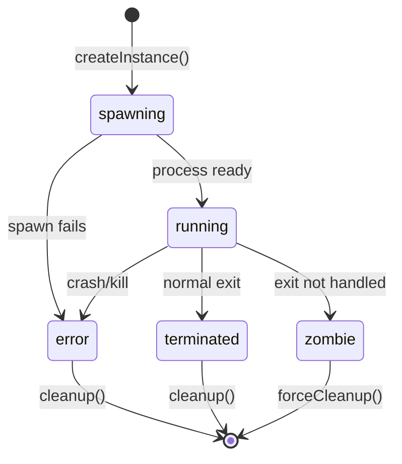

# Process Lifecycle Management Specification

## 1. PROCESS STATE MACHINE

### 1.1 State Transitions


### 1.2 State Definitions
- **spawning**: Process creation initiated, awaiting startup
- **running**: Process active and accepting I/O
- **terminated**: Process ended normally (exit code 0)
- **error**: Process failed or crashed (exit code != 0)
- **zombie**: Process ended but resources not cleaned up

## 2. PROCESS REGISTRY ARCHITECTURE

### 2.1 Registry Structure
```typescript
class ProcessRegistry {
  private processes = new Map<string, ProcessInstance>();
  private processGroups = new Map<string, Set<string>>();
  private resourceLimits = new ProcessResourceLimits();
  
  register(instance: ProcessInstance): void;
  unregister(instanceId: string): void;
  get(instanceId: string): ProcessInstance | undefined;
  getAll(): ProcessInstance[];
  getByStatus(status: ProcessStatus): ProcessInstance[];
  getByGroup(groupId: string): ProcessInstance[];
}
```

### 2.2 Process Instance Schema
```typescript
interface ProcessInstance {
  // Identity
  instanceId: string;           // Unique instance identifier
  groupId: string;             // Process group for batch operations
  
  // Process Reference
  process: ChildProcess;       // Node.js ChildProcess object
  pid: number;                // Real system PID
  
  // State Management
  status: ProcessStatus;       // Current lifecycle state
  startTime: Date;            // Process creation timestamp
  endTime?: Date;             // Process termination timestamp
  exitCode?: number;          // Process exit code
  signal?: string;            // Termination signal
  
  // Configuration
  command: string[];          // Executed command with arguments
  workingDirectory: string;   // Process working directory
  environment: NodeJS.ProcessEnv; // Environment variables
  
  // I/O Management
  stdin: Writable;            // Input stream reference
  stdout: Readable;           // Output stream reference
  stderr: Readable;           // Error stream reference
  
  // Activity Tracking
  lastActivity: Date;         // Last I/O or state change
  inputCount: number;         // Total inputs sent
  outputBytes: number;        // Total output bytes
  
  // Metadata
  metadata: {
    type: string;             // Creation source (button type)
    label: string;            // Human-readable name
    tags: string[];           // Classification tags
    creator: string;          // User or system identifier
  };
  
  // Resource Usage
  resources: {
    memoryUsage: number;      // Current memory in bytes
    cpuTime: number;          // Accumulated CPU time
    openFiles: number;        // File descriptor count
  };
}
```

## 3. SPAWNING PROCESS SPECIFICATION

### 3.1 Spawn Configuration
```typescript
interface SpawnConfig {
  command: string[];              // Command and arguments
  workingDirectory: string;       // Working directory path
  environment?: NodeJS.ProcessEnv; // Environment variables
  stdio?: StdioOptions;          // I/O configuration
  timeout?: number;              // Spawn timeout in ms
  resourceLimits?: {
    memory: number;              // Memory limit in bytes
    cpu: number;                 // CPU limit percentage
    files: number;               // File descriptor limit
  };
  metadata?: {
    type: string;
    label: string;
    tags: string[];
  };
}
```

### 3.2 Spawn Implementation
```typescript
class ClaudeProcessSpawner {
  async spawn(config: SpawnConfig): Promise<ProcessInstance> {
    // 1. Validate configuration
    this.validateSpawnConfig(config);
    
    // 2. Check resource limits
    await this.checkResourceAvailability(config);
    
    // 3. Generate unique instance ID
    const instanceId = this.generateInstanceId();
    
    // 4. Spawn process with proper error handling
    const childProcess = spawn(
      config.command[0],
      config.command.slice(1),
      {
        cwd: config.workingDirectory,
        env: { ...process.env, ...config.environment },
        stdio: ['pipe', 'pipe', 'pipe'],
        detached: false, // Keep attached for proper cleanup
      }
    );
    
    // 5. Create instance record
    const instance: ProcessInstance = {
      instanceId,
      groupId: this.generateGroupId(config),
      process: childProcess,
      pid: childProcess.pid!,
      status: 'spawning',
      startTime: new Date(),
      command: config.command,
      workingDirectory: config.workingDirectory,
      environment: config.environment || {},
      stdin: childProcess.stdin!,
      stdout: childProcess.stdout!,
      stderr: childProcess.stderr!,
      lastActivity: new Date(),
      inputCount: 0,
      outputBytes: 0,
      metadata: config.metadata || {
        type: 'unknown',
        label: 'Claude Process',
        tags: [],
        creator: 'system'
      },
      resources: {
        memoryUsage: 0,
        cpuTime: 0,
        openFiles: 3 // stdin, stdout, stderr
      }
    };
    
    // 6. Setup process event handlers
    this.setupProcessHandlers(instance);
    
    // 7. Register instance
    this.registry.register(instance);
    
    // 8. Start monitoring
    this.startMonitoring(instance);
    
    // 9. Wait for process to be ready
    await this.waitForProcessReady(instance);
    
    return instance;
  }
  
  private setupProcessHandlers(instance: ProcessInstance): void {
    const { process, instanceId } = instance;
    
    // Handle process ready
    process.on('spawn', () => {
      instance.status = 'running';
      instance.lastActivity = new Date();
      this.broadcaster.broadcastProcessStatus(instanceId, 'running');
    });
    
    // Handle process exit
    process.on('exit', (code, signal) => {
      instance.exitCode = code;
      instance.signal = signal;
      instance.endTime = new Date();
      instance.status = code === 0 ? 'terminated' : 'error';
      this.broadcaster.broadcastProcessStatus(instanceId, instance.status);
      
      // Schedule cleanup
      setTimeout(() => this.cleanup(instanceId), 1000);
    });
    
    // Handle process errors
    process.on('error', (error) => {
      instance.status = 'error';
      instance.lastActivity = new Date();
      this.broadcaster.broadcastProcessError(instanceId, error);
    });
    
    // Handle stdio close
    process.on('close', (code, signal) => {
      if (instance.status === 'running') {
        instance.status = code === 0 ? 'terminated' : 'error';
      }
    });
  }
}
```

## 4. TERMINATION PROCESS SPECIFICATION

### 4.1 Graceful Termination
```typescript
class ClaudeProcessTerminator {
  async terminate(instanceId: string, options?: TerminationOptions): Promise<void> {
    const instance = this.registry.get(instanceId);
    if (!instance) {
      throw new Error(`Process instance not found: ${instanceId}`);
    }
    
    // 1. Send graceful shutdown signal
    if (options?.graceful !== false) {
      instance.process.kill('SIGTERM');
      
      // Wait for graceful shutdown
      const gracefulShutdown = await this.waitForExit(instance, 5000);
      if (gracefulShutdown) {
        return;
      }
    }
    
    // 2. Force kill if graceful failed
    instance.process.kill('SIGKILL');
    
    // 3. Wait for force kill to complete
    await this.waitForExit(instance, 2000);
    
    // 4. Force cleanup if still not dead
    if (instance.status !== 'terminated' && instance.status !== 'error') {
      await this.forceCleanup(instanceId);
    }
  }
  
  private async waitForExit(instance: ProcessInstance, timeout: number): Promise<boolean> {
    return new Promise((resolve) => {
      const timer = setTimeout(() => resolve(false), timeout);
      
      instance.process.once('exit', () => {
        clearTimeout(timer);
        resolve(true);
      });
    });
  }
  
  private async forceCleanup(instanceId: string): Promise<void> {
    const instance = this.registry.get(instanceId);
    if (!instance) return;
    
    try {
      // Force kill via system PID
      process.kill(instance.pid, 'SIGKILL');
    } catch (error) {
      console.warn(`Failed to force kill PID ${instance.pid}:`, error);
    }
    
    // Mark as terminated and cleanup
    instance.status = 'terminated';
    instance.endTime = new Date();
    await this.cleanup(instanceId);
  }
}
```

### 4.2 Cleanup Process
```typescript
interface CleanupResult {
  instanceId: string;
  cleaned: {
    processKilled: boolean;
    streamsClosd: boolean;
    sseDisconnected: boolean;
    memoryReleased: boolean;
    registryRemoved: boolean;
  };
  errors: string[];
}

class ProcessCleanupManager {
  async cleanup(instanceId: string): Promise<CleanupResult> {
    const result: CleanupResult = {
      instanceId,
      cleaned: {
        processKilled: false,
        streamsClosd: false,
        sseDisconnected: false,
        memoryReleased: false,
        registryRemoved: false
      },
      errors: []
    };
    
    const instance = this.registry.get(instanceId);
    if (!instance) {
      result.errors.push('Instance not found in registry');
      return result;
    }
    
    try {
      // 1. Ensure process is terminated
      if (!instance.process.killed) {
        instance.process.kill('SIGTERM');
        result.cleaned.processKilled = true;
      }
      
      // 2. Close I/O streams
      try {
        instance.stdin.destroy();
        instance.stdout.destroy(); 
        instance.stderr.destroy();
        result.cleaned.streamsClosd = true;
      } catch (error) {
        result.errors.push(`Stream cleanup error: ${error}`);
      }
      
      // 3. Disconnect SSE connections
      try {
        this.broadcaster.disconnectAllConnections(instanceId);
        result.cleaned.sseDisconnected = true;
      } catch (error) {
        result.errors.push(`SSE cleanup error: ${error}`);
      }
      
      // 4. Release memory references
      try {
        // Clear large objects and circular references
        delete (instance as any).process;
        delete (instance as any).stdin;
        delete (instance as any).stdout;
        delete (instance as any).stderr;
        result.cleaned.memoryReleased = true;
      } catch (error) {
        result.errors.push(`Memory cleanup error: ${error}`);
      }
      
      // 5. Remove from registry
      try {
        this.registry.unregister(instanceId);
        result.cleaned.registryRemoved = true;
      } catch (error) {
        result.errors.push(`Registry cleanup error: ${error}`);
      }
      
    } catch (error) {
      result.errors.push(`General cleanup error: ${error}`);
    }
    
    return result;
  }
}
```

## 5. PROCESS MONITORING

### 5.1 Health Monitoring
```typescript
class ProcessHealthMonitor {
  private healthChecks = new Map<string, NodeJS.Timer>();
  
  startMonitoring(instance: ProcessInstance): void {
    const interval = setInterval(async () => {
      await this.checkHealth(instance);
    }, 5000); // Check every 5 seconds
    
    this.healthChecks.set(instance.instanceId, interval);
  }
  
  private async checkHealth(instance: ProcessInstance): Promise<void> {
    try {
      // 1. Check if process still exists
      const exists = this.processExists(instance.pid);
      if (!exists && instance.status === 'running') {
        instance.status = 'error';
        this.broadcaster.broadcastProcessStatus(instance.instanceId, 'error');
        return;
      }
      
      // 2. Update resource usage
      const usage = await this.getProcessUsage(instance.pid);
      instance.resources.memoryUsage = usage.memory;
      instance.resources.cpuTime = usage.cpu;
      
      // 3. Check resource limits
      await this.checkResourceLimits(instance);
      
      // 4. Update activity timestamp if I/O detected
      if (this.hasRecentActivity(instance)) {
        instance.lastActivity = new Date();
      }
      
      // 5. Check for zombie processes
      const timeSinceActivity = Date.now() - instance.lastActivity.getTime();
      if (timeSinceActivity > 300000) { // 5 minutes
        console.warn(`Process ${instance.instanceId} appears inactive`);
      }
      
    } catch (error) {
      console.error(`Health check failed for ${instance.instanceId}:`, error);
    }
  }
  
  private processExists(pid: number): boolean {
    try {
      process.kill(pid, 0); // Signal 0 checks existence
      return true;
    } catch {
      return false;
    }
  }
  
  private async getProcessUsage(pid: number): Promise<{memory: number, cpu: number}> {
    // Implementation depends on platform
    // Could use ps command or native modules
    return { memory: 0, cpu: 0 };
  }
}
```

## 6. RESOURCE MANAGEMENT

### 6.1 Resource Limits
```typescript
interface ResourceLimits {
  maxProcesses: number;        // Maximum concurrent processes
  maxMemoryPerProcess: number; // Memory limit per process (bytes)
  maxTotalMemory: number;      // Total memory limit (bytes)
  maxCpuPerProcess: number;    // CPU percentage per process
  maxFiles: number;            // File descriptor limit
}

class ResourceManager {
  private limits: ResourceLimits = {
    maxProcesses: 10,
    maxMemoryPerProcess: 1024 * 1024 * 1024, // 1GB
    maxTotalMemory: 4 * 1024 * 1024 * 1024,  // 4GB
    maxCpuPerProcess: 80,
    maxFiles: 1000
  };
  
  async checkResourceAvailability(config: SpawnConfig): Promise<void> {
    const currentProcesses = this.registry.getByStatus('running').length;
    
    // Check process limit
    if (currentProcesses >= this.limits.maxProcesses) {
      throw new Error(`Process limit exceeded: ${currentProcesses}/${this.limits.maxProcesses}`);
    }
    
    // Check memory availability
    const totalMemory = this.getTotalMemoryUsage();
    const requiredMemory = config.resourceLimits?.memory || this.limits.maxMemoryPerProcess;
    
    if (totalMemory + requiredMemory > this.limits.maxTotalMemory) {
      throw new Error(`Memory limit would be exceeded: ${totalMemory + requiredMemory} > ${this.limits.maxTotalMemory}`);
    }
    
    // Check system resources
    const systemStats = await this.getSystemStats();
    if (systemStats.freeMemory < requiredMemory) {
      throw new Error(`Insufficient system memory: ${systemStats.freeMemory} < ${requiredMemory}`);
    }
  }
  
  private getTotalMemoryUsage(): number {
    return this.registry.getAll()
      .reduce((total, instance) => total + instance.resources.memoryUsage, 0);
  }
}
```

## 7. ERROR HANDLING & RECOVERY

### 7.1 Error Classification
```typescript
enum ProcessErrorType {
  SPAWN_FAILED = 'spawn_failed',
  PROCESS_CRASHED = 'process_crashed',
  RESOURCE_EXHAUSTED = 'resource_exhausted',
  IO_ERROR = 'io_error',
  TIMEOUT = 'timeout',
  PERMISSION_DENIED = 'permission_denied',
  COMMAND_NOT_FOUND = 'command_not_found'
}

interface ProcessError {
  type: ProcessErrorType;
  instanceId: string;
  message: string;
  details: any;
  timestamp: Date;
  recoverable: boolean;
}
```

### 7.2 Recovery Strategies
```typescript
class ProcessRecoveryManager {
  async handleError(error: ProcessError): Promise<void> {
    switch (error.type) {
      case ProcessErrorType.SPAWN_FAILED:
        await this.handleSpawnFailure(error);
        break;
        
      case ProcessErrorType.PROCESS_CRASHED:
        await this.handleProcessCrash(error);
        break;
        
      case ProcessErrorType.RESOURCE_EXHAUSTED:
        await this.handleResourceExhaustion(error);
        break;
        
      default:
        await this.handleGenericError(error);
    }
  }
  
  private async handleSpawnFailure(error: ProcessError): Promise<void> {
    const instance = this.registry.get(error.instanceId);
    if (!instance) return;
    
    // Log detailed spawn failure information
    console.error(`Spawn failed for ${error.instanceId}:`, error.details);
    
    // Broadcast error to frontend
    this.broadcaster.broadcastProcessError(error.instanceId, {
      type: 'spawn_failed',
      message: 'Failed to start Claude process',
      details: this.sanitizeErrorDetails(error.details)
    });
    
    // Clean up failed instance
    await this.cleanup(error.instanceId);
  }
  
  private async handleProcessCrash(error: ProcessError): Promise<void> {
    const instance = this.registry.get(error.instanceId);
    if (!instance) return;
    
    // Save crash dump if enabled
    await this.saveCrashDump(instance, error);
    
    // Attempt automatic restart if configured
    if (instance.metadata.tags.includes('auto-restart')) {
      await this.attemptRestart(instance);
    }
  }
}
```

This specification provides a comprehensive framework for managing Claude process lifecycles with proper state management, resource control, and error recovery mechanisms.