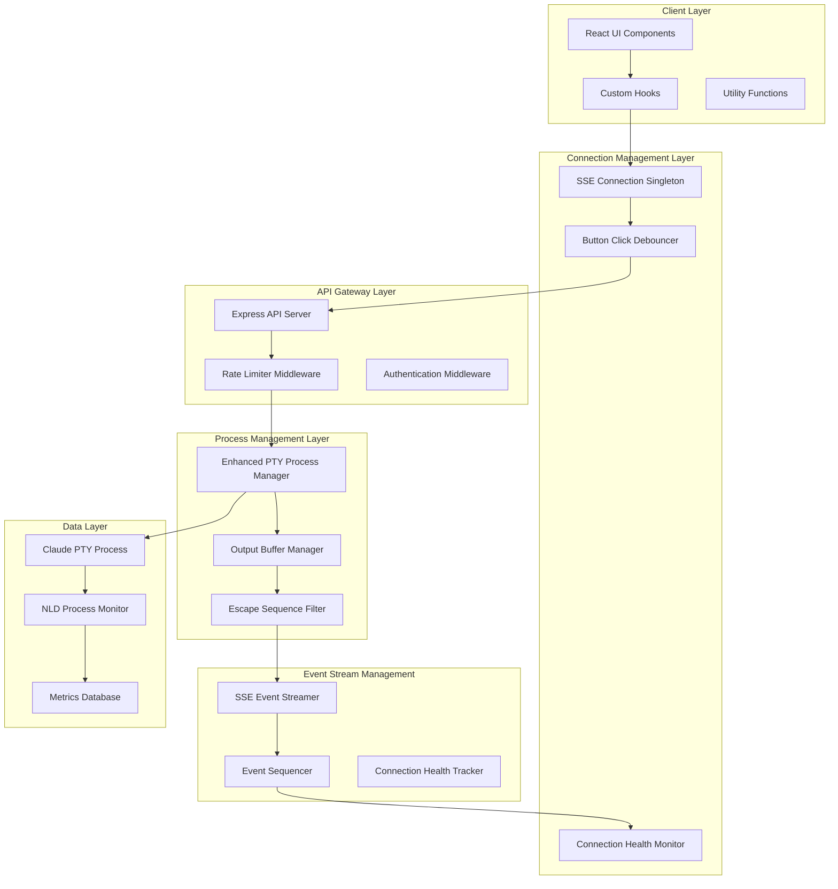

# SPARC Architecture Phase: Terminal Escape Sequence Storm Fix

## Architecture Overview

This document defines the architectural design for fixing the terminal escape sequence storm identified through comprehensive NLD analysis. The architecture addresses four critical components that work together to prevent terminal flooding, connection storms, and resource exhaustion.

## 1. System Architecture Diagram



## 2. Enhanced PTY Process Manager Architecture

### 2.1 Core Service Definition

```typescript
// /src/services/EnhancedPTYProcessManager.ts
interface PTYProcessConfig {
  instanceId: string;
  command: string[];
  workingDirectory: string;
  environment: Record<string, string>;
  bufferConfig: {
    maxOutputLines: number;
    flushInterval: number;
    escapeSequenceFiltering: boolean;
    rateLimit: {
      messagesPerSecond: number;
      burstSize: number;
    };
  };
}

class EnhancedPTYProcessManager {
  private processes: Map<string, PTYProcess>;
  private outputFilters: Map<string, EscapeSequenceFilter>;
  private bufferManagers: Map<string, OutputBufferManager>;
  private healthMonitors: Map<string, ProcessHealthMonitor>;
  
  // Core lifecycle methods
  async createInstance(config: PTYProcessConfig): Promise<PTYProcess>;
  async terminateInstance(instanceId: string): Promise<void>;
  
  // Input/Output handling
  async sendInput(instanceId: string, input: string): Promise<void>;
  getFilteredOutput(instanceId: string): OutputStream;
  
  // Health monitoring
  getProcessHealth(instanceId: string): ProcessHealthStatus;
  handleEscapeSequenceStorm(instanceId: string): Promise<void>;
}
```

### 2.2 Escape Sequence Filter Design

```typescript
// /src/services/EscapeSequenceFilter.ts
interface FilterConfig {
  allowedEscapeSequences: string[];
  maxSequenceLength: number;
  floodThreshold: number;
  blockUnknownSequences: boolean;
}

class EscapeSequenceFilter {
  private buffer: string = '';
  private sequenceCount: number = 0;
  private lastFlushTime: number = Date.now();
  
  // Core filtering methods
  filterOutput(rawOutput: string): FilteredOutput;
  detectEscapeSequenceFlood(output: string): boolean;
  sanitizeControlCharacters(text: string): string;
  
  // Sequence analysis
  identifyEscapeSequences(text: string): EscapeSequence[];
  validateSequence(sequence: EscapeSequence): boolean;
  
  private isValidEscapeSequence(sequence: string): boolean {
    const validPatterns = [
      /^\x1b\[[0-9;]*[a-zA-Z]/,  // ANSI escape sequences
      /^\x1b\[[?][0-9;]*[a-zA-Z]/, // DEC private mode
      /^\x1b\][0-9];.*?\x07/,    // OSC sequences
      /^\x1b[()][AB012]?/        // Charset selection
    ];
    
    return validPatterns.some(pattern => pattern.test(sequence));
  }
  
  private detectFloodPattern(sequences: EscapeSequence[]): boolean {
    const now = Date.now();
    const recentSequences = sequences.filter(s => 
      now - s.timestamp < 1000 // Within last second
    );
    
    return recentSequences.length > this.config.floodThreshold;
  }
}
```

### 2.3 Process Health Monitoring

```typescript
// /src/services/ProcessHealthMonitor.ts
interface HealthMetrics {
  outputRate: number;        // Messages per second
  escapeSequenceRate: number; // Escape sequences per second
  bufferUtilization: number; // Buffer usage percentage
  connectionCount: number;   // Active SSE connections
  errorRate: number;        // Errors per minute
}

class ProcessHealthMonitor {
  private healthThresholds = {
    maxOutputRate: 100,          // Max messages/sec
    maxEscapeSequenceRate: 50,   // Max escape sequences/sec
    maxBufferUtilization: 0.8,   // 80% buffer utilization
    maxErrorRate: 5              // 5 errors/minute
  };
  
  async monitorHealth(instanceId: string): Promise<HealthStatus>;
  detectAnomalousPatterns(metrics: HealthMetrics): Anomaly[];
  triggerEmergencyMitigation(instanceId: string, anomaly: Anomaly): Promise<void>;
}
```

## 3. SSE Event Stream Management Architecture

### 3.1 Connection Lifecycle Manager

```typescript
// /src/services/SSEConnectionManager.ts
interface ConnectionMetadata {
  connectionId: string;
  instanceId: string;
  clientIP: string;
  userAgent: string;
  connectedAt: Date;
  lastActivity: Date;
  eventsSent: number;
  bytesTransferred: number;
  isHealthy: boolean;
}

class SSEConnectionManager {
  private connections: Map<string, ConnectionMetadata>;
  private connectionPool: Map<string, Response[]>; // instanceId -> connections
  private heartbeatInterval: NodeJS.Timeout;
  
  // Connection management
  registerConnection(instanceId: string, response: Response): string;
  unregisterConnection(connectionId: string): void;
  
  // Health monitoring
  performHealthCheck(): void;
  detectZombieConnections(): string[];
  cleanupStaleConnections(): Promise<void>;
  
  // Event broadcasting
  broadcastToInstance(instanceId: string, event: SSEEvent): BroadcastResult;
  broadcastToConnection(connectionId: string, event: SSEEvent): boolean;
}
```

### 3.2 Event Sequencing and Deduplication

```typescript
// /src/services/SSEEventSequencer.ts
interface SequencedEvent {
  eventId: string;
  instanceId: string;
  sequenceNumber: number;
  timestamp: number;
  eventType: 'output' | 'status' | 'error' | 'heartbeat';
  payload: any;
  checksum: string;
}

class SSEEventSequencer {
  private sequenceCounters: Map<string, number>;
  private eventCache: Map<string, Set<string>>; // Deduplication cache
  private eventHistory: Map<string, SequencedEvent[]>;
  
  createSequencedEvent(instanceId: string, eventType: string, payload: any): SequencedEvent;
  isDuplicateEvent(event: SequencedEvent): boolean;
  getNextSequenceNumber(instanceId: string): number;
  
  // Event replay for reconnections
  getEventsSince(instanceId: string, lastSequence: number): SequencedEvent[];
  pruneOldEvents(maxAge: number): void;
}
```

### 3.3 Connection Health Tracking

```typescript
// /src/services/SSEHealthTracker.ts
interface ConnectionHealth {
  connectionId: string;
  status: 'healthy' | 'degraded' | 'unhealthy';
  latency: number;
  errorCount: number;
  lastErrorTime?: Date;
  consecutiveFailures: number;
  reconnectionAttempts: number;
}

class SSEHealthTracker {
  private healthMap: Map<string, ConnectionHealth>;
  private healthCheckInterval: NodeJS.Timeout;
  
  trackConnectionHealth(connectionId: string): void;
  updateConnectionMetrics(connectionId: string, metrics: Partial<ConnectionHealth>): void;
  getUnhealthyConnections(): ConnectionHealth[];
  
  // Automatic remediation
  attemptConnectionRecovery(connectionId: string): Promise<boolean>;
  quarantineConnection(connectionId: string): void;
}
```

## 4. Button Click Debouncing System Architecture

### 4.1 Component-Level Debouncing

```typescript
// /src/hooks/useDebouncer.ts
interface DebouncerConfig {
  delay: number;
  maxWait?: number;
  immediate?: boolean;
  cancelOnUnmount?: boolean;
}

function useDebouncer<T extends (...args: any[]) => any>(
  callback: T,
  config: DebouncerConfig
): [T, () => void, boolean] {
  const [isPending, setIsPending] = useState(false);
  const timeoutRef = useRef<NodeJS.Timeout>();
  const maxTimeoutRef = useRef<NodeJS.Timeout>();
  const lastCallTimeRef = useRef<number>();
  
  const debouncedCallback = useCallback((...args: Parameters<T>) => {
    const now = Date.now();
    
    // Clear existing timeouts
    if (timeoutRef.current) clearTimeout(timeoutRef.current);
    if (maxTimeoutRef.current) clearTimeout(maxTimeoutRef.current);
    
    setIsPending(true);
    
    // Immediate execution on first call
    if (config.immediate && !lastCallTimeRef.current) {
      callback(...args);
      setIsPending(false);
      lastCallTimeRef.current = now;
      return;
    }
    
    // Regular debounced execution
    timeoutRef.current = setTimeout(() => {
      callback(...args);
      setIsPending(false);
      lastCallTimeRef.current = Date.now();
    }, config.delay);
    
    // Max wait timeout
    if (config.maxWait && !maxTimeoutRef.current) {
      maxTimeoutRef.current = setTimeout(() => {
        if (timeoutRef.current) clearTimeout(timeoutRef.current);
        callback(...args);
        setIsPending(false);
        lastCallTimeRef.current = Date.now();
      }, config.maxWait);
    }
    
    lastCallTimeRef.current = now;
  }, [callback, config]);
  
  const cancel = useCallback(() => {
    if (timeoutRef.current) clearTimeout(timeoutRef.current);
    if (maxTimeoutRef.current) clearTimeout(maxTimeoutRef.current);
    setIsPending(false);
  }, []);
  
  useEffect(() => {
    if (config.cancelOnUnmount) {
      return cancel;
    }
  }, [cancel, config.cancelOnUnmount]);
  
  return [debouncedCallback as T, cancel, isPending];
}
```

### 4.2 Instance Creation Debouncing

```typescript
// /src/components/claude-manager/ClaudeInstanceButtons.tsx
interface InstanceCreationState {
  isCreating: boolean;
  lastCreationTime: number;
  creationCount: number;
  windowStartTime: number;
}

function useInstanceCreationDebouncer() {
  const [creationState, setCreationState] = useState<InstanceCreationState>({
    isCreating: false,
    lastCreationTime: 0,
    creationCount: 0,
    windowStartTime: Date.now()
  });
  
  const [debouncedCreate, cancelCreate, isCreatePending] = useDebouncer(
    async (command: string) => {
      // Rate limiting logic
      const now = Date.now();
      const windowDuration = 60000; // 1 minute window
      
      if (now - creationState.windowStartTime > windowDuration) {
        // Reset window
        setCreationState(prev => ({
          ...prev,
          creationCount: 0,
          windowStartTime: now
        }));
      }
      
      if (creationState.creationCount >= 3) {
        throw new Error('Rate limit exceeded: Maximum 3 instances per minute');
      }
      
      setCreationState(prev => ({
        ...prev,
        isCreating: true,
        creationCount: prev.creationCount + 1,
        lastCreationTime: now
      }));
      
      try {
        await createInstanceAPI(command);
      } finally {
        setCreationState(prev => ({
          ...prev,
          isCreating: false
        }));
      }
    },
    {
      delay: 1000,     // 1 second delay
      maxWait: 5000,   // Maximum 5 second wait
      immediate: false
    }
  );
  
  return {
    createInstance: debouncedCreate,
    cancelCreation: cancelCreate,
    isCreating: isCreatePending || creationState.isCreating,
    canCreate: creationState.creationCount < 3
  };
}
```

## 5. Output Buffer Rate Limiting Architecture

### 5.1 Intelligent Buffer Management

```typescript
// /src/services/OutputBufferManager.ts
interface BufferConfig {
  maxBufferSize: number;
  flushInterval: number;
  rateLimit: {
    messagesPerSecond: number;
    burstSize: number;
  };
  adaptiveThrottling: {
    enabled: boolean;
    thresholds: {
      low: number;    // < 50% capacity
      medium: number; // 50-80% capacity
      high: number;   // > 80% capacity
    };
  };
}

class OutputBufferManager {
  private buffers: Map<string, OutputBuffer>;
  private rateLimiters: Map<string, TokenBucket>;
  private flushTimers: Map<string, NodeJS.Timeout>;
  
  constructor(private config: BufferConfig) {
    this.setupFlushScheduler();
  }
  
  async bufferOutput(instanceId: string, output: string): Promise<void> {
    const buffer = this.getOrCreateBuffer(instanceId);
    const rateLimiter = this.getOrCreateRateLimiter(instanceId);
    
    // Check rate limit
    if (!rateLimiter.consume(output.length)) {
      await this.handleRateLimit(instanceId, output);
      return;
    }
    
    // Add to buffer
    buffer.add(output);
    
    // Check if immediate flush needed
    if (this.shouldFlushImmediately(buffer)) {
      await this.flushBuffer(instanceId);
    }
  }
  
  private shouldFlushImmediately(buffer: OutputBuffer): boolean {
    const utilizationRatio = buffer.size / this.config.maxBufferSize;
    const timeSinceLastFlush = Date.now() - buffer.lastFlushTime;
    
    return (
      utilizationRatio > 0.8 || // Buffer almost full
      timeSinceLastFlush > this.config.flushInterval || // Time threshold reached
      buffer.containsPriorityContent() // High-priority content
    );
  }
  
  private async handleRateLimit(instanceId: string, output: string): Promise<void> {
    const buffer = this.buffers.get(instanceId);
    if (!buffer) return;
    
    // Implement adaptive throttling
    if (this.config.adaptiveThrottling.enabled) {
      const utilization = buffer.size / this.config.maxBufferSize;
      
      if (utilization > this.config.adaptiveThrottling.thresholds.high) {
        // High utilization: aggressive throttling
        await this.delay(2000);
      } else if (utilization > this.config.adaptiveThrottling.thresholds.medium) {
        // Medium utilization: moderate throttling
        await this.delay(1000);
      } else {
        // Low utilization: light throttling
        await this.delay(500);
      }
    }
    
    // Retry adding to buffer
    buffer.add(output);
  }
}
```

### 5.2 Token Bucket Rate Limiter

```typescript
// /src/services/TokenBucket.ts
class TokenBucket {
  private tokens: number;
  private lastRefill: number;
  
  constructor(
    private capacity: number,
    private refillRate: number, // tokens per second
    private burstSize: number
  ) {
    this.tokens = capacity;
    this.lastRefill = Date.now();
  }
  
  consume(tokens: number): boolean {
    this.refill();
    
    if (tokens > this.burstSize) {
      return false; // Request exceeds burst limit
    }
    
    if (this.tokens >= tokens) {
      this.tokens -= tokens;
      return true;
    }
    
    return false;
  }
  
  private refill(): void {
    const now = Date.now();
    const timePassed = (now - this.lastRefill) / 1000;
    const tokensToAdd = Math.min(
      this.capacity - this.tokens,
      timePassed * this.refillRate
    );
    
    this.tokens += tokensToAdd;
    this.lastRefill = now;
  }
  
  getAvailableTokens(): number {
    this.refill();
    return this.tokens;
  }
}
```

### 5.3 Priority-Based Output Processing

```typescript
// /src/services/OutputPrioritizer.ts
enum OutputPriority {
  CRITICAL = 1,  // Errors, system messages
  HIGH = 2,      // User input echo, important responses
  MEDIUM = 3,    // Standard output
  LOW = 4        // Debug info, verbose output
}

interface PrioritizedOutput {
  content: string;
  priority: OutputPriority;
  timestamp: number;
  instanceId: string;
}

class OutputPrioritizer {
  private priorityQueues: Map<string, PriorityQueue<PrioritizedOutput>>;
  
  addOutput(instanceId: string, content: string): void {
    const priority = this.determinePriority(content);
    const prioritizedOutput: PrioritizedOutput = {
      content,
      priority,
      timestamp: Date.now(),
      instanceId
    };
    
    const queue = this.getOrCreateQueue(instanceId);
    queue.enqueue(prioritizedOutput);
  }
  
  getNextOutput(instanceId: string): PrioritizedOutput | null {
    const queue = this.priorityQueues.get(instanceId);
    return queue?.dequeue() || null;
  }
  
  private determinePriority(content: string): OutputPriority {
    if (this.isErrorMessage(content)) return OutputPriority.CRITICAL;
    if (this.isUserInputEcho(content)) return OutputPriority.HIGH;
    if (this.isDebugOutput(content)) return OutputPriority.LOW;
    return OutputPriority.MEDIUM;
  }
  
  private isErrorMessage(content: string): boolean {
    const errorPatterns = [
      /error:/i,
      /exception:/i,
      /failed:/i,
      /\[ERROR\]/i,
      /panic:/i
    ];
    return errorPatterns.some(pattern => pattern.test(content));
  }
  
  private isUserInputEcho(content: string): boolean {
    // Detect echoed user input (usually prefixed with prompt)
    return /^[\$#%>]\s/.test(content.trim());
  }
}
```

## 6. Integration Architecture

### 6.1 Service Integration Layer

```typescript
// /src/services/IntegratedTerminalManager.ts
class IntegratedTerminalManager {
  private ptyManager: EnhancedPTYProcessManager;
  private sseManager: SSEConnectionManager;
  private bufferManager: OutputBufferManager;
  private healthTracker: SSEHealthTracker;
  
  constructor() {
    this.ptyManager = new EnhancedPTYProcessManager();
    this.sseManager = new SSEConnectionManager();
    this.bufferManager = new OutputBufferManager(BUFFER_CONFIG);
    this.healthTracker = new SSEHealthTracker();
    
    this.setupIntegration();
  }
  
  private setupIntegration(): void {
    // PTY output -> Buffer -> SSE
    this.ptyManager.on('output', async (instanceId, output) => {
      await this.bufferManager.bufferOutput(instanceId, output);
    });
    
    // Buffer flush -> SSE broadcast
    this.bufferManager.on('flush', (instanceId, bufferedOutput) => {
      const event = this.createOutputEvent(instanceId, bufferedOutput);
      this.sseManager.broadcastToInstance(instanceId, event);
    });
    
    // Health monitoring integration
    this.healthTracker.on('connectionUnhealthy', (connectionId) => {
      this.sseManager.quarantineConnection(connectionId);
    });
  }
  
  async createInstance(config: PTYProcessConfig): Promise<string> {
    const instanceId = await this.ptyManager.createInstance(config);
    
    // Initialize supporting services
    this.bufferManager.initializeBuffer(instanceId);
    this.sseManager.registerInstance(instanceId);
    
    return instanceId;
  }
  
  async terminateInstance(instanceId: string): Promise<void> {
    await this.ptyManager.terminateInstance(instanceId);
    this.bufferManager.cleanupBuffer(instanceId);
    this.sseManager.unregisterInstance(instanceId);
  }
}
```

### 6.2 API Integration Points

```typescript
// /src/api/routes/terminal-manager.ts
export class TerminalManagerAPI {
  constructor(private terminalManager: IntegratedTerminalManager) {}
  
  // Instance lifecycle endpoints
  async createInstance(req: Request, res: Response): Promise<void> {
    const config = this.validateInstanceConfig(req.body);
    const instanceId = await this.terminalManager.createInstance(config);
    
    res.json({
      success: true,
      instanceId,
      message: 'Instance created successfully'
    });
  }
  
  // SSE endpoint with built-in connection management
  async streamTerminalOutput(req: Request, res: Response): Promise<void> {
    const { instanceId } = req.params;
    
    // Register SSE connection
    const connectionId = this.terminalManager.sseManager.registerConnection(
      instanceId,
      res
    );
    
    // Setup connection cleanup
    req.on('close', () => {
      this.terminalManager.sseManager.unregisterConnection(connectionId);
    });
    
    // Send initial connection event
    const connectionEvent = this.terminalManager.createConnectionEvent(
      instanceId,
      connectionId
    );
    res.write(connectionEvent);
  }
  
  // Input endpoint with rate limiting
  async sendInput(req: Request, res: Response): Promise<void> {
    const { instanceId } = req.params;
    const { input } = req.body;
    
    // Validate and rate limit input
    if (!this.validateInput(input)) {
      res.status(400).json({ error: 'Invalid input' });
      return;
    }
    
    await this.terminalManager.sendInput(instanceId, input);
    res.json({ success: true });
  }
}
```

## 7. Deployment Architecture

### 7.1 Configuration Management

```typescript
// /src/config/terminal-config.ts
export const TERMINAL_CONFIG = {
  pty: {
    maxInstances: 10,
    instanceTimeout: 3600000, // 1 hour
    bufferSize: 1024 * 1024,  // 1MB per instance
  },
  
  escapeSequenceFilter: {
    enabled: true,
    floodThreshold: 50,       // sequences per second
    maxSequenceLength: 1024,
    allowedSequences: [
      'cursor_movement',
      'color_codes',
      'clear_screen',
      'title_setting'
    ]
  },
  
  rateLimit: {
    messagesPerSecond: 100,
    burstSize: 50,
    windowSize: 60000, // 1 minute
  },
  
  sse: {
    maxConnections: 100,
    heartbeatInterval: 30000,  // 30 seconds
    connectionTimeout: 120000, // 2 minutes
    maxEventHistory: 1000,
  },
  
  debouncing: {
    buttonClickDelay: 1000,    // 1 second
    inputDelay: 300,           // 300ms
    maxWait: 5000,            // 5 seconds
  }
};
```

### 7.2 Monitoring and Observability

```typescript
// /src/monitoring/TerminalMetrics.ts
interface SystemMetrics {
  activeInstances: number;
  totalConnections: number;
  outputRate: number;
  errorRate: number;
  bufferUtilization: number;
  escapeSequenceRate: number;
}

class TerminalMetricsCollector {
  private metrics: SystemMetrics;
  private collectors: Map<string, MetricCollector>;
  
  collectMetrics(): SystemMetrics {
    return {
      activeInstances: this.ptyManager.getActiveInstances().length,
      totalConnections: this.sseManager.getTotalConnections(),
      outputRate: this.calculateOutputRate(),
      errorRate: this.calculateErrorRate(),
      bufferUtilization: this.calculateBufferUtilization(),
      escapeSequenceRate: this.calculateEscapeSequenceRate()
    };
  }
  
  generateHealthReport(): HealthReport {
    const metrics = this.collectMetrics();
    const issues = this.detectIssues(metrics);
    
    return {
      timestamp: new Date(),
      metrics,
      issues,
      recommendations: this.generateRecommendations(issues)
    };
  }
}
```

## 8. Testing Strategy

### 8.1 Integration Testing

```typescript
// /src/tests/integration/terminal-storm-prevention.test.ts
describe('Terminal Storm Prevention', () => {
  test('should handle escape sequence flood', async () => {
    const manager = new IntegratedTerminalManager();
    const instanceId = await manager.createInstance(TEST_CONFIG);
    
    // Simulate escape sequence flood
    const floodOutput = '\x1b[H'.repeat(1000);
    
    const startTime = Date.now();
    await manager.simulateOutput(instanceId, floodOutput);
    const endTime = Date.now();
    
    // Verify flooding was mitigated
    expect(endTime - startTime).toBeGreaterThan(1000); // Rate limited
    expect(manager.getBufferSize(instanceId)).toBeLessThan(MAX_BUFFER_SIZE);
  });
  
  test('should prevent connection multiplication', async () => {
    // Simulate rapid connection attempts
    const promises = Array.from({ length: 10 }, () =>
      manager.connectToInstance(instanceId)
    );
    
    const results = await Promise.allSettled(promises);
    const successful = results.filter(r => r.status === 'fulfilled').length;
    
    // Should be rate limited to prevent storm
    expect(successful).toBeLessThanOrEqual(3);
  });
});
```

### 8.2 Load Testing

```typescript
// /src/tests/load/terminal-load.test.ts
describe('Terminal Load Testing', () => {
  test('should handle concurrent instances', async () => {
    const instancePromises = Array.from({ length: 5 }, (_, i) =>
      manager.createInstance({
        ...TEST_CONFIG,
        instanceId: `test-${i}`
      })
    );
    
    const instanceIds = await Promise.all(instancePromises);
    
    // Simulate high output volume on all instances
    const outputPromises = instanceIds.map(id =>
      manager.simulateHighVolumeOutput(id, 1000) // 1000 messages/sec
    );
    
    await Promise.all(outputPromises);
    
    // Verify system stability
    const metrics = manager.getMetrics();
    expect(metrics.errorRate).toBeLessThan(0.01); // < 1% error rate
    expect(metrics.bufferUtilization).toBeLessThan(0.9); // < 90% utilization
  });
});
```

## 9. Implementation Roadmap

### Phase 1: Core Infrastructure (Week 1-2)
1. Enhanced PTY Process Manager implementation
2. Escape Sequence Filter development
3. Output Buffer Manager creation
4. Basic rate limiting implementation

### Phase 2: SSE Management (Week 3-4)
1. SSE Event Streamer implementation
2. Connection lifecycle management
3. Event sequencing and deduplication
4. Health tracking system

### Phase 3: UI Integration (Week 5)
1. Button debouncing implementation
2. Connection singleton refactoring
3. Error handling improvements
4. User feedback systems

### Phase 4: Testing & Optimization (Week 6)
1. Comprehensive testing suite
2. Performance optimization
3. Load testing and tuning
4. Documentation completion

## 10. Success Metrics

### Performance Targets
- Output processing rate: > 100 messages/second per instance
- Connection establishment time: < 500ms
- Memory usage per instance: < 50MB
- CPU utilization: < 10% per instance

### Reliability Targets
- Error rate: < 0.1%
- Connection success rate: > 99%
- Storm detection accuracy: > 95%
- Automatic recovery success rate: > 90%

### User Experience Targets
- Button responsiveness: < 200ms perceived delay
- Terminal output latency: < 100ms
- Connection recovery time: < 3 seconds
- Zero data loss during normal operations

---

This architecture provides a comprehensive solution to the terminal escape sequence storm problem through layered defense mechanisms, intelligent rate limiting, and robust connection management. The design ensures scalability, reliability, and maintainability while providing excellent user experience.