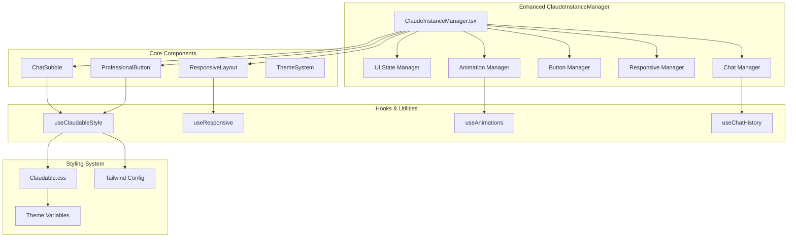

# SPARC UI Modernization - Architecture Phase

## A - Architecture Design for UI Modernization

### 1. System Architecture Overview



### 2. Component Architecture

#### 2.1 Enhanced ClaudeInstanceManager Structure

```typescript
// Architecture: Layered component design with separation of concerns
interface ClaudeInstanceManagerArchitecture {
  // Layer 1: Presentation Layer (UI Components)
  presentation: {
    ClaudeInstanceManager: MainComponent,
    ChatInterface: ChatInterfaceComponent, 
    ButtonSystem: ButtonSystemComponent,
    InstanceList: InstanceListComponent,
    StatusHeader: StatusHeaderComponent
  };
  
  // Layer 2: Business Logic Layer (Managers)
  businessLogic: {
    UIStateManager: StateManagementSystem,
    ChatManager: MessageHandlingSystem,
    ButtonManager: ButtonStateSystem,
    ResponsiveManager: LayoutManagementSystem,
    AnimationManager: AnimationOrchestrationSystem
  };
  
  // Layer 3: Integration Layer (Hooks & Adapters)
  integration: {
    ClaudableStyleHook: StyleIntegrationHook,
    ResponsiveHook: ResponsiveDesignHook,
    AnimationHook: AnimationSystemHook,
    ChatHistoryHook: MessagePersistenceHook
  };
  
  // Layer 4: Infrastructure Layer (Utilities & Services)
  infrastructure: {
    ThemeProvider: ThemeManagementService,
    AnimationService: AnimationExecutionService,
    ResponsiveService: BreakpointManagementService,
    MessageProcessor: MessageFormattingService
  };
}
```

#### 2.2 Chat Interface Component Architecture

```typescript
interface ChatInterfaceArchitecture {
  container: {
    className: "chat-interface-container",
    layout: "flex-column",
    height: "100%"
  };
  
  components: {
    // Chat Messages Area
    messagesArea: {
      component: "ChatMessagesArea",
      features: ["virtualization", "auto-scroll", "message-grouping"],
      styling: "chat-messages-container"
    };
    
    // Individual Message Bubbles
    messageBubble: {
      component: "ChatBubble",
      variants: ["user", "claude", "system"],
      features: ["timestamp", "status-indicator", "rich-content"]
    };
    
    // Input Area
    inputArea: {
      component: "ChatInputArea", 
      features: ["command-input", "send-button", "keyboard-shortcuts"],
      styling: "chat-input-container"
    };
  };
  
  stateManagement: {
    messages: "Map<instanceId, Message[]>",
    visibleMessages: "Message[]",
    scrollPosition: "number",
    inputValue: "string",
    isTyping: "boolean"
  };
}
```

#### 2.3 Professional Button System Architecture

```typescript
interface ButtonSystemArchitecture {
  hierarchy: {
    primary: {
      component: "PrimaryButton",
      usage: "Main actions (prod/claude)",
      styling: "btn-primary",
      states: ["normal", "hover", "active", "disabled", "loading"]
    };
    
    secondary: {
      component: "SecondaryButton", 
      usage: "Secondary actions (skip-permissions)",
      styling: "btn-secondary",
      states: ["normal", "hover", "active", "disabled", "loading"]
    };
    
    tertiary: {
      component: "TertiaryButton",
      usage: "Utility actions (terminate, select)",
      styling: "btn-tertiary", 
      states: ["normal", "hover", "active", "disabled"]
    };
  };
  
  stateManagement: {
    buttonStates: "Map<buttonId, ButtonState>",
    loadingStates: "Set<buttonId>", 
    disabledStates: "Set<buttonId>",
    animationQueue: "AnimationStep[]"
  };
  
  animations: {
    stateTransitions: "300ms cubic-bezier(0.4, 0, 0.2, 1)",
    loadingSpinner: "infinite 1s linear",
    hoverEffects: "200ms ease-out"
  };
}
```

### 3. Integration Architecture

#### 3.1 Backward Compatibility Layer

```typescript
interface BackwardCompatibilityArchitecture {
  // Wrapper that preserves existing API while adding new features
  compatibilityWrapper: {
    // Preserve existing props interface
    existingProps: ClaudeInstanceManagerProps,
    
    // Internal enhancement props
    enhancementProps: {
      chatMode?: boolean,
      animationsEnabled?: boolean,
      theme?: 'claudable' | 'classic'
    },
    
    // State mapping between old and new systems
    stateMapping: {
      instances: "instances", // Direct mapping
      selectedInstance: "selectedInstance", // Direct mapping
      output: "messages", // Transform to message format
      input: "currentInput", // Direct mapping
      loading: "buttonStates.loading", // Transform to button state
      error: "systemMessages.error" // Transform to system message
    }
  };
  
  // Event handler preservation
  eventMapping: {
    "instances:fetch": "onInstancesUpdate",
    "instance:create": "onInstanceCreate", 
    "instance:select": "onInstanceSelect",
    "terminal:output": "onMessageReceive",
    "terminal:input": "onMessageSend"
  };
}
```

#### 3.2 SSE Integration Architecture

```typescript
interface SSEIntegrationArchitecture {
  // Enhanced message processing while preserving existing flow
  messageFlow: {
    // Existing SSE events → Enhanced processing → UI display
    sseEvents: [
      "connect",
      "terminal:output", 
      "instance:status",
      "error"
    ];
    
    processing: {
      messageProcessor: MessageProcessorService,
      messageFormatter: MessageFormatterService,
      messageGrouper: MessageGrouperService,
      displayManager: ChatDisplayManager
    };
    
    uiUpdates: {
      chatBubbleRenderer: ChatBubbleComponent,
      animationTrigger: AnimationManager,
      scrollManager: AutoScrollService,
      stateUpdater: UIStateManager
    };
  };
  
  // Preserve existing useHTTPSSE integration
  hookIntegration: {
    preservedMethods: [
      "connectSSE",
      "startPolling", 
      "disconnectFromInstance",
      "on",
      "off", 
      "emit"
    ];
    
    enhancedMethods: {
      onMessage: "Enhanced with chat bubble rendering",
      onConnect: "Enhanced with UI state updates",
      onError: "Enhanced with system message display"
    };
  };
}
```

### 4. Styling Architecture

#### 4.1 Claudable Theme System

```css
/* CSS Architecture: Layered theming with CSS custom properties */

/* Layer 1: Base Theme Variables */
:root {
  /* Claudable Color Palette */
  --claudable-primary: rgba(139, 92, 246, 0.8);
  --claudable-secondary: rgba(236, 72, 153, 0.8);
  --claudable-accent: rgba(59, 130, 246, 0.8);
  
  /* Semantic Color Mappings */
  --color-user-bubble: var(--claudable-primary);
  --color-claude-bubble: var(--claudable-secondary);
  --color-system-message: var(--claudable-accent);
  
  /* Component-specific Variables */
  --button-primary-bg: linear-gradient(135deg, var(--claudable-primary) 0%, var(--claudable-accent) 100%);
  --button-secondary-bg: linear-gradient(135deg, var(--claudable-secondary) 0%, var(--claudable-primary) 100%);
  
  /* Animation Variables */
  --animation-speed-fast: 200ms;
  --animation-speed-normal: 300ms; 
  --animation-speed-slow: 500ms;
  --animation-easing: cubic-bezier(0.4, 0, 0.2, 1);
}

/* Layer 2: Component Base Styles */
.chat-interface-container {
  display: flex;
  flex-direction: column;
  height: 100%;
  background: linear-gradient(135deg, #f8fafc 0%, #e2e8f0 100%);
  font-family: -apple-system, BlinkMacSystemFont, 'SF Pro Display', system-ui;
}

.chat-bubble {
  max-width: 75%;
  padding: 1rem 1.25rem;
  border-radius: 1.25rem;
  margin-bottom: 0.75rem;
  position: relative;
  animation: slideInUp var(--animation-speed-normal) var(--animation-easing);
}

/* Layer 3: Variant Styles */
.chat-bubble--user {
  background: var(--color-user-bubble);
  color: white;
  margin-left: auto;
  border-bottom-right-radius: 0.5rem;
}

.chat-bubble--claude {
  background: var(--color-claude-bubble);
  color: white;
  margin-right: auto;
  border-bottom-left-radius: 0.5rem;
}

.chat-bubble--system {
  background: rgba(107, 114, 128, 0.1);
  color: var(--color-system-message);
  margin: 0 auto;
  text-align: center;
  font-size: 0.875rem;
}
```

#### 4.2 Button System Styling Architecture

```css
/* Professional Button System with State Management */

.btn {
  /* Base button styles */
  display: inline-flex;
  align-items: center;
  gap: 0.5rem;
  padding: 0.75rem 1.5rem;
  border: none;
  border-radius: 0.75rem;
  font-weight: 600;
  font-size: 1rem;
  cursor: pointer;
  transition: all var(--animation-speed-normal) var(--animation-easing);
  position: relative;
  overflow: hidden;
  
  /* Touch targets (accessibility) */
  min-height: 48px;
  min-width: 48px;
}

.btn--primary {
  background: var(--button-primary-bg);
  color: white;
  box-shadow: 0 4px 14px 0 rgba(139, 92, 246, 0.3);
}

.btn--primary:hover:not(:disabled) {
  transform: translateY(-2px);
  box-shadow: 0 8px 25px 0 rgba(139, 92, 246, 0.4);
}

.btn--primary:active {
  transform: translateY(0);
  box-shadow: 0 2px 8px 0 rgba(139, 92, 246, 0.3);
}

.btn--loading {
  pointer-events: none;
}

.btn--loading::after {
  content: '';
  position: absolute;
  width: 16px;
  height: 16px;
  border: 2px solid rgba(255, 255, 255, 0.3);
  border-top: 2px solid white;
  border-radius: 50%;
  animation: spin 1s linear infinite;
}

@keyframes spin {
  to { transform: rotate(360deg); }
}
```

### 5. Responsive Architecture

#### 5.1 Breakpoint System

```typescript
interface ResponsiveArchitecture {
  breakpoints: {
    mobile: "0px - 640px",
    tablet: "641px - 1024px", 
    desktop: "1025px - 1440px",
    wide: "1441px+"
  };
  
  layouts: {
    mobile: {
      instancesGrid: "1fr", // Single column
      navigation: "bottom-tabs",
      chatBubbleWidth: "85%",
      buttonSize: "large"
    };
    
    tablet: {
      instancesGrid: "300px 1fr", // Sidebar + main
      navigation: "sidebar",
      chatBubbleWidth: "75%", 
      buttonSize: "medium"
    };
    
    desktop: {
      instancesGrid: "350px 1fr", // Wider sidebar + main
      navigation: "sidebar",
      chatBubbleWidth: "65%",
      buttonSize: "medium"
    };
  };
  
  adaptations: {
    touchTargets: "Minimum 48x48px on mobile",
    textScaling: "Responsive font sizes with clamp()",
    spacing: "Proportional spacing system",
    interactions: "Touch vs mouse optimizations"
  };
}
```

### 6. Animation Architecture

#### 6.1 Animation System Design

```typescript
interface AnimationArchitecture {
  animationTypes: {
    entrance: {
      slideInUp: "Message bubbles appearing",
      fadeIn: "Content appearing", 
      scaleIn: "Buttons activating"
    };
    
    transition: {
      slideTransition: "Layout changes",
      morphTransition: "State changes",
      colorTransition: "Theme changes"
    };
    
    interaction: {
      buttonHover: "Button state feedback",
      bubbleHover: "Message interaction",
      scrollAnimation: "Smooth scrolling"
    };
  };
  
  choreography: {
    messageSequence: [
      "Bubble slides in (300ms)",
      "Content fades in (200ms, delay 100ms)",
      "Timestamp appears (150ms, delay 200ms)"
    ];
    
    layoutTransition: [
      "Measure current positions",
      "Apply new layout", 
      "Animate to new positions (300ms)",
      "Update interaction states"
    ];
  };
  
  performance: {
    useTransforms: "For smooth animations",
    useWillChange: "For complex sequences",
    useRAF: "For scroll-based animations",
    useDeferredUpdates: "For non-critical updates"
  };
}
```

### 7. Testing Architecture

#### 7.1 Component Testing Strategy

```typescript
interface TestingArchitecture {
  unitTests: {
    components: [
      "ChatBubble rendering and variants",
      "ProfessionalButton states and interactions", 
      "ResponsiveLayout breakpoint handling",
      "MessageProcessor formatting and grouping"
    ];
    
    hooks: [
      "useClaudableStyle theme switching",
      "useResponsive breakpoint detection",
      "useAnimations sequence execution", 
      "useChatHistory message management"
    ];
  };
  
  integrationTests: {
    workflows: [
      "Complete message flow from SSE to display",
      "Button interaction triggering instance creation",
      "Layout adaptation on screen size change",
      "Animation sequences during state transitions"
    ];
    
    compatibility: [
      "Existing prop interfaces preserved",
      "SSE event handling unchanged",
      "State management backward compatibility",
      "Error handling preservation"
    ];
  };
  
  e2eTests: {
    userJourneys: [
      "Launch instance → Chat interaction → Instance management",
      "Responsive design across device sizes",
      "Animation performance under load",
      "Error scenarios and recovery"
    ];
  };
}
```

### 8. Performance Architecture

#### 8.1 Optimization Strategy

```typescript
interface PerformanceArchitecture {
  rendering: {
    virtualization: "For large message histories",
    memoization: "For expensive component renders",
    debouncing: "For frequent state updates",
    throttling: "For scroll and resize events"
  };
  
  animations: {
    gpuAcceleration: "Use transform3d for smooth animations",
    compositingHints: "will-change for complex sequences",
    frameRateBudget: "Target 60fps for all interactions",
    animationCleanup: "Proper cleanup after completion"
  };
  
  bundleOptimization: {
    codesplitting: "Lazy load animation features",
    treeshaking: "Remove unused CSS and JS",
    compression: "Optimize CSS custom properties",
    caching: "Efficient CSS-in-JS caching"
  };
  
  memoryManagement: {
    messageHistory: "Efficient data structures",
    eventListeners: "Proper cleanup on unmount", 
    animationFrames: "Cancel unused RAF calls",
    domReferences: "Weak references where appropriate"
  };
}
```

This architecture provides a comprehensive blueprint for transforming the Claude Instance Manager into a modern, chat-style interface while maintaining complete backward compatibility and preserving all existing functionality. The design emphasizes separation of concerns, performance, and maintainability.