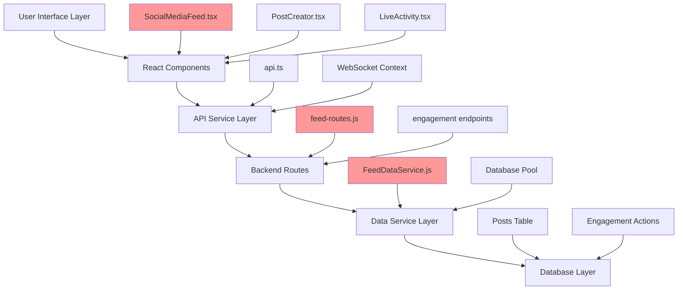
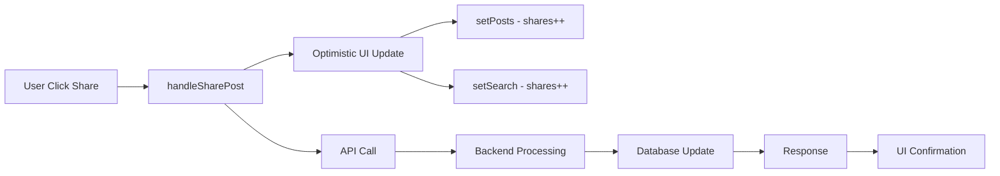
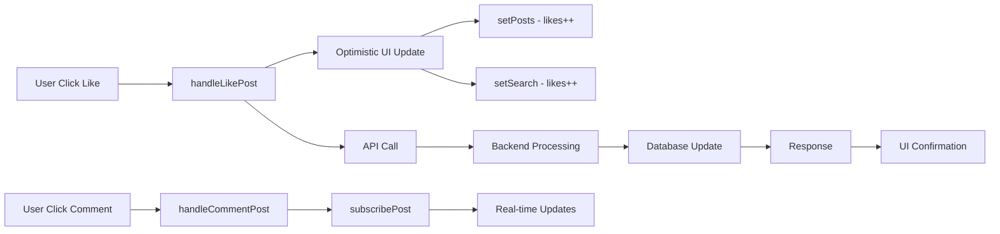
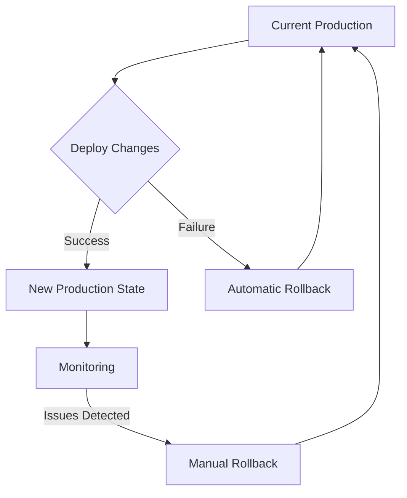

# SPARC ARCHITECTURE: Component Modification Plan

## System Architecture for Sharing Functionality Removal

### Architecture Overview



### Component Interaction Analysis

#### Current Architecture with Sharing
```
┌─────────────────┐    ┌──────────────────┐    ┌─────────────────┐
│  UI Component   │    │   API Service    │    │  Backend Route  │
│                 │    │                  │    │                 │
│ handleSharePost │───▶│ updatePostEng..  │───▶│ validate:share  │
│ Share2 Icon     │    │                  │    │                 │  
│ shares count    │    │                  │    │                 │
└─────────────────┘    └──────────────────┘    └─────────────────┘
         │                       │                       │
         ▼                       ▼                       ▼
┌─────────────────┐    ┌──────────────────┐    ┌─────────────────┐
│   React State   │    │  HTTP Request    │    │ Database Query  │
│                 │    │                  │    │                 │
│ post.shares++   │    │ POST /api/eng..  │    │ INSERT action:  │
│ optimistic UI   │    │                  │    │      share      │
└─────────────────┘    └──────────────────┘    └─────────────────┘
```

#### Target Architecture without Sharing
```
┌─────────────────┐    ┌──────────────────┐    ┌─────────────────┐
│  UI Component   │    │   API Service    │    │  Backend Route  │
│                 │    │                  │    │                 │
│ handleLikePost  │───▶│ updatePostEng..  │───▶│ validate:like   │
│ Heart Icon      │    │                  │    │ validate:comment│  
│ likes count     │    │                  │    │                 │
│ handleComment   │    │                  │    │                 │
└─────────────────┘    └──────────────────┘    └─────────────────┘
         │                       │                       │
         ▼                       ▼                       ▼
┌─────────────────┐    ┌──────────────────┐    ┌─────────────────┐
│   React State   │    │  HTTP Request    │    │ Database Query  │
│                 │    │                  │    │                 │
│ post.likes++    │    │ POST /api/eng..  │    │ INSERT action:  │
│ post.comments++ │    │                  │    │   like/comment  │
└─────────────────┘    └──────────────────┘    └─────────────────┘
```

### Detailed Component Modifications

#### 1. Frontend Component Architecture

**File**: `/workspaces/agent-feed/frontend/src/components/SocialMediaFeed.tsx`

**Current Structure**:
```typescript
┌─────────────────────────────────────┐
│           SocialMediaFeed           │
├─────────────────────────────────────┤
│ Imports:                            │
│ ├─ Share2 (Lucide React)           │
│ ├─ Other icons                      │
│                                     │
│ Interfaces:                         │
│ ├─ AgentPost { shares?: number }   │
│                                     │
│ State Management:                   │
│ ├─ posts: AgentPost[]              │
│ ├─ search.results: AgentPost[]     │
│                                     │
│ Event Handlers:                     │
│ ├─ handleLikePost()                │
│ ├─ handleCommentPost()             │
│ ├─ handleSharePost() ◄─── REMOVE   │
│                                     │
│ Render:                             │
│ ├─ Like Button                     │
│ ├─ Comment Button                  │
│ ├─ Share Button ◄─── REMOVE        │
└─────────────────────────────────────┘
```

**Target Structure**:
```typescript
┌─────────────────────────────────────┐
│           SocialMediaFeed           │
├─────────────────────────────────────┤
│ Imports:                            │
│ ├─ Heart, MessageCircle            │
│ ├─ Other icons (no Share2)         │
│                                     │
│ Interfaces:                         │
│ ├─ AgentPost { likes?, comments? } │
│                                     │
│ State Management:                   │
│ ├─ posts: AgentPost[]              │
│ ├─ search.results: AgentPost[]     │
│                                     │
│ Event Handlers:                     │
│ ├─ handleLikePost()                │
│ ├─ handleCommentPost()             │
│                                     │
│ Render:                             │
│ ├─ Like Button                     │
│ ├─ Comment Button                  │
└─────────────────────────────────────┘
```

#### 2. API Service Layer Architecture

**File**: `/workspaces/agent-feed/frontend/src/services/api.ts`

**Modification Plan**:
```typescript
// Current updatePostEngagement method
async updatePostEngagement(postId: string, action: 'like' | 'unlike' | 'comment' | 'share')

// Target updatePostEngagement method  
async updatePostEngagement(postId: string, action: 'like' | 'unlike' | 'comment')
```

**Impact Assessment**:
- Remove 'share' from union type
- Maintain existing error handling
- Preserve other engagement types
- No change to HTTP request structure

#### 3. Backend Route Architecture

**File**: `/workspaces/agent-feed/src/routes/api/feed-routes.js`

**Current Validation Logic**:
```javascript
┌─────────────────────────────────────┐
│        Engagement Validation        │
├─────────────────────────────────────┤
│ validActions = [                    │
│   'like',                           │
│   'unlike',                         │  
│   'comment',                        │
│   'share'  ◄─── REMOVE             │
│ ]                                   │
│                                     │
│ Request Processing:                 │
│ ├─ Validate action in validActions │
│ ├─ Call data service               │
│ ├─ Return response                 │
└─────────────────────────────────────┘
```

**Target Validation Logic**:
```javascript
┌─────────────────────────────────────┐
│        Engagement Validation        │
├─────────────────────────────────────┤
│ validActions = [                    │
│   'like',                           │
│   'unlike',                         │
│   'comment'                         │
│ ]                                   │
│                                     │
│ Request Processing:                 │
│ ├─ Validate action in validActions │
│ ├─ Call data service               │
│ ├─ Return response                 │
└─────────────────────────────────────┘
```

#### 4. Data Service Layer Architecture

**File**: `/workspaces/agent-feed/src/services/FeedDataService.js`

**Current Query Structure**:
```sql
SELECT 
  fi.id,
  fi.title,
  fi.content,
  -- Other fields...
  (SELECT COUNT(*) FROM action_responses ar 
   WHERE ar.feed_item_id = fi.id AND ar.action_id = 'like') as likes,
  (SELECT COUNT(*) FROM action_responses ar 
   WHERE ar.feed_item_id = fi.id AND ar.action_id = 'comment') as comments,
  (SELECT COUNT(*) FROM action_responses ar 
   WHERE ar.feed_item_id = fi.id AND ar.action_id = 'share') as shares  -- REMOVE
FROM feed_items fi
```

**Target Query Structure**:
```sql
SELECT 
  fi.id,
  fi.title, 
  fi.content,
  -- Other fields...
  (SELECT COUNT(*) FROM action_responses ar 
   WHERE ar.feed_item_id = fi.id AND ar.action_id = 'like') as likes,
  (SELECT COUNT(*) FROM action_responses ar 
   WHERE ar.feed_item_id = fi.id AND ar.action_id = 'comment') as comments
FROM feed_items fi
```

### Database Schema Impact

#### Current Schema
```sql
┌─────────────────────────────────────┐
│         action_responses            │
├─────────────────────────────────────┤
│ id (Primary Key)                    │
│ feed_item_id (Foreign Key)          │
│ action_id (Enum)                    │
│   ├─ 'like'                        │
│   ├─ 'unlike'                      │
│   ├─ 'comment'                     │
│   ├─ 'share'  ◄─── REMOVE         │
│ user_id                             │  
│ created_at                          │
└─────────────────────────────────────┘
```

#### Target Schema
```sql
┌─────────────────────────────────────┐
│         action_responses            │
├─────────────────────────────────────┤
│ id (Primary Key)                    │
│ feed_item_id (Foreign Key)          │
│ action_id (Enum)                    │
│   ├─ 'like'                        │
│   ├─ 'unlike'                      │
│   ├─ 'comment'                     │
│ user_id                             │
│ created_at                          │
└─────────────────────────────────────┘
```

**Note**: Existing 'share' records can remain in database for historical purposes, but new shares won't be created.

### State Management Architecture

#### Current React State Flow


#### Target React State Flow  


### Error Handling Architecture

#### Current Error Boundaries
```typescript
┌─────────────────────────────────────┐
│         Error Handling              │
├─────────────────────────────────────┤
│ handleLikePost:                     │
│ ├─ Try/Catch Block                 │
│ ├─ Rollback on Failure            │
│                                     │
│ handleSharePost: ◄─── REMOVE       │
│ ├─ Try/Catch Block                 │
│ ├─ Rollback on Failure            │
│                                     │
│ handleCommentPost:                  │
│ ├─ Try/Catch Block                 │
│ ├─ Rollback on Failure            │
└─────────────────────────────────────┘
```

#### Target Error Boundaries
```typescript
┌─────────────────────────────────────┐
│         Error Handling              │
├─────────────────────────────────────┤
│ handleLikePost:                     │
│ ├─ Try/Catch Block                 │
│ ├─ Rollback on Failure            │
│                                     │
│ handleCommentPost:                  │
│ ├─ Try/Catch Block                 │
│ ├─ Rollback on Failure            │
└─────────────────────────────────────┘
```

### Real-time Updates Architecture

#### WebSocket Event Handling
```typescript
// Current Events
on('post:created', handlePostCreated);
on('post:updated', handlePostUpdated); 
on('post:deleted', handlePostDeleted);
on('like:updated', handleLikeUpdated);
on('comment:created', handleCommentCreated);
on('share:created', handleShareCreated);  // ◄─── REMOVE

// Target Events  
on('post:created', handlePostCreated);
on('post:updated', handlePostUpdated);
on('post:deleted', handlePostDeleted);
on('like:updated', handleLikeUpdated);
on('comment:created', handleCommentCreated);
```

### Performance Optimization Architecture

#### Bundle Size Impact
```
Current Bundle:
├─ lucide-react imports: Share2, Heart, MessageCircle, ...
├─ Component size: ~950 lines
├─ State complexity: High (likes, comments, shares)

Target Bundle:  
├─ lucide-react imports: Heart, MessageCircle, ...
├─ Component size: ~900 lines (-50 lines)
├─ State complexity: Medium (likes, comments)
```

#### Database Query Performance
```
Current Query Performance:
├─ 3 subqueries per post (likes, comments, shares)
├─ Query complexity: O(n*3) where n = posts

Target Query Performance:
├─ 2 subqueries per post (likes, comments) 
├─ Query complexity: O(n*2) where n = posts
├─ ~33% reduction in query complexity
```

### Testing Architecture

#### Component Testing Structure
```
tests/
├─ unit/
│   ├─ SocialMediaFeed.test.tsx
│   │   ├─ ✓ Like functionality
│   │   ├─ ✓ Comment functionality  
│   │   ├─ ✗ Share functionality (removed)
│   │   ├─ ✓ Search functionality
│   │   └─ ✓ Real-time updates
│   └─ api.test.ts
│       ├─ ✓ Like endpoint
│       ├─ ✓ Comment endpoint
│       └─ ✗ Share endpoint (removed)
├─ integration/
│   ├─ feed-routes.test.js
│   │   ├─ ✓ Valid actions: like, comment
│   │   └─ ✓ Invalid actions: share (rejected)
│   └─ FeedDataService.test.js
│       ├─ ✓ Query returns likes, comments
│       └─ ✓ Query excludes shares
└─ e2e/
    ├─ user-interactions.spec.js
    │   ├─ ✓ Can like posts
    │   ├─ ✓ Can comment on posts
    │   └─ ✗ Cannot share posts
    └─ regression.spec.js
        ├─ ✓ All existing features work
        └─ ✓ No visual regressions
```

### Deployment Architecture

#### Rollback Strategy


#### Feature Flag Architecture (Optional)
```typescript
// Optional: Use feature flags for gradual rollout
const FEATURES = {
  SHARING_ENABLED: false, // Set to false to disable sharing
  LIKES_ENABLED: true,
  COMMENTS_ENABLED: true
};

// Component logic
{FEATURES.SHARING_ENABLED && (
  <ShareButton onClick={handleSharePost} />
)}
```

### Security Considerations

#### API Endpoint Security
```javascript
// Current: Share endpoint accessible
POST /api/v1/posts/:id/engagement
Body: { action: 'share' } ✓ Accepted

// Target: Share endpoint rejected  
POST /api/v1/posts/:id/engagement
Body: { action: 'share' } ✗ 400 Bad Request: Invalid action
```

#### Data Privacy
```
Current Data Collection:
├─ User likes tracked ✓
├─ User comments tracked ✓  
├─ User shares tracked ✓ ◄─── STOP COLLECTING

Target Data Collection:
├─ User likes tracked ✓
├─ User comments tracked ✓
├─ User shares: Historical data preserved, no new collection
```

This architecture plan provides a comprehensive strategy for safely removing sharing functionality while maintaining all other features and ensuring system integrity.