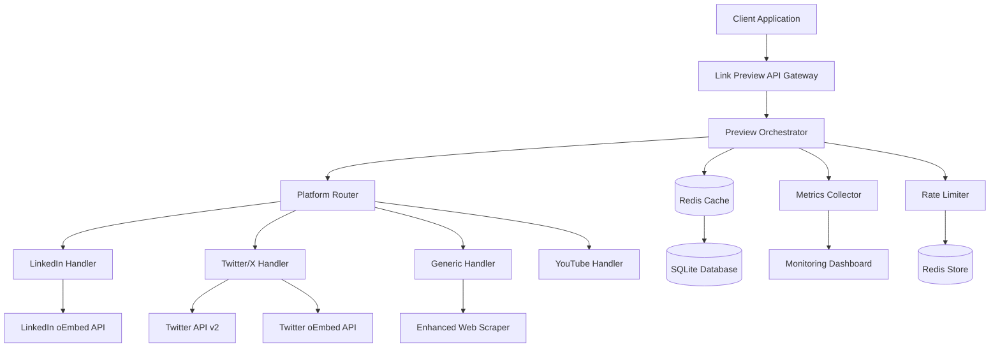
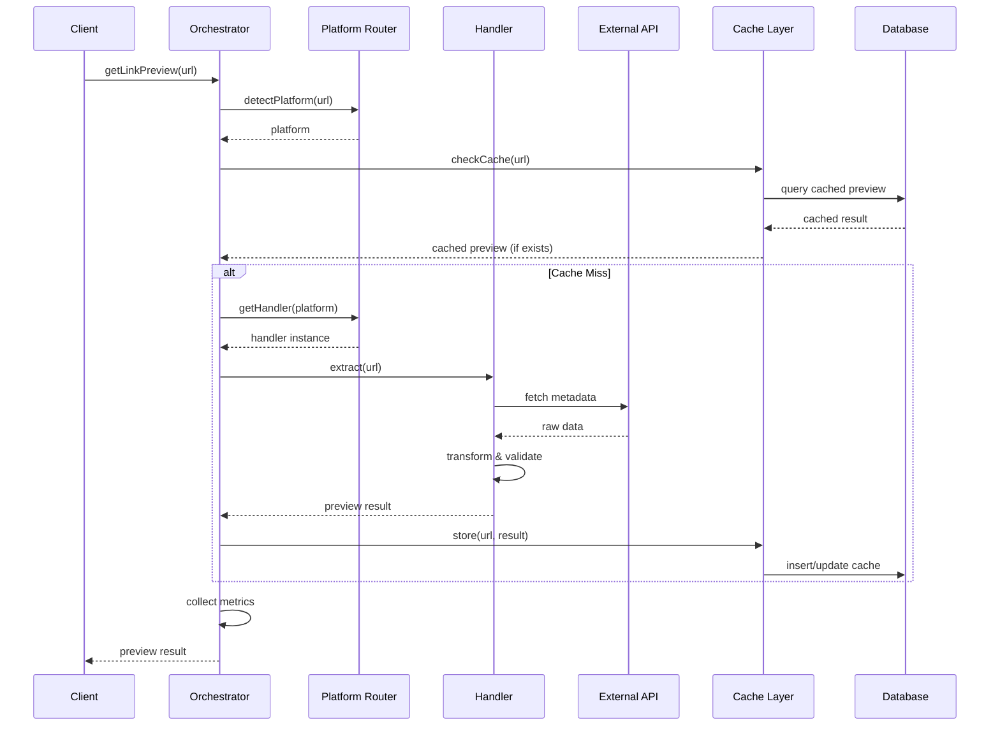
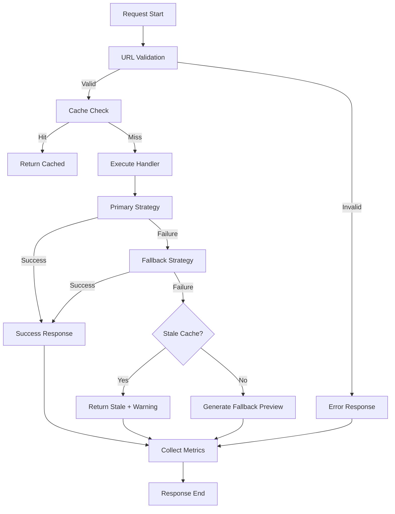

# Enhanced Link Preview System - SPARC Architecture Phase

## 1. SYSTEM ARCHITECTURE OVERVIEW



## 2. COMPONENT ARCHITECTURE

### 2.1 Core Components

#### Preview Orchestrator (Enhanced LinkPreviewService)
```javascript
class EnhancedLinkPreviewService {
  constructor() {
    this.platformRouter = new PlatformRouter();
    this.cacheManager = new CacheManager();
    this.rateLimiter = new RateLimiter();
    this.metricsCollector = new MetricsCollector();
    this.retryManager = new RetryManager();
  }
  
  // Main public interface
  async getLinkPreview(url: string): Promise<PreviewResult>
  async getLinkPreviews(urls: string[]): Promise<PreviewResult[]>
  async invalidateCache(url: string): Promise<boolean>
  
  // Internal orchestration methods
  private async executePreviewPipeline(url: string): Promise<PreviewResult>
  private async selectOptimalStrategy(url: string): Promise<HandlerStrategy>
}
```

#### Platform Router
```javascript
class PlatformRouter {
  private handlers: Map<Platform, BaseHandler> = new Map();
  
  constructor() {
    this.handlers.set(Platform.LINKEDIN, new LinkedInHandler());
    this.handlers.set(Platform.TWITTER, new TwitterXHandler());
    this.handlers.set(Platform.X, new TwitterXHandler());
    this.handlers.set(Platform.YOUTUBE, new YouTubeHandler());
    this.handlers.set(Platform.GENERIC, new GenericHandler());
  }
  
  detectPlatform(url: string): Platform
  getHandler(platform: Platform): BaseHandler
  registerCustomHandler(platform: Platform, handler: BaseHandler): void
}
```

### 2.2 Handler Hierarchy

```javascript
abstract class BaseHandler {
  abstract platform: Platform;
  abstract priority: number;
  
  // Template method pattern
  async extract(url: string): Promise<PreviewResult> {
    const validated = await this.validateUrl(url);
    const cached = await this.checkCache(validated);
    if (cached) return cached;
    
    const result = await this.performExtraction(validated);
    await this.cacheResult(validated, result);
    return result;
  }
  
  protected abstract validateUrl(url: string): Promise<string>;
  protected abstract performExtraction(url: string): Promise<PreviewResult>;
  protected abstract getCacheStrategy(): CacheStrategy;
}

class LinkedInHandler extends BaseHandler {
  platform = Platform.LINKEDIN;
  priority = 1;
  
  private oembedClient: LinkedInOEmbedClient;
  private scrapingFallback: LinkedInScraper;
  
  protected async performExtraction(url: string): Promise<PreviewResult> {
    // Strategy pattern implementation
    const strategies = [
      () => this.oembedClient.fetch(url),
      () => this.scrapingFallback.scrape(url)
    ];
    
    return await this.executeStrategiesWithFallback(strategies);
  }
}
```

## 3. DATA FLOW ARCHITECTURE

### 3.1 Request Processing Pipeline



### 3.2 Error Handling Flow



## 4. INTEGRATION ARCHITECTURE

### 4.1 Cache Integration Strategy

```javascript
interface CacheManager {
  // Multi-tier caching
  memoryCache: LRUCache<string, PreviewResult>;  // L1: In-memory
  redisCache: RedisClient;                       // L2: Redis
  persistentCache: DatabaseCache;                // L3: SQLite
  
  async get(key: string): Promise<PreviewResult | null>;
  async set(key: string, value: PreviewResult, ttl?: number): Promise<void>;
  async invalidate(key: string): Promise<void>;
  async clear(pattern?: string): Promise<void>;
}

class TieredCacheManager implements CacheManager {
  async get(key: string): Promise<PreviewResult | null> {
    // Check L1 cache first
    let result = this.memoryCache.get(key);
    if (result) return result;
    
    // Check L2 cache (Redis)
    result = await this.redisCache.get(key);
    if (result) {
      this.memoryCache.set(key, result);
      return result;
    }
    
    // Check L3 cache (Database)
    result = await this.persistentCache.get(key);
    if (result) {
      await this.redisCache.set(key, result, this.getRedisTTL());
      this.memoryCache.set(key, result);
      return result;
    }
    
    return null;
  }
}
```

### 4.2 Database Schema Evolution

```sql
-- Enhanced link_preview_cache table
CREATE TABLE IF NOT EXISTS link_preview_cache (
  id INTEGER PRIMARY KEY AUTOINCREMENT,
  url TEXT NOT NULL UNIQUE,
  platform TEXT NOT NULL DEFAULT 'generic',
  title TEXT,
  description TEXT,
  image_url TEXT,
  image_width INTEGER,
  image_height INTEGER,
  image_alt TEXT,
  author_name TEXT,
  author_username TEXT,
  author_avatar TEXT,
  author_verified BOOLEAN DEFAULT FALSE,
  content_type TEXT,
  publish_date DATETIME,
  engagement_likes INTEGER,
  engagement_shares INTEGER,
  engagement_comments INTEGER,
  metadata_json TEXT, -- JSON blob for platform-specific data
  cache_ttl INTEGER NOT NULL DEFAULT 3600,
  cached_at DATETIME DEFAULT CURRENT_TIMESTAMP,
  last_accessed DATETIME DEFAULT CURRENT_TIMESTAMP,
  access_count INTEGER DEFAULT 1,
  is_stale BOOLEAN DEFAULT FALSE,
  fetch_time_ms INTEGER,
  cache_hit BOOLEAN DEFAULT FALSE,
  fallback_used BOOLEAN DEFAULT FALSE,
  error_message TEXT,
  
  -- Indexes for performance
  INDEX idx_url_platform (url, platform),
  INDEX idx_cached_at (cached_at),
  INDEX idx_platform_content_type (platform, content_type),
  INDEX idx_stale_cleanup (is_stale, cached_at)
);

-- Performance metrics table
CREATE TABLE IF NOT EXISTS preview_metrics (
  id INTEGER PRIMARY KEY AUTOINCREMENT,
  platform TEXT NOT NULL,
  operation TEXT NOT NULL, -- 'fetch', 'cache_hit', 'fallback', etc.
  response_time_ms INTEGER,
  success BOOLEAN,
  error_type TEXT,
  timestamp DATETIME DEFAULT CURRENT_TIMESTAMP,
  
  INDEX idx_platform_timestamp (platform, timestamp),
  INDEX idx_operation_success (operation, success)
);

-- Rate limiting tracking
CREATE TABLE IF NOT EXISTS rate_limits (
  id INTEGER PRIMARY KEY AUTOINCREMENT,
  platform TEXT NOT NULL,
  operation TEXT NOT NULL,
  window_start DATETIME NOT NULL,
  request_count INTEGER DEFAULT 1,
  limit_exceeded BOOLEAN DEFAULT FALSE,
  
  UNIQUE(platform, operation, window_start),
  INDEX idx_window_cleanup (window_start)
);
```

## 5. TESTING ARCHITECTURE

### 5.1 Test Structure Hierarchy

```
tests/
├── unit/
│   ├── handlers/
│   │   ├── LinkedInHandler.test.js
│   │   ├── TwitterXHandler.test.js
│   │   ├── GenericHandler.test.js
│   │   └── BaseHandler.test.js
│   ├── services/
│   │   ├── EnhancedLinkPreviewService.test.js
│   │   ├── CacheManager.test.js
│   │   ├── PlatformRouter.test.js
│   │   └── RateLimiter.test.js
│   └── utils/
│       ├── UrlValidator.test.js
│       ├── MetadataExtractor.test.js
│       └── ImageOptimizer.test.js
├── integration/
│   ├── api-endpoints/
│   │   ├── linkedin-integration.test.js
│   │   ├── twitter-integration.test.js
│   │   └── fallback-scenarios.test.js
│   ├── cache-strategies/
│   │   ├── multi-tier-cache.test.js
│   │   └── cache-invalidation.test.js
│   └── performance/
│       ├── concurrent-requests.test.js
│       ├── rate-limiting.test.js
│       └── memory-usage.test.js
└── e2e/
    ├── real-world-urls.test.js
    ├── error-scenarios.test.js
    └── performance-benchmarks.test.js
```

### 5.2 Testing Strategy Implementation

```javascript
// Example comprehensive test suite structure
describe('EnhancedLinkPreviewService', () => {
  describe('Platform Detection', () => {
    test('correctly identifies LinkedIn URLs', async () => {
      const testCases = [
        'https://www.linkedin.com/posts/username_post-id',
        'https://linkedin.com/in/profile-name',
        'https://www.linkedin.com/company/company-name'
      ];
      // Test implementation
    });
  });
  
  describe('Cache Strategies', () => {
    test('implements correct TTL for different platforms', async () => {
      // Test cache TTL logic
    });
    
    test('handles cache invalidation gracefully', async () => {
      // Test invalidation scenarios
    });
  });
  
  describe('Error Handling', () => {
    test('gracefully degrades when API is unavailable', async () => {
      // Mock API failures and test fallbacks
    });
    
    test('respects rate limits and implements backoff', async () => {
      // Test rate limiting behavior
    });
  });
  
  describe('Performance', () => {
    test('handles concurrent requests efficiently', async () => {
      // Load testing with multiple simultaneous requests
    });
    
    test('meets response time requirements', async () => {
      // Performance benchmarking
    });
  });
});
```

## 6. MONITORING & OBSERVABILITY ARCHITECTURE

### 6.1 Metrics Collection

```javascript
class MetricsCollector {
  private counters: Map<string, number> = new Map();
  private histograms: Map<string, number[]> = new Map();
  private gauges: Map<string, number> = new Map();
  
  // Platform-specific metrics
  recordPreviewFetch(platform: Platform, responseTime: number, success: boolean) {
    this.incrementCounter(`preview.fetch.${platform}.total`);
    this.incrementCounter(`preview.fetch.${platform}.${success ? 'success' : 'failure'}`);
    this.recordHistogram(`preview.response_time.${platform}`, responseTime);
  }
  
  recordCacheHit(platform: Platform, cacheLayer: 'memory' | 'redis' | 'database') {
    this.incrementCounter(`cache.hit.${platform}.${cacheLayer}`);
  }
  
  recordRateLimitHit(platform: Platform) {
    this.incrementCounter(`rate_limit.hit.${platform}`);
  }
  
  // System health metrics
  updateActiveConnections(count: number) {
    this.setGauge('system.connections.active', count);
  }
  
  updateMemoryUsage(bytes: number) {
    this.setGauge('system.memory.used_bytes', bytes);
  }
}
```

### 6.2 Logging Strategy

```javascript
interface LoggingStrategy {
  // Structured logging with correlation IDs
  logPreviewRequest(correlationId: string, url: string, platform: Platform): void;
  logCacheOperation(correlationId: string, operation: string, hit: boolean): void;
  logAPICall(correlationId: string, platform: Platform, success: boolean, responseTime: number): void;
  logError(correlationId: string, error: Error, context: Record<string, any>): void;
  logPerformanceMetrics(correlationId: string, metrics: PerformanceMetrics): void;
}

class StructuredLogger implements LoggingStrategy {
  logPreviewRequest(correlationId: string, url: string, platform: Platform): void {
    console.log(JSON.stringify({
      timestamp: new Date().toISOString(),
      level: 'INFO',
      correlationId,
      event: 'preview_request_start',
      url: this.sanitizeUrl(url),
      platform,
      service: 'enhanced-link-preview'
    }));
  }
}
```

## 7. DEPLOYMENT ARCHITECTURE

### 7.1 Environment Configuration

```javascript
// config/environments/production.js
export const productionConfig = {
  cache: {
    redis: {
      host: process.env.REDIS_HOST || 'localhost',
      port: parseInt(process.env.REDIS_PORT || '6379'),
      password: process.env.REDIS_PASSWORD,
      db: parseInt(process.env.REDIS_DB || '0'),
      keyPrefix: 'link-preview:',
      ttl: {
        memory: 5 * 60,      // 5 minutes
        redis: 30 * 60,      // 30 minutes  
        database: 24 * 60 * 60  // 24 hours
      }
    },
    database: {
      path: process.env.DATABASE_PATH || './data/previews.db',
      maxCacheSize: 10000,
      cleanupInterval: 60 * 60 * 1000 // 1 hour
    }
  },
  
  rateLimits: {
    linkedin: { requests: 1000, window: 60 * 60 * 1000 }, // 1000/hour
    twitter: { requests: 300, window: 15 * 60 * 1000 },   // 300/15min
    generic: { requests: 10000, window: 60 * 60 * 1000 }  // 10000/hour
  },
  
  performance: {
    maxConcurrentRequests: 100,
    requestTimeout: 15000,
    retryAttempts: 3,
    backoffMultiplier: 2
  },
  
  monitoring: {
    metricsInterval: 60000, // 1 minute
    healthCheckInterval: 30000 // 30 seconds
  }
};
```

### 7.2 Feature Flags System

```javascript
class FeatureFlags {
  private flags: Map<string, boolean> = new Map();
  
  constructor() {
    this.flags.set('enhanced-linkedin-handler', 
      process.env.FF_ENHANCED_LINKEDIN === 'true');
    this.flags.set('twitter-api-v2', 
      process.env.FF_TWITTER_API_V2 === 'true');
    this.flags.set('concurrent-processing', 
      process.env.FF_CONCURRENT_PROCESSING === 'true');
    this.flags.set('advanced-caching', 
      process.env.FF_ADVANCED_CACHING === 'true');
  }
  
  isEnabled(flag: string): boolean {
    return this.flags.get(flag) ?? false;
  }
  
  // Dynamic flag updates for gradual rollouts
  async updateFlag(flag: string, enabled: boolean): Promise<void> {
    this.flags.set(flag, enabled);
    await this.notifyFlagChange(flag, enabled);
  }
}
```

This architecture provides a comprehensive foundation for building a scalable, maintainable, and high-performance enhanced link preview system with proper separation of concerns, extensive testing capabilities, and robust monitoring.