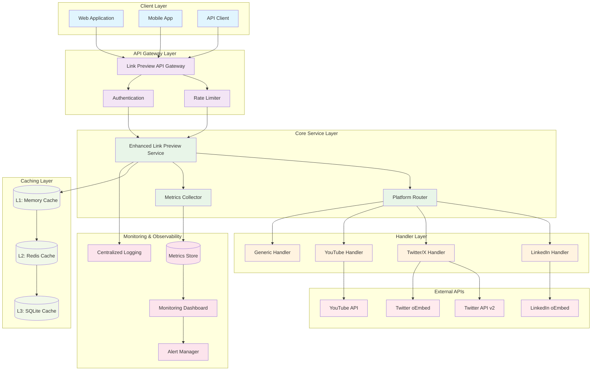
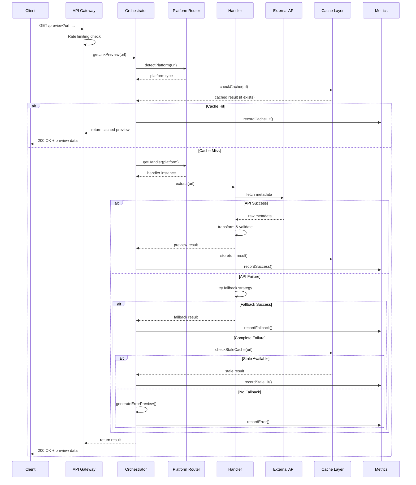
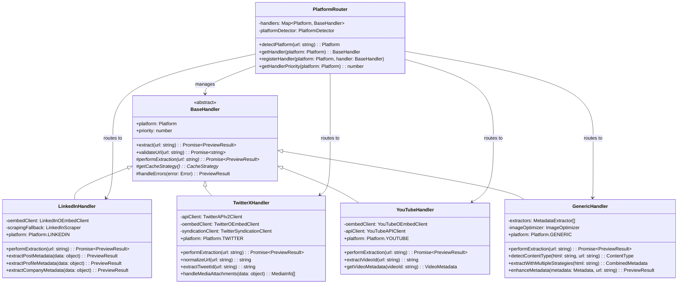
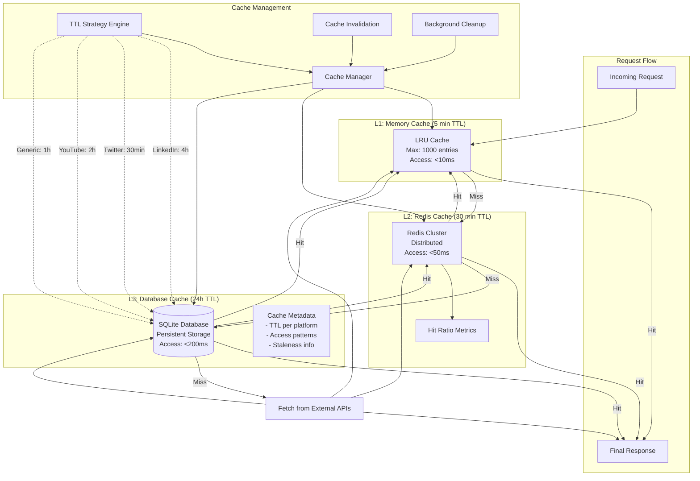
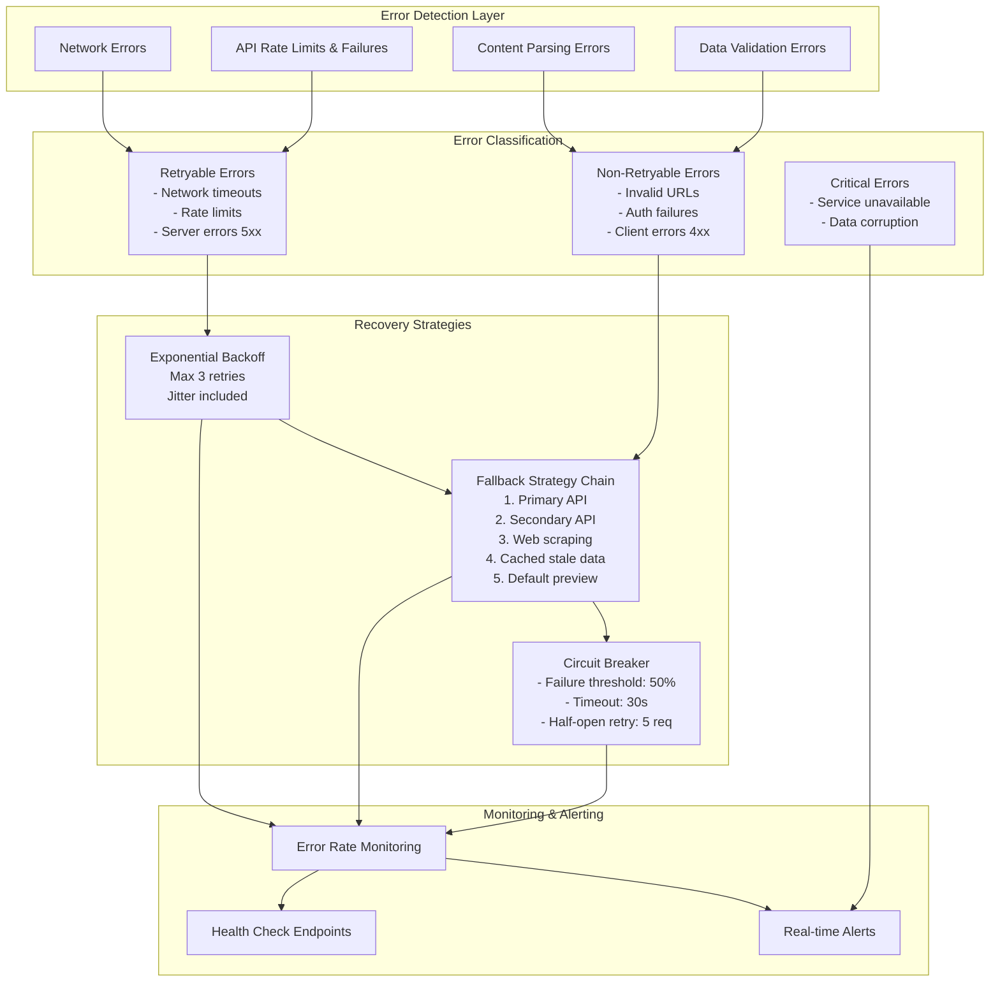
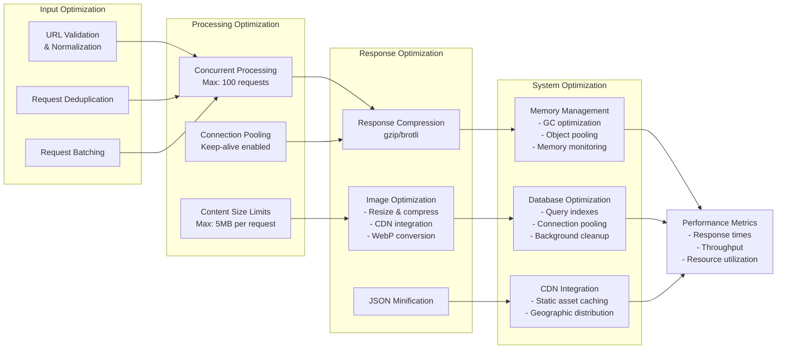
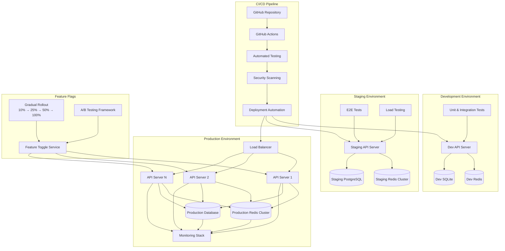
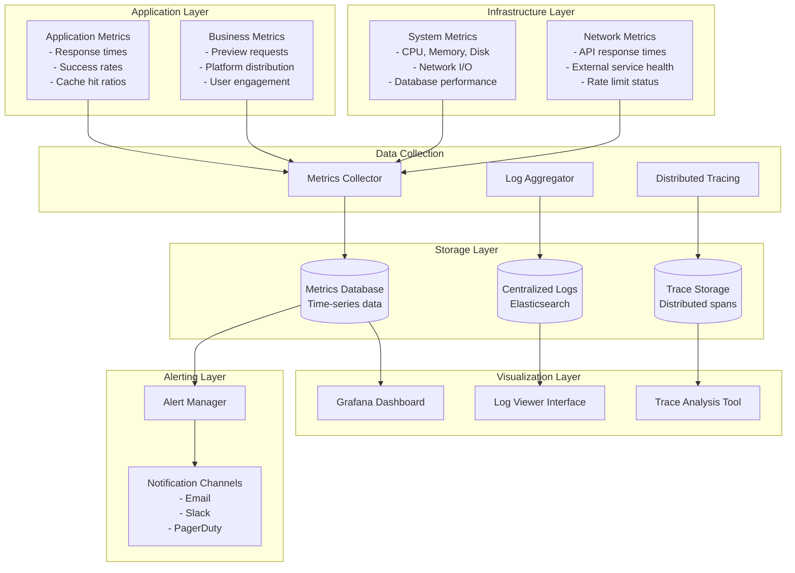

# Enhanced Link Preview System - Architectural Diagrams

## 1. SYSTEM OVERVIEW ARCHITECTURE

## 2. DATA FLOW ARCHITECTURE

## 3. HANDLER HIERARCHY ARCHITECTURE

## 4. CACHING ARCHITECTURE

## 5. ERROR HANDLING & RESILIENCE ARCHITECTURE

## 6. PERFORMANCE OPTIMIZATION ARCHITECTURE

## 7. DEPLOYMENT ARCHITECTURE

## 8. MONITORING & OBSERVABILITY ARCHITECTURE

These architectural diagrams provide a comprehensive visual representation of the enhanced link preview system's design, covering all major components from high-level system architecture to detailed deployment and monitoring strategies.