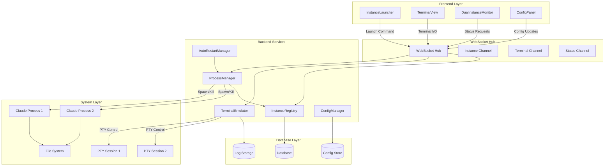
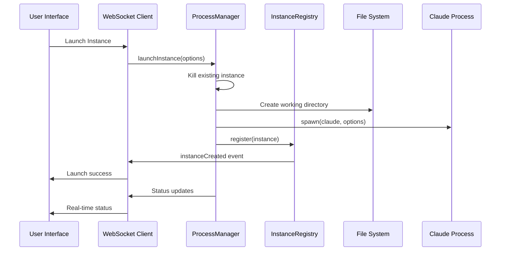
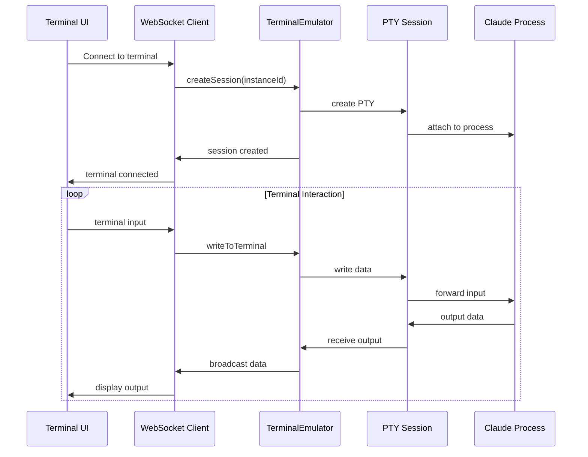
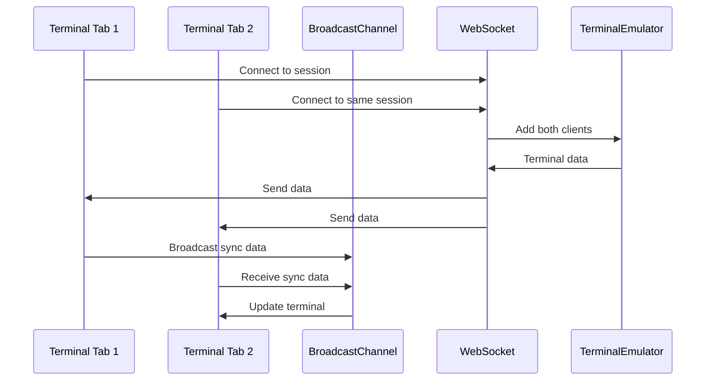

# SPARC Phase 3: Claude Instance Manager Architecture

## 🏗️ System Architecture Overview



## 🏛️ Component Architecture

### 1. ProcessManager Service

```typescript
interface ProcessManager {
  // Core Operations
  launchInstance(options: LaunchOptions): Promise<string>
  killInstance(instanceId: string, graceful?: boolean): Promise<void>
  restartInstance(instanceId: string): Promise<string>
  
  // Process Monitoring
  getInstanceStatus(instanceId: string): InstanceStatus
  listInstances(): Instance[]
  monitorProcess(instanceId: string): ProcessMonitor
  
  // Resource Management
  getResourceUsage(instanceId: string): ResourceMetrics
  setResourceLimits(instanceId: string, limits: ResourceLimits): void
  
  // Event Handling
  on(event: ProcessEvent, callback: EventCallback): void
  emit(event: ProcessEvent, data: any): void
}

interface LaunchOptions {
  type: 'production' | 'development'
  workingDirectory: string
  environment: Record<string, string>
  arguments: string[]
  resourceLimits: ResourceLimits
  autoRestart: AutoRestartConfig
  name?: string
}

interface Instance {
  id: string
  name: string
  type: string
  pid: number
  status: InstanceStatus
  createdAt: Date
  lastSeen: Date
  config: LaunchOptions
  metrics: ResourceMetrics
}
```

### 2. TerminalEmulator Service

```typescript
interface TerminalEmulator {
  // Session Management
  createSession(instanceId: string): Promise<TerminalSession>
  getSession(sessionId: string): TerminalSession | null
  destroySession(sessionId: string): Promise<void>
  
  // Client Management
  addClient(sessionId: string, clientId: string): void
  removeClient(sessionId: string, clientId: string): void
  broadcastToSession(sessionId: string, data: any): void
  
  // Terminal Operations
  writeToTerminal(sessionId: string, data: string): void
  resizeTerminal(sessionId: string, cols: number, rows: number): void
  
  // History Management
  getHistory(sessionId: string, lines?: number): string[]
  clearHistory(sessionId: string): void
}

interface TerminalSession {
  id: string
  instanceId: string
  pty: NodePTY
  clients: Set<string>
  history: CircularBuffer<string>
  size: { cols: number; rows: number }
  lastActivity: Date
  settings: TerminalSettings
}

interface TerminalSettings {
  fontSize: number
  fontFamily: string
  theme: TerminalTheme
  scrollback: number
  cursorBlink: boolean
}
```

### 3. InstanceRegistry Service

```typescript
interface InstanceRegistry {
  // Registration
  register(instance: Instance): Promise<void>
  unregister(instanceId: string): Promise<void>
  update(instanceId: string, updates: Partial<Instance>): Promise<void>
  
  // Queries
  get(instanceId: string): Promise<Instance | null>
  list(filter?: InstanceFilter): Promise<Instance[]>
  findByType(type: string): Promise<Instance[]>
  
  // Health Tracking
  heartbeat(instanceId: string): Promise<void>
  getHealth(instanceId: string): Promise<HealthStatus>
  
  // Events
  subscribe(callback: RegistryEventCallback): string
  unsubscribe(subscriptionId: string): void
}

interface InstanceFilter {
  type?: string
  status?: InstanceStatus
  createdAfter?: Date
  createdBefore?: Date
}

interface HealthStatus {
  status: 'healthy' | 'unhealthy' | 'unknown'
  lastSeen: Date
  checks: HealthCheck[]
  score: number
}
```

### 4. AutoRestartManager Service

```typescript
interface AutoRestartManager {
  // Configuration
  enableAutoRestart(instanceId: string, config: AutoRestartConfig): void
  disableAutoRestart(instanceId: string): void
  updateConfig(instanceId: string, config: Partial<AutoRestartConfig>): void
  
  // Execution
  scheduleRestart(instanceId: string): void
  performRestart(instanceId: string): Promise<string>
  cancelRestart(instanceId: string): void
  
  // Monitoring
  getSchedule(instanceId: string): RestartSchedule | null
  getHistory(instanceId: string): RestartEvent[]
  getStatistics(): RestartStatistics
}

interface AutoRestartConfig {
  enabled: boolean
  intervalHours: number
  maxRestarts: number
  healthCheckEnabled: boolean
  gracefulShutdownTimeout: number
  conditions: RestartCondition[]
}

interface RestartCondition {
  type: 'memory' | 'cpu' | 'uptime' | 'health'
  threshold: number
  duration: number
  action: 'restart' | 'alert' | 'ignore'
}
```

## 🌐 Frontend Architecture

### 1. Component Hierarchy

```typescript
// Main Application Structure
App
├── Router
│   ├── DualInstancePage
│   │   ├── InstanceLauncher
│   │   ├── InstanceList
│   │   └── TerminalView
│   │       ├── TerminalDisplay (xterm.js)
│   │       ├── TerminalControls
│   │       └── ConnectionStatus
│   ├── PerformancePage (existing, updated)
│   └── Other existing routes
└── GlobalComponents
    ├── WebSocketProvider
    ├── NotificationProvider
    └── ErrorBoundary
```

### 2. State Management Architecture

```typescript
// Redux Store Structure
interface AppState {
  instances: InstancesState
  terminals: TerminalsState
  config: ConfigState
  ui: UIState
  websocket: WebSocketState
}

interface InstancesState {
  byId: Record<string, Instance>
  allIds: string[]
  loading: boolean
  error: string | null
  lastFetch: Date | null
}

interface TerminalsState {
  sessions: Record<string, TerminalSession>
  activeSessionId: string | null
  connectionStatus: Record<string, ConnectionStatus>
  syncEnabled: boolean
}

interface ConfigState {
  autoRestart: AutoRestartConfig
  terminal: TerminalSettings
  notifications: NotificationSettings
  theme: ThemeSettings
}
```

### 3. WebSocket Client Architecture

```typescript
class InstanceManagerWebSocket {
  private socket: Socket
  private subscriptions: Map<string, Subscription>
  private reconnectAttempts: number
  private heartbeatInterval: NodeJS.Timeout

  // Connection Management
  connect(): Promise<void>
  disconnect(): void
  reconnect(): Promise<void>
  
  // Channel Management
  subscribeToInstance(instanceId: string): void
  subscribeToTerminal(sessionId: string): void
  subscribeToStatus(): void
  
  // Event Handlers
  onInstanceUpdate(callback: InstanceUpdateCallback): void
  onTerminalData(callback: TerminalDataCallback): void
  onStatusChange(callback: StatusChangeCallback): void
  
  // Commands
  sendLaunchCommand(options: LaunchOptions): Promise<string>
  sendKillCommand(instanceId: string): Promise<void>
  sendTerminalInput(sessionId: string, data: string): void
  sendTerminalResize(sessionId: string, size: TerminalSize): void
}
```

## 🔄 Data Flow Architecture

### 1. Instance Launch Flow



### 2. Terminal Communication Flow



### 3. Multi-Tab Synchronization Flow



## 🗄️ Database Architecture

### 1. Instance Registry Schema

```sql
-- Instances table
CREATE TABLE instances (
    id VARCHAR(255) PRIMARY KEY,
    name VARCHAR(255) NOT NULL,
    type VARCHAR(50) NOT NULL,
    pid INTEGER,
    status VARCHAR(50) NOT NULL,
    created_at TIMESTAMP DEFAULT CURRENT_TIMESTAMP,
    updated_at TIMESTAMP DEFAULT CURRENT_TIMESTAMP,
    last_seen TIMESTAMP,
    config JSON,
    metrics JSON
);

-- Terminal sessions table
CREATE TABLE terminal_sessions (
    id VARCHAR(255) PRIMARY KEY,
    instance_id VARCHAR(255) REFERENCES instances(id) ON DELETE CASCADE,
    created_at TIMESTAMP DEFAULT CURRENT_TIMESTAMP,
    last_activity TIMESTAMP,
    settings JSON,
    client_count INTEGER DEFAULT 0
);

-- Auto-restart configuration
CREATE TABLE auto_restart_config (
    instance_id VARCHAR(255) PRIMARY KEY REFERENCES instances(id) ON DELETE CASCADE,
    enabled BOOLEAN DEFAULT false,
    interval_hours INTEGER,
    max_restarts INTEGER,
    restart_count INTEGER DEFAULT 0,
    config JSON,
    created_at TIMESTAMP DEFAULT CURRENT_TIMESTAMP,
    updated_at TIMESTAMP DEFAULT CURRENT_TIMESTAMP
);

-- Restart history
CREATE TABLE restart_history (
    id SERIAL PRIMARY KEY,
    instance_id VARCHAR(255) REFERENCES instances(id) ON DELETE CASCADE,
    restart_type VARCHAR(50), -- 'scheduled', 'manual', 'crash'
    triggered_at TIMESTAMP DEFAULT CURRENT_TIMESTAMP,
    completed_at TIMESTAMP,
    success BOOLEAN,
    error_message TEXT,
    old_pid INTEGER,
    new_pid INTEGER
);
```

### 2. Logging Schema

```sql
-- Instance logs
CREATE TABLE instance_logs (
    id SERIAL PRIMARY KEY,
    instance_id VARCHAR(255) REFERENCES instances(id) ON DELETE CASCADE,
    level VARCHAR(10) NOT NULL,
    message TEXT NOT NULL,
    timestamp TIMESTAMP DEFAULT CURRENT_TIMESTAMP,
    source VARCHAR(100),
    metadata JSON
);

-- Performance metrics
CREATE TABLE performance_metrics (
    id SERIAL PRIMARY KEY,
    instance_id VARCHAR(255) REFERENCES instances(id) ON DELETE CASCADE,
    cpu_usage DECIMAL(5,2),
    memory_usage BIGINT,
    disk_usage BIGINT,
    network_rx BIGINT,
    network_tx BIGINT,
    timestamp TIMESTAMP DEFAULT CURRENT_TIMESTAMP
);

-- Create indexes for performance
CREATE INDEX idx_instances_status ON instances(status);
CREATE INDEX idx_instances_type ON instances(type);
CREATE INDEX idx_instance_logs_instance_id ON instance_logs(instance_id);
CREATE INDEX idx_instance_logs_timestamp ON instance_logs(timestamp);
CREATE INDEX idx_performance_metrics_instance_id ON performance_metrics(instance_id);
CREATE INDEX idx_performance_metrics_timestamp ON performance_metrics(timestamp);
```

## 🔒 Security Architecture

### 1. Authentication & Authorization

```typescript
interface SecurityManager {
  // Authentication
  authenticateUser(token: string): Promise<User>
  generateApiKey(userId: string, scope: string[]): Promise<string>
  
  // Authorization
  canLaunchInstance(user: User): boolean
  canAccessTerminal(user: User, instanceId: string): boolean
  canKillInstance(user: User, instanceId: string): boolean
  canViewLogs(user: User, instanceId: string): boolean
  
  // Audit
  logAction(user: User, action: string, resource: string): void
  getAuditTrail(filters: AuditFilter): Promise<AuditEntry[]>
}

interface User {
  id: string
  username: string
  roles: Role[]
  permissions: Permission[]
  sessionId: string
}

interface Role {
  name: string
  permissions: Permission[]
  instanceAccess: InstanceAccessRule[]
}

interface InstanceAccessRule {
  instanceType: string
  actions: string[]
  conditions: AccessCondition[]
}
```

### 2. Input Validation & Sanitization

```typescript
class InputValidator {
  validateLaunchOptions(options: LaunchOptions): ValidationResult
  validateTerminalInput(input: string): ValidationResult
  validateConfigUpdate(config: any): ValidationResult
  sanitizeLogOutput(output: string): string
  validateFilePath(path: string): boolean
  preventPathTraversal(path: string): string
}

interface ValidationResult {
  valid: boolean
  errors: ValidationError[]
  sanitized?: any
}
```

### 3. Process Isolation

```typescript
interface ProcessIsolation {
  createSandbox(instanceId: string): Sandbox
  applyCgroups(pid: number, limits: ResourceLimits): void
  setupSeccomp(pid: number, allowedSyscalls: string[]): void
  chroot(pid: number, directory: string): void
  setUidGid(pid: number, uid: number, gid: number): void
}

interface ResourceLimits {
  maxMemory: number // bytes
  maxCpu: number    // percentage
  maxFiles: number  // file descriptors
  maxProcesses: number
  allowedDirectories: string[]
  blockedNetworks: string[]
}
```

## 📊 Monitoring & Observability Architecture

### 1. Metrics Collection

```typescript
interface MetricsCollector {
  // System Metrics
  collectSystemMetrics(): SystemMetrics
  collectProcessMetrics(pid: number): ProcessMetrics
  collectNetworkMetrics(): NetworkMetrics
  
  // Application Metrics
  collectInstanceMetrics(instanceId: string): InstanceMetrics
  collectTerminalMetrics(sessionId: string): TerminalMetrics
  collectWebSocketMetrics(): WebSocketMetrics
  
  // Custom Metrics
  incrementCounter(name: string, labels?: Record<string, string>): void
  recordHistogram(name: string, value: number, labels?: Record<string, string>): void
  setGauge(name: string, value: number, labels?: Record<string, string>): void
}

interface InstanceMetrics {
  cpu: number
  memory: number
  uptime: number
  terminalConnections: number
  commandsExecuted: number
  errorRate: number
  responseTime: number
}
```

### 2. Health Checks

```typescript
interface HealthChecker {
  registerCheck(name: string, check: HealthCheck): void
  runChecks(): Promise<HealthReport>
  getCheckHistory(name: string): HealthCheckResult[]
  
  // Built-in checks
  checkProcessHealth(instanceId: string): Promise<HealthCheckResult>
  checkTerminalHealth(sessionId: string): Promise<HealthCheckResult>
  checkWebSocketHealth(): Promise<HealthCheckResult>
  checkDatabaseHealth(): Promise<HealthCheckResult>
}

interface HealthCheck {
  name: string
  interval: number
  timeout: number
  retries: number
  check: () => Promise<HealthCheckResult>
}

interface HealthCheckResult {
  status: 'pass' | 'fail' | 'warn'
  message: string
  duration: number
  timestamp: Date
  metadata?: Record<string, any>
}
```

## 🔄 Integration Architecture

### 1. WebSocket Hub Integration

The Claude Instance Manager integrates with the existing WebSocket hub using dedicated channels:

```typescript
// Hub Integration
interface HubIntegration {
  instanceChannel: Channel    // Instance lifecycle events
  terminalChannel: Channel    // Terminal I/O communication
  statusChannel: Channel      // Status broadcasts
  controlChannel: Channel     // Control commands
}

// Channel Configuration
const channelConfig = {
  instanceChannel: {
    name: 'claude-instance-manager',
    authentication: true,
    rateLimiting: { maxRequests: 100, windowMs: 60000 },
    subscribers: ['frontend', 'monitoring']
  },
  terminalChannel: {
    name: 'terminal-session',
    authentication: true,
    rateLimiting: { maxRequests: 10000, windowMs: 60000 },
    subscribers: ['frontend']
  }
}
```

### 2. Existing System Integration

The system integrates with existing components:

```typescript
// Integration Points
interface SystemIntegration {
  // Performance Monitor Integration
  extendPerformanceMonitor(): void
  
  // Dual Instance Monitor Migration
  migrateDualInstanceMonitor(): void
  
  // Authentication Integration
  useExistingAuth(): void
  
  // Database Integration
  useExistingDatabase(): void
  
  // Logging Integration
  useExistingLogger(): void
}
```

## 📋 Deployment Architecture

### 1. Service Deployment

```yaml
# Docker Compose Integration
services:
  claude-instance-manager:
    build: ./src/instance-manager
    environment:
      - NODE_ENV=production
      - DATABASE_URL=${DATABASE_URL}
      - WEBSOCKET_HUB_URL=${WEBSOCKET_HUB_URL}
    volumes:
      - ./prod:/app/prod
      - /var/run/docker.sock:/var/run/docker.sock
    depends_on:
      - database
      - websocket-hub
    restart: unless-stopped
```

### 2. Scaling Considerations

```typescript
interface ScalingArchitecture {
  // Horizontal Scaling
  loadBalancer: LoadBalancer
  instanceDistribution: DistributionStrategy
  
  // Vertical Scaling
  resourceMonitoring: ResourceMonitor
  autoScaling: AutoScaler
  
  // High Availability
  failover: FailoverManager
  backup: BackupStrategy
  monitoring: MonitoringStack
}
```

---

This architecture provides a comprehensive, scalable, and maintainable foundation for the Claude Instance Manager system, integrating seamlessly with existing infrastructure while providing robust new capabilities for process management and terminal interaction.