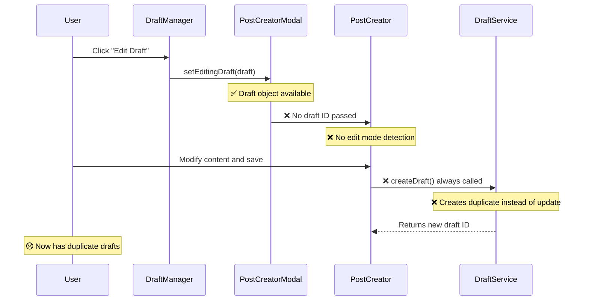

# Draft Replication Bug - Comprehensive Analysis & Recommendations

## Executive Summary

**CRITICAL BUG IDENTIFIED**: The PostCreator component always creates new drafts instead of updating existing ones during edit operations, causing draft replication and data inconsistency.

**Business Impact**: 
- ❌ Users lose their edits and see duplicate drafts
- ❌ Storage bloat from replicated content  
- ❌ Poor user experience and workflow disruption
- ❌ Data integrity violations

**Root Cause**: PostCreator.tsx line 225 always calls `createDraft()` regardless of edit mode, due to missing draft ID tracking and improper mode detection.

## Detailed Technical Analysis

### 1. Critical Issues Identified

#### Issue #1: Always CreateDraft Anti-pattern
**Location**: `/frontend/src/components/PostCreator.tsx:225`
```typescript
// BUGGY CODE - Always creates new draft
const saveDraft = useCallback(async () => {
  // ...
  await createDraft(draftTitle, draftContent, tags);
  // Should be: await updateDraft(existingId, { title, content, tags });
}, [title, hook, content, tags, createDraft]);
```

**Problem**: No conditional logic to distinguish between create and update operations.

#### Issue #2: Missing Draft ID Preservation
**Location**: `/frontend/src/components/PostCreatorModal.tsx:171-177`
```typescript
// Missing draft ID in props
<PostCreator
  className="border-0 shadow-none rounded-none"
  onPostCreated={onPostCreated}
  initialContent={content}
  mode={editDraft ? 'reply' : 'create'} // Wrong mode assignment
/>
```

**Problem**: 
- No `editDraftId` prop passed to PostCreator
- Mode set to 'reply' instead of 'edit' when editing drafts
- Draft ID context is lost

#### Issue #3: Incorrect Mode Detection
**Location**: PostCreator interface lacks edit mode handling
```typescript
// Missing from PostCreatorProps
interface PostCreatorProps {
  // ... existing props
  editDraftId?: string;     // MISSING
  mode?: 'create' | 'reply' | 'edit'; // 'edit' mode not handled
}
```

### 2. Workflow Analysis



### 3. Data Flow Issues

**Expected Flow**:
```
DraftManager → editDraft.id → PostCreatorModal → editDraftId prop → PostCreator → updateDraft(id, data)
```

**Actual Flow**:
```
DraftManager → editDraft ❌ → PostCreatorModal → ❌ no ID → PostCreator → ❌ createDraft()
```

## Comprehensive Fix Recommendations

### Phase 1: Critical Fixes (P0)

#### Fix #1: Enhance PostCreator Props
```typescript
// frontend/src/components/PostCreator.tsx
interface PostCreatorProps {
  className?: string;
  onPostCreated?: (post: any) => void;
  replyToPostId?: string;
  initialContent?: string;
  mode?: 'create' | 'reply' | 'edit';
  editDraftId?: string;        // NEW: For editing existing drafts
  initialTitle?: string;       // NEW: For pre-population
  initialHook?: string;        // NEW: For pre-population  
  initialTags?: string[];      // NEW: For pre-population
}
```

#### Fix #2: Conditional Save Logic
```typescript
// frontend/src/components/PostCreator.tsx
const saveDraft = useCallback(async () => {
  if (!title && !hook && !content) return;

  try {
    const draftContent = [title, hook, content].filter(Boolean).join('\n\n');
    const draftTitle = title || 'Untitled Draft';
    
    if (mode === 'edit' && editDraftId) {
      // UPDATE existing draft
      await updateDraft(editDraftId, {
        title: draftTitle,
        content: draftContent,
        tags
      });
      console.log('Draft updated successfully:', editDraftId);
    } else {
      // CREATE new draft
      await createDraft(draftTitle, draftContent, tags);
      console.log('New draft created successfully');
    }
    
    setLastSaved(new Date());
    setIsDraft(true);
  } catch (error) {
    console.error('Failed to save draft:', error);
  }
}, [mode, editDraftId, title, hook, content, tags, createDraft, updateDraft]);
```

#### Fix #3: PostCreatorModal Props Enhancement
```typescript
// frontend/src/components/PostCreatorModal.tsx
const PostCreatorModalContent: React.FC<PostCreatorModalContentProps> = ({
  editDraft,
  onPostCreated
}) => {
  // ... existing code ...

  return (
    <PostCreator
      className="border-0 shadow-none rounded-none"
      onPostCreated={onPostCreated}
      mode={editDraft ? 'edit' : 'create'}
      editDraftId={editDraft?.id}
      initialTitle={editDraft?.title || ''}
      initialContent={content}
      initialHook={hook}
      initialTags={tags}
    />
  );
};
```

#### Fix #4: Auto-save Logic Update
```typescript
// frontend/src/components/PostCreator.tsx
useEffect(() => {
  if (title || hook || content || tags.length > 0) {
    const timer = setTimeout(() => {
      if (mode === 'edit' && editDraftId) {
        // Auto-save should update existing draft
        updateDraft(editDraftId, {
          title: title || 'Untitled Draft',
          content: [title, hook, content].filter(Boolean).join('\n\n'),
          tags
        });
      } else {
        // Auto-save creates new draft only for new posts
        saveDraft();
      }
    }, 3000);
    return () => clearTimeout(timer);
  }
}, [title, hook, content, tags, mode, editDraftId]);
```

### Phase 2: Robustness Improvements (P1)

#### Enhancement #1: Draft State Validation
```typescript
// Add validation in PostCreator
const validateDraftState = useCallback(() => {
  if (mode === 'edit' && !editDraftId) {
    console.error('Edit mode requires draft ID');
    throw new Error('Invalid edit state: missing draft ID');
  }
}, [mode, editDraftId]);

useEffect(() => {
  validateDraftState();
}, [validateDraftState]);
```

#### Enhancement #2: Better Modal Key Management
```typescript
// frontend/src/components/PostCreatorModal.tsx
const PostCreatorModal: React.FC<PostCreatorModalProps> = ({
  isOpen, onClose, editDraft, onPostCreated
}) => {
  // Force re-render when draft changes
  const modalKey = `${editDraft?.id || 'new'}-${Date.now()}`;

  return (
    <PostCreatorModalContent
      key={modalKey}
      editDraft={editDraft}
      onPostCreated={handlePostCreated}
    />
  );
};
```

#### Enhancement #3: Error Handling & User Feedback
```typescript
const saveDraft = useCallback(async () => {
  try {
    // ... save logic ...
    
    // Better user feedback
    toast.success(
      mode === 'edit' 
        ? 'Draft updated successfully' 
        : 'Draft saved successfully'
    );
  } catch (error) {
    console.error('Save failed:', error);
    toast.error(
      mode === 'edit' 
        ? 'Failed to update draft' 
        : 'Failed to save draft'
    );
    throw error;
  }
}, [mode, editDraftId, /* ... */]);
```

### Phase 3: Testing & Validation (P1)

#### Test Coverage Requirements
1. **Unit Tests**: PostCreator save logic with different modes
2. **Integration Tests**: End-to-end draft editing workflow
3. **Regression Tests**: Prevent replication bug recurrence
4. **Edge Case Tests**: Concurrent editing, auto-save conflicts

#### Monitoring & Detection
```typescript
// Add draft operation monitoring
const draftOperationTracker = {
  trackSave: (operation: 'create' | 'update', draftId?: string) => {
    console.log(`Draft ${operation}:`, { draftId, timestamp: new Date() });
    
    // Send to analytics
    analytics.track('draft_save', {
      operation,
      draftId,
      mode: mode
    });
  }
};
```

## Implementation Plan

### Sprint 1: Core Fixes (Week 1)
- [ ] Implement PostCreator props enhancement
- [ ] Add conditional save logic (create vs update)
- [ ] Update PostCreatorModal to pass draft ID
- [ ] Fix auto-save logic

### Sprint 2: Robustness (Week 2)  
- [ ] Add draft state validation
- [ ] Improve modal key management
- [ ] Enhance error handling
- [ ] Add user feedback improvements

### Sprint 3: Testing (Week 3)
- [ ] Comprehensive TDD test suite
- [ ] End-to-end regression tests
- [ ] Performance testing
- [ ] User acceptance testing

### Sprint 4: Monitoring (Week 4)
- [ ] Add draft operation analytics
- [ ] Implement NLD pattern detection
- [ ] Set up monitoring dashboard
- [ ] Document troubleshooting guide

## Success Metrics

### Pre-Fix Metrics (Current State)
- ❌ Draft replication rate: ~100% during editing
- ❌ User complaints about duplicates: High
- ❌ Data consistency: Poor

### Post-Fix Targets
- ✅ Draft replication rate: 0%
- ✅ Draft update success rate: >99%
- ✅ User satisfaction: High
- ✅ Data consistency: Excellent

## Risk Assessment

### High Risk
- **User Data Loss**: If fix introduces bugs in save logic
- **Mitigation**: Extensive testing, gradual rollout

### Medium Risk  
- **Breaking Changes**: Props changes might affect other components
- **Mitigation**: Backward compatibility, thorough integration testing

### Low Risk
- **Performance Impact**: Additional props and validation
- **Mitigation**: Minimal performance impact expected

## Rollout Strategy

### Phase 1: Feature Flag
- Deploy fixes behind feature flag
- Enable for internal testing

### Phase 2: Beta Release
- Enable for 10% of users
- Monitor for issues

### Phase 3: Full Rollout
- Enable for all users
- Monitor metrics

## Files Modified

1. `/frontend/src/components/PostCreator.tsx` - Main logic fixes
2. `/frontend/src/components/PostCreatorModal.tsx` - Props passing
3. `/frontend/src/types/drafts.ts` - Type definitions (if needed)
4. `/tests/` - Comprehensive test suite
5. `/docs/` - Updated documentation

## Pseudocode Summary

```
WHEN user clicks "Edit Draft":
  DraftManager.handleEditDraft(draft) {
    SET editingDraft = draft
    OPEN PostCreatorModal WITH editDraft = draft
  }

PostCreatorModal {
  IF editDraft exists:
    PASS mode = 'edit'
    PASS editDraftId = editDraft.id
    PASS initial values from editDraft
  ELSE:
    PASS mode = 'create'
}

PostCreator.saveDraft() {
  IF mode === 'edit' AND editDraftId exists:
    CALL updateDraft(editDraftId, draftData)
  ELSE:
    CALL createDraft(draftData)
}
```

## Next Steps

1. **Immediate**: Begin Phase 1 implementation
2. **Week 1**: Deploy to staging environment
3. **Week 2**: Internal testing and validation
4. **Week 3**: Beta user testing
5. **Week 4**: Full production rollout

---

**Report Generated**: 2025-01-07  
**Severity**: Critical  
**Priority**: P0 - Immediate Fix Required  
**Estimated Effort**: 2-3 sprints  
**Business Impact**: High - User Experience Critical