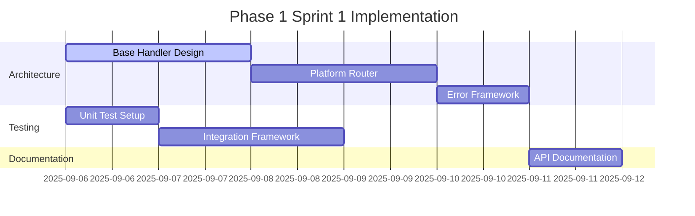
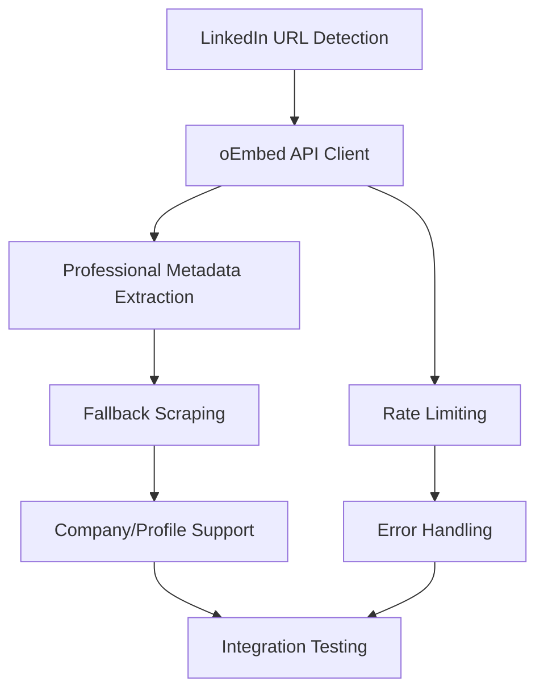
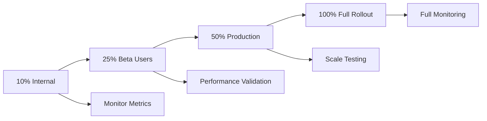

# Enhanced Link Preview System - Implementation Roadmap

## 🎯 PROJECT OVERVIEW

### Vision Statement
Transform the existing link preview system into a comprehensive, platform-aware service that delivers rich, accurate metadata for LinkedIn, Twitter/X, YouTube, and generic websites with sub-2s response times and 99.9% reliability.

### Success Metrics
- **Performance**: 95% of requests complete under 2 seconds
- **Reliability**: 99.9% uptime with graceful degradation
- **Accuracy**: 95% metadata extraction accuracy across platforms
- **Adoption**: Seamless migration with zero breaking changes

## 📋 PHASE-BASED IMPLEMENTATION PLAN

### PHASE 1: FOUNDATION & INFRASTRUCTURE (Weeks 1-2)

#### Sprint 1.1: Architecture & Base Classes (Week 1)

**Deliverables:**
- [ ] Enhanced base handler architecture
- [ ] Platform router implementation
- [ ] Improved error handling framework
- [ ] Basic metrics collection system

**Implementation Steps:**


**Key Files to Create:**
```javascript
// src/services/linkPreview/handlers/BaseHandler.js
// src/services/linkPreview/PlatformRouter.js
// src/services/linkPreview/models/PreviewResult.js
// src/services/linkPreview/strategies/ErrorHandlingStrategy.js
// tests/services/linkPreview/unit/BaseHandler.test.js
```

**Acceptance Criteria:**
- [ ] All existing functionality preserved
- [ ] New architecture extensible for additional platforms
- [ ] 100% backward compatibility maintained
- [ ] Error handling never crashes the service

#### Sprint 1.2: Enhanced Caching & Performance (Week 2)

**Deliverables:**
- [ ] Multi-tier cache implementation (Memory → Redis → SQLite)
- [ ] Intelligent TTL strategies per platform
- [ ] Performance monitoring and metrics
- [ ] Cache invalidation mechanisms

**Implementation Steps:**
- Day 1-2: Multi-tier cache manager implementation
- Day 3-4: Platform-specific TTL strategies
- Day 5: Performance metrics and monitoring
- Day 6-7: Integration testing and optimization

**Key Files to Create:**
```javascript
// src/services/linkPreview/cache/CacheManager.js
// src/services/linkPreview/cache/TieredCache.js
// src/services/linkPreview/strategies/CacheStrategy.js
// src/services/linkPreview/metrics/MetricsCollector.js
```

**Quality Gates:**
- [ ] Cache hit ratio > 80% for repeated requests
- [ ] Memory cache response time < 10ms
- [ ] Redis cache response time < 50ms
- [ ] Database cache response time < 200ms

### PHASE 2: PLATFORM HANDLERS (Weeks 3-4)

#### Sprint 2.1: LinkedIn Handler Development (Week 3)

**Deliverables:**
- [ ] LinkedIn oEmbed API integration
- [ ] Professional metadata extraction
- [ ] Fallback scraping for public content
- [ ] Company page and profile support

**Implementation Priority:**


**Key Implementation Files:**
```javascript
// src/services/linkPreview/handlers/LinkedInHandler.js
// src/services/linkPreview/clients/LinkedInOEmbedClient.js
// src/services/linkPreview/scrapers/LinkedInScraper.js
// src/services/linkPreview/models/LinkedInPreview.js
// tests/services/linkPreview/unit/LinkedInHandler.test.js
// tests/services/linkPreview/integration/linkedin-integration.test.js
```

**Feature Specifications:**
```javascript
// Expected LinkedIn preview structure
const linkedinPreview = {
  title: "Post title or profile name",
  description: "Post content or professional summary",
  author: {
    name: "Author full name",
    title: "Professional title",
    company: "Company name",
    profileUrl: "LinkedIn profile URL",
    avatar: "Profile image URL",
    verified: true/false
  },
  engagement: {
    likes: 245,
    comments: 12,
    shares: 8
  },
  publishDate: "2025-09-06T10:30:00Z",
  platform: "linkedin",
  contentType: "social"
};
```

#### Sprint 2.2: Twitter/X Unified Handler (Week 4)

**Deliverables:**
- [ ] Unified Twitter/X URL handling
- [ ] Multiple API strategy implementation
- [ ] Media attachment support
- [ ] Threading context extraction

**Implementation Architecture:**
```javascript
class TwitterXHandler extends BaseHandler {
  strategies = [
    new TwitterAPIv2Strategy(),
    new TwitterOEmbedStrategy(), 
    new TwitterSyndicationStrategy(),
    new TwitterFallbackStrategy()
  ];
  
  async extract(url) {
    const normalizedUrl = this.normalizeUrl(url);
    return await this.executeStrategiesWithFallback(normalizedUrl);
  }
  
  normalizeUrl(url) {
    // Convert x.com → twitter.com for API compatibility
    // Handle mobile URLs
    // Extract tweet ID for API calls
  }
}
```

**Key Files:**
```javascript
// src/services/linkPreview/handlers/TwitterXHandler.js
// src/services/linkPreview/strategies/TwitterAPIv2Strategy.js
// src/services/linkPreview/strategies/TwitterOEmbedStrategy.js
// src/services/linkPreview/strategies/TwitterSyndicationStrategy.js
// src/services/linkPreview/utils/TwitterUrlNormalizer.js
```

### PHASE 3: ADVANCED FEATURES (Weeks 5-6)

#### Sprint 3.1: Generic Handler Enhancement (Week 5)

**Deliverables:**
- [ ] Enhanced Open Graph extraction
- [ ] Schema.org structured data support
- [ ] Content type intelligence
- [ ] Image optimization and CDN integration

**Advanced Features:**
```javascript
class EnhancedGenericHandler extends BaseHandler {
  extractors = [
    new OpenGraphExtractor(),
    new TwitterCardsExtractor(),
    new SchemaOrgExtractor(),
    new JSONLDExtractor(),
    new MicrodataExtractor(),
    new BasicHTMLExtractor()
  ];
  
  async extract(url) {
    const content = await this.fetchOptimized(url);
    const metadata = await this.extractWithMultipleStrategies(content);
    return await this.enhanceMetadata(metadata, url);
  }
}
```

#### Sprint 3.2: Performance & Scalability (Week 6)

**Deliverables:**
- [ ] Concurrent request processing
- [ ] Advanced rate limiting
- [ ] Resource optimization
- [ ] Monitoring dashboard

**Performance Optimizations:**
```javascript
// Concurrent processing implementation
async processMultiplePreviews(urls) {
  const concurrencyLimit = this.config.maxConcurrentRequests;
  const semaphore = new Semaphore(concurrencyLimit);
  
  return Promise.all(urls.map(async (url) => {
    await semaphore.acquire();
    try {
      return await this.getLinkPreview(url);
    } finally {
      semaphore.release();
    }
  }));
}
```

### PHASE 4: PRODUCTION DEPLOYMENT (Weeks 7-8)

#### Sprint 4.1: Production Hardening (Week 7)

**Deliverables:**
- [ ] Comprehensive error handling
- [ ] Security audit and fixes
- [ ] Performance optimization
- [ ] Monitoring and alerting

**Security Checklist:**
- [ ] Input validation and sanitization
- [ ] SSRF protection implementation
- [ ] Rate limiting per IP/user
- [ ] API key secure storage
- [ ] Content Security Policy compliance

#### Sprint 4.2: Gradual Rollout (Week 8)

**Rollout Strategy:**


**Rollout Phases:**
1. **10% Internal**: Development team and internal tools
2. **25% Beta**: Selected beta users and test environments
3. **50% Production**: Half of production traffic
4. **100% Full**: Complete migration

## 🔧 TECHNICAL IMPLEMENTATION DETAILS

### Database Schema Migration

```sql
-- Migration script for enhanced link preview cache
ALTER TABLE link_preview_cache ADD COLUMN platform TEXT DEFAULT 'generic';
ALTER TABLE link_preview_cache ADD COLUMN author_name TEXT;
ALTER TABLE link_preview_cache ADD COLUMN author_username TEXT;
ALTER TABLE link_preview_cache ADD COLUMN author_avatar TEXT;
ALTER TABLE link_preview_cache ADD COLUMN content_type TEXT DEFAULT 'website';
ALTER TABLE link_preview_cache ADD COLUMN engagement_json TEXT;
ALTER TABLE link_preview_cache ADD COLUMN publish_date DATETIME;
ALTER TABLE link_preview_cache ADD COLUMN fetch_time_ms INTEGER;
ALTER TABLE link_preview_cache ADD COLUMN fallback_used BOOLEAN DEFAULT FALSE;

-- Create indexes for performance
CREATE INDEX idx_platform_content_type ON link_preview_cache(platform, content_type);
CREATE INDEX idx_author_lookup ON link_preview_cache(author_username);
CREATE INDEX idx_performance_metrics ON link_preview_cache(fetch_time_ms, fallback_used);
```

### Configuration Management

```javascript
// config/link-preview.js
export const linkPreviewConfig = {
  platforms: {
    linkedin: {
      oembedEndpoint: 'https://www.linkedin.com/oembed',
      rateLimit: { requests: 1000, window: 3600000 },
      cacheTTL: 14400, // 4 hours
      fallbackToScraping: true,
      userAgent: 'AgentFeed/1.0 (+https://agent-feed.com/bot)'
    },
    twitter: {
      apiEndpoint: 'https://api.twitter.com/2/tweets',
      oembedEndpoint: 'https://publish.twitter.com/oembed',
      syndicationEndpoint: 'https://cdn.syndication.twimg.com',
      rateLimit: { requests: 300, window: 900000 }, // 15 minutes
      cacheTTL: 1800, // 30 minutes
      apiKey: process.env.TWITTER_API_KEY
    },
    generic: {
      cacheTTL: 3600, // 1 hour
      maxContentSize: 5 * 1024 * 1024, // 5MB
      timeout: 15000,
      retryAttempts: 3,
      userAgent: 'AgentFeed/1.0 LinkPreview'
    }
  },
  
  performance: {
    maxConcurrentRequests: 100,
    memoryCache: { maxSize: 1000, ttl: 300 },
    redisCache: { ttl: 3600, keyPrefix: 'link-preview:' },
    databaseCache: { cleanupInterval: 86400000 } // 24 hours
  }
};
```

### API Integration Examples

```javascript
// LinkedIn oEmbed integration
class LinkedInOEmbedClient {
  async fetch(url) {
    const oembedUrl = `${this.endpoint}?url=${encodeURIComponent(url)}&format=json`;
    
    const response = await this.httpClient.get(oembedUrl, {
      headers: {
        'User-Agent': this.userAgent,
        'Accept': 'application/json'
      },
      timeout: 10000
    });
    
    if (!response.ok) {
      throw new LinkedInAPIError(`oEmbed failed: ${response.status}`);
    }
    
    return this.transformOEmbedResponse(await response.json());
  }
}

// Twitter API v2 integration  
class TwitterAPIv2Client {
  async fetchTweet(tweetId) {
    const url = `${this.apiEndpoint}/${tweetId}`;
    const params = new URLSearchParams({
      'tweet.fields': 'created_at,author_id,public_metrics,attachments',
      'user.fields': 'name,username,verified,profile_image_url',
      'media.fields': 'preview_image_url,url,width,height',
      'expansions': 'author_id,attachments.media_keys'
    });
    
    const response = await this.httpClient.get(`${url}?${params}`, {
      headers: {
        'Authorization': `Bearer ${this.bearerToken}`,
        'User-Agent': this.userAgent
      }
    });
    
    return this.transformTwitterResponse(await response.json());
  }
}
```

## 🧪 TESTING STRATEGY

### Test Coverage Requirements

| Component | Unit Tests | Integration Tests | E2E Tests |
|-----------|------------|-------------------|-----------|
| Base Handler | 95% | 80% | 60% |
| Platform Handlers | 90% | 85% | 70% |
| Cache Manager | 95% | 90% | 50% |
| API Clients | 85% | 95% | 80% |
| Error Handling | 90% | 85% | 75% |

### Automated Testing Pipeline

```yaml
# .github/workflows/link-preview-ci.yml
name: Enhanced Link Preview CI
on: [push, pull_request]

jobs:
  unit-tests:
    runs-on: ubuntu-latest
    steps:
      - uses: actions/checkout@v3
      - name: Run Unit Tests
        run: npm test -- --coverage
      - name: Upload Coverage
        uses: codecov/codecov-action@v3

  integration-tests:
    runs-on: ubuntu-latest
    services:
      redis:
        image: redis:7-alpine
        ports: ['6379:6379']
    steps:
      - name: Run Integration Tests
        run: npm run test:integration

  e2e-tests:
    runs-on: ubuntu-latest
    steps:
      - name: Run E2E Tests
        run: npm run test:e2e
        env:
          TWITTER_API_KEY: ${{ secrets.TWITTER_API_KEY }}
          LINKEDIN_API_KEY: ${{ secrets.LINKEDIN_API_KEY }}
```

## 📊 MONITORING & ALERTING

### Key Performance Indicators

```javascript
// Monitoring dashboard metrics
const monitoringMetrics = {
  performance: {
    'preview.response_time.p95': { threshold: 2000, unit: 'ms' },
    'preview.cache_hit_ratio': { threshold: 0.8, unit: 'ratio' },
    'preview.error_rate': { threshold: 0.001, unit: 'ratio' }
  },
  
  reliability: {
    'preview.success_rate': { threshold: 0.999, unit: 'ratio' },
    'preview.fallback_usage': { threshold: 0.1, unit: 'ratio' },
    'preview.timeout_rate': { threshold: 0.01, unit: 'ratio' }
  },
  
  platform_specific: {
    'linkedin.api_rate_limit_hits': { threshold: 10, unit: 'count/hour' },
    'twitter.api_errors': { threshold: 5, unit: 'count/hour' },
    'generic.scraping_failures': { threshold: 20, unit: 'count/hour' }
  }
};
```

### Alerting Configuration

```javascript
// Alert definitions
const alerts = [
  {
    name: 'High Error Rate',
    condition: 'error_rate > 0.01',
    severity: 'critical',
    notification: ['email', 'slack']
  },
  {
    name: 'Performance Degradation',
    condition: 'response_time_p95 > 3000',
    severity: 'warning',
    notification: ['slack']
  },
  {
    name: 'Cache Hit Ratio Low',
    condition: 'cache_hit_ratio < 0.7',
    severity: 'info',
    notification: ['email']
  }
];
```

## 🎯 SUCCESS CRITERIA & VALIDATION

### Go-Live Checklist

- [ ] All unit tests passing (>95% coverage)
- [ ] Integration tests validated against real APIs
- [ ] Performance benchmarks met
- [ ] Security audit completed
- [ ] Database migration tested
- [ ] Rollback procedures verified
- [ ] Monitoring and alerting configured
- [ ] Documentation complete

### Post-Launch Validation (30 days)

- [ ] Response time SLA maintained (95% < 2s)
- [ ] Error rate below threshold (<0.1%)
- [ ] Cache efficiency improved (>80% hit rate)
- [ ] Platform-specific accuracy validated
- [ ] User adoption metrics positive
- [ ] No critical issues reported

This roadmap provides a comprehensive, phase-based approach to implementing the enhanced link preview system with proper testing, monitoring, and gradual rollout strategies.