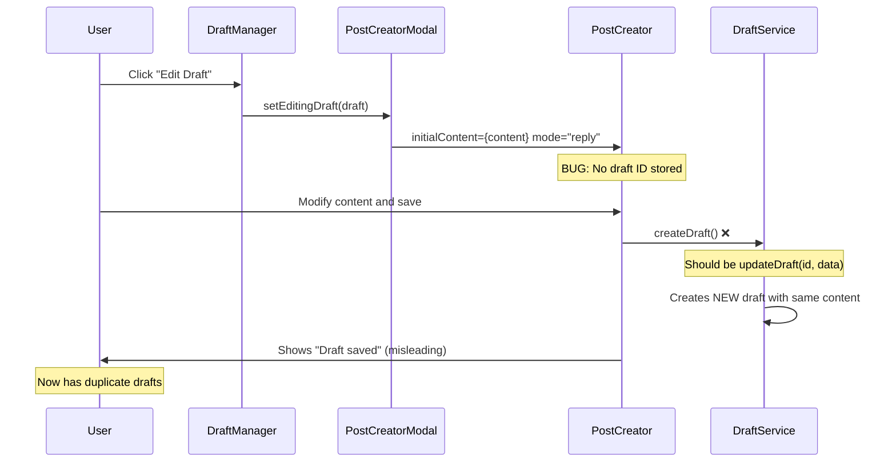

# SPARC Phase 1 - Draft Replication Bug Specification

## Executive Summary

**Critical Bug Identified**: Draft editing creates new drafts instead of updating existing ones, resulting in draft replication and data inconsistency.

**Root Cause**: PostCreator component always calls `createDraft()` instead of `updateDraft()` when editing existing drafts, due to lack of draft ID tracking and proper edit mode detection.

**Business Impact**: 
- Users lose edits and see duplicate drafts
- Storage bloat from replicated content
- Poor user experience and workflow disruption
- Data integrity issues

## Bug Analysis

### Expected vs Actual Behavior

**Expected Behavior:**
1. User opens draft for editing via DraftManager
2. PostCreator modal loads with existing draft data
3. User modifies content and saves
4. Original draft is updated with new content
5. No new draft is created

**Actual Behavior:**
1. User opens draft for editing via DraftManager
2. PostCreator modal loads with existing draft data
3. User modifies content and saves
4. **BUG**: New draft is created instead of updating existing one
5. Original draft remains unchanged
6. User now has duplicate drafts

### Technical Analysis

#### 1. PostCreator Component Issues

**Problem**: PostCreator.tsx line 225 always calls `createDraft()`:
```typescript
// BUGGY CODE - always creates new draft
await createDraft(draftTitle, draftContent, tags);
```

**Missing Logic**:
- No draft ID preservation from modal
- No edit mode detection
- No conditional logic for update vs create

#### 2. PostCreatorModal Component Issues

**Problem**: PostCreatorModal.tsx doesn't pass draft ID to PostCreator:
```typescript
// Missing draft ID in props
<PostCreator
  className="border-0 shadow-none rounded-none"
  onPostCreated={onPostCreated}
  initialContent={content}
  mode={editDraft ? 'reply' : 'create'} // Wrong mode assignment
/>
```

**Issues**:
- `mode='reply'` instead of `mode='edit'`
- No `editDraftId` prop passed
- No draft state preservation

#### 3. DraftManager Component Issues

**Problem**: DraftManager.tsx line 144-150 opens modal but doesn't ensure proper edit mode:
```typescript
const handleEditDraft = async (draft: Draft) => {
  try {
    setEditingDraft(draft);
    setShowPostCreatorModal(true);
  } catch (error) {
    console.error('Failed to open draft editor:', error);
  }
};
```

**Missing**:
- No validation that draft ID is preserved
- No explicit edit mode passing
- No draft state verification

### Workflow Trace



## Detailed Requirements

### R1: Draft ID Preservation
- PostCreator MUST receive and store the draft ID when editing
- Draft ID MUST be preserved throughout the edit session
- Form state MUST be linked to specific draft entity

### R2: Update vs Create Logic
- PostCreator MUST conditionally call updateDraft() vs createDraft()
- Edit mode MUST be explicitly detected and handled
- Save operations MUST modify existing draft, not create new ones

### R3: Modal State Management
- PostCreatorModal MUST pass edit draft ID to PostCreator
- Modal MUST distinguish between create and edit modes
- Draft data initialization MUST be idempotent

### R4: Auto-save Behavior
- Auto-save MUST update existing draft when in edit mode
- Auto-save MUST NOT create new drafts during editing
- Auto-save state MUST be consistent with manual save

## Test Scenarios

### Scenario 1: Basic Draft Editing
```gherkin
Given a draft with ID "draft-123" exists
When user clicks "Edit" on the draft
And modifies the content
And clicks "Save Draft"
Then the original draft "draft-123" should be updated
And no new draft should be created
And the draft list should show only 1 draft with updated content
```

### Scenario 2: Auto-save During Editing
```gherkin
Given user is editing draft with ID "draft-456"
When user types content for more than 3 seconds
Then auto-save should trigger
And the original draft "draft-456" should be updated
And no new draft should be created
```

### Scenario 3: Modal Re-opening
```gherkin
Given user is editing a draft
When user closes the modal without saving
And reopens the same draft for editing
Then the draft should load with original content
And save operations should still update the original draft
```

## Edge Cases

1. **Concurrent Editing**: Multiple tabs editing same draft
2. **Auto-save Conflicts**: Auto-save vs manual save timing
3. **Modal Rapid Open/Close**: State preservation across modal sessions
4. **Network Issues**: Save failures and retry logic
5. **Storage Limits**: Maximum draft count reached during replication

## Success Criteria

- ✅ Zero draft replication during editing
- ✅ Draft ID preservation throughout edit workflow
- ✅ Proper update vs create method selection
- ✅ Auto-save updates existing drafts only
- ✅ Modal state correctly handles edit mode
- ✅ User sees single draft with latest changes

## Implementation Priority

1. **P0 - Critical**: Fix PostCreator to accept and use draft ID
2. **P0 - Critical**: Implement update vs create logic
3. **P1 - High**: Fix PostCreatorModal prop passing
4. **P1 - High**: Add comprehensive test coverage
5. **P2 - Medium**: Implement NLD pattern recognition
6. **P3 - Low**: Add advanced error handling

## Pseudocode Solution

```typescript
// PostCreator enhancement
interface PostCreatorProps {
  // ... existing props
  editDraftId?: string;
  mode?: 'create' | 'reply' | 'edit';
}

const PostCreator = ({ editDraftId, mode, ... }) => {
  const saveDraft = useCallback(async () => {
    if (mode === 'edit' && editDraftId) {
      // Update existing draft
      await updateDraft(editDraftId, {
        title, content, tags
      });
    } else {
      // Create new draft
      await createDraft(title, content, tags);
    }
  }, [mode, editDraftId, title, content, tags]);
};
```

## Next Steps

1. **Architecture Phase**: Design proper draft state management
2. **Refinement Phase**: Implement TDD fixes with comprehensive tests
3. **Completion Phase**: Integration testing and user acceptance validation

---

**Generated via SPARC Phase 1 Specification**
**Date**: 2025-01-07
**Status**: Critical Bug - Immediate Fix Required