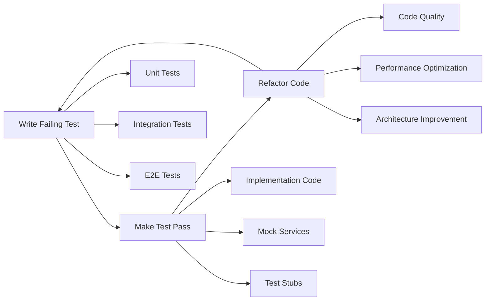

# Enhanced Link Preview System - SPARC Refinement Phase

## 1. TEST-DRIVEN DEVELOPMENT STRATEGY

### 1.1 TDD Workflow Implementation



### 1.2 Test Pyramid Strategy

#### Level 1: Unit Tests (70% of total tests)
```javascript
// Fast, isolated, comprehensive unit tests
describe('LinkedInHandler', () => {
  let handler: LinkedInHandler;
  let mockOEmbedClient: jest.Mocked<LinkedInOEmbedClient>;
  let mockScraper: jest.Mocked<LinkedInScraper>;
  
  beforeEach(() => {
    mockOEmbedClient = createMockOEmbedClient();
    mockScraper = createMockScraper();
    handler = new LinkedInHandler(mockOEmbedClient, mockScraper);
  });
  
  describe('URL validation', () => {
    test('accepts valid LinkedIn post URLs', async () => {
      const validUrls = [
        'https://www.linkedin.com/posts/username_activity-id',
        'https://linkedin.com/posts/username_activity-id'
      ];
      
      for (const url of validUrls) {
        expect(() => handler.validateUrl(url)).not.toThrow();
      }
    });
    
    test('rejects invalid LinkedIn URLs', async () => {
      const invalidUrls = [
        'https://example.com/fake-linkedin',
        'https://linkedin.com/invalid-path',
        'not-a-url-at-all'
      ];
      
      for (const url of invalidUrls) {
        expect(() => handler.validateUrl(url)).toThrow();
      }
    });
  });
  
  describe('metadata extraction', () => {
    test('extracts complete metadata from oEmbed API', async () => {
      // Arrange
      const testUrl = 'https://www.linkedin.com/posts/test-user_activity-123';
      const mockOEmbedResponse = {
        title: 'Test LinkedIn Post',
        author_name: 'Test User',
        author_url: 'https://www.linkedin.com/in/test-user',
        thumbnail_url: 'https://media.linkedin.com/image.jpg',
        html: '<blockquote>Post content</blockquote>'
      };
      
      mockOEmbedClient.fetch.mockResolvedValue(mockOEmbedResponse);
      
      // Act
      const result = await handler.extract(testUrl);
      
      // Assert
      expect(result).toMatchObject({
        title: 'Test LinkedIn Post',
        author: {
          name: 'Test User',
          profileUrl: 'https://www.linkedin.com/in/test-user'
        },
        image: {
          url: 'https://media.linkedin.com/image.jpg'
        },
        platform: Platform.LINKEDIN
      });
      
      expect(mockOEmbedClient.fetch).toHaveBeenCalledWith(testUrl);
      expect(mockScraper.scrape).not.toHaveBeenCalled();
    });
    
    test('falls back to scraping when oEmbed fails', async () => {
      // Arrange
      const testUrl = 'https://www.linkedin.com/posts/test-user_activity-123';
      const scrapedData = {
        title: 'Scraped LinkedIn Post',
        author: 'Scraped User',
        description: 'Content from scraping'
      };
      
      mockOEmbedClient.fetch.mockRejectedValue(new Error('oEmbed failed'));
      mockScraper.scrape.mockResolvedValue(scrapedData);
      
      // Act
      const result = await handler.extract(testUrl);
      
      // Assert
      expect(result.title).toBe('Scraped LinkedIn Post');
      expect(result.fallbackUsed).toBe(true);
      expect(mockOEmbedClient.fetch).toHaveBeenCalled();
      expect(mockScraper.scrape).toHaveBeenCalledWith(testUrl);
    });
  });
});
```

#### Level 2: Integration Tests (20% of total tests)
```javascript
// Test component interactions and external dependencies
describe('Enhanced Link Preview Integration', () => {
  let service: EnhancedLinkPreviewService;
  let testDatabase: Database;
  let redisClient: Redis;
  
  beforeEach(async () => {
    testDatabase = await createTestDatabase();
    redisClient = await createTestRedisClient();
    service = new EnhancedLinkPreviewService({
      database: testDatabase,
      redis: redisClient,
      enableRealAPIs: false // Use mocked APIs for integration tests
    });
  });
  
  afterEach(async () => {
    await cleanupTestDatabase(testDatabase);
    await redisClient.quit();
  });
  
  describe('Cache Integration', () => {
    test('implements multi-tier cache correctly', async () => {
      const testUrl = 'https://www.linkedin.com/posts/test_123';
      const expectedPreview = createMockPreview();
      
      // Mock the handler to return predictable data
      jest.spyOn(service['platformRouter'], 'getHandler')
        .mockReturnValue(createMockHandler(expectedPreview));
      
      // First call - cache miss
      const result1 = await service.getLinkPreview(testUrl);
      expect(result1.performance.cacheHit).toBe(false);
      
      // Second call - should hit memory cache
      const result2 = await service.getLinkPreview(testUrl);
      expect(result2.performance.cacheHit).toBe(true);
      expect(result2.performance.fetchTime).toBeLessThan(10);
      
      // Verify data is stored in all cache layers
      const memoryCache = service['cacheManager'].memoryCache.get(testUrl);
      expect(memoryCache).toBeDefined();
      
      const redisCache = await redisClient.get(`link-preview:${testUrl}`);
      expect(redisCache).toBeDefined();
      
      const dbCache = await testDatabase.prepare(
        'SELECT * FROM link_preview_cache WHERE url = ?'
      ).get(testUrl);
      expect(dbCache).toBeDefined();
    });
    
    test('handles cache invalidation across all tiers', async () => {
      const testUrl = 'https://example.com/test-page';
      
      // Cache some data
      await service.getLinkPreview(testUrl);
      
      // Invalidate cache
      await service.invalidateCache(testUrl);
      
      // Verify removal from all tiers
      expect(service['cacheManager'].memoryCache.has(testUrl)).toBe(false);
      
      const redisResult = await redisClient.get(`link-preview:${testUrl}`);
      expect(redisResult).toBeNull();
      
      const dbResult = await testDatabase.prepare(
        'SELECT * FROM link_preview_cache WHERE url = ?'
      ).get(testUrl);
      expect(dbResult).toBeUndefined();
    });
  });
  
  describe('Rate Limiting Integration', () => {
    test('enforces rate limits across requests', async () => {
      const rateLimiter = service['rateLimiter'];
      const platform = Platform.TWITTER;
      
      // Configure strict rate limit for testing
      rateLimiter.setLimit(platform, 'fetch', 2, 60000); // 2 requests per minute
      
      // First two requests should succeed
      await expect(service.getLinkPreview('https://twitter.com/test/1'))
        .resolves.toBeDefined();
      await expect(service.getLinkPreview('https://twitter.com/test/2'))
        .resolves.toBeDefined();
      
      // Third request should be rate limited
      await expect(service.getLinkPreview('https://twitter.com/test/3'))
        .rejects.toThrow(/rate limit/i);
    });
  });
});
```

#### Level 3: End-to-End Tests (10% of total tests)
```javascript
// Test complete user journeys with real external dependencies
describe('End-to-End Link Preview Tests', () => {
  let service: EnhancedLinkPreviewService;
  
  beforeEach(() => {
    service = new EnhancedLinkPreviewService({
      enableRealAPIs: true, // Use actual external APIs
      timeout: 30000 // Longer timeout for real network calls
    });
  });
  
  describe('Real-world URL handling', () => {
    test('processes popular LinkedIn post correctly', async () => {
      const linkedinUrl = 'https://www.linkedin.com/posts/sundarpichai_ai-google-tech-activity-7140123456789';
      
      const result = await service.getLinkPreview(linkedinUrl);
      
      expect(result).toMatchObject({
        title: expect.any(String),
        description: expect.any(String),
        author: {
          name: expect.any(String),
          verified: expect.any(Boolean)
        },
        platform: Platform.LINKEDIN,
        contentType: 'social'
      });
      
      expect(result.performance.fetchTime).toBeLessThan(5000);
      expect(result.error).toBeUndefined();
    }, 30000);
    
    test('handles rate limiting gracefully in production', async () => {
      const urls = Array.from({ length: 10 }, (_, i) => 
        `https://twitter.com/elonmusk/status/${1000000000000000000 + i}`
      );
      
      const startTime = Date.now();
      const results = await Promise.allSettled(
        urls.map(url => service.getLinkPreview(url))
      );
      const endTime = Date.now();
      
      const successful = results.filter(r => r.status === 'fulfilled').length;
      const rateLimited = results.filter(r => 
        r.status === 'rejected' && 
        r.reason.message.includes('rate limit')
      ).length;
      
      expect(successful + rateLimited).toBe(urls.length);
      expect(endTime - startTime).toBeGreaterThan(0); // Some delay expected
      
      // At least some requests should succeed
      expect(successful).toBeGreaterThan(0);
    }, 60000);
  });
});
```

## 2. INCREMENTAL ROLLOUT STRATEGY

### 2.1 Feature Flag Driven Development

```javascript
class IncrementalRolloutManager {
  private featureFlags: FeatureFlags;
  private metricsCollector: MetricsCollector;
  
  constructor() {
    this.featureFlags = new FeatureFlags();
    this.metricsCollector = new MetricsCollector();
  }
  
  async executeWithRollout<T>(
    featureFlag: string,
    enhancedImplementation: () => Promise<T>,
    legacyImplementation: () => Promise<T>,
    rolloutPercentage: number = 10
  ): Promise<T> {
    const shouldUseEnhanced = this.shouldExecuteEnhanced(
      featureFlag, 
      rolloutPercentage
    );
    
    if (shouldUseEnhanced) {
      try {
        const result = await enhancedImplementation();
        this.metricsCollector.recordFeatureSuccess(featureFlag);
        return result;
      } catch (error) {
        this.metricsCollector.recordFeatureError(featureFlag, error);
        // Fallback to legacy implementation on error
        return await legacyImplementation();
      }
    } else {
      return await legacyImplementation();
    }
  }
  
  private shouldExecuteEnhanced(featureFlag: string, percentage: number): boolean {
    if (!this.featureFlags.isEnabled(featureFlag)) {
      return false;
    }
    
    // Consistent rollout based on hash of request context
    const hash = this.generateRolloutHash();
    return (hash % 100) < percentage;
  }
}

// Usage in the enhanced service
class EnhancedLinkPreviewService {
  private rolloutManager: IncrementalRolloutManager;
  
  async getLinkPreview(url: string): Promise<PreviewResult> {
    return this.rolloutManager.executeWithRollout(
      'enhanced-link-preview',
      () => this.getEnhancedPreview(url),      // New implementation
      () => this.getLegacyPreview(url),        // Current implementation
      25 // 25% rollout
    );
  }
}
```

### 2.2 Phased Rollout Plan

#### Phase 1: Foundation (Week 1-2)
```javascript
const PHASE_1_CONFIG = {
  features: [
    'enhanced-url-validation',
    'improved-error-handling',
    'basic-metrics-collection'
  ],
  rolloutPercentage: 10,
  criteria: {
    platforms: ['generic'], // Start with generic handler only
    users: 'internal',      // Internal testing only
    monitoring: 'enhanced'
  }
};

// Phase 1 tests focus on stability
describe('Phase 1: Foundation Stability', () => {
  test('enhanced error handling never crashes', async () => {
    const chaosUrls = [
      'https://definitely-not-a-real-domain-12345.com',
      'https://httpstat.us/500', // Returns 500 error
      'https://httpstat.us/404', // Returns 404
      'malformed-url',
      'https://site-with-malformed-html.com'
    ];
    
    for (const url of chaosUrls) {
      await expect(service.getLinkPreview(url))
        .resolves.toBeDefined(); // Should never throw
    }
  });
});
```

#### Phase 2: Platform Handlers (Week 3-4)
```javascript
const PHASE_2_CONFIG = {
  features: [
    'linkedin-handler',
    'twitter-x-handler',
    'enhanced-youtube-handler'
  ],
  rolloutPercentage: 25,
  criteria: {
    platforms: ['linkedin', 'twitter', 'youtube'],
    users: 'beta',
    monitoring: 'detailed'
  }
};

// Phase 2 tests focus on handler accuracy
describe('Phase 2: Platform Handler Accuracy', () => {
  test('LinkedIn handler extracts complete professional metadata', async () => {
    const testCases = [
      'https://www.linkedin.com/posts/professional-user_activity-123',
      'https://www.linkedin.com/in/professional-profile',
      'https://www.linkedin.com/company/tech-company'
    ];
    
    for (const url of testCases) {
      const result = await service.getLinkPreview(url);
      expect(result.author.name).toBeDefined();
      expect(result.author.profileUrl).toMatch(/linkedin\.com/);
    }
  });
});
```

#### Phase 3: Performance Optimization (Week 5-6)
```javascript
const PHASE_3_CONFIG = {
  features: [
    'multi-tier-caching',
    'concurrent-processing',
    'rate-limit-optimization'
  ],
  rolloutPercentage: 50,
  criteria: {
    platforms: 'all',
    users: 'production',
    monitoring: 'comprehensive'
  }
};

// Phase 3 tests focus on performance
describe('Phase 3: Performance Optimization', () => {
  test('concurrent processing improves throughput', async () => {
    const urls = generateTestUrls(50);
    
    const sequentialStart = Date.now();
    for (const url of urls) {
      await service.getLinkPreview(url);
    }
    const sequentialTime = Date.now() - sequentialStart;
    
    const concurrentStart = Date.now();
    await Promise.all(urls.map(url => service.getLinkPreview(url)));
    const concurrentTime = Date.now() - concurrentStart;
    
    expect(concurrentTime).toBeLessThan(sequentialTime * 0.3); // 70% improvement
  });
});
```

## 3. REGRESSION TESTING STRATEGY

### 3.1 Automated Regression Test Suite

```javascript
class RegressionTestSuite {
  private snapshotManager: SnapshotManager;
  private performanceBaselines: PerformanceBaselines;
  
  async runComprehensiveRegressionTests(): Promise<RegressionReport> {
    const report = new RegressionReport();
    
    // Functional regression tests
    await this.runFunctionalRegressionTests(report);
    
    // Performance regression tests
    await this.runPerformanceRegressionTests(report);
    
    // Integration regression tests
    await this.runIntegrationRegressionTests(report);
    
    return report;
  }
  
  private async runFunctionalRegressionTests(report: RegressionReport): Promise<void> {
    const testCases = await this.loadRegressionTestCases();
    
    for (const testCase of testCases) {
      try {
        const result = await this.service.getLinkPreview(testCase.url);
        const snapshot = await this.snapshotManager.getSnapshot(testCase.id);
        
        const comparison = this.compareResults(result, snapshot);
        if (!comparison.isCompatible) {
          report.addFunctionalRegression(testCase.id, comparison);
        }
      } catch (error) {
        report.addFunctionalFailure(testCase.id, error);
      }
    }
  }
  
  private async runPerformanceRegressionTests(report: RegressionReport): Promise<void> {
    const performanceTests = [
      { name: 'cache-hit-performance', urls: this.getCachedUrls() },
      { name: 'fresh-fetch-performance', urls: this.getFreshUrls() },
      { name: 'concurrent-performance', urls: this.getConcurrentTestUrls() }
    ];
    
    for (const test of performanceTests) {
      const baseline = this.performanceBaselines.get(test.name);
      const currentPerformance = await this.measurePerformance(test);
      
      if (currentPerformance.averageTime > baseline.averageTime * 1.2) {
        report.addPerformanceRegression(test.name, {
          baseline: baseline.averageTime,
          current: currentPerformance.averageTime,
          degradation: (currentPerformance.averageTime / baseline.averageTime) - 1
        });
      }
    }
  }
}
```

### 3.2 Snapshot Testing for API Responses

```javascript
describe('API Response Snapshots', () => {
  test('LinkedIn oEmbed response structure remains consistent', async () => {
    const testUrl = 'https://www.linkedin.com/posts/test-user_activity-123';
    const result = await service.getLinkPreview(testUrl);
    
    // Remove dynamic fields that change over time
    const snapshot = {
      ...result,
      metadata: {
        ...result.metadata,
        engagement: undefined, // Engagement numbers change
        publishDate: undefined // Dates may be formatted differently
      },
      performance: undefined,   // Performance metrics vary
      caching: undefined       // Cache timing varies
    };
    
    expect(snapshot).toMatchSnapshot('linkedin-oembed-response');
  });
  
  test('Error responses maintain consistent structure', async () => {
    const invalidUrl = 'https://invalid-domain-12345.com/test';
    const result = await service.getLinkPreview(invalidUrl);
    
    expect(result).toMatchObject({
      title: expect.any(String),
      description: expect.any(String),
      error: expect.any(String),
      fallback: true
    });
    
    expect(result).toMatchSnapshot('error-response-structure');
  });
});
```

## 4. QUALITY METRICS & MONITORING

### 4.1 Quality Gates Implementation

```javascript
class QualityGatesMonitor {
  private metrics: QualityMetrics;
  
  async evaluateQualityGates(): Promise<QualityGateResult> {
    const results = {
      performance: await this.evaluatePerformanceGates(),
      reliability: await this.evaluateReliabilityGates(),
      functionality: await this.evaluateFunctionalityGates(),
      security: await this.evaluateSecurityGates()
    };
    
    return new QualityGateResult(results);
  }
  
  private async evaluatePerformanceGates(): Promise<GateResult> {
    const metrics = await this.metrics.getPerformanceMetrics();
    
    const gates = [
      {
        name: 'cache-hit-response-time',
        threshold: 50,
        actual: metrics.averageCacheHitTime,
        unit: 'ms'
      },
      {
        name: 'fresh-fetch-response-time-p95',
        threshold: 2000,
        actual: metrics.p95FreshFetchTime,
        unit: 'ms'
      },
      {
        name: 'concurrent-request-success-rate',
        threshold: 0.95,
        actual: metrics.concurrentSuccessRate,
        unit: 'ratio'
      }
    ];
    
    return this.evaluateGates(gates);
  }
  
  private async evaluateReliabilityGates(): Promise<GateResult> {
    const metrics = await this.metrics.getReliabilityMetrics();
    
    const gates = [
      {
        name: 'overall-success-rate',
        threshold: 0.999,
        actual: metrics.overallSuccessRate,
        unit: 'ratio'
      },
      {
        name: 'fallback-success-rate',
        threshold: 1.0,
        actual: metrics.fallbackSuccessRate,
        unit: 'ratio'
      },
      {
        name: 'error-rate',
        threshold: 0.001,
        actual: metrics.errorRate,
        unit: 'ratio',
        direction: 'under' // Should be under threshold
      }
    ];
    
    return this.evaluateGates(gates);
  }
}
```

### 4.2 Continuous Quality Assessment

```javascript
// Automated quality assessment that runs with each deployment
class ContinuousQualityAssessment {
  async runPostDeploymentQualityChecks(): Promise<QualityReport> {
    const report = new QualityReport();
    
    // Smoke tests on production endpoints
    await this.runSmokeTests(report);
    
    // Performance baseline validation
    await this.validatePerformanceBaselines(report);
    
    // Error rate monitoring
    await this.monitorErrorRates(report);
    
    // Cache efficiency verification
    await this.verifyCacheEfficiency(report);
    
    return report;
  }
  
  private async runSmokeTests(report: QualityReport): Promise<void> {
    const smokeTestUrls = [
      'https://www.linkedin.com/posts/sundarpichai_ai-activity-123',
      'https://twitter.com/elonmusk/status/1234567890',
      'https://www.youtube.com/watch?v=dQw4w9WgXcQ',
      'https://example.com/generic-website'
    ];
    
    const results = await Promise.allSettled(
      smokeTestUrls.map(url => this.service.getLinkPreview(url))
    );
    
    const failures = results.filter(r => r.status === 'rejected');
    if (failures.length > 0) {
      report.addCriticalIssue('smoke-tests-failed', {
        failedUrls: failures.length,
        totalUrls: smokeTestUrls.length
      });
    }
  }
}
```

This comprehensive TDD and refinement strategy ensures high code quality, systematic rollout, and continuous monitoring of the enhanced link preview system.