# Token Cost Analytics - Integration Diagrams & Data Flow

## System Architecture Overview

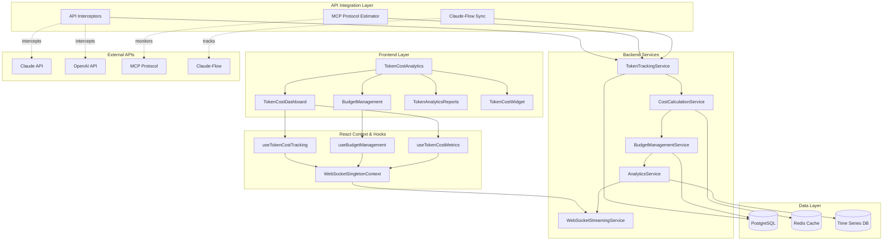
```mermaid
graph TB
    subgraph "Frontend Layer"
        TC[TokenCostAnalytics]
        TCD[TokenCostDashboard]
        BM[BudgetManagement]
        TAR[TokenAnalyticsReports]
        TCW[TokenCostWidget]
    end
    
    subgraph "React Context & Hooks"
        WSC[WebSocketSingletonContext]
        TCTK[useTokenCostTracking]
        BMH[useBudgetManagement]
        TCMH[useTokenCostMetrics]
    end
    
    subgraph "API Integration Layer"
        AI[API Interceptors]
        MCPE[MCP Protocol Estimator]
        CFS[Claude-Flow Sync]
    end
    
    subgraph "Backend Services"
        TTS[TokenTrackingService]
        CCS[CostCalculationService]
        BMS[BudgetManagementService]
        AS[AnalyticsService]
        WSS[WebSocketStreamingService]
    end
    
    subgraph "Data Layer"
        PG[(PostgreSQL)]
        RD[(Redis Cache)]
        TS[(Time Series DB)]
    end
    
    subgraph "External APIs"
        CLAUDE[Claude API]
        OPENAI[OpenAI API]
        MCP[MCP Protocol]
        CF[Claude-Flow]
    end
    
    TC --> TCD
    TC --> BM
    TC --> TAR
    TC --> TCW
    
    TCD --> TCTK
    TCD --> TCMH
    BM --> BMH
    
    TCTK --> WSC
    BMH --> WSC
    TCMH --> WSC
    
    WSC --> WSS
    
    AI --> TTS
    MCPE --> TTS
    CFS --> TTS
    
    TTS --> CCS
    CCS --> BMS
    BMS --> AS
    AS --> WSS
    
    TTS --> PG
    CCS --> RD
    BMS --> PG
    AS --> TS
    
    AI -.->|intercepts| CLAUDE
    AI -.->|intercepts| OPENAI
    MCPE -.->|monitors| MCP
    CFS -.->|tracks| CF
```

## Data Flow Architecture

### 1. Token Tracking Flow

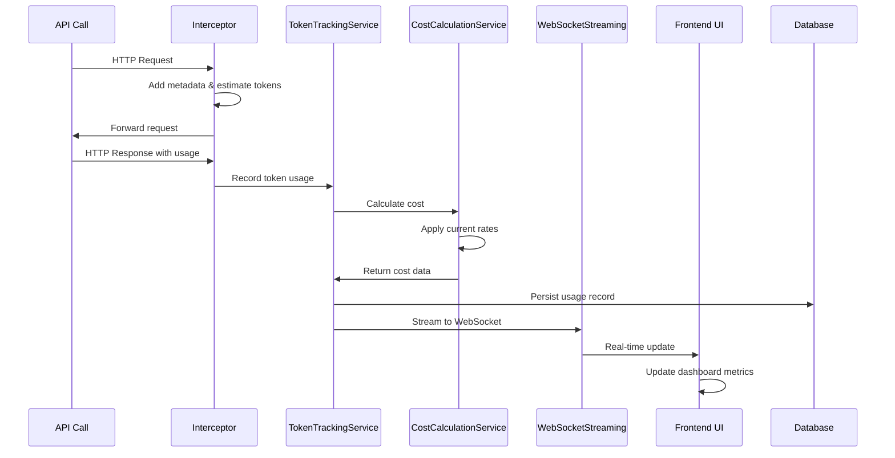
```mermaid
sequenceDiagram
    participant API as API Call
    participant INT as Interceptor
    participant TTS as TokenTrackingService
    participant CCS as CostCalculationService
    participant WSS as WebSocketStreaming
    participant UI as Frontend UI
    participant DB as Database
    
    API->>INT: HTTP Request
    INT->>INT: Add metadata & estimate tokens
    INT->>API: Forward request
    API->>INT: HTTP Response with usage
    INT->>TTS: Record token usage
    TTS->>CCS: Calculate cost
    CCS->>CCS: Apply current rates
    CCS->>TTS: Return cost data
    TTS->>DB: Persist usage record
    TTS->>WSS: Stream to WebSocket
    WSS->>UI: Real-time update
    UI->>UI: Update dashboard metrics
```

### 2. Budget Monitoring Flow

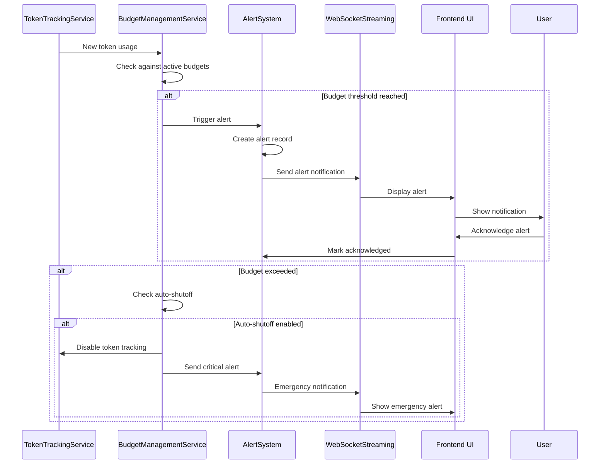
```mermaid
sequenceDiagram
    participant TTS as TokenTrackingService
    participant BMS as BudgetManagementService
    participant AS as AlertSystem
    participant WSS as WebSocketStreaming
    participant UI as Frontend UI
    participant USER as User
    
    TTS->>BMS: New token usage
    BMS->>BMS: Check against active budgets
    alt Budget threshold reached
        BMS->>AS: Trigger alert
        AS->>AS: Create alert record
        AS->>WSS: Send alert notification
        WSS->>UI: Display alert
        UI->>USER: Show notification
        USER->>UI: Acknowledge alert
        UI->>AS: Mark acknowledged
    end
    
    alt Budget exceeded
        BMS->>BMS: Check auto-shutoff
        alt Auto-shutoff enabled
            BMS->>TTS: Disable token tracking
            BMS->>AS: Send critical alert
            AS->>WSS: Emergency notification
            WSS->>UI: Show emergency alert
        end
    end
```

### 3. Real-time Updates Flow

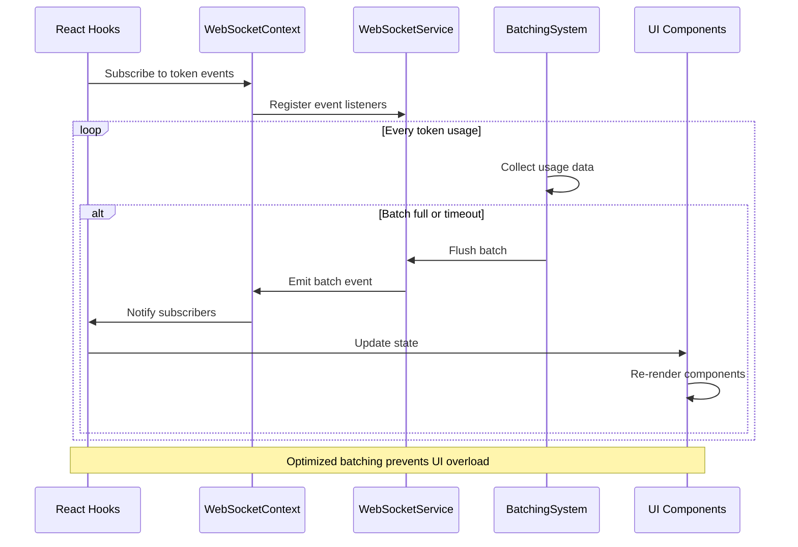
```mermaid
sequenceDiagram
    participant HOOKS as React Hooks
    participant WSC as WebSocketContext
    participant WSS as WebSocketService
    participant BS as BatchingSystem
    participant UI as UI Components
    
    HOOKS->>WSC: Subscribe to token events
    WSC->>WSS: Register event listeners
    
    loop Every token usage
        BS->>BS: Collect usage data
        alt Batch full or timeout
            BS->>WSS: Flush batch
            WSS->>WSC: Emit batch event
            WSC->>HOOKS: Notify subscribers
            HOOKS->>UI: Update state
            UI->>UI: Re-render components
        end
    end
    
    Note over HOOKS,UI: Optimized batching prevents UI overload
```

## Component Integration Architecture

### 1. TokenCostAnalytics Container

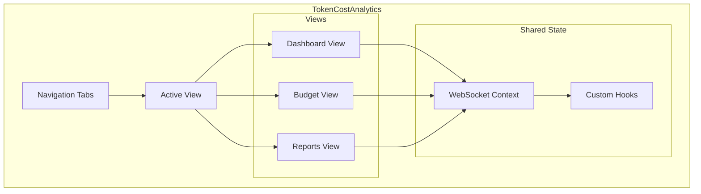
```mermaid
graph TB
    subgraph "TokenCostAnalytics"
        NAV[Navigation Tabs]
        VIEW[Active View]
        
        subgraph "Views"
            DASH[Dashboard View]
            BUDGET[Budget View]
            REPORTS[Reports View]
        end
        
        subgraph "Shared State"
            WSC[WebSocket Context]
            HOOKS[Custom Hooks]
        end
    end
    
    NAV --> VIEW
    VIEW --> DASH
    VIEW --> BUDGET
    VIEW --> REPORTS
    
    DASH --> WSC
    BUDGET --> WSC
    REPORTS --> WSC
    
    WSC --> HOOKS
```

### 2. Hook Dependencies

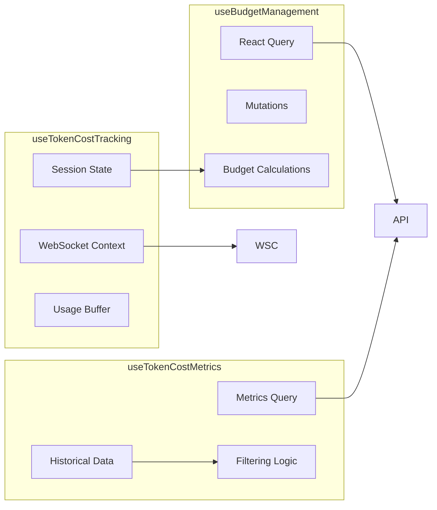
```mermaid
graph LR
    subgraph "useTokenCostTracking"
        TCT_WS[WebSocket Context]
        TCT_STATE[Session State]
        TCT_BUFFER[Usage Buffer]
    end
    
    subgraph "useBudgetManagement"
        BM_QUERY[React Query]
        BM_MUTATIONS[Mutations]
        BM_CALC[Budget Calculations]
    end
    
    subgraph "useTokenCostMetrics"
        TCM_QUERY[Metrics Query]
        TCM_HIST[Historical Data]
        TCM_FILTER[Filtering Logic]
    end
    
    TCT_WS --> WSC
    BM_QUERY --> API
    TCM_QUERY --> API
    
    TCT_STATE --> BM_CALC
    TCM_HIST --> TCM_FILTER
```

## API Integration Points

### 1. Token Interceptor Architecture

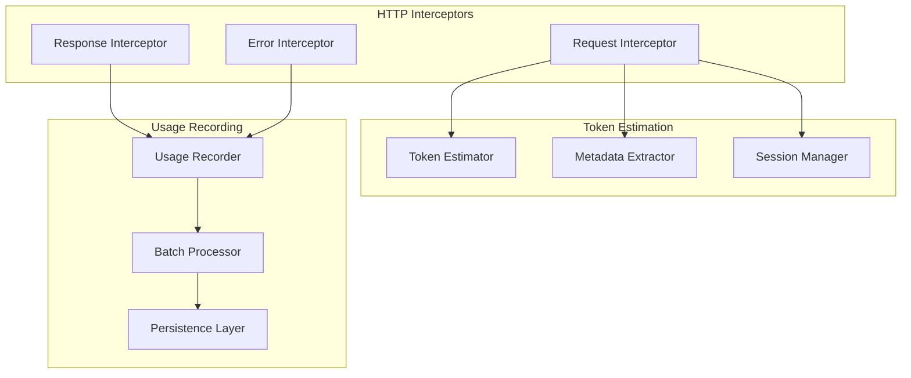
```mermaid
graph TB
    subgraph "HTTP Interceptors"
        REQ[Request Interceptor]
        RES[Response Interceptor]
        ERR[Error Interceptor]
    end
    
    subgraph "Token Estimation"
        EST[Token Estimator]
        META[Metadata Extractor]
        SESS[Session Manager]
    end
    
    subgraph "Usage Recording"
        REC[Usage Recorder]
        BATCH[Batch Processor]
        PERSIST[Persistence Layer]
    end
    
    REQ --> EST
    REQ --> META
    REQ --> SESS
    
    RES --> REC
    ERR --> REC
    
    REC --> BATCH
    BATCH --> PERSIST
```

### 2. MCP Protocol Integration

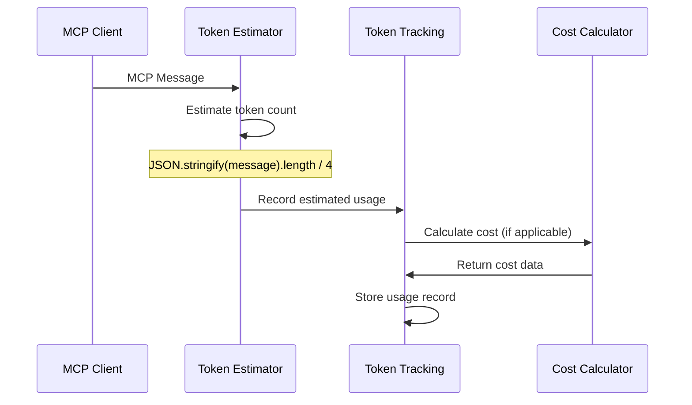
```mermaid
sequenceDiagram
    participant MCP as MCP Client
    participant EST as Token Estimator
    participant TTS as Token Tracking
    participant CCS as Cost Calculator
    
    MCP->>EST: MCP Message
    EST->>EST: Estimate token count
    Note over EST: JSON.stringify(message).length / 4
    EST->>TTS: Record estimated usage
    TTS->>CCS: Calculate cost (if applicable)
    CCS->>TTS: Return cost data
    TTS->>TTS: Store usage record
```

## Database Schema Architecture

### 1. Core Tables Relationships

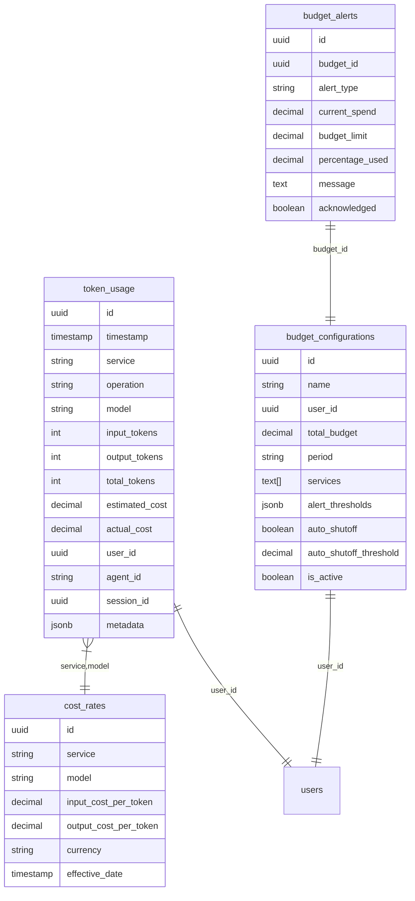
```mermaid
erDiagram
    token_usage {
        uuid id
        timestamp timestamp
        string service
        string operation
        string model
        int input_tokens
        int output_tokens
        int total_tokens
        decimal estimated_cost
        decimal actual_cost
        uuid user_id
        string agent_id
        uuid session_id
        jsonb metadata
    }
    
    budget_configurations {
        uuid id
        string name
        uuid user_id
        decimal total_budget
        string period
        text[] services
        jsonb alert_thresholds
        boolean auto_shutoff
        decimal auto_shutoff_threshold
        boolean is_active
    }
    
    budget_alerts {
        uuid id
        uuid budget_id
        string alert_type
        decimal current_spend
        decimal budget_limit
        decimal percentage_used
        text message
        boolean acknowledged
    }
    
    cost_rates {
        uuid id
        string service
        string model
        decimal input_cost_per_token
        decimal output_cost_per_token
        string currency
        timestamp effective_date
    }
    
    token_usage ||--|| users : user_id
    budget_configurations ||--|| users : user_id
    budget_alerts ||--|| budget_configurations : budget_id
    token_usage }|--|| cost_rates : "service,model"
```

### 2. Partitioning Strategy

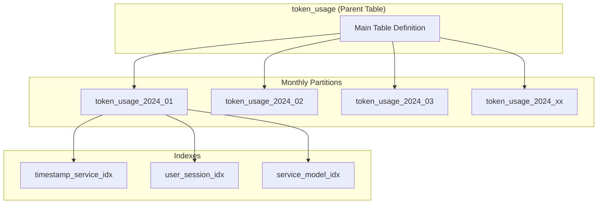
```mermaid
graph TB
    subgraph "token_usage (Parent Table)"
        MAIN[Main Table Definition]
    end
    
    subgraph "Monthly Partitions"
        P1[token_usage_2024_01]
        P2[token_usage_2024_02]
        P3[token_usage_2024_03]
        Pn[token_usage_2024_xx]
    end
    
    subgraph "Indexes"
        IDX1[timestamp_service_idx]
        IDX2[user_session_idx]
        IDX3[service_model_idx]
    end
    
    MAIN --> P1
    MAIN --> P2
    MAIN --> P3
    MAIN --> Pn
    
    P1 --> IDX1
    P1 --> IDX2
    P1 --> IDX3
```

## Performance Optimization Architecture

### 1. Caching Layers

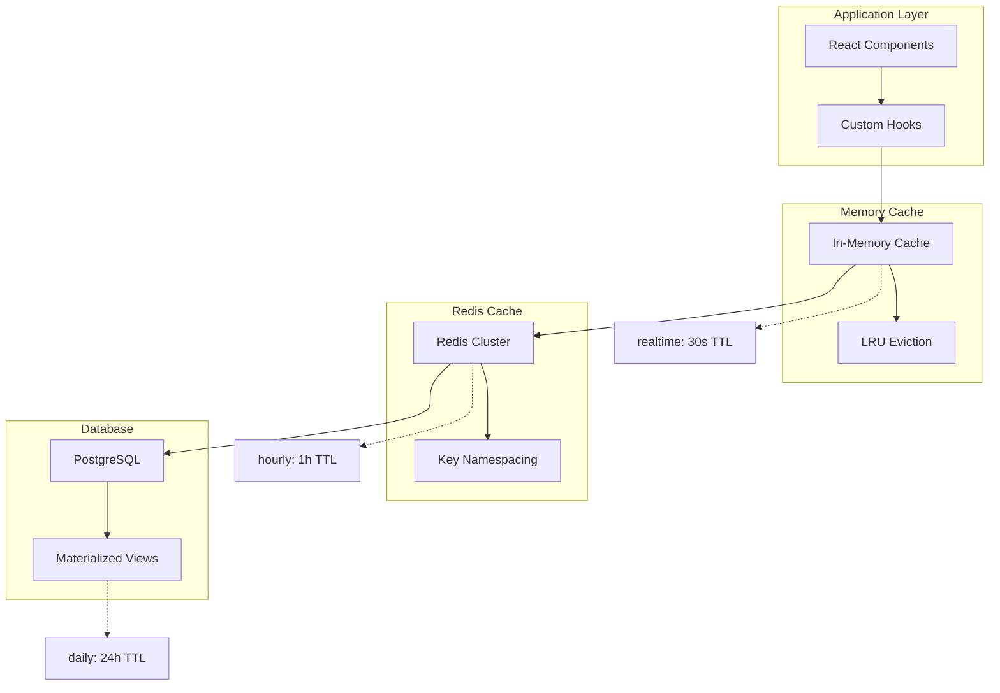
```mermaid
graph TB
    subgraph "Application Layer"
        APP[React Components]
        HOOKS[Custom Hooks]
    end
    
    subgraph "Memory Cache"
        MEM[In-Memory Cache]
        LRU[LRU Eviction]
    end
    
    subgraph "Redis Cache"
        REDIS[Redis Cluster]
        KEYS[Key Namespacing]
    end
    
    subgraph "Database"
        PG[PostgreSQL]
        MAT[Materialized Views]
    end
    
    APP --> HOOKS
    HOOKS --> MEM
    MEM --> REDIS
    REDIS --> PG
    
    MEM --> LRU
    REDIS --> KEYS
    PG --> MAT
    
    Note1[realtime: 30s TTL]
    Note2[hourly: 1h TTL]
    Note3[daily: 24h TTL]
    
    MEM -.-> Note1
    REDIS -.-> Note2
    MAT -.-> Note3
```

### 2. Data Streaming Optimization

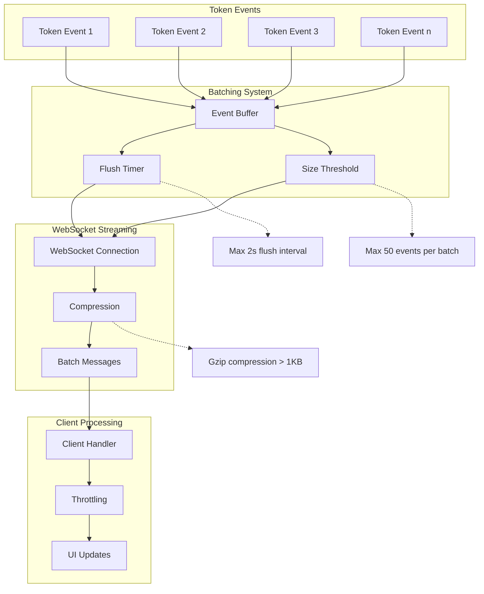
```mermaid
graph TB
    subgraph "Token Events"
        E1[Token Event 1]
        E2[Token Event 2]
        E3[Token Event 3]
        En[Token Event n]
    end
    
    subgraph "Batching System"
        BUFFER[Event Buffer]
        TIMER[Flush Timer]
        SIZE[Size Threshold]
    end
    
    subgraph "WebSocket Streaming"
        WS[WebSocket Connection]
        COMP[Compression]
        BATCH[Batch Messages]
    end
    
    subgraph "Client Processing"
        CLIENT[Client Handler]
        THROTTLE[Throttling]
        UPDATE[UI Updates]
    end
    
    E1 --> BUFFER
    E2 --> BUFFER
    E3 --> BUFFER
    En --> BUFFER
    
    BUFFER --> TIMER
    BUFFER --> SIZE
    
    TIMER --> WS
    SIZE --> WS
    
    WS --> COMP
    COMP --> BATCH
    BATCH --> CLIENT
    
    CLIENT --> THROTTLE
    THROTTLE --> UPDATE
    
    Note1[Max 50 events per batch]
    Note2[Max 2s flush interval]
    Note3[Gzip compression > 1KB]
    
    SIZE -.-> Note1
    TIMER -.-> Note2
    COMP -.-> Note3
```

## Security Architecture

### 1. Data Protection Flow

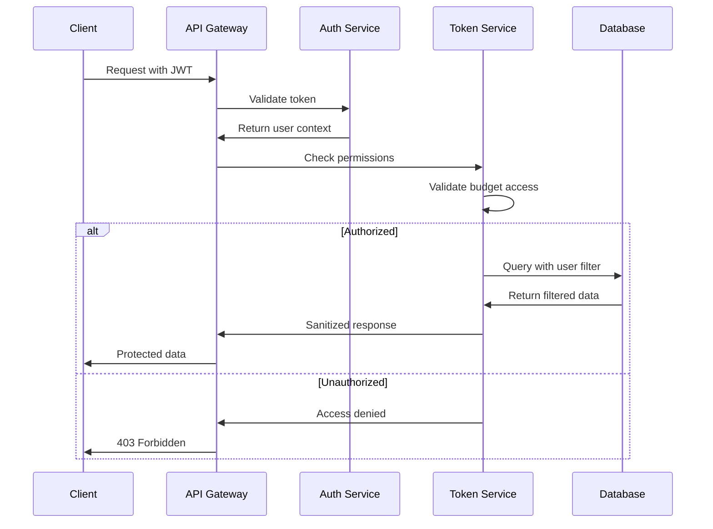
```mermaid
sequenceDiagram
    participant CLIENT as Client
    participant API as API Gateway
    participant AUTH as Auth Service
    participant TOKEN as Token Service
    participant DB as Database
    
    CLIENT->>API: Request with JWT
    API->>AUTH: Validate token
    AUTH->>API: Return user context
    API->>TOKEN: Check permissions
    TOKEN->>TOKEN: Validate budget access
    alt Authorized
        TOKEN->>DB: Query with user filter
        DB->>TOKEN: Return filtered data
        TOKEN->>API: Sanitized response
        API->>CLIENT: Protected data
    else Unauthorized
        TOKEN->>API: Access denied
        API->>CLIENT: 403 Forbidden
    end
```

### 2. Rate Limiting Architecture

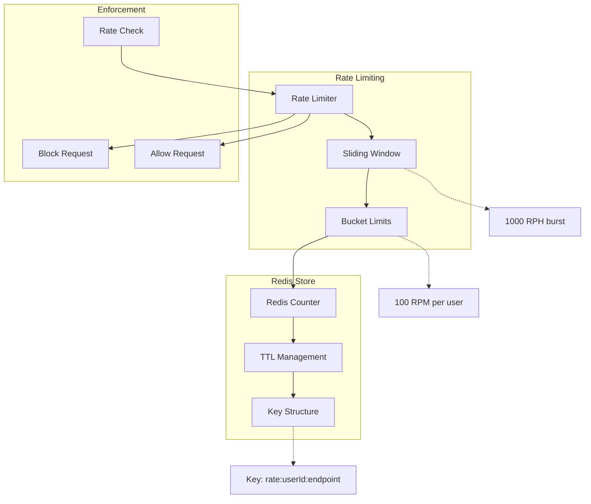
```mermaid
graph TB
    subgraph "Rate Limiting"
        RL[Rate Limiter]
        SW[Sliding Window]
        BL[Bucket Limits]
    end
    
    subgraph "Redis Store"
        REDIS[Redis Counter]
        TTL[TTL Management]
        KEYS[Key Structure]
    end
    
    subgraph "Enforcement"
        CHECK[Rate Check]
        BLOCK[Block Request]
        ALLOW[Allow Request]
    end
    
    RL --> SW
    SW --> BL
    BL --> REDIS
    REDIS --> TTL
    TTL --> KEYS
    
    CHECK --> RL
    RL --> BLOCK
    RL --> ALLOW
    
    Note1[100 RPM per user]
    Note2[1000 RPH burst]
    Note3[Key: rate:userId:endpoint]
    
    BL -.-> Note1
    SW -.-> Note2
    KEYS -.-> Note3
```

## Monitoring & Alerting Architecture

### 1. Health Check System

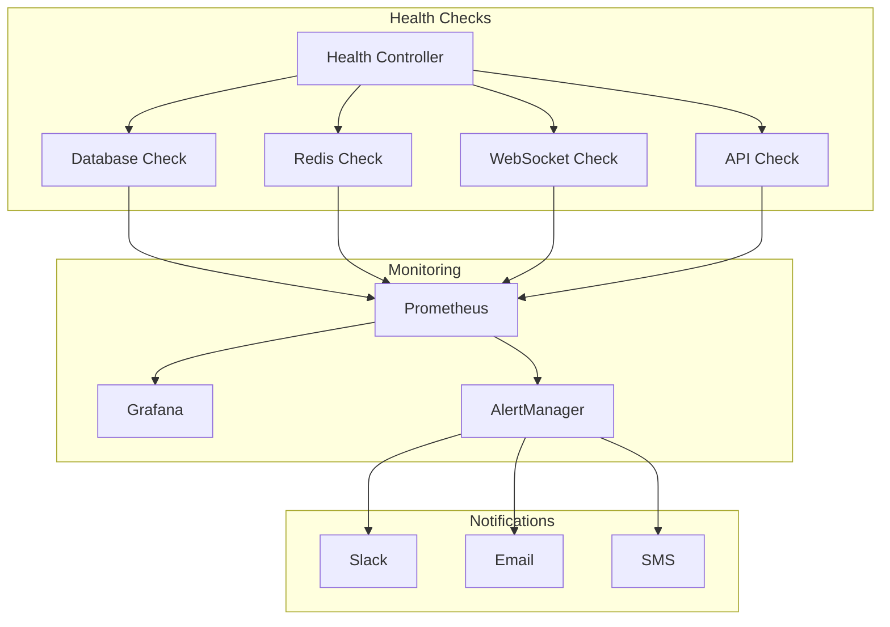
```mermaid
graph TB
    subgraph "Health Checks"
        HC[Health Controller]
        DB_CHECK[Database Check]
        REDIS_CHECK[Redis Check]
        WS_CHECK[WebSocket Check]
        API_CHECK[API Check]
    end
    
    subgraph "Monitoring"
        PROM[Prometheus]
        GRAF[Grafana]
        ALERT[AlertManager]
    end
    
    subgraph "Notifications"
        SLACK[Slack]
        EMAIL[Email]
        SMS[SMS]
    end
    
    HC --> DB_CHECK
    HC --> REDIS_CHECK
    HC --> WS_CHECK
    HC --> API_CHECK
    
    DB_CHECK --> PROM
    REDIS_CHECK --> PROM
    WS_CHECK --> PROM
    API_CHECK --> PROM
    
    PROM --> GRAF
    PROM --> ALERT
    
    ALERT --> SLACK
    ALERT --> EMAIL
    ALERT --> SMS
```

### 2. Cost Alert Flow

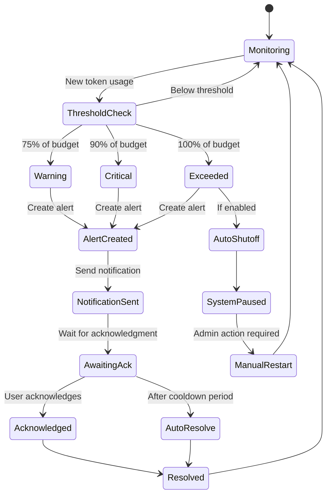
```mermaid
stateDiagram-v2
    [*] --> Monitoring
    
    Monitoring --> ThresholdCheck : New token usage
    
    ThresholdCheck --> Warning : 75% of budget
    ThresholdCheck --> Critical : 90% of budget
    ThresholdCheck --> Exceeded : 100% of budget
    ThresholdCheck --> Monitoring : Below threshold
    
    Warning --> AlertCreated : Create alert
    Critical --> AlertCreated : Create alert
    Exceeded --> AlertCreated : Create alert
    
    AlertCreated --> NotificationSent : Send notification
    
    NotificationSent --> AwaitingAck : Wait for acknowledgment
    
    AwaitingAck --> Acknowledged : User acknowledges
    AwaitingAck --> AutoResolve : After cooldown period
    
    Acknowledged --> Resolved
    AutoResolve --> Resolved
    
    Resolved --> Monitoring
    
    Exceeded --> AutoShutoff : If enabled
    AutoShutoff --> SystemPaused
    SystemPaused --> ManualRestart : Admin action required
    ManualRestart --> Monitoring
```

## Deployment Architecture

### 1. Kubernetes Deployment

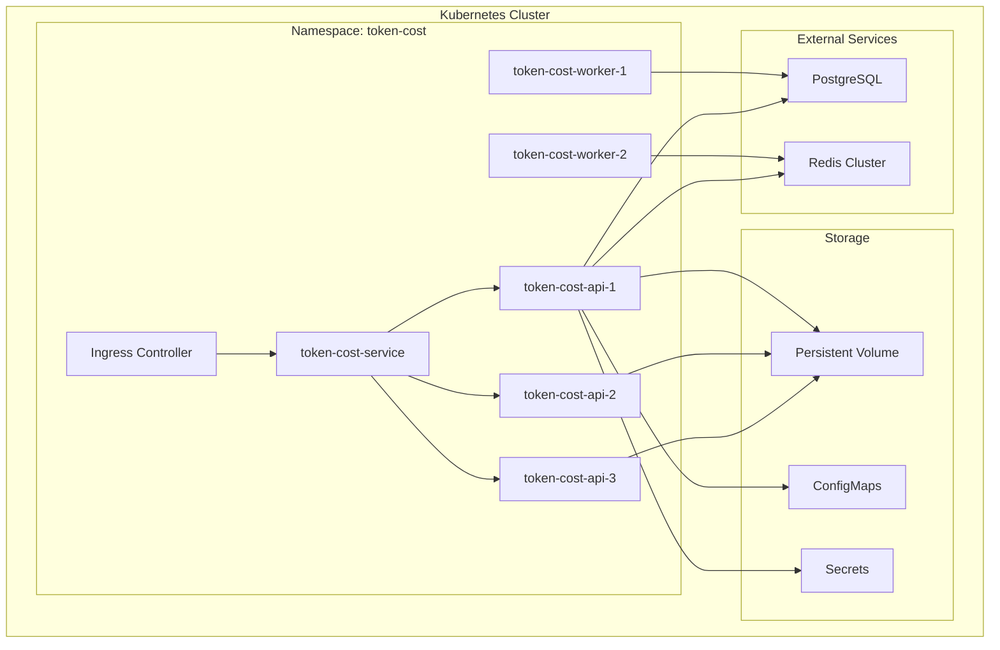
```mermaid
graph TB
    subgraph "Kubernetes Cluster"
        subgraph "Namespace: token-cost"
            POD1[token-cost-api-1]
            POD2[token-cost-api-2]
            POD3[token-cost-api-3]
            
            WORKER1[token-cost-worker-1]
            WORKER2[token-cost-worker-2]
            
            SERVICE[token-cost-service]
            INGRESS[Ingress Controller]
        end
        
        subgraph "Storage"
            PVC[Persistent Volume]
            CONFIG[ConfigMaps]
            SECRETS[Secrets]
        end
        
        subgraph "External Services"
            PG[PostgreSQL]
            REDIS[Redis Cluster]
        end
    end
    
    INGRESS --> SERVICE
    SERVICE --> POD1
    SERVICE --> POD2
    SERVICE --> POD3
    
    POD1 --> PVC
    POD2 --> PVC
    POD3 --> PVC
    
    POD1 --> CONFIG
    POD1 --> SECRETS
    
    WORKER1 --> PG
    WORKER2 --> REDIS
    
    POD1 --> PG
    POD1 --> REDIS
```

### 2. Scaling Strategy

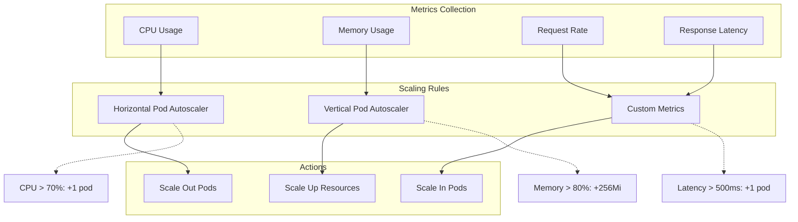
```mermaid
graph TB
    subgraph "Metrics Collection"
        CPU[CPU Usage]
        MEM[Memory Usage]
        REQ[Request Rate]
        LATENCY[Response Latency]
    end
    
    subgraph "Scaling Rules"
        HPA[Horizontal Pod Autoscaler]
        VPA[Vertical Pod Autoscaler]
        CUSTOM[Custom Metrics]
    end
    
    subgraph "Actions"
        SCALE_OUT[Scale Out Pods]
        SCALE_UP[Scale Up Resources]
        SCALE_IN[Scale In Pods]
    end
    
    CPU --> HPA
    MEM --> VPA
    REQ --> CUSTOM
    LATENCY --> CUSTOM
    
    HPA --> SCALE_OUT
    VPA --> SCALE_UP
    CUSTOM --> SCALE_IN
    
    Note1[CPU > 70%: +1 pod]
    Note2[Memory > 80%: +256Mi]
    Note3[Latency > 500ms: +1 pod]
    
    HPA -.-> Note1
    VPA -.-> Note2
    CUSTOM -.-> Note3
```

## Implementation Timeline

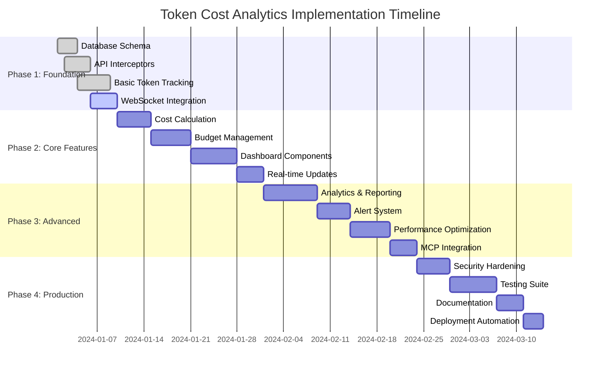
```mermaid
gantt
    title Token Cost Analytics Implementation Timeline
    dateFormat YYYY-MM-DD
    section Phase 1: Foundation
    Database Schema         :done, schema, 2024-01-01, 3d
    API Interceptors       :done, interceptors, 2024-01-02, 4d
    Basic Token Tracking   :done, tracking, 2024-01-04, 5d
    WebSocket Integration  :active, websocket, 2024-01-06, 4d
    
    section Phase 2: Core Features
    Cost Calculation       :calc, after websocket, 5d
    Budget Management      :budget, after calc, 6d
    Dashboard Components   :dashboard, after budget, 7d
    Real-time Updates      :realtime, after dashboard, 4d
    
    section Phase 3: Advanced
    Analytics & Reporting  :analytics, after realtime, 8d
    Alert System          :alerts, after analytics, 5d
    Performance Optimization :perf, after alerts, 6d
    MCP Integration       :mcp, after perf, 4d
    
    section Phase 4: Production
    Security Hardening    :security, after mcp, 5d
    Testing Suite         :testing, after security, 7d
    Documentation         :docs, after testing, 4d
    Deployment Automation :deploy, after docs, 3d
```

This comprehensive integration documentation provides detailed diagrams and flows for implementing the token cost analytics system, showing how all components work together to create a robust, scalable solution that integrates seamlessly with the existing architecture.