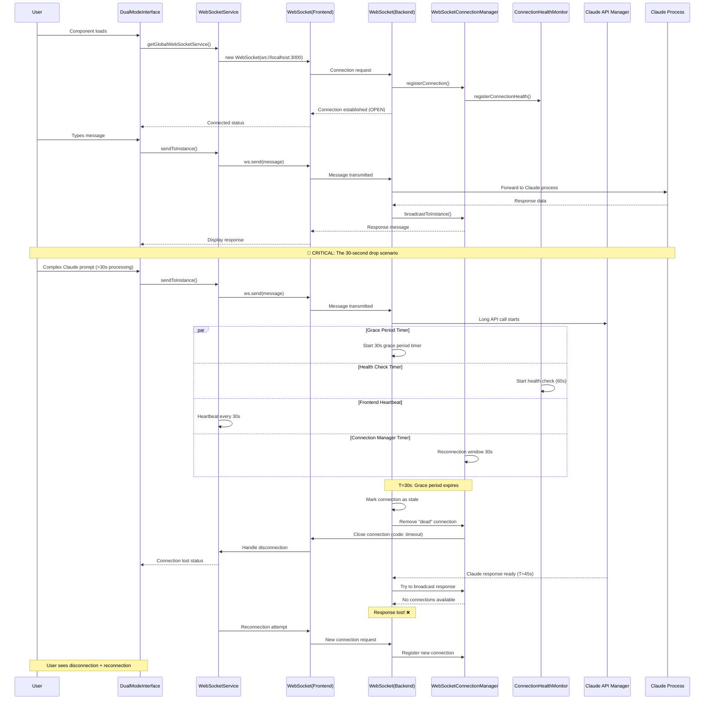
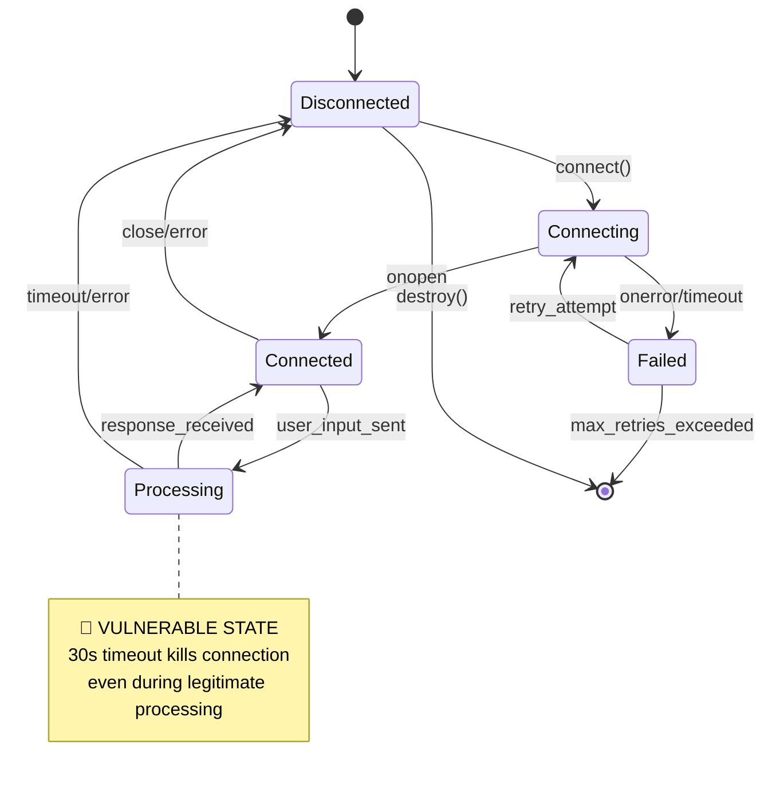
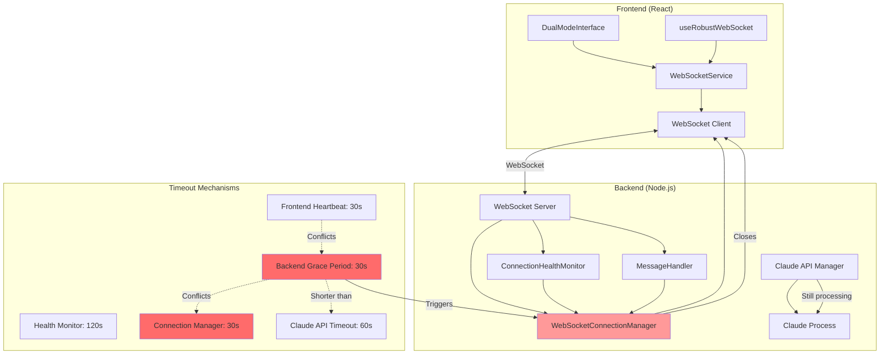
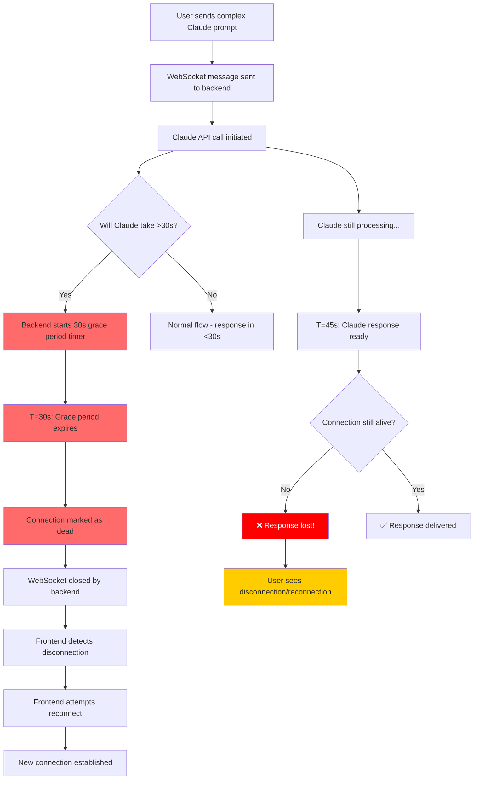
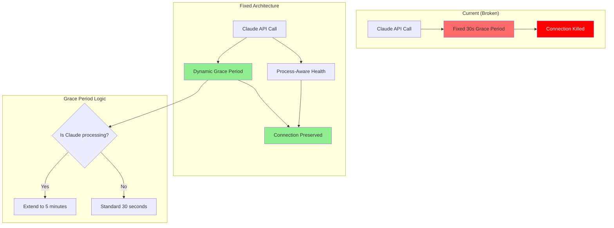
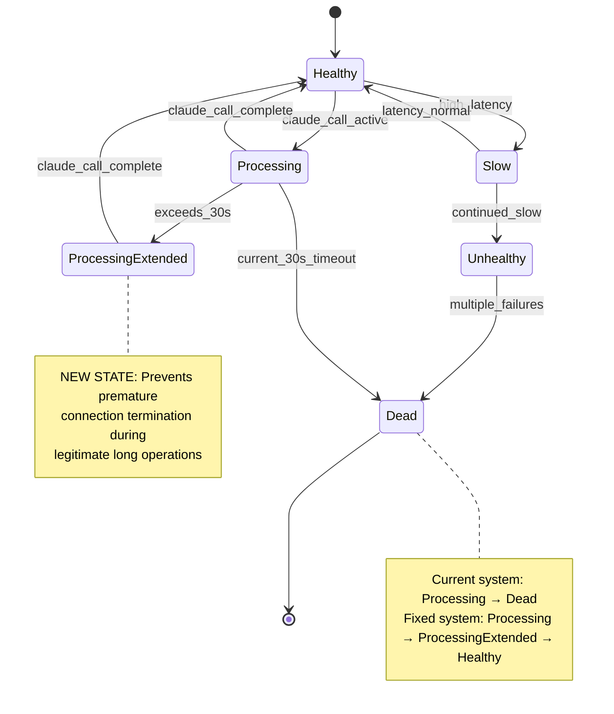

# WebSocket Connection Lifecycle Diagram - Agent Feed System

## Connection Flow Sequence Diagram

## State Transition Diagram

## Component Interaction Map

## Timeline Analysis - 30 Second Drop

```mermaid
gantt
    title Connection Lifecycle During 30s Drop Scenario
    dateFormat X
    axisFormat %Ss

    section User Action
    Complex prompt sent       :active, prompt, 0, 5

    section Claude Processing  
    Claude API call           :active, claude, 0, 45
    
    section Timeout Timers
    Grace period (30s)        :crit, grace, 0, 30
    Health monitor (120s)     :monitor, 0, 120
    Frontend heartbeat (30s)  :heartbeat, 0, 30
    Conn manager (30s)        :connmgr, 0, 30
    
    section Connection State
    Connection alive          :active, conn1, 0, 30
    Connection dead           :crit, dead, 30, 45
    Reconnection attempt      :reconn, 45, 50
    New connection            :active, conn2, 50, 120
    
    section Critical Events
    Grace period expires      :milestone, expire, 30, 0
    Response ready (lost)     :milestone, lost, 45, 0
    Reconnection complete     :milestone, recon, 50, 0
```

## Root Cause Flow Chart

## Recommended Architecture Fix

## Connection Health States

This comprehensive analysis reveals that the 30-second connection drops are a **deterministic design flaw** caused by competing timeout mechanisms. The fix requires making the connection management "Claude-aware" and coordinating timeout values across the system.