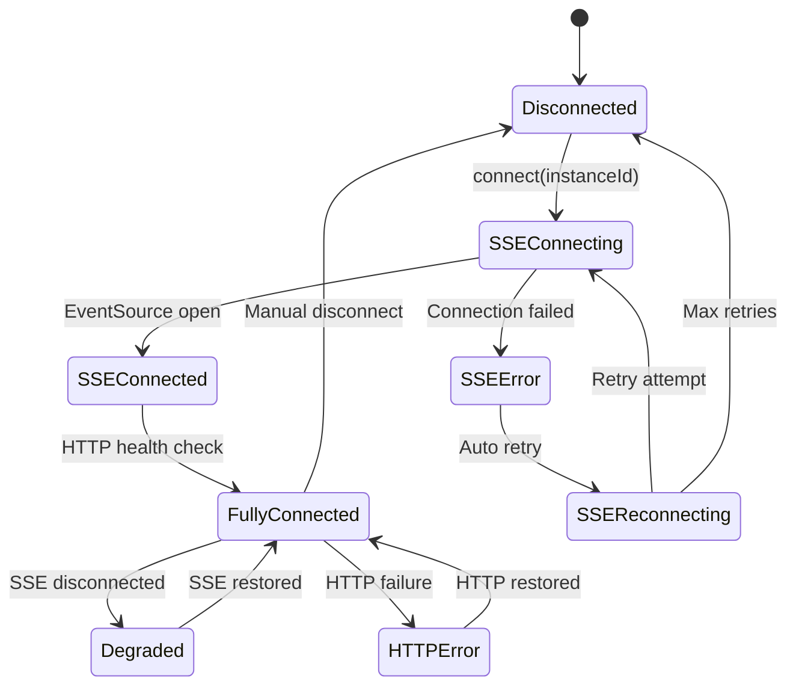

# WebSocket to HTTP+SSE Migration Specification
## Interactive Control Tab Enhancement

**Document Version**: 1.0  
**Date**: 2025-02-01  
**Status**: Requirements Analysis Complete  

---

## 1. Executive Summary

This specification details the migration of the Interactive Control tab's communication layer from WebSocket-based bidirectional communication to a hybrid HTTP+SSE (Server-Sent Events) architecture for improved reliability, debugging, and browser compatibility.

### 1.1 Migration Scope

**Current State**:
- ClaudeInstanceManager uses WebSocket via useWebSocketTerminal hook
- Single persistent connection for both input and output
- Connection managed through WebSocketTerminalManager singleton

**Target State**:
- HTTP POST for command input to `/api/claude/instances/{instanceId}/terminal/input`
- SSE stream for real-time output from `/api/claude/instances/{instanceId}/terminal/stream`
- Hybrid connection state management with automatic failover

---

## 2. System Architecture Analysis

### 2.1 Current WebSocket Implementation

```typescript
// Current flow in ClaudeInstanceManager.tsx
const { 
  socket, 
  isConnected, 
  connectionError, 
  connectSSE,       // Actually WebSocket
  startPolling, 
  disconnectFromInstance,
  on, off, emit
} = useHTTPSSE({     // Misnomer - currently WebSocket
  url: apiUrl,
  autoConnect: true
});
```

### 2.2 Existing SSE Infrastructure

**Backend Endpoints** (Already Available):
- ✅ SSE Stream: `GET /api/claude/instances/{instanceId}/terminal/stream`
- ✅ HTTP Input: `POST /api/claude/instances/{instanceId}/terminal/input`
- ✅ SSEConnectionManager service for connection lifecycle
- ✅ SSEEventStreamer for message broadcasting

**Current Backend Implementation**:
```typescript
// From simple-backend.js.backup analysis
app.get('/api/claude/instances/:instanceId/terminal/stream', (req, res) => {
  // SSE connection setup with proper headers
  // Event streaming: 'output', 'status', 'error'
});

app.post('/api/claude/instances/:instanceId/terminal/input', (req, res) => {
  // Command processing and forwarding to Claude process
  // Input validation and sanitization
});
```

---

## 3. Functional Requirements

### 3.1 Core Communication Functions

#### FR-3.1.1 Real-time Output Streaming
- **Requirement**: Stream Claude instance output via SSE with sub-second latency
- **Implementation**: EventSource connection to `/api/claude/instances/{instanceId}/terminal/stream`
- **Events**: `output`, `status`, `error`, `loading`, `permission_request`
- **Buffering**: Client-side accumulation with automatic scrolling
- **Format**: Text stream with ANSI escape sequence support

#### FR-3.1.2 Command Input Processing
- **Requirement**: Send commands via HTTP POST with immediate acknowledgment
- **Endpoint**: `POST /api/claude/instances/{instanceId}/terminal/input`
- **Payload**: `{ input: string, instanceId: string, timestamp: number }`
- **Response**: `{ success: boolean, commandId: string, queued: boolean }`
- **Validation**: Instance existence, command sanitization, rate limiting

#### FR-3.1.3 Connection State Management
- **Requirement**: Track SSE and HTTP connection health independently
- **States**: 
  - `disconnected` - No active connections
  - `sse-connecting` - SSE connection establishing
  - `sse-connected` - SSE receiving events
  - `http-ready` - HTTP input endpoint available
  - `fully-connected` - Both SSE and HTTP functional
  - `degraded` - Partial functionality (SSE or HTTP failing)
  - `error` - Connection failure requiring user intervention

#### FR-3.1.4 Automatic Reconnection
- **Requirement**: Exponential backoff reconnection for SSE failures
- **Strategy**: 
  - Initial delay: 1 second
  - Maximum delay: 30 seconds
  - Backoff factor: 2.0
  - Maximum attempts: 10
- **Triggers**: SSE connection loss, 503/502 responses, network errors
- **User Feedback**: Connection status indicator with retry countdown

#### FR-3.1.5 Error Handling and Recovery
- **Requirement**: Graceful handling of network failures and partial outages
- **HTTP Error Mapping**:
  - `404` - Instance not found → Show instance recreation UI
  - `429` - Rate limited → Show throttling message, auto-retry
  - `500` - Server error → Show error details, manual retry
  - `503` - Service unavailable → Show maintenance mode
- **SSE Error Recovery**: Automatic reconnection with connection health display

### 3.2 User Interface Requirements

#### FR-3.2.1 Terminal-like Interface
- **Requirement**: Maintain existing xterm.js integration
- **Features**: 
  - Scrollable output history (10,000 lines buffer)
  - ANSI color and formatting support
  - Copy/paste functionality
  - Search within output
- **Input**: Command line with Enter key submission
- **Indicators**: Connection status, command processing state

#### FR-3.2.2 Connection Status Display
- **Requirement**: Real-time connection health visualization
- **Elements**:
  - Connection type indicator (SSE + HTTP)
  - Latency display (when measurable)
  - Error messages with resolution suggestions
  - Reconnection progress and countdown
- **Colors**: Green (connected), Yellow (degraded), Red (failed)

---

## 4. Non-Functional Requirements

### 4.1 Performance Requirements

#### NFR-4.1.1 Response Time
- **HTTP Input Latency**: < 200ms for 95% of requests under normal load
- **SSE Output Latency**: < 100ms from backend event to frontend display
- **Connection Establishment**: < 2 seconds for both SSE and HTTP setup
- **Measurement**: Client-side performance monitoring with percentile tracking

#### NFR-4.1.2 Throughput
- **Command Rate**: Support 10 commands/second per instance (burst), 2/second sustained
- **Output Rate**: Handle 10MB/hour continuous output per instance
- **Concurrent Instances**: Support 20 active Claude instances simultaneously
- **Browser Limits**: Work within browser's 6 concurrent connections limit

#### NFR-4.1.3 Memory Efficiency
- **Output Buffer**: Maximum 50MB per instance (auto-truncation at 45MB)
- **Connection Overhead**: < 5MB for connection management structures
- **Garbage Collection**: Proactive cleanup of disconnected instance data
- **Memory Monitoring**: Automatic warnings at 80% of limits

### 4.2 Reliability Requirements

#### NFR-4.2.1 Availability
- **Target Uptime**: 99.5% availability during active Claude sessions
- **Failover Time**: < 5 seconds to detect and begin recovery from connection loss
- **Data Loss Prevention**: No command loss during connection transitions
- **Persistence**: Maintain output history across reconnections (session storage)

#### NFR-4.2.2 Error Tolerance
- **Network Interruption**: Automatic recovery within 30 seconds of network restoration
- **Server Restart**: Graceful reconnection to restored services
- **Partial Failure**: Continued operation with degraded functionality
- **Rate Limit Handling**: Automatic backoff and retry with user notification

### 4.3 Compatibility Requirements

#### NFR-4.3.1 Browser Support
- **Minimum Support**: Chrome 90+, Firefox 88+, Safari 14+, Edge 90+
- **EventSource**: Native EventSource API (no polyfills required)
- **HTTP/2**: Leverage HTTP/2 multiplexing where available
- **CORS**: Proper CORS configuration for cross-origin development

#### NFR-4.3.2 Mobile Support
- **Responsive Design**: Functional on tablet and mobile viewports
- **Touch Input**: Support for touch-based command input
- **Performance**: Maintain performance on mobile networks (3G+)
- **Battery**: Minimize battery drain through efficient event handling

---

## 5. Technical Architecture

### 5.1 Component Architecture

```typescript
// New hybrid communication hook
interface UseHTTPSSEResult {
  // Connection Management
  connectionState: ConnectionState;
  connect: (instanceId: string) => Promise<void>;
  disconnect: () => Promise<void>;
  
  // Communication
  sendCommand: (command: string) => Promise<CommandResponse>;
  
  // Event Handling  
  on: (event: string, handler: EventHandler) => void;
  off: (event: string, handler: EventHandler) => void;
  
  // Health Monitoring
  getConnectionHealth: () => ConnectionHealth;
  isConnected: boolean;
  lastError: Error | null;
}

interface ConnectionState {
  sse: {
    status: 'disconnected' | 'connecting' | 'connected' | 'error';
    eventSource: EventSource | null;
    lastMessage: number;
    reconnectAttempt: number;
  };
  http: {
    status: 'ready' | 'rate-limited' | 'error';
    lastCommand: number;
    pendingCommands: number;
    rateLimitReset: number;
  };
  overall: 'disconnected' | 'connecting' | 'connected' | 'degraded' | 'error';
}
```

### 5.2 Connection Lifecycle



### 5.3 Error Handling Strategy

```typescript
interface ErrorHandler {
  sseErrors: {
    connectionLost: () => void;      // Auto-reconnect
    serverError: () => void;         // Show error, manual retry
    rateLimited: () => void;         // Wait for reset
  };
  httpErrors: {
    instanceNotFound: () => void;    // Show instance recreation
    commandFailed: (error: any) => void;  // Show error details
    rateLimited: (resetTime: number) => void;  // Show countdown
  };
}
```

---

## 6. API Specification

### 6.1 HTTP Input Endpoint

#### Request Specification
```yaml
endpoint: POST /api/claude/instances/{instanceId}/terminal/input
headers:
  Content-Type: application/json
  Authorization: Bearer {token}  # Future authentication
  X-Client-ID: {clientId}       # Optional client tracking
body:
  type: object
  required: [input, instanceId]
  properties:
    input:
      type: string
      minLength: 1
      maxLength: 8192
      description: Command to send to Claude instance
    instanceId:
      type: string
      pattern: "^claude-[a-zA-Z0-9-]+$"
      description: Target Claude instance identifier
    timestamp:
      type: number
      description: Client timestamp for latency tracking
    commandId:
      type: string
      description: Client-generated command identifier
```

#### Response Specification
```yaml
success_response:
  status: 200
  body:
    type: object
    properties:
      success:
        type: boolean
        const: true
      commandId:
        type: string
        description: Server-assigned command identifier
      queued:
        type: boolean
        description: Whether command was queued or processed immediately
      timestamp:
        type: number
        description: Server processing timestamp
      latency:
        type: number
        description: Server-side processing time in milliseconds

error_responses:
  400:  # Bad Request
    body:
      success: false
      error: "validation_failed"
      details: string[]
  404:  # Instance Not Found
    body:
      success: false
      error: "instance_not_found"
      instanceId: string
  429:  # Rate Limited
    body:
      success: false
      error: "rate_limited"
      retryAfter: number  # Seconds until reset
      remaining: number   # Commands remaining this window
  500:  # Server Error
    body:
      success: false
      error: "server_error"
      message: string
```

### 6.2 SSE Stream Endpoint

#### Connection Specification
```yaml
endpoint: GET /api/claude/instances/{instanceId}/terminal/stream
headers:
  Accept: text/event-stream
  Cache-Control: no-cache
  Authorization: Bearer {token}  # Future authentication
parameters:
  instanceId:
    type: string
    pattern: "^claude-[a-zA-Z0-9-]+$"
    required: true
  lastEventId:
    type: string
    description: Resume from specific event (for reconnection)
    header: Last-Event-ID
```

#### Event Types Specification
```yaml
events:
  output:
    data:
      type: object
      properties:
        output:
          type: string
          description: Raw terminal output from Claude
        timestamp:
          type: number
          description: Server timestamp
        source:
          type: string
          enum: [stdout, stderr]
          default: stdout
    
  status:
    data:
      type: object
      properties:
        status:
          type: string
          enum: [starting, running, stopped, error]
        timestamp:
          type: number
        details:
          type: object
          description: Additional status information
    
  error:
    data:
      type: object
      properties:
        error:
          type: string
          description: Error message
        code:
          type: string
          description: Error classification
        recoverable:
          type: boolean
          description: Whether client should attempt recovery
        timestamp:
          type: number
    
  heartbeat:
    data:
      type: object
      properties:
        timestamp:
          type: number
        connectionId:
          type: string
```

---

## 7. Implementation Phases

### 7.1 Phase 1: Infrastructure Preparation
**Duration**: 2-3 days  
**Deliverables**:
- [ ] New `useHTTPSSE` hook implementation
- [ ] Connection state management system
- [ ] Error handling framework
- [ ] Basic HTTP POST command sending
- [ ] SSE connection with event parsing

### 7.2 Phase 2: Frontend Integration
**Duration**: 3-4 days  
**Deliverables**:
- [ ] ClaudeInstanceManager component migration
- [ ] Terminal interface adaptation
- [ ] Connection status UI components
- [ ] Error display and recovery UI
- [ ] Auto-reconnection logic

### 7.3 Phase 3: Advanced Features
**Duration**: 2-3 days  
**Deliverables**:
- [ ] Performance monitoring integration
- [ ] Memory management optimization
- [ ] Mobile responsiveness
- [ ] Advanced error recovery scenarios
- [ ] Connection health analytics

### 7.4 Phase 4: Testing and Validation
**Duration**: 2-3 days  
**Deliverables**:
- [ ] Unit tests for all components
- [ ] Integration tests for HTTP+SSE flow
- [ ] Performance benchmarking
- [ ] Error scenario testing
- [ ] Browser compatibility validation

---

## 8. Acceptance Criteria

### 8.1 Functional Acceptance Criteria

#### AC-8.1.1 Basic Communication
```gherkin
Feature: HTTP+SSE Terminal Communication

Scenario: Successful command execution
  Given a Claude instance is running with ID "claude-test-123"
  When I connect to the terminal interface
  Then I should see SSE connection established
  And HTTP input should be ready
  When I send command "echo 'Hello World'"
  Then I should receive HTTP 200 response within 200ms
  And I should see "Hello World" in terminal output within 500ms

Scenario: Connection recovery after network failure
  Given an active terminal session
  When network connection is lost for 5 seconds
  Then SSE should automatically reconnect within 10 seconds
  And terminal output should resume
  And connection status should show "connected"
```

#### AC-8.1.2 Error Handling
```gherkin
Scenario: Instance not found error
  Given no instance with ID "claude-invalid"
  When I send command "ls"
  Then I should receive HTTP 404 response
  And UI should display "Instance not found" error
  And UI should offer instance recreation option

Scenario: Rate limiting recovery
  Given I am rate limited (HTTP 429)
  When rate limit window resets
  Then commands should automatically resume
  And UI should show countdown during limit period
```

#### AC-8.1.3 Performance Requirements
```gherkin
Scenario: Response time validation
  Given a stable connection
  When I send 10 consecutive commands
  Then 95% should respond within 200ms
  And output should appear within 500ms
  And memory usage should not exceed 50MB per instance
```

### 8.2 Technical Acceptance Criteria

#### AC-8.2.1 Browser Compatibility
- [ ] Chrome 90+: Full functionality including EventSource
- [ ] Firefox 88+: All features working correctly  
- [ ] Safari 14+: Proper SSE handling and reconnection
- [ ] Edge 90+: Complete feature parity
- [ ] Mobile browsers: Basic functionality on touch devices

#### AC-8.2.2 Connection Management
- [ ] SSE connection establishes within 2 seconds
- [ ] HTTP endpoint responds within 200ms for 95% of requests
- [ ] Automatic reconnection after network interruption
- [ ] Graceful degradation when one connection type fails
- [ ] Memory cleanup after instance termination

#### AC-8.2.3 Error Scenarios
- [ ] Network disconnection: Auto-reconnect with exponential backoff
- [ ] Server restart: Reconnect to restored services within 30s
- [ ] Invalid instance ID: Clear error message and recovery options
- [ ] Rate limiting: Automatic retry with user notification
- [ ] Malformed responses: Graceful error handling without crashes

---

## 9. Security Considerations

### 9.1 Input Validation
- **Command Sanitization**: Validate all input commands for malicious content
- **Instance ID Validation**: Strict regex pattern matching for instance identifiers  
- **Rate Limiting**: Prevent command injection and DoS attacks
- **Content Length**: Enforce maximum command size limits

### 9.2 Authentication (Future)
- **Bearer Tokens**: JWT-based authentication for HTTP endpoints
- **SSE Authentication**: Token validation for EventSource connections
- **Session Management**: Secure session handling across connection types
- **CORS Configuration**: Proper cross-origin resource sharing setup

### 9.3 Data Protection  
- **Output Sanitization**: Clean terminal output of sensitive information
- **Error Message Safety**: Avoid exposing system internals in error responses
- **Connection Encryption**: HTTPS/WSS enforcement in production
- **Audit Logging**: Track all command execution and connection events

---

## 10. Monitoring and Observability

### 10.1 Key Performance Indicators
- **Connection Success Rate**: % of successful SSE connections
- **Command Success Rate**: % of HTTP commands processed successfully  
- **Average Response Time**: Mean latency for command processing
- **Reconnection Frequency**: Number of auto-reconnections per hour
- **Error Rate**: % of requests resulting in 4xx/5xx responses

### 10.2 Logging Requirements
- **Connection Events**: SSE connect/disconnect, HTTP request/response
- **Error Tracking**: All error scenarios with context and recovery actions
- **Performance Metrics**: Response times, throughput, resource usage
- **User Actions**: Command execution, connection management interactions
- **System Health**: Memory usage, connection counts, rate limit metrics

### 10.3 Alerting Thresholds
- **Error Rate**: > 5% over 5-minute window
- **Response Time**: > 500ms average over 2-minute window  
- **Connection Failures**: > 10% SSE connection failures over 10 minutes
- **Memory Usage**: > 80% of configured limits
- **Rate Limiting**: > 20% of requests being throttled

---

## 11. Migration Strategy

### 11.1 Backward Compatibility
- **Gradual Migration**: Feature flag to enable HTTP+SSE mode
- **Fallback Support**: Automatic fallback to WebSocket if HTTP+SSE fails
- **Configuration**: Environment variable to control communication mode
- **Testing**: Parallel testing of both communication methods

### 11.2 Rollback Plan
- **Feature Toggle**: Instant rollback via configuration change
- **Database Migration**: No database changes required for rollback
- **Client Update**: Frontend code supports both communication modes
- **Monitoring**: Real-time monitoring of migration success metrics

### 11.3 User Communication
- **Change Notification**: In-app notification of improved connection reliability
- **Documentation Update**: Update user guides with new connection behavior
- **Support Training**: Update support team on new error messages and recovery
- **Feedback Collection**: Mechanism for users to report connection issues

---

## 12. Success Metrics

### 12.1 Technical Success Criteria
- [ ] 99.5% uptime for terminal connections
- [ ] < 200ms average command response time
- [ ] < 5% error rate across all HTTP+SSE operations  
- [ ] Zero data loss during connection transitions
- [ ] 50% reduction in connection-related support tickets

### 12.2 User Experience Metrics
- [ ] Improved connection reliability feedback in user surveys
- [ ] Reduced time-to-recovery from connection failures
- [ ] Maintained or improved terminal responsiveness
- [ ] Successful operation across all supported browsers
- [ ] Positive developer experience with new debugging capabilities

---

**Document Control**:
- **Created**: 2025-02-01
- **Authors**: SPARC Development Team  
- **Reviewers**: Architecture Team, Product Team
- **Approval**: Technical Lead
- **Next Review**: Post-implementation retrospective

---

*This specification serves as the foundation for migrating the Interactive Control tab from WebSocket to HTTP+SSE architecture while maintaining reliability and improving debugging capabilities.*