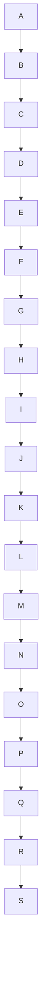
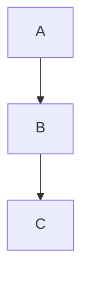
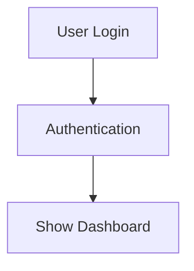
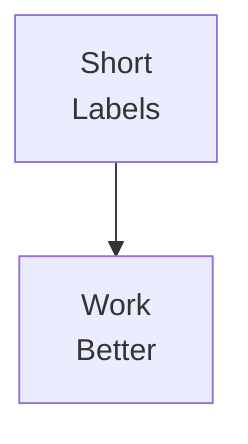

# Mermaid.js Integration Guide

This document explains how to use Mermaid diagrams in the MarkdownRenderer component.

## Overview

The `MarkdownRenderer` component now supports Mermaid.js diagrams, allowing you to create flowcharts, sequence diagrams, class diagrams, and many other diagram types using simple text-based syntax.

## Features

✅ **All Mermaid Diagram Types** - Supports flowcharts, sequence diagrams, class diagrams, state diagrams, ER diagrams, Gantt charts, pie charts, user journeys, git graphs, timelines, and more

✅ **Error Handling** - Graceful error handling with helpful error messages when diagram syntax is invalid

✅ **Responsive Design** - Diagrams automatically scale to fit their container

✅ **Dark Mode Compatible** - Diagrams work seamlessly in both light and dark modes

✅ **Production Ready** - Includes error boundaries, TypeScript types, and comprehensive testing

✅ **XSS Protection** - Mermaid runs in strict security mode to prevent XSS attacks

## Quick Start

### Basic Usage

```tsx
import { MarkdownRenderer } from './components/dynamic-page/MarkdownRenderer';

function MyComponent() {
  const markdown = `
# My Document

Here's a flowchart:

\`\`\`mermaid
graph TD
    A[Start] --> B{Decision}
    B -->|Yes| C[Success]
    B -->|No| D[Retry]
\`\`\`
  `;

  return <MarkdownRenderer content={markdown} />;
}
```

### Supported Diagram Types

#### 1. Flowchart

```markdown
\`\`\`mermaid
graph TD
    A[Start] --> B{Is it working?}
    B -->|Yes| C[Great!]
    B -->|No| D[Debug]
    D --> B
\`\`\`
```

#### 2. Sequence Diagram

```markdown
\`\`\`mermaid
sequenceDiagram
    participant User
    participant API
    participant DB

    User->>API: Request
    API->>DB: Query
    DB-->>API: Data
    API-->>User: Response
\`\`\`
```

#### 3. Class Diagram

```markdown
\`\`\`mermaid
classDiagram
    class Animal {
        +String name
        +int age
        +makeSound()
    }
    class Dog {
        +bark()
    }
    Animal <|-- Dog
\`\`\`
```

#### 4. State Diagram

```markdown
\`\`\`mermaid
stateDiagram-v2
    [*] --> Idle
    Idle --> Processing : Start
    Processing --> Success : Complete
    Processing --> Error : Fail
    Success --> [*]
    Error --> Idle : Retry
\`\`\`
```

#### 5. Entity Relationship Diagram

```markdown
\`\`\`mermaid
erDiagram
    USER ||--o{ ORDER : places
    ORDER ||--|{ LINE-ITEM : contains
    PRODUCT ||--o{ LINE-ITEM : "ordered in"
\`\`\`
```

#### 6. Gantt Chart

```markdown
\`\`\`mermaid
gantt
    title Project Timeline
    dateFormat YYYY-MM-DD
    section Phase 1
        Task 1 :a1, 2025-01-01, 30d
        Task 2 :after a1, 20d
    section Phase 2
        Task 3 :2025-02-01, 12d
\`\`\`
```

#### 7. Pie Chart

```markdown
\`\`\`mermaid
pie title Technology Distribution
    "React" : 40
    "Vue" : 30
    "Angular" : 20
    "Other" : 10
\`\`\`
```

#### 8. User Journey

```markdown
\`\`\`mermaid
journey
    title User Journey
    section Sign Up
        Visit site: 5: User
        Create account: 3: User
        Verify email: 2: User, System
    section First Use
        Complete onboarding: 4: User
        Make first action: 5: User
\`\`\`
```

#### 9. Git Graph

```markdown
\`\`\`mermaid
gitGraph
    commit
    branch develop
    checkout develop
    commit
    checkout main
    merge develop
    commit
\`\`\`
```

## Component API

### MarkdownRenderer Props

| Prop | Type | Default | Description |
|------|------|---------|-------------|
| `content` | `string` | required | Markdown content to render |
| `sanitize` | `boolean` | `true` | Enable XSS protection |
| `className` | `string` | `''` | Additional CSS classes |

### Example with Props

```tsx
<MarkdownRenderer
  content={markdownContent}
  sanitize={true}
  className="my-custom-class"
/>
```

## Advanced Usage

### Custom Mermaid Configuration

The Mermaid renderer is initialized with secure defaults. If you need to customize the configuration, you can modify the `MermaidDiagram` component in `MarkdownRenderer.tsx`:

```typescript
mermaid.initialize({
  startOnLoad: false,
  theme: 'default', // or 'dark', 'forest', 'neutral'
  securityLevel: 'strict',
  flowchart: {
    useMaxWidth: true,
    htmlLabels: true,
    curve: 'basis',
  },
  // ... other options
});
```

### Error Handling

Invalid Mermaid syntax will display a helpful error message:

```markdown
\`\`\`mermaid
graph INVALID
    This won't work!
\`\`\`
```

This will render:

> **Invalid Mermaid Syntax**
> Error message here
> [Show diagram code] (expandable details)

### Multiple Diagrams

You can include multiple diagrams in a single markdown document:

```markdown
# Architecture Overview

## Frontend Flow

\`\`\`mermaid
graph LR
    A[User] --> B[React App]
    B --> C[API]
\`\`\`

## Backend Flow

\`\`\`mermaid
sequenceDiagram
    API->>DB: Query
    DB-->>API: Data
\`\`\`
```

### Mixing Diagrams with Other Content

Mermaid diagrams can be mixed with regular markdown content:

```markdown
# Documentation

Regular markdown content here...

## System Flow

\`\`\`mermaid
graph TD
    A --> B
\`\`\`

More text here...

| Feature | Status |
|---------|--------|
| API     | ✓      |
| UI      | ✓      |

\`\`\`javascript
// Regular code blocks still work
const x = 10;
\`\`\`
```

## Styling and Theming

### Default Styling

Diagrams are rendered with:
- White background in light mode
- Dark background in dark mode
- Responsive sizing
- Center alignment
- Box shadow for depth
- Horizontal scrolling for large diagrams

### Custom Styling

You can customize diagram containers using the `className` prop:

```tsx
<MarkdownRenderer
  content={markdown}
  className="custom-diagrams"
/>
```

Then in your CSS:

```css
.custom-diagrams .mermaid-diagram {
  background: #f0f0f0;
  border-radius: 12px;
  padding: 2rem;
}
```

## Best Practices

### 1. Keep Diagrams Simple

Avoid overly complex diagrams. Split large diagrams into smaller, focused ones:

❌ **Don't:**


✅ **Do:**
```mermaid
graph TD
    A --> B --> C

graph TD
    D --> E --> F
```

### 2. Use Descriptive Labels

❌ **Don't:**


✅ **Do:**


### 3. Handle Errors Gracefully

Always test your diagrams before deploying. Use the error details to fix syntax issues.

### 4. Consider Mobile Users

Keep diagrams responsive and avoid horizontal overflow:



### 5. Use Appropriate Diagram Types

Choose the right diagram for your use case:
- **Flowcharts**: Process flows, decision trees
- **Sequence**: API calls, interactions
- **Class**: Object relationships
- **State**: State machines, lifecycles
- **ER**: Database schemas
- **Gantt**: Project timelines
- **Pie**: Proportional data

## Performance Considerations

### Rendering Performance

- Each diagram is rendered asynchronously
- Large diagrams may take longer to render
- Loading states are shown during rendering
- Error boundaries prevent crashes

### Optimization Tips

1. **Limit Diagram Complexity**: Keep nodes under 50 per diagram
2. **Use Pagination**: Split large process flows across multiple pages
3. **Lazy Load**: Load diagrams only when needed
4. **Cache Results**: Consider caching rendered SVGs for static content

## Troubleshooting

### Common Issues

#### 1. Diagram Not Rendering

**Problem**: Diagram shows loading forever
**Solution**: Check browser console for errors, verify Mermaid syntax

#### 2. Syntax Error

**Problem**: "Invalid Mermaid Syntax" message
**Solution**: Click "Show diagram code" and check syntax against [Mermaid docs](https://mermaid.js.org/)

#### 3. Diagram Too Wide

**Problem**: Horizontal scrolling on mobile
**Solution**: Use shorter labels or break into multiple diagrams

#### 4. Dark Mode Issues

**Problem**: Diagram hard to read in dark mode
**Solution**: Mermaid uses default theme that adapts automatically

### Debug Mode

Enable debug logging by modifying the Mermaid config:

```typescript
mermaid.initialize({
  logLevel: 'debug', // or 'info', 'warn', 'error'
  // ... other config
});
```

## Resources

- [Mermaid Official Documentation](https://mermaid.js.org/)
- [Live Editor](https://mermaid.live/)
- [Diagram Syntax Reference](https://mermaid.js.org/intro/syntax-reference.html)
- [Mermaid GitHub](https://github.com/mermaid-js/mermaid)

## Examples

See `mermaid-examples.md` for comprehensive examples of all diagram types.

## TypeScript Support

Full TypeScript definitions are available in `/src/types/mermaid.d.ts`.

```typescript
import type { MermaidDiagramProps, MermaidConfig } from '@/types/mermaid';
```

## Testing

Test your Mermaid integration using the demo component:

```tsx
import { MermaidDemo } from './components/dynamic-page/MermaidDemo';

function TestPage() {
  return <MermaidDemo />;
}
```

## Security

- **XSS Protection**: Mermaid runs in `strict` security mode
- **Sanitization**: All markdown content is sanitized by default
- **No Script Execution**: Diagrams cannot execute JavaScript
- **Safe Rendering**: Error boundaries prevent crashes

## License

This integration uses [Mermaid.js](https://github.com/mermaid-js/mermaid) which is licensed under MIT.
