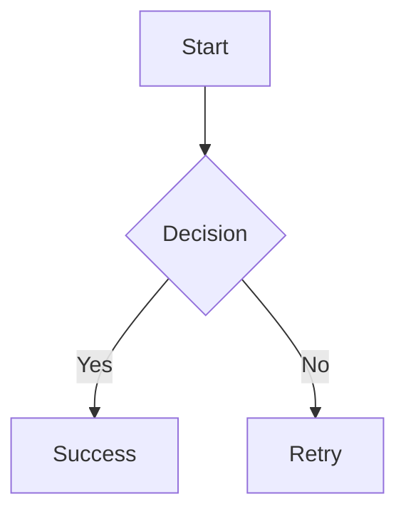
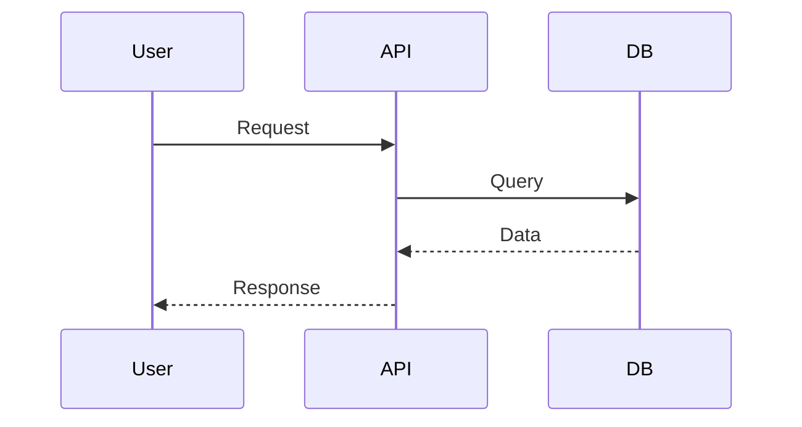
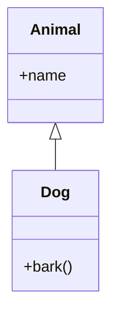
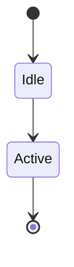
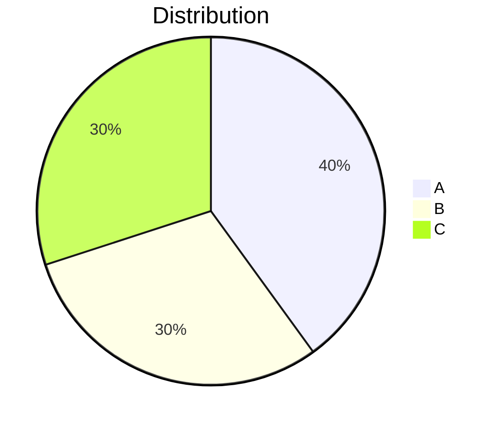

# Mermaid Quick Start Guide

## Installation

Mermaid is already installed! Just start using it in markdown.

## Basic Usage

```tsx
import MarkdownRenderer from '@/components/markdown/MarkdownRenderer';

const content = `
\`\`\`mermaid
graph TD
    A[Start] --> B[End]
\`\`\`
`;

<MarkdownRenderer content={content} />
```

## Common Diagram Types

### 1. Flowchart


### 2. Sequence Diagram


### 3. Class Diagram


### 4. State Diagram


### 5. Pie Chart


## Quick Tips

✅ **Always use backticks** with `mermaid` language tag
✅ **Test syntax** at https://mermaid.live before deploying
✅ **Keep it simple** - avoid overly complex diagrams
✅ **Use labels** - make diagrams self-explanatory

## Error Handling

Invalid syntax will show:
- ❌ Error message
- 📄 Expandable code view
- 🔍 Helpful debugging info

## More Resources

- 📚 Full docs: `/src/components/markdown/README.md`
- 🎨 Examples: `/mermaid-examples.md`
- 🔧 Integration guide: `/MERMAID_INTEGRATION.md`
- 🧪 Demo: `<MermaidDemo />`

## File Locations

```
/src/components/markdown/
├── MarkdownRenderer.tsx (main component)
├── CodeBlock.tsx (code + mermaid)
├── MermaidDiagram.tsx (diagram renderer)
└── MermaidDemo.tsx (demo)
```

## Support

All Mermaid diagram types are supported:
- Flowchart, Sequence, Class, State
- ER, Gantt, Pie, Journey
- Git Graph, Timeline, Mindmap

## Troubleshooting

**Diagram not showing?**
1. Check syntax at mermaid.live
2. Ensure backticks are correct: \`\`\`mermaid
3. Check browser console for errors

**Styling issues?**
- Diagrams auto-adapt to light/dark mode
- Use responsive containers
- Test on mobile devices

That's it! Start creating diagrams now! 🎉
