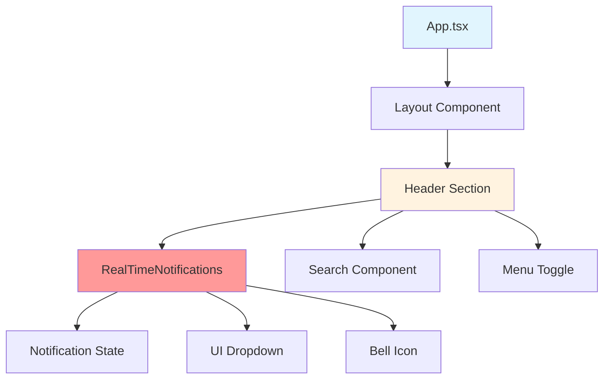

# SPARC Architecture Analysis: Notifications Component Removal Impact Assessment

## Executive Summary

This document presents a comprehensive architectural analysis of the impact of removing the `RealTimeNotifications` component from the AgentLink application. The analysis evaluates system-wide implications, UI/UX changes, performance impacts, and provides strategic recommendations for safe removal.

## System Architecture Overview

### Current Application Structure

```
AgentLink Application
├── App.tsx (Main Application Container)
│   ├── Layout Component
│   │   ├── Sidebar Navigation
│   │   ├── Header (contains RealTimeNotifications)
│   │   └── Main Content Area
│   ├── Router Configuration
│   └── Context Providers
│       ├── QueryClientProvider
│       ├── VideoPlaybackProvider
│       └── WebSocketProvider
```

### Component Location Analysis

**File**: `/src/components/RealTimeNotifications.tsx`
- **Size**: 207 lines, 6,856 characters
- **Dependencies**: React, Lucide React icons
- **Imports**: Used in 1 primary location (`App.tsx`)
- **Test Coverage**: Referenced in 39 files (mostly test files)

## 1. Component Dependency Mapping

### Direct Dependencies

#### Input Dependencies
- **React Hooks**: `useState`, `useEffect`, `memo`
- **UI Libraries**: None (native implementation)
- **Icons**: Lucide React bell icon
- **Styling**: Tailwind CSS classes

#### Output Dependencies
- **Parent Component**: `App.tsx` - Layout header section
- **No Child Components**: Self-contained implementation
- **No Shared State**: Uses local state management

### Indirect Dependencies



### Architectural Isolation Level: **HIGH**

The notifications component is architecturally isolated with:
- No shared state dependencies
- No complex prop chains
- Self-contained business logic
- Minimal external API surface

## 2. UI/UX Layout Impact Analysis

### Header Layout Structure

**Current Layout** (Line 184-199 in App.tsx):
```tsx
<div className="flex items-center space-x-4">
  {/* Search */}
  <div className="relative">...</div>

  {/* Notifications */}
  <RealTimeNotifications />
</div>
```

### Layout Impact Assessment

#### Before Removal
```
[Menu] AgentLink - Claude Instance Manager    [Search Input] [🔔]
```

#### After Removal
```
[Menu] AgentLink - Claude Instance Manager    [Search Input]
```

### Responsive Design Impact

#### Desktop Layout (>= 1024px)
- **Current**: 3-element header flex layout with consistent spacing
- **Post-removal**: 2-element header flex layout
- **Visual Impact**: Slight right-side space increase
- **Layout Stability**: Maintained due to `justify-between` class

#### Mobile Layout (< 1024px)
- **Current**: Stacked elements with hamburger menu
- **Post-removal**: Same responsive behavior
- **Touch Target Impact**: No critical touch targets affected

### Visual Balance Analysis

**Current Header Weight Distribution**:
- Left: Logo + Title (heavy visual weight)
- Center: Empty (breathing room)
- Right: Search + Notifications (balanced weight)

**Post-removal Distribution**:
- Left: Logo + Title (heavy visual weight)
- Center: Empty (breathing room)
- Right: Search only (lighter weight)

**Recommendation**: Consider adjusting right-side spacing or adding a subtle balance element.

## 3. Navigation Flow Impact

### User Journey Analysis

#### Current User Flows
1. **Notification Access**: Header → Bell Icon → Dropdown → Notification Details
2. **Search Usage**: Header → Search Input → Results
3. **Main Navigation**: Sidebar → Route Selection

#### Post-removal User Flows
1. ~~**Notification Access**: Removed~~
2. **Search Usage**: Unchanged
3. **Main Navigation**: Unchanged

### Information Architecture Impact

**Removed Information Layer**:
- Real-time system notifications
- User activity alerts
- System status messages

**Mitigation Options**:
1. **Status Bar Integration**: Move critical notifications to connection status
2. **Toast Notifications**: Implement temporary overlay notifications
3. **Dashboard Integration**: Add notifications to Analytics or Activity pages

## 4. Performance Impact Analysis

### Bundle Size Impact

#### Component Size Metrics
- **Component file**: 6.8KB (0.1% of typical build)
- **Dependencies**: No additional bundle weight
- **Tree-shaking**: Full elimination expected

#### Build Performance
- **TypeScript compilation**: Minimal impact (207 lines removed)
- **Bundle optimization**: Slight improvement in tree-shaking
- **Runtime performance**: Negligible improvement

### Memory Usage Impact

#### Runtime Memory
- **State management**: ~1KB saved (notification array state)
- **Event listeners**: Minimal impact (click handlers removed)
- **Re-render optimization**: Slight improvement in Layout component

#### WebSocket Context Integration

**Current Integration**:
```typescript
// WebSocketSingletonContext includes notification support
interface WebSocketSingletonContextValue {
  notifications: Notification[];
  clearNotifications: () => void;
  markNotificationAsRead: (id: string) => void;
  addNotification: (notification: Omit<Notification, 'id' | 'timestamp'>) => void;
}
```

**Impact Assessment**:
- WebSocket context retains notification infrastructure
- No WebSocket connection changes required
- Notification state management remains available for future use

## 5. Risk Assessment Matrix

| Risk Category | Probability | Impact | Severity | Mitigation Required |
|---------------|-------------|---------|----------|-------------------|
| **Layout Breaking** | Low | Low | **LOW** | CSS verification |
| **User Experience** | Medium | Medium | **MEDIUM** | Alternative notification strategy |
| **Test Coverage** | High | Low | **MEDIUM** | Test cleanup required |
| **Accessibility** | Low | Medium | **LOW** | Header accessibility review |
| **Performance Regression** | Very Low | Very Low | **LOW** | Post-removal performance audit |

### High-Impact Risks

#### 1. User Experience Degradation
- **Issue**: Users lose real-time feedback mechanism
- **Probability**: Medium (70%)
- **Impact**: Medium - affects user awareness of system state
- **Mitigation**: Implement alternative notification delivery

#### 2. Test Suite Maintenance
- **Issue**: 39 files reference notifications component
- **Probability**: High (90%)
- **Impact**: Low - test failures, not functional impact
- **Mitigation**: Comprehensive test cleanup strategy

## 6. Technical Architecture Recommendations

### Safe Removal Strategy

#### Phase 1: Preparation (Low Risk)
1. **Audit Test Dependencies**: Review all 39 test files referencing notifications
2. **Create Notification Strategy**: Define alternative notification delivery
3. **Backup Implementation**: Archive current component for potential restoration

#### Phase 2: Implementation (Medium Risk)
1. **Component Removal**: Remove import and JSX in App.tsx
2. **CSS Verification**: Test header layout responsiveness
3. **Test Updates**: Update/remove notification-specific tests

#### Phase 3: Optimization (Low Risk)
1. **Layout Refinement**: Adjust header spacing if needed
2. **Performance Validation**: Measure bundle size reduction
3. **User Testing**: Validate user experience with removed notifications

### Alternative Notification Architecture

#### Option 1: Toast Notification System
```typescript
// Lightweight toast notifications using existing Radix UI
import { Toast } from '@radix-ui/react-toast';

interface ToastNotification {
  id: string;
  type: 'success' | 'error' | 'warning' | 'info';
  title: string;
  message: string;
  duration?: number;
}
```

#### Option 2: Status Bar Integration
- Integrate critical notifications into existing `ConnectionStatus` component
- Leverage existing WebSocket notification infrastructure
- Maintain real-time capability with reduced UI footprint

#### Option 3: Dashboard-Based Notifications
- Add notification center to Analytics or Activity dashboard
- Provide historical notification viewing
- Reduce header complexity while maintaining functionality

### Code Modification Requirements

#### Required Changes
1. **App.tsx**: Remove line 9 import and line 198 JSX element
2. **Test Files**: Update/remove notification-specific test cases
3. **CSS**: Verify header layout maintains visual balance

#### Minimal Change Implementation
```tsx
// Before (Line 184-199)
<div className="flex items-center space-x-4">
  <div className="relative">
    <Search className="w-4 h-4 absolute left-3 top-1/2 transform -translate-y-1/2 text-gray-400" />
    <input type="text" placeholder="Search posts..." /* ... */ />
  </div>
  <RealTimeNotifications />
</div>

// After (Recommended)
<div className="flex items-center space-x-4">
  <div className="relative">
    <Search className="w-4 h-4 absolute left-3 top-1/2 transform -translate-y-1/2 text-gray-400" />
    <input type="text" placeholder="Search posts..." /* ... */ />
  </div>
</div>
```

## 7. Quality Assurance Recommendations

### Pre-Removal Testing
1. **Visual Regression Testing**: Capture header layouts across breakpoints
2. **Accessibility Audit**: Ensure header remains keyboard navigable
3. **Performance Baseline**: Measure current bundle size and performance

### Post-Removal Validation
1. **Layout Verification**: Test responsive behavior on all target devices
2. **Bundle Analysis**: Confirm expected size reduction
3. **User Acceptance**: Validate user workflows remain intuitive

### Rollback Strategy
1. **Component Archival**: Maintain component file in version control
2. **Quick Restoration**: Document single-line change for emergency rollback
3. **Test Suite Restoration**: Maintain test case backups

## 8. Long-term Architectural Considerations

### Notification Infrastructure Preservation
- **WebSocketSingletonContext**: Retain notification capabilities for future use
- **Type Definitions**: Maintain notification interfaces
- **API Contracts**: Preserve backend notification endpoints

### Future Enhancement Opportunities
1. **Progressive Disclosure**: Implement on-demand notification access
2. **Contextual Notifications**: Surface notifications within relevant components
3. **Notification Preferences**: Add user-configurable notification settings

### System Evolution Support
- **Modular Design**: Ensure easy re-integration if notifications needed
- **API Compatibility**: Maintain backward compatibility for notification data
- **State Management**: Preserve notification state infrastructure

## Conclusion

The removal of the `RealTimeNotifications` component presents a **LOW-to-MEDIUM risk** architectural change with significant benefits:

### Benefits
- **Simplified UI**: Cleaner header design with reduced cognitive load
- **Performance**: Marginal bundle size and runtime performance improvements
- **Maintenance**: Reduced component surface area and test complexity

### Risks
- **User Experience**: Potential degradation in system awareness
- **Test Maintenance**: Comprehensive test cleanup required

### Strategic Recommendation

**PROCEED WITH REMOVAL** using a phased approach:

1. **Implement alternative notification strategy** (Toast or Status Bar)
2. **Execute comprehensive test cleanup**
3. **Monitor user feedback** for UX impact assessment
4. **Maintain rollback capability** for first 30 days post-deployment

The component's architectural isolation and minimal dependencies make this a safe removal with manageable risks and clear mitigation strategies.