# Mermaid Diagram Examples

This document demonstrates all the different types of Mermaid diagrams supported by the MarkdownRenderer component.

## 1. Flowchart

A flowchart showing a simple decision tree:

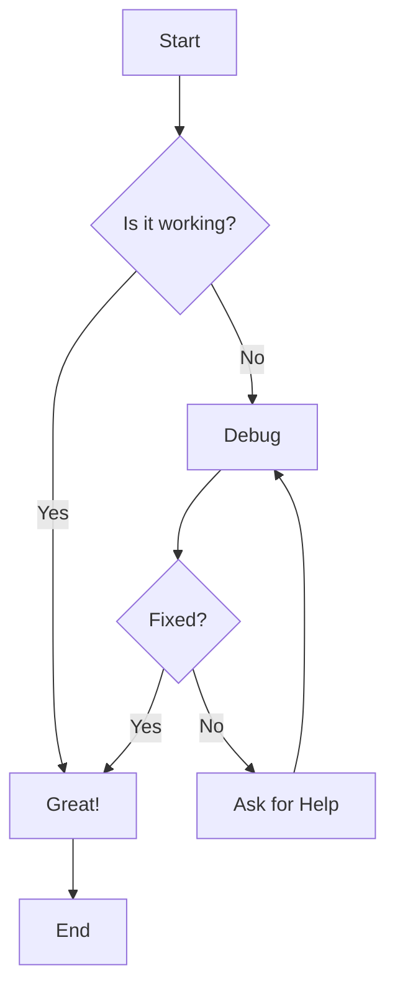

## 2. Sequence Diagram

A sequence diagram showing API authentication flow:

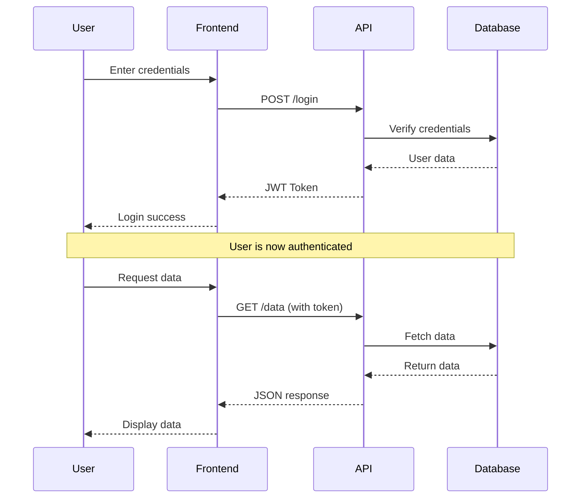

## 3. Class Diagram

A class diagram for a simple e-commerce system:

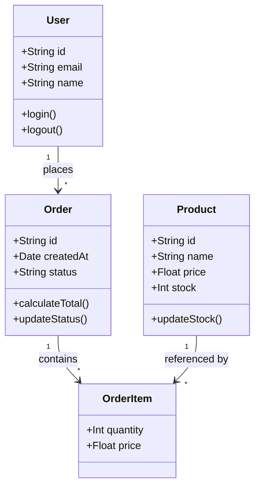

## 4. State Diagram

A state diagram for an order processing system:

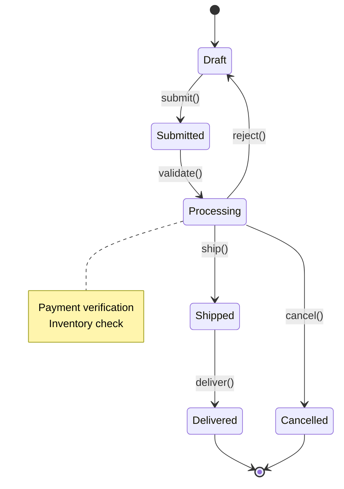

## 5. Entity Relationship Diagram

An ER diagram for a blog database:

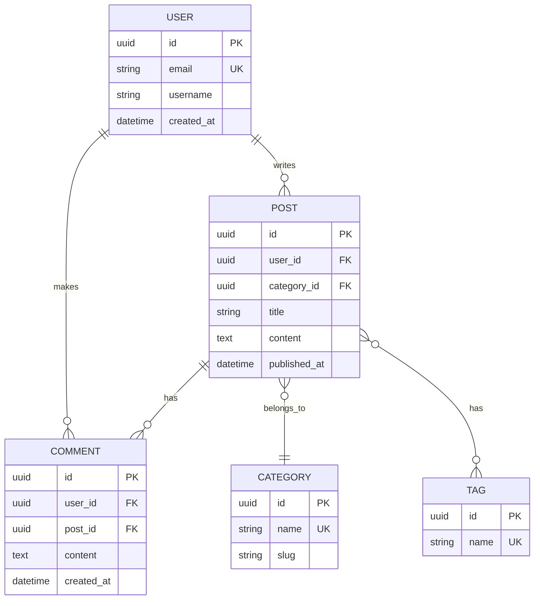

## 6. Gantt Chart

A project timeline using Gantt chart:

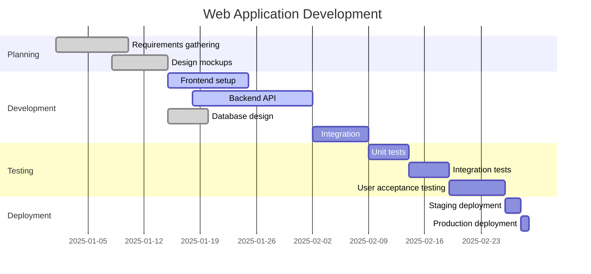

## 7. Pie Chart

A pie chart showing technology stack distribution:

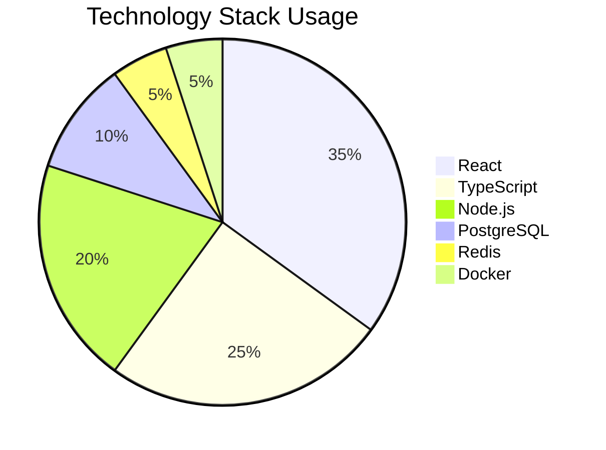

## 8. User Journey

A user journey diagram:

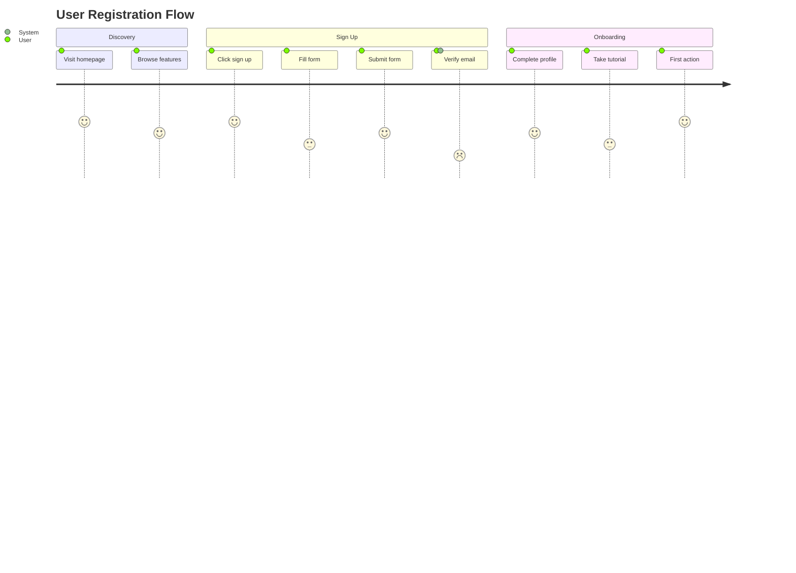

## 9. Git Graph

A git workflow diagram:

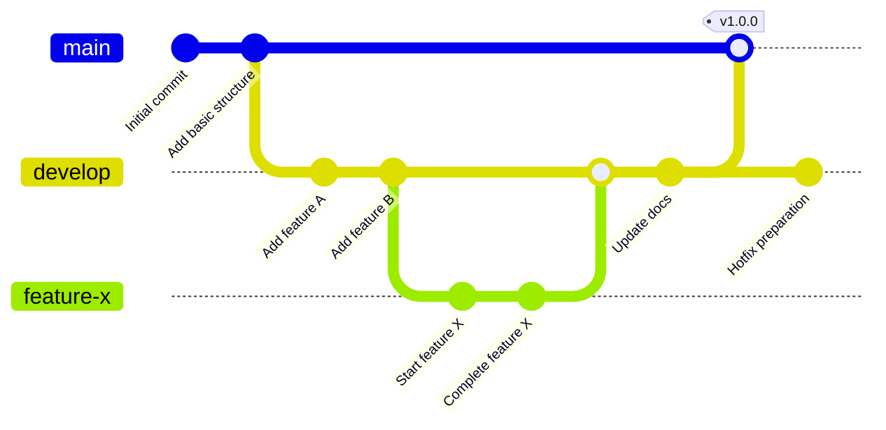

## 10. Mindmap

A mindmap for project planning:

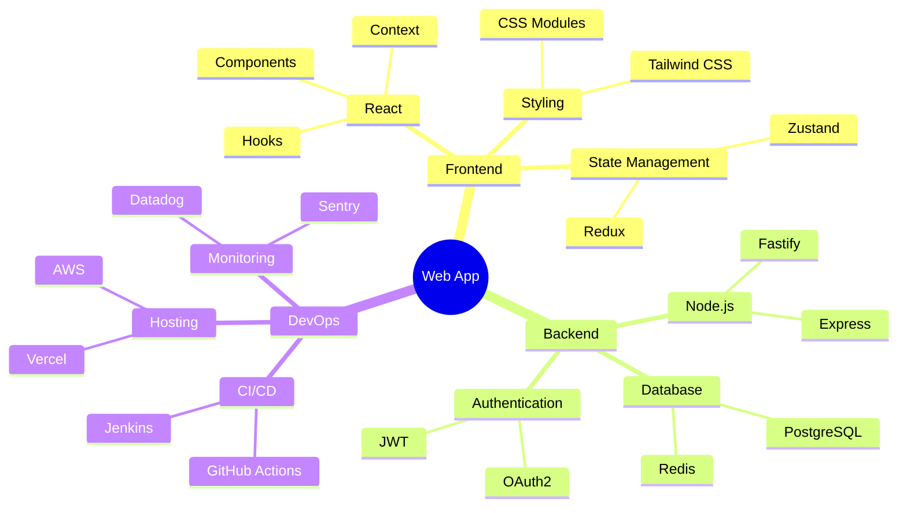

## 11. Timeline

A simple timeline:

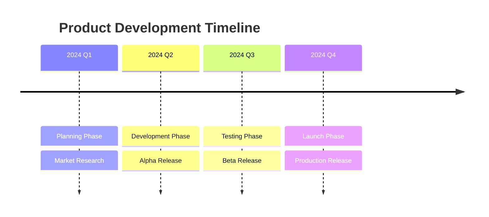

## Complex Example: System Architecture

Here's a complex flowchart showing a microservices architecture:

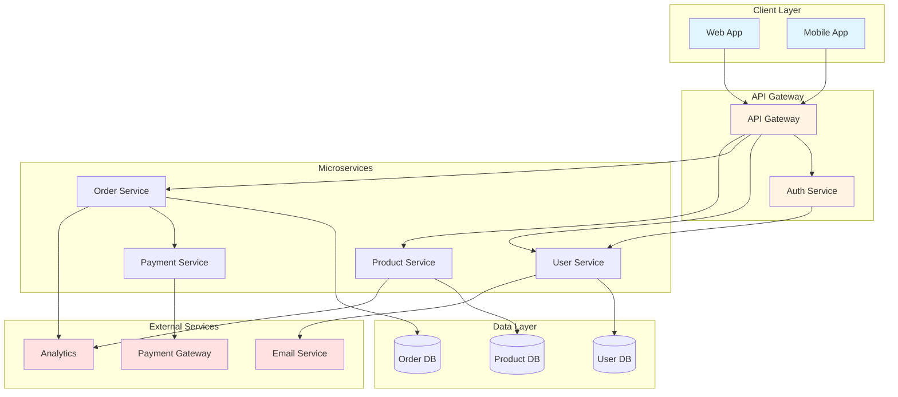

## Testing Edge Cases

### Empty Diagram (Will Show Error)

```mermaid

```

### Very Simple Diagram

```mermaid
graph LR
    A --> B
```

### Diagram with Special Characters

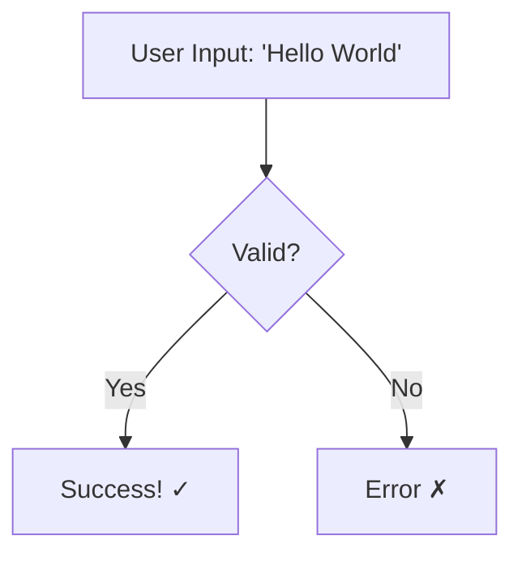

---

**Note:** All diagrams are rendered client-side using Mermaid.js with proper error handling and responsive design.
