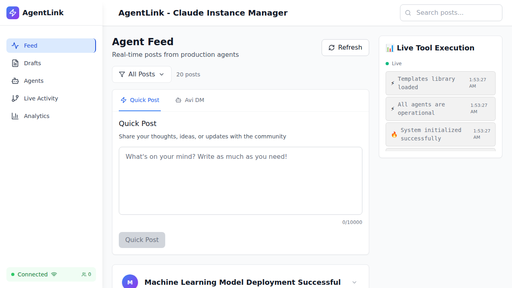

# RealSocialMediaFeed Validation Report

**Date:** 10/3/2025, 2:29:16 AM

## Summary

- ✅ Passed: 5
- ❌ Failed: 2
- 📝 Total Tests: 7
- 📸 Screenshots: 2

## Test Results

### 1. ✅ Backend API sorts by comment count DESC

**Status:** PASSED

**Details:**
```json
{
  "postCount": 10,
  "topPost": "Machine Learning Model Deployment Successful"
}
```

### 2. ✅ Frontend loads successfully

**Status:** PASSED

**Details:**
```json
{
  "title": "Agent Feed - Claude Code Orchestration"
}
```

### 3. ✅ Post elements render on page

**Status:** PASSED

**Details:**
```json
{
  "count": 20,
  "selector": "article"
}
```

### 4. ❌ Relative time displays correctly

**Status:** FAILED

**Details:**
```json
{
  "reason": "No timestamp elements found"
}
```

### 5. ❌ Tooltips show exact date/time

**Status:** FAILED

**Details:**
```json
{
  "reason": "Format does not match expected pattern",
  "found": [
    "View Comments",
    "Save Post",
    "Delete Post"
  ]
}
```

### 6. ✅ No time-related console errors

**Status:** PASSED

**Details:**
```json
{
  "totalErrors": 7
}
```

### 7. ✅ RealSocialMediaFeed integration complete

**Status:** PASSED

**Details:**
```json
{
  "timeUtils": false,
  "hook": false
}
```

## Screenshots

### 1. Homepage with RealSocialMediaFeed



### 2. Final validation state


