# Production System Architecture Overview

## System Architecture Diagram

```mermaid
graph TB
    subgraph "Development Environment"
        DevClaude[Development Claude]
        DevWorkspace[dev/agent_workspace]
        SystemInstructions[System Instructions<br/>Creator & Manager]
    end
    
    subgraph "Production Environment - READ-ONLY ZONE"
        ProdClaude[Production Claude<br/>READ-ONLY ACCESS]
        SystemInstructionsRO[prod/system_instructions/<br/>🔒 READ-ONLY]
        
        subgraph "Read-Only Components"
            API_RO[API Definitions<br/>🔒 READ-ONLY]
            Rules_RO[System Rules<br/>🔒 READ-ONLY] 
            Architecture_RO[Architecture Docs<br/>🔒 READ-ONLY]
        end
    end
    
    subgraph "Production Environment - WRITABLE ZONE"
        ProdWorkspace[prod/agent_workspace<br/>✅ READ-WRITE]
        ProdLogs[prod/logs<br/>✅ READ-WRITE]
        ProdDebug[prod/debug<br/>✅ READ-WRITE]
        ProdBackups[prod/backups<br/>✅ READ-WRITE]
    end
    
    subgraph "Protection Layer"
        FileSystemPerms[File System Permissions<br/>444/555]
        AppLevelBlocks[Application-Level Blocks]
        MonitoringSystem[Real-time Monitoring]
        IntegrityChecks[Integrity Verification]
    end
    
    subgraph "Shared Resources"
        Database[(Database)]
        WebSocket[WebSocket Server]
        APIServer[API Server]
    end
    
    %% Development Flow
    DevClaude --> SystemInstructions
    SystemInstructions --> SystemInstructionsRO
    DevClaude --> DevWorkspace
    
    %% Production Read-Only Access
    ProdClaude -.->|READ ONLY| SystemInstructionsRO
    ProdClaude -.->|READ ONLY| API_RO
    ProdClaude -.->|READ ONLY| Rules_RO
    ProdClaude -.->|READ ONLY| Architecture_RO
    
    %% Production Write Access
    ProdClaude --> ProdWorkspace
    ProdClaude --> ProdLogs
    ProdClaude --> ProdDebug
    ProdClaude --> ProdBackups
    
    %% Protection Mechanisms
    FileSystemPerms --> SystemInstructionsRO
    AppLevelBlocks --> ProdClaude
    MonitoringSystem --> SystemInstructionsRO
    IntegrityChecks --> SystemInstructionsRO
    
    %% Shared Access
    DevClaude --> Database
    ProdClaude --> Database
    DevClaude --> WebSocket
    ProdClaude --> WebSocket
    DevClaude --> APIServer
    ProdClaude --> APIServer
    
    style SystemInstructionsRO fill:#ffcccc,stroke:#cc0000,stroke-width:3px
    style API_RO fill:#ffcccc,stroke:#cc0000,stroke-width:2px
    style Rules_RO fill:#ffcccc,stroke:#cc0000,stroke-width:2px
    style Architecture_RO fill:#ffcccc,stroke:#cc0000,stroke-width:2px
    style ProdWorkspace fill:#ccffcc,stroke:#00cc00,stroke-width:2px
    style ProdLogs fill:#ccffcc,stroke:#00cc00,stroke-width:2px
    style ProdDebug fill:#ccffcc,stroke:#00cc00,stroke-width:2px
    style ProdBackups fill:#ccffcc,stroke:#00cc00,stroke-width:2px
```



## Core Components

### 1. Development Environment
**Purpose**: Complete system control and modification capabilities

**Components**:
- **Development Claude**: Full read-write access to entire system
- **Development Workspace**: Unrestricted workspace for development activities  
- **System Instructions Creator**: Manages and updates system instructions

**Responsibilities**:
- Create and modify system instructions
- Develop and test new features
- Manage system configurations
- Deploy updates to production environment

### 2. Production Environment - Read-Only Zone
**Purpose**: Immutable system instructions and configuration

**Components**:
- **Production Claude**: Read-only access to system instructions
- **System Instructions Directory**: Bulletproof read-only instruction set
- **API Definitions**: Immutable API contracts and schemas
- **System Rules**: Fixed operational boundaries and constraints
- **Architecture Documentation**: Static system architecture information

**Protection Characteristics**:
- File permissions: 444 (read-only) for files, 555 for directories
- Application-level write blocks
- Real-time integrity monitoring
- Automatic corruption detection and recovery

### 3. Production Environment - Writable Zone
**Purpose**: Operational workspace for production activities

**Components**:
- **Production Agent Workspace**: Isolated work environment
- **Production Logs**: System and operational logging
- **Production Debug**: Debugging and troubleshooting data
- **Production Backups**: Automated backup storage

**Access Characteristics**:
- Full read-write access for production Claude
- Resource quotas and limits enforced
- Automatic cleanup and maintenance
- Security scanning and validation

## Security Architecture

### Multi-Layer Protection Strategy

#### Layer 1: Operating System Level
```bash
# File permissions enforcement
chmod 444 /prod/system_instructions/**/*     # Files read-only
chmod 555 /prod/system_instructions/*/      # Directories read+execute only
chown root:root /prod/system_instructions/   # System ownership
chattr +i /prod/system_instructions/**/*     # Immutable flag (where supported)
```

#### Layer 2: Application Level
```typescript
function validateOperation(operation: Operation): ValidationResult {
    // Check against forbidden operations
    if (isForbiddenPath(operation.path)) {
        return {
            allowed: false,
            reason: "System instructions are read-only",
            severity: "CRITICAL"
        };
    }
    
    // Check against allowed operations
    if (!isAllowedOperation(operation)) {
        return {
            allowed: false,
            reason: "Operation not in whitelist",
            severity: "HIGH"
        };
    }
    
    return { allowed: true };
}
```

#### Layer 3: Monitoring and Auditing
```typescript
class SystemInstructionMonitor {
    constructor() {
        this.startIntegrityMonitoring();
        this.startAccessLogging();
        this.startAnomalyDetection();
    }
    
    private startIntegrityMonitoring() {
        setInterval(() => {
            this.verifyFileIntegrity();
            this.checkPermissions();
            this.validateChecksums();
        }, 5 * 60 * 1000); // Every 5 minutes
    }
}
```

#### Layer 4: Recovery and Restoration
```typescript
class AutoRecoverySystem {
    async detectCorruption(): Promise<boolean> {
        const integrityCheck = await this.verifySystemInstructions();
        if (!integrityCheck.valid) {
            await this.initiateRecovery(integrityCheck.corruptedFiles);
            return true;
        }
        return false;
    }
    
    private async initiateRecovery(corruptedFiles: string[]) {
        await this.isolateCorruptedFiles(corruptedFiles);
        await this.restoreFromBackup(corruptedFiles);
        await this.verifyRestoration(corruptedFiles);
        await this.alertAdministrators("System instructions restored");
    }
}
```

## Data Flow Architecture

### Read Operations Flow
```
Production Claude Request
         ↓
Access Control Validation
         ↓
Path Permission Check
         ↓
File System Access
         ↓
Content Validation
         ↓
Audit Logging
         ↓
Response to Claude
```

### Write Operations Flow (Workspace Only)
```
Production Claude Request
         ↓
Operation Validation
         ↓
Workspace Boundary Check
         ↓
Content Security Scan
         ↓
Resource Quota Check
         ↓
File System Write
         ↓
Integrity Verification
         ↓
Audit Logging
         ↓
Response to Claude
```

### Monitoring Flow
```
File System Events
         ↓
Event Classification
         ↓
Threat Assessment
         ↓
Automatic Response
         ↓
Alert Generation
         ↓
Audit Trail Update
```

## Integration Points

### With Existing Systems

#### Regression Protection Integration
```typescript
class RegressionProtectionIntegration {
    async validateSystemInstructions(): Promise<ValidationResult> {
        // Integration with existing regression tests
        const regressionResult = await runRegressionTests();
        const structureResult = await validateStructure();
        
        return {
            passed: regressionResult.passed && structureResult.valid,
            details: {
                regression: regressionResult,
                structure: structureResult
            }
        };
    }
}
```

#### Agent Workspace Migration
```typescript
class WorkspaceMigration {
    async migrateExistingWorkspace(): Promise<MigrationResult> {
        const existingWorkspace = '/workspaces/agent-feed/agent_workspace';
        const productionWorkspace = '/workspaces/agent-feed/prod/agent_workspace';
        
        return {
            sourcePreserved: true,
            targetCreated: await this.createProductionWorkspace(),
            dataIntegrity: await this.verifyMigration()
        };
    }
}
```

## Scalability and Performance

### Performance Characteristics
- **Access Control Check**: < 1ms per operation
- **File Integrity Verification**: < 100ms per file
- **Backup Operations**: < 5 minutes for full backup
- **Recovery Operations**: < 30 seconds for single file recovery

### Scalability Considerations
- **Concurrent Access**: Support for multiple production Claude instances
- **Load Distribution**: Efficient distribution of read operations
- **Cache Optimization**: Intelligent caching of frequently accessed instructions
- **Resource Management**: Dynamic resource allocation based on demand

### Monitoring Metrics
- **Access Frequency**: Number of read operations per minute
- **Error Rate**: Percentage of failed operations
- **Response Time**: Average response time for read operations
- **Resource Usage**: CPU, memory, and storage utilization
- **Security Events**: Number of security violations detected

## Disaster Recovery

### Backup Strategy
- **Frequency**: Hourly incremental, daily full backups
- **Retention**: 30 days of hourly, 90 days of daily backups  
- **Storage**: Multiple geographic locations
- **Verification**: Automated backup integrity verification

### Recovery Procedures
1. **Immediate Response**: Automatic switching to backup copy
2. **Root Cause Analysis**: Investigation of corruption cause
3. **System Restoration**: Full restoration from verified backup
4. **Integrity Verification**: Complete system integrity check
5. **Security Assessment**: Security impact analysis and remediation

### Business Continuity
- **RTO (Recovery Time Objective)**: < 5 minutes
- **RPO (Recovery Point Objective)**: < 1 hour
- **Availability Target**: 99.99% uptime
- **Failover Capability**: Automatic failover to backup systems

This architecture ensures bulletproof protection of system instructions while maintaining operational efficiency and providing clear boundaries for production Claude operations.