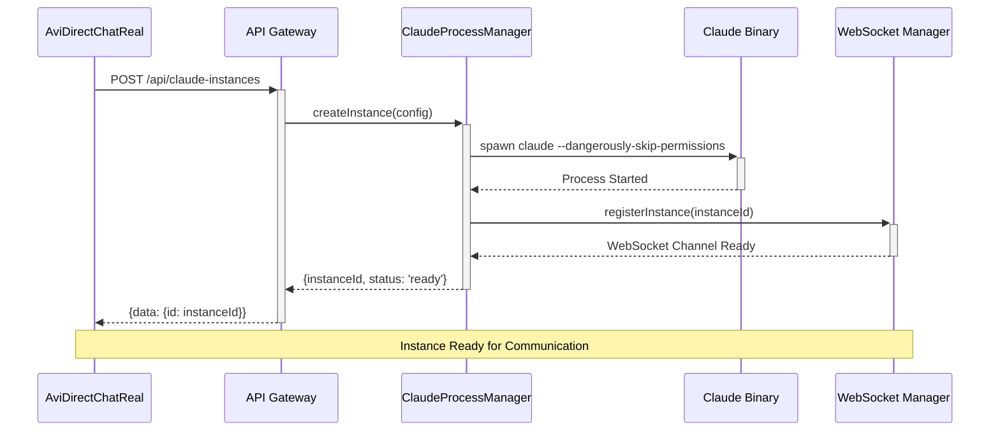
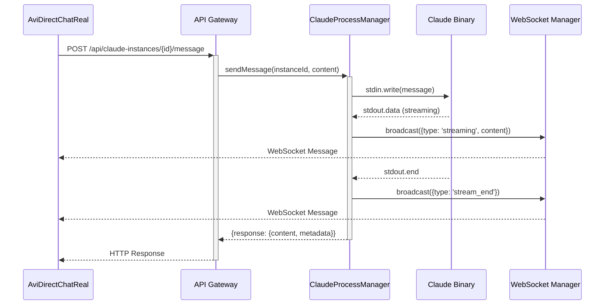
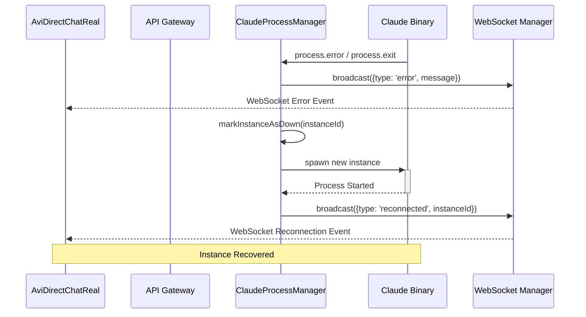
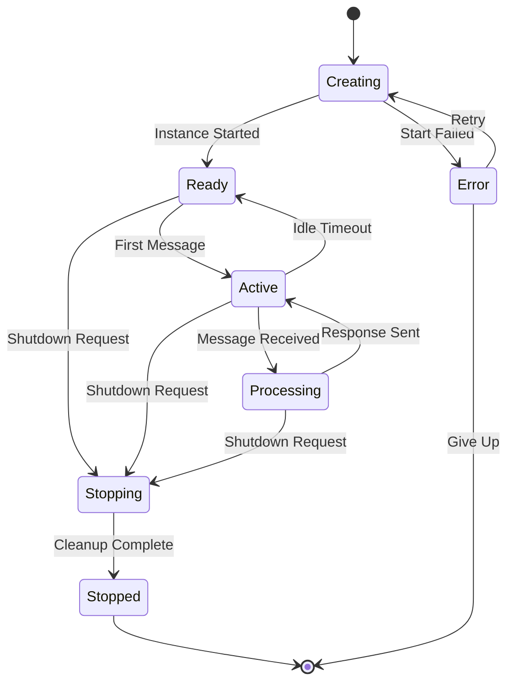

# Claude Code Integration Architecture for Avi DM

## Executive Summary

This document outlines the comprehensive system architecture for integrating Claude Code instances into the Avi Direct Message system within the Agent Feed platform. The architecture leverages existing infrastructure while introducing real-time communication capabilities and robust error handling.

## 1. High-Level System Architecture

### 1.1 Architecture Overview

```
┌─────────────────────────────────────────────────────────────────┐
│                    Agent Feed Platform                          │
├─────────────────────────────────────────────────────────────────┤
│  Frontend Layer                                                 │
│  ┌─────────────────┐    ┌──────────────────┐                   │
│  │ EnhancedPosting │    │ RealSocialMedia  │                   │
│  │ Interface       │    │ Feed             │                   │
│  │                 │    │                  │                   │
│  │ ┌─────────────┐ │    │                  │                   │
│  │ │AviDirectChat│ │    │                  │                   │
│  │ │Real         │ │    │                  │                   │
│  │ └─────────────┘ │    │                  │                   │
│  └─────────────────┘    └──────────────────┘                   │
├─────────────────────────────────────────────────────────────────┤
│  API Gateway & WebSocket Layer                                  │
│  ┌─────────────────┐    ┌──────────────────┐                   │
│  │ HTTP API        │    │ WebSocket        │                   │
│  │ /api/claude/    │    │ /ws/claude/      │                   │
│  │ instances       │    │ {instanceId}     │                   │
│  └─────────────────┘    └──────────────────┘                   │
├─────────────────────────────────────────────────────────────────┤
│  Business Logic Layer                                           │
│  ┌─────────────────┐    ┌──────────────────┐                   │
│  │ Claude Process  │    │ WebSocket        │                   │
│  │ Manager         │    │ Manager          │                   │
│  │                 │    │                  │                   │
│  │ • Lifecycle     │    │ • Real-time      │                   │
│  │ • Communication │    │ • Broadcasting   │                   │
│  │ • Error Handling│    │ • Connection Mgmt│                   │
│  └─────────────────┘    └──────────────────┘                   │
├─────────────────────────────────────────────────────────────────┤
│  Process Layer                                                  │
│  ┌─────────────────┐    ┌──────────────────┐                   │
│  │ Claude Code     │    │ PTY Session      │                   │
│  │ Binary          │    │ Management       │                   │
│  │                 │    │                  │                   │
│  │ • Instance 1    │    │ • Interactive    │                   │
│  │ • Instance 2    │    │ • Streaming I/O  │                   │
│  │ • Instance N    │    │ • Session State  │                   │
│  └─────────────────┘    └──────────────────┘                   │
└─────────────────────────────────────────────────────────────────┘
```

### 1.2 Key Components

#### Frontend Components
- **AviDirectChatReal**: Primary chat interface for Claude Code interaction
- **EnhancedPostingInterface**: Tab-based container housing the Avi DM
- **RealSocialMediaFeed**: Integration point for feed updates

#### Backend Components
- **ClaudeProcessManager**: Core service managing Claude binary instances
- **WebSocketManager**: Real-time communication orchestration
- **APIGateway**: REST endpoints for instance management

#### Process Layer
- **Claude Code Binary**: External process instances
- **PTY Sessions**: Interactive terminal sessions

## 2. Component Interaction Diagrams

### 2.1 Instance Creation Flow



### 2.2 Message Communication Flow



### 2.3 Error Recovery Flow



## 3. Data Flow Architecture

### 3.1 Message Flow Patterns

#### HTTP-based Communication (Current)
```
User Input → AviDirectChatReal → POST /api/claude-instances/{id}/message
→ ClaudeProcessManager → Claude Binary → Response → AviDirectChatReal
```

#### WebSocket-based Communication (Future)
```
User Input → AviDirectChatReal → WebSocket Send → WebSocket Manager
→ ClaudeProcessManager → Claude Binary → PTY Stream → WebSocket Manager
→ WebSocket Broadcast → AviDirectChatReal
```

### 3.2 Data Models

#### Instance Configuration
```typescript
interface ClaudeInstanceConfig {
  name: string;
  workingDirectory: string;
  skipPermissions: boolean;
  resumeSession: boolean;
  metadata: {
    isAvi: boolean;
    purpose: string;
    capabilities: string[];
  };
}
```

#### Message Protocol
```typescript
interface MessageRequest {
  content: string;
  metadata: {
    source: string;
    timestamp: string;
    context?: any;
  };
}

interface MessageResponse {
  type: 'message' | 'streaming' | 'stream_end' | 'error';
  content?: string;
  metadata?: any;
  error?: string;
}
```

#### WebSocket Events
```typescript
interface WebSocketEvent {
  type: 'message' | 'streaming' | 'stream_end' | 'error' | 'reconnected';
  instanceId: string;
  content?: string;
  message?: string;
  timestamp: string;
}
```

## 4. Error Handling and Recovery Strategies

### 4.1 Error Categories

#### Process-Level Errors
- **Claude Binary Crash**: Process exits unexpectedly
- **Permission Denied**: File system access issues
- **Resource Exhaustion**: Memory or CPU limits exceeded

#### Communication Errors
- **WebSocket Disconnection**: Network interruptions
- **Message Timeout**: Claude non-responsive
- **Malformed Responses**: Parsing errors

#### Application-Level Errors
- **Instance Not Found**: Invalid instance ID
- **Rate Limiting**: Too many requests
- **Configuration Errors**: Invalid setup parameters

### 4.2 Recovery Mechanisms

#### Automatic Recovery
```typescript
interface RecoveryStrategy {
  maxRetries: number;
  backoffMultiplier: number;
  timeoutMs: number;

  strategies: {
    processRestart: boolean;
    websocketReconnect: boolean;
    sessionRestore: boolean;
    fallbackMode: boolean;
  };
}
```

#### Circuit Breaker Pattern
- **Closed**: Normal operation
- **Open**: Failure threshold exceeded, reject requests
- **Half-Open**: Test recovery with limited requests

#### Graceful Degradation
- HTTP-only fallback when WebSocket fails
- Static responses when Claude instances unavailable
- User notification of degraded functionality

### 4.3 Error Monitoring

#### Health Checks
- Instance process monitoring
- WebSocket connection status
- Response time tracking
- Resource utilization monitoring

#### Alerting Thresholds
- Process restart frequency > 5/hour
- WebSocket disconnection rate > 10%
- Average response time > 10 seconds
- Memory usage > 90%

## 5. API Specifications and Contracts

### 5.1 REST API Endpoints

#### Instance Management
```http
POST /api/claude-instances
Content-Type: application/json

{
  "name": "Avi - Direct Message Assistant",
  "workingDirectory": "/workspaces/agent-feed/prod",
  "skipPermissions": true,
  "resumeSession": true,
  "metadata": {
    "isAvi": true,
    "purpose": "direct-messaging",
    "capabilities": ["code-review", "debugging"]
  }
}

Response:
{
  "data": {
    "id": "uuid-instance-id",
    "status": "ready",
    "createdAt": "2024-01-15T10:30:00Z"
  }
}
```

#### Message Communication
```http
POST /api/claude-instances/{instanceId}/message
Content-Type: application/json

{
  "content": "Hello, Claude!",
  "metadata": {
    "source": "avi-dm",
    "timestamp": "2024-01-15T10:30:00Z"
  }
}

Response:
{
  "data": {
    "response": {
      "content": "Hello! How can I help you today?",
      "timestamp": "2024-01-15T10:30:01Z"
    }
  }
}
```

#### Instance Status
```http
GET /api/claude-instances/{instanceId}/status

Response:
{
  "data": {
    "id": "uuid-instance-id",
    "status": "running" | "stopped" | "error",
    "uptime": 3600,
    "lastActivity": "2024-01-15T10:29:00Z",
    "resourceUsage": {
      "memory": "256MB",
      "cpu": "15%"
    }
  }
}
```

### 5.2 WebSocket Protocol

#### Connection Establishment
```
ws://localhost:3000/ws/claude/{instanceId}
```

#### Message Types
```typescript
// Incoming from Claude
{
  "type": "streaming",
  "content": "Partial response content...",
  "timestamp": "2024-01-15T10:30:00Z"
}

{
  "type": "message",
  "content": "Complete response content",
  "timestamp": "2024-01-15T10:30:01Z"
}

{
  "type": "error",
  "message": "Error description",
  "timestamp": "2024-01-15T10:30:02Z"
}
```

## 6. WebSocket Architecture Design

### 6.1 WebSocket Infrastructure

#### Connection Management
```typescript
class WebSocketManager {
  private connections: Map<string, WebSocket[]>;
  private instances: Map<string, ClaudeInstance>;

  registerInstance(instanceId: string): void;
  broadcastToInstance(instanceId: string, message: any): void;
  handleConnection(ws: WebSocket, instanceId: string): void;
  handleDisconnection(ws: WebSocket, instanceId: string): void;
}
```

#### Message Broadcasting
```typescript
interface BroadcastStrategy {
  fanOut(instanceId: string, message: any): void;
  unicast(connectionId: string, message: any): void;
  multicast(connectionIds: string[], message: any): void;
}
```

### 6.2 Real-time Features

#### Streaming Responses
- Character-by-character streaming for immediate feedback
- Chunk-based streaming for formatted content
- Binary streaming for file transfers

#### Live Status Updates
- Instance health monitoring
- Connection status changes
- Resource usage updates

#### Collaborative Features
- Multi-user session support
- Shared conversation threads
- Real-time typing indicators

## 7. Instance Lifecycle Management

### 7.1 Lifecycle States



### 7.2 Lifecycle Management

#### Instance Creation
```typescript
interface InstanceCreationConfig {
  timeout: number;
  retryAttempts: number;
  resourceLimits: {
    memory: string;
    cpu: string;
    disk: string;
  };
  environment: Record<string, string>;
}
```

#### Resource Management
```typescript
interface ResourceMonitor {
  trackMemoryUsage(instanceId: string): void;
  trackCpuUsage(instanceId: string): void;
  enforceResourceLimits(instanceId: string): void;
  triggerGarbageCollection(): void;
}
```

#### Cleanup Strategies
- **Graceful Shutdown**: Send termination signal, wait for cleanup
- **Force Kill**: Terminate process after timeout
- **Resource Cleanup**: Remove temporary files, close handles
- **Memory Deallocation**: Clear instance references

## 8. Security and Permission Handling

### 8.1 Security Architecture

#### Permission Model
```typescript
interface PermissionConfig {
  skipPermissions: boolean;
  allowedPaths: string[];
  restrictedOperations: string[];
  resourceLimits: ResourceLimits;
}
```

#### Authentication & Authorization
- **Instance-level**: Each instance has unique credentials
- **User-level**: User context passed to Claude instances
- **Operation-level**: Fine-grained permission checking

#### Sandboxing
```typescript
interface SandboxConfig {
  workingDirectory: string;
  allowedMounts: string[];
  networkAccess: boolean;
  systemCallFilters: string[];
}
```

### 8.2 Security Measures

#### Input Validation
- Message content sanitization
- Command injection prevention
- File path validation
- Resource limit enforcement

#### Output Filtering
- Sensitive data redaction
- Response size limits
- Content type validation
- Rate limiting

#### Audit Logging
```typescript
interface AuditLog {
  timestamp: string;
  instanceId: string;
  userId: string;
  operation: string;
  parameters: any;
  result: 'success' | 'failure';
  riskLevel: 'low' | 'medium' | 'high';
}
```

## 9. Performance and Scalability Considerations

### 9.1 Performance Metrics

#### Response Time Targets
- Instance creation: < 5 seconds
- Message processing: < 2 seconds
- WebSocket latency: < 100ms
- Error recovery: < 10 seconds

#### Throughput Targets
- Concurrent instances: 50+
- Messages per second: 100+
- WebSocket connections: 500+
- Data transfer rate: 10MB/s

### 9.2 Scalability Strategies

#### Horizontal Scaling
```typescript
interface ScalingConfig {
  maxInstancesPerNode: number;
  loadBalancingStrategy: 'round-robin' | 'least-connections' | 'resource-based';
  autoScaling: {
    enabled: boolean;
    minInstances: number;
    maxInstances: number;
    scaleUpThreshold: number;
    scaleDownThreshold: number;
  };
}
```

#### Resource Optimization
- Connection pooling for WebSockets
- Instance lifecycle optimization
- Memory usage monitoring
- CPU scheduling optimization

#### Caching Strategies
- Response caching for common queries
- Session state caching
- Instance metadata caching
- Connection state caching

## 10. Operational Considerations

### 10.1 Monitoring and Observability

#### Metrics Collection
```typescript
interface SystemMetrics {
  instanceMetrics: {
    count: number;
    memoryUsage: number;
    cpuUsage: number;
    responseTime: number;
  };
  websocketMetrics: {
    activeConnections: number;
    messagesPerSecond: number;
    errorRate: number;
  };
  apiMetrics: {
    requestCount: number;
    errorRate: number;
    latency: number;
  };
}
```

#### Health Checks
- Instance process monitoring
- WebSocket connectivity tests
- API endpoint health checks
- Database connectivity verification

### 10.2 Deployment Strategy

#### Environment Configuration
```typescript
interface DeploymentConfig {
  environment: 'development' | 'staging' | 'production';
  claudeBinaryPath: string;
  workspaceRoot: string;
  resourceLimits: ResourceLimits;
  monitoring: MonitoringConfig;
}
```

#### Rolling Deployments
- Zero-downtime deployments
- Instance migration strategies
- Configuration hot-reloading
- Rollback procedures

### 10.3 Backup and Recovery

#### Data Persistence
- Session state backup
- Conversation history archival
- Instance configuration backup
- Metric data retention

#### Disaster Recovery
```typescript
interface DisasterRecoveryPlan {
  backupFrequency: string;
  recoveryTimeObjective: number;
  recoveryPointObjective: number;
  failoverStrategy: 'manual' | 'automatic';
  dataReplicationStrategy: string;
}
```

## 11. Implementation Roadmap

### Phase 1: Foundation (Week 1-2)
- Implement missing API endpoints (`/api/claude-instances`)
- Create ClaudeProcessManager service
- Basic instance lifecycle management
- HTTP-based communication

### Phase 2: Real-time Communication (Week 3-4)
- WebSocket infrastructure setup
- Real-time message streaming
- Connection management
- Basic error handling

### Phase 3: Advanced Features (Week 5-6)
- Enhanced error recovery
- Performance optimization
- Security hardening
- Monitoring and metrics

### Phase 4: Production Readiness (Week 7-8)
- Load testing and optimization
- Documentation completion
- Deployment automation
- Operational procedures

## 12. Risk Assessment and Mitigation

### 12.1 Technical Risks

#### High Risk
- **Claude Binary Stability**: Mitigation through process monitoring and auto-restart
- **WebSocket Connection Issues**: Mitigation through reconnection logic and fallbacks
- **Resource Exhaustion**: Mitigation through resource limits and monitoring

#### Medium Risk
- **API Rate Limiting**: Mitigation through throttling and queuing
- **Data Consistency**: Mitigation through transaction management
- **Security Vulnerabilities**: Mitigation through input validation and sandboxing

#### Low Risk
- **Configuration Drift**: Mitigation through configuration management
- **Logging Overhead**: Mitigation through log level management
- **Dependency Updates**: Mitigation through automated testing

### 12.2 Operational Risks

#### High Risk
- **Instance Proliferation**: Mitigation through lifecycle management and cleanup
- **Performance Degradation**: Mitigation through monitoring and alerting
- **Data Loss**: Mitigation through backup and recovery procedures

## Conclusion

This architecture provides a robust, scalable foundation for integrating Claude Code instances into the Avi DM system. The design emphasizes reliability, performance, and maintainability while providing clear paths for future enhancements and scaling.

The implementation should proceed incrementally, starting with basic HTTP-based communication and evolving toward real-time WebSocket integration. Continuous monitoring and iterative improvement will ensure the system meets performance and reliability requirements.