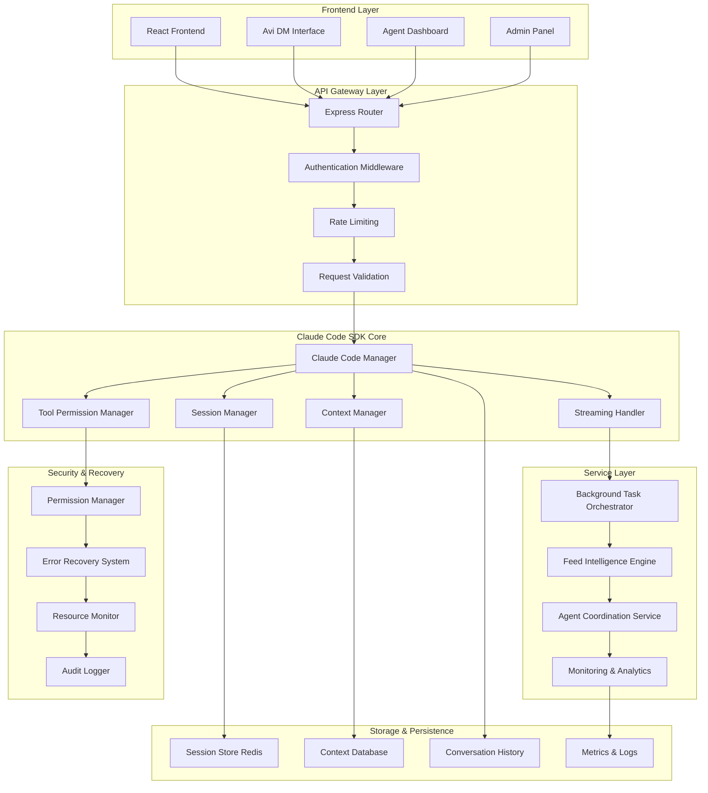
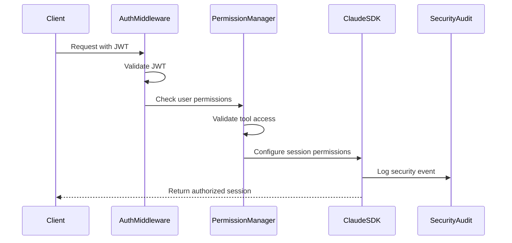

# Claude Code SDK Integration Architecture

**Document Version**: 2.0
**Date**: September 15, 2025
**Working Directory**: `/workspaces/agent-feed/prod`
**Target**: Full Claude Code SDK Implementation with --dangerously-skip-permissions

---

## Executive Summary

This document provides a comprehensive architecture for integrating the Claude Code SDK into our existing agent-feed system, replacing the current conversational API with full tool access, context management, session handling, and robust error recovery mechanisms.

### Key Integration Points

1. **Current AnthropicSDKManager** → **Enhanced Claude Code SDK Manager**
2. **Basic API endpoints** → **Full RESTful API with streaming support**
3. **Limited tool access** → **Complete tool ecosystem with security controls**
4. **Simple conversation flow** → **Advanced session and context management**

---

## System Architecture Overview



---

## Core Components Architecture

### 1. Claude Code SDK Manager

```typescript
class ClaudeCodeSDKManager {
  private streamingInstances: Map<string, ClaudeCodeInstance>
  private headlessInstances: Map<string, ClaudeCodeInstance>
  private sessionManager: SessionManager
  private contextManager: ContextManager
  private permissionManager: PermissionManager
  private errorRecovery: ErrorRecoverySystem

  constructor(config: SDKConfig) {
    this.initializeSecurity()
    this.setupInstances()
    this.configureErrorHandling()
  }

  // Core Methods
  async createStreamingSession(userId: string, options: SessionOptions): Promise<StreamingSession>
  async executeHeadlessTask(task: HeadlessTask): Promise<TaskResult>
  async manageContext(sessionId: string, operation: ContextOperation): Promise<ContextResult>
  async handleToolCall(sessionId: string, toolCall: ToolCall): Promise<ToolResult>
}
```

### 2. Session Management System

```typescript
interface SessionManager {
  // Session Lifecycle
  createSession(userId: string, type: 'streaming' | 'headless'): Promise<Session>
  getSession(sessionId: string): Promise<Session | null>
  updateSession(sessionId: string, updates: Partial<Session>): Promise<void>
  terminateSession(sessionId: string): Promise<void>

  // Session Persistence
  saveSessionState(sessionId: string, state: SessionState): Promise<void>
  restoreSessionState(sessionId: string): Promise<SessionState | null>

  // Session Monitoring
  getActiveSessions(userId?: string): Promise<Session[]>
  getSessionMetrics(sessionId: string): Promise<SessionMetrics>
}
```

### 3. Context Management System

```typescript
interface ContextManager {
  // Context Operations
  createContext(sessionId: string, initialContext?: ContextData): Promise<string>
  updateContext(contextId: string, data: ContextData): Promise<void>
  getContext(contextId: string): Promise<ContextData | null>
  compactContext(contextId: string, strategy?: CompactionStrategy): Promise<CompactionResult>

  // Context Persistence
  saveContextSnapshot(contextId: string): Promise<string>
  loadContextSnapshot(snapshotId: string): Promise<ContextData>

  // Context Analysis
  analyzeContextUsage(contextId: string): Promise<ContextAnalysis>
  optimizeContext(contextId: string): Promise<OptimizationResult>
}
```

### 4. Tool Permission & Security Manager

```typescript
interface PermissionManager {
  // Permission Configuration
  setToolPermissions(sessionId: string, permissions: ToolPermissions): Promise<void>
  getToolPermissions(sessionId: string): Promise<ToolPermissions>
  validateToolAccess(sessionId: string, toolName: string, operation: string): Promise<boolean>

  // Security Controls
  enableDangerousMode(sessionId: string, justification: string): Promise<void>
  auditToolUsage(sessionId: string): Promise<ToolAuditLog[]>

  // Resource Limits
  setResourceLimits(sessionId: string, limits: ResourceLimits): Promise<void>
  monitorResourceUsage(sessionId: string): Promise<ResourceUsage>
}
```

---

## API Architecture

### RESTful Endpoints

#### Session Management Endpoints

```typescript
// POST /api/claude/sessions
interface CreateSessionRequest {
  type: 'streaming' | 'headless'
  userId: string
  workingDirectory?: string
  toolPermissions?: ToolPermissions
  contextSize?: number
}

// GET /api/claude/sessions/:sessionId
interface GetSessionResponse {
  session: Session
  context: ContextSummary
  metrics: SessionMetrics
}

// PUT /api/claude/sessions/:sessionId
interface UpdateSessionRequest {
  workingDirectory?: string
  toolPermissions?: ToolPermissions
  contextSettings?: ContextSettings
}

// DELETE /api/claude/sessions/:sessionId
interface TerminateSessionRequest {
  saveContext?: boolean
  reason?: string
}
```

#### Streaming Communication Endpoints

```typescript
// POST /api/claude/sessions/:sessionId/stream
interface StreamMessageRequest {
  message: {
    role: 'user' | 'assistant'
    content: string | MessageContent[]
  }
  attachments?: FileAttachment[]
  toolCalls?: ToolCall[]
}

// GET /api/claude/sessions/:sessionId/stream (SSE)
interface StreamResponse {
  type: 'message' | 'tool_call' | 'error' | 'status'
  data: MessageData | ToolCallData | ErrorData | StatusData
  timestamp: string
}

// WebSocket: /ws/claude/sessions/:sessionId
interface WebSocketMessage {
  type: 'message' | 'tool_call' | 'context_update' | 'session_update'
  payload: any
  messageId: string
}
```

#### Headless Task Execution Endpoints

```typescript
// POST /api/claude/tasks
interface CreateTaskRequest {
  prompt: string
  workingDirectory: string
  allowedTools: string[]
  outputFormat: 'text' | 'json' | 'structured'
  timeout?: number
  priority?: 'low' | 'medium' | 'high'
}

// GET /api/claude/tasks/:taskId
interface GetTaskResponse {
  task: Task
  status: 'pending' | 'running' | 'completed' | 'failed'
  result?: TaskResult
  error?: TaskError
}

// GET /api/claude/tasks/:taskId/stream (SSE)
interface TaskStreamResponse {
  type: 'output' | 'tool_call' | 'progress' | 'completion'
  data: any
  timestamp: string
}
```

#### Context Management Endpoints

```typescript
// GET /api/claude/sessions/:sessionId/context
interface GetContextResponse {
  context: ContextData
  size: number
  tokens: number
  lastCompaction: string
}

// POST /api/claude/sessions/:sessionId/context/compact
interface CompactContextRequest {
  strategy: 'aggressive' | 'moderate' | 'conservative'
  preserveKeys?: string[]
}

// POST /api/claude/sessions/:sessionId/context/snapshot
interface CreateSnapshotRequest {
  name?: string
  description?: string
}
```

---

## Security Architecture

### 1. Authentication & Authorization Flow



### 2. Permission Levels & Controls

```typescript
interface ToolPermissions {
  // File System Access
  fileSystem: {
    read: string[]      // Allowed read paths
    write: string[]     // Allowed write paths
    execute: string[]   // Allowed execution paths
  }

  // Network Access
  network: {
    allowHttp: boolean
    allowedDomains: string[]
    allowedPorts: number[]
  }

  // System Access
  system: {
    allowBash: boolean
    allowedCommands: string[]
    dangerousMode: boolean
  }

  // Tool Restrictions
  tools: {
    allowed: string[]
    restricted: string[]
    customLimits: Record<string, any>
  }
}
```

### 3. Dangerous Mode Security

```typescript
interface DangerousModeConfig {
  enabled: boolean
  justification: string
  approver: string
  timeLimit: number
  auditLevel: 'verbose' | 'complete'
  restrictions: {
    allowedOperations: string[]
    forbiddenPaths: string[]
    maxConcurrentOperations: number
  }
}
```

---

## Session & Context Management

### 1. Session Lifecycle

```typescript
interface Session {
  id: string
  userId: string
  type: 'streaming' | 'headless'
  status: 'active' | 'suspended' | 'terminated'
  created: Date
  lastActivity: Date
  configuration: SessionConfig
  metrics: SessionMetrics
}

interface SessionConfig {
  workingDirectory: string
  toolPermissions: ToolPermissions
  contextSettings: ContextSettings
  resourceLimits: ResourceLimits
  dangerousMode: DangerousModeConfig
}
```

### 2. Context Management Strategy

```typescript
interface ContextSettings {
  maxSize: number              // Maximum context size in tokens
  compactionThreshold: number  // When to trigger auto-compaction
  compactionStrategy: 'aggressive' | 'moderate' | 'conservative'
  preservePatterns: string[]   // Patterns to preserve during compaction
  snapshotInterval: number     // Auto-snapshot interval in minutes
}

interface ContextData {
  messages: Message[]
  toolCalls: ToolCall[]
  artifacts: Artifact[]
  workingState: WorkingState
  metadata: ContextMetadata
}
```

### 3. Automatic Context Compaction

```typescript
class ContextCompactor {
  async compactContext(
    contextId: string,
    strategy: CompactionStrategy
  ): Promise<CompactionResult> {
    const context = await this.getContext(contextId)
    const analysis = await this.analyzeContext(context)

    switch (strategy) {
      case 'aggressive':
        return this.aggressiveCompaction(context, analysis)
      case 'moderate':
        return this.moderateCompaction(context, analysis)
      case 'conservative':
        return this.conservativeCompaction(context, analysis)
    }
  }

  private async aggressiveCompaction(
    context: ContextData,
    analysis: ContextAnalysis
  ): Promise<CompactionResult> {
    // Remove old messages beyond certain threshold
    // Summarize tool call sequences
    // Compress artifact references
    // Maintain only essential working state
  }
}
```

---

## Error Handling & Recovery

### 1. Error Classification System

```typescript
enum ErrorType {
  AUTHENTICATION_ERROR = 'auth_error',
  PERMISSION_DENIED = 'permission_denied',
  TOOL_EXECUTION_ERROR = 'tool_error',
  CONTEXT_OVERFLOW = 'context_overflow',
  SESSION_TIMEOUT = 'session_timeout',
  RESOURCE_EXHAUSTION = 'resource_exhaustion',
  NETWORK_ERROR = 'network_error',
  INTERNAL_ERROR = 'internal_error'
}

interface ErrorContext {
  sessionId: string
  userId: string
  errorType: ErrorType
  originalError: Error
  stackTrace: string
  contextSnapshot: ContextSnapshot
  recoveryOptions: RecoveryOption[]
}
```

### 2. Recovery Strategies

```typescript
interface RecoveryStrategy {
  canRecover(error: ErrorContext): boolean
  recover(error: ErrorContext): Promise<RecoveryResult>
  preventRecurrence(error: ErrorContext): Promise<void>
}

class SessionRecoveryStrategy implements RecoveryStrategy {
  async recover(error: ErrorContext): Promise<RecoveryResult> {
    switch (error.errorType) {
      case ErrorType.SESSION_TIMEOUT:
        return this.restoreSession(error.sessionId)

      case ErrorType.CONTEXT_OVERFLOW:
        return this.compactAndContinue(error.sessionId)

      case ErrorType.TOOL_EXECUTION_ERROR:
        return this.retryWithFallback(error)

      default:
        return this.createNewSession(error.userId)
    }
  }
}
```

### 3. Monitoring & Alerting

```typescript
interface MonitoringSystem {
  // Health Monitoring
  checkSystemHealth(): Promise<HealthStatus>
  monitorSessionHealth(sessionId: string): Promise<SessionHealth>
  trackResourceUsage(): Promise<ResourceMetrics>

  // Performance Monitoring
  measureResponseTimes(): Promise<PerformanceMetrics>
  trackTokenUsage(): Promise<TokenMetrics>
  monitorContextEfficiency(): Promise<ContextMetrics>

  // Alert Management
  configureAlerts(config: AlertConfig): Promise<void>
  sendAlert(alert: Alert): Promise<void>
  getActiveAlerts(): Promise<Alert[]>
}
```

---

## Integration with Existing System

### 1. Migration Strategy from AnthropicSDKManager

```typescript
class MigrationManager {
  async migrateFromLegacySDK(): Promise<MigrationResult> {
    // 1. Analyze existing sessions
    const legacySessions = await this.analyzeLegacySessions()

    // 2. Create migration plan
    const plan = await this.createMigrationPlan(legacySessions)

    // 3. Execute phased migration
    return this.executePhaseBasedMigration(plan)
  }

  private async executePhaseBasedMigration(plan: MigrationPlan): Promise<MigrationResult> {
    // Phase 1: Setup new SDK infrastructure
    await this.setupNewInfrastructure()

    // Phase 2: Migrate authentication system
    await this.migrateAuthentication()

    // Phase 3: Convert existing sessions
    await this.convertExistingSessions()

    // Phase 4: Update API endpoints
    await this.updateAPIEndpoints()

    // Phase 5: Validate and cleanup
    return this.validateAndCleanup()
  }
}
```

### 2. Backward Compatibility Layer

```typescript
class CompatibilityLayer {
  // Provide backward compatibility for existing API calls
  async handleLegacyRequest(req: LegacyRequest): Promise<LegacyResponse> {
    // Convert legacy request to new format
    const newRequest = await this.convertRequest(req)

    // Process with new SDK
    const result = await this.newSDK.process(newRequest)

    // Convert response back to legacy format
    return this.convertResponse(result)
  }
}
```

### 3. Configuration Management

```typescript
interface SystemConfiguration {
  claude: {
    apiKey: string
    workingDirectory: string
    dangerousMode: boolean
    maxConcurrentSessions: number
    defaultToolPermissions: ToolPermissions
  }

  session: {
    defaultTimeout: number
    maxContextSize: number
    autoCompactionThreshold: number
    snapshotInterval: number
  }

  security: {
    requireAuthentication: boolean
    auditLevel: 'basic' | 'verbose' | 'complete'
    maxResourceUsage: ResourceLimits
  }

  monitoring: {
    enableMetrics: boolean
    enableAlerts: boolean
    logLevel: 'error' | 'warn' | 'info' | 'debug'
  }
}
```

---

## Implementation Classes

### 1. Core SDK Manager Implementation

```typescript
export class ClaudeCodeSDKManager {
  private config: SystemConfiguration
  private claude: ClaudeCode
  private sessions: Map<string, Session>
  private contexts: Map<string, ContextData>

  constructor(config: SystemConfiguration) {
    this.config = config
    this.claude = new ClaudeCode({
      apiKey: config.claude.apiKey,
      dangerouslySkipPermissions: config.claude.dangerousMode
    })
    this.sessions = new Map()
    this.contexts = new Map()
  }

  async createStreamingSession(userId: string, options: SessionOptions): Promise<StreamingSession> {
    const session = await this.sessionManager.createSession(userId, 'streaming')
    const permissions = await this.permissionManager.getPermissions(userId)

    const streamingSession = new StreamingSession({
      session,
      claude: this.claude,
      permissions,
      workingDirectory: options.workingDirectory || this.config.claude.workingDirectory
    })

    this.sessions.set(session.id, session)
    return streamingSession
  }

  async executeHeadlessTask(task: HeadlessTaskRequest): Promise<TaskResult> {
    const session = await this.sessionManager.createSession(task.userId, 'headless')

    try {
      const result = await this.claude.execute({
        prompt: task.prompt,
        workingDirectory: task.workingDirectory,
        allowedTools: task.allowedTools,
        outputFormat: task.outputFormat,
        timeout: task.timeout
      })

      await this.sessionManager.updateSession(session.id, {
        status: 'completed',
        result: result
      })

      return result
    } catch (error) {
      await this.errorRecovery.handleError(session.id, error)
      throw error
    }
  }
}
```

### 2. Streaming Session Handler

```typescript
export class StreamingSession {
  private session: Session
  private claude: ClaudeCode
  private eventEmitter: EventEmitter
  private messageQueue: MessageQueue

  constructor(options: StreamingSessionOptions) {
    this.session = options.session
    this.claude = options.claude
    this.eventEmitter = new EventEmitter()
    this.messageQueue = new MessageQueue()
  }

  async sendMessage(message: Message): Promise<void> {
    this.messageQueue.enqueue(message)
    await this.processMessageQueue()
  }

  private async processMessageQueue(): Promise<void> {
    while (!this.messageQueue.isEmpty()) {
      const message = this.messageQueue.dequeue()

      try {
        const response = await this.claude.query(this.generateMessages(message))

        for await (const chunk of response) {
          this.eventEmitter.emit('message', chunk)
        }
      } catch (error) {
        this.eventEmitter.emit('error', error)
        await this.handleStreamingError(error)
      }
    }
  }

  subscribe(callback: (event: StreamEvent) => void): () => void {
    this.eventEmitter.on('message', callback)
    this.eventEmitter.on('error', callback)
    this.eventEmitter.on('tool_call', callback)

    return () => {
      this.eventEmitter.removeListener('message', callback)
      this.eventEmitter.removeListener('error', callback)
      this.eventEmitter.removeListener('tool_call', callback)
    }
  }
}
```

---

## Deployment Architecture

### 1. Production Configuration

```yaml
# docker-compose.claude-code.yml
version: '3.8'
services:
  claude-code-manager:
    build: .
    environment:
      - ANTHROPIC_API_KEY=${ANTHROPIC_API_KEY}
      - CLAUDE_WORKING_DIRECTORY=/workspaces/agent-feed/prod
      - CLAUDE_DANGEROUS_MODE=true
      - MAX_CONCURRENT_SESSIONS=10
      - CONTEXT_MAX_SIZE=100000
      - REDIS_URL=redis://redis:6379
    volumes:
      - ./prod:/workspaces/agent-feed/prod
      - ./logs:/app/logs
    depends_on:
      - redis
      - postgres

  redis:
    image: redis:7-alpine
    volumes:
      - redis_data:/data

  postgres:
    image: postgres:15
    environment:
      - POSTGRES_DB=agent_feed
      - POSTGRES_USER=${DB_USER}
      - POSTGRES_PASSWORD=${DB_PASSWORD}
    volumes:
      - postgres_data:/var/lib/postgresql/data

volumes:
  redis_data:
  postgres_data:
```

### 2. Environment Configuration

```bash
# .env.production
ANTHROPIC_API_KEY=sk-ant-api03-...
CLAUDE_WORKING_DIRECTORY=/workspaces/agent-feed/prod
CLAUDE_DANGEROUS_MODE=true
CLAUDE_MAX_CONCURRENT_SESSIONS=10
CLAUDE_DEFAULT_TIMEOUT=300000

# Session Management
SESSION_REDIS_URL=redis://localhost:6379
SESSION_TTL=86400
CONTEXT_MAX_SIZE=100000
AUTO_COMPACTION_THRESHOLD=80000

# Security
JWT_SECRET=${JWT_SECRET}
REQUIRE_AUTHENTICATION=true
AUDIT_LEVEL=verbose
MAX_FILE_SIZE=10MB

# Monitoring
ENABLE_METRICS=true
ENABLE_ALERTS=true
LOG_LEVEL=info
HEALTH_CHECK_INTERVAL=30
```

---

## Testing Strategy

### 1. Unit Tests

```typescript
describe('ClaudeCodeSDKManager', () => {
  let manager: ClaudeCodeSDKManager

  beforeEach(() => {
    manager = new ClaudeCodeSDKManager(testConfig)
  })

  describe('Session Management', () => {
    it('should create streaming session with proper permissions', async () => {
      const session = await manager.createStreamingSession('user-1', {
        workingDirectory: '/test/dir'
      })

      expect(session.id).toBeDefined()
      expect(session.type).toBe('streaming')
      expect(session.workingDirectory).toBe('/test/dir')
    })

    it('should handle session timeout gracefully', async () => {
      const session = await manager.createStreamingSession('user-1', {
        timeout: 1000
      })

      await delay(2000)
      const status = await manager.getSessionStatus(session.id)
      expect(status).toBe('terminated')
    })
  })

  describe('Error Recovery', () => {
    it('should recover from context overflow', async () => {
      const session = await manager.createStreamingSession('user-1', {})

      // Simulate context overflow
      await fillContextToCapacity(session.id)

      const result = await manager.sendMessage(session.id, 'Continue conversation')
      expect(result.success).toBe(true)
    })
  })
})
```

### 2. Integration Tests

```typescript
describe('Claude SDK Integration', () => {
  it('should execute headless tasks with proper tool access', async () => {
    const task = {
      prompt: 'Create a test file in /tmp',
      workingDirectory: '/tmp',
      allowedTools: ['Write', 'Bash'],
      userId: 'test-user'
    }

    const result = await manager.executeHeadlessTask(task)

    expect(result.success).toBe(true)
    expect(result.output).toContain('File created successfully')
  })

  it('should stream responses in real-time', async () => {
    const session = await manager.createStreamingSession('user-1', {})
    const messages: StreamEvent[] = []

    session.subscribe((event) => {
      messages.push(event)
    })

    await session.sendMessage({
      role: 'user',
      content: 'Hello, Claude!'
    })

    await waitForMessages(messages, 1)
    expect(messages[0].type).toBe('message')
    expect(messages[0].data.content).toContain('Hello')
  })
})
```

---

## Monitoring & Observability

### 1. Metrics Collection

```typescript
interface SystemMetrics {
  sessions: {
    active: number
    total: number
    averageDuration: number
    successRate: number
  }

  performance: {
    averageResponseTime: number
    tokenThroughput: number
    contextEfficiency: number
    errorRate: number
  }

  resources: {
    memoryUsage: number
    cpuUsage: number
    diskUsage: number
    networkUsage: number
  }

  security: {
    authenticationAttempts: number
    permissionDenials: number
    dangerousModeUsage: number
    securityEvents: number
  }
}
```

### 2. Health Checks

```typescript
class HealthChecker {
  async checkSystemHealth(): Promise<HealthStatus> {
    const checks = await Promise.allSettled([
      this.checkClaudeSDKConnectivity(),
      this.checkRedisConnectivity(),
      this.checkDatabaseConnectivity(),
      this.checkFileSystemAccess(),
      this.checkResourceUsage()
    ])

    return {
      status: this.calculateOverallStatus(checks),
      checks: this.formatCheckResults(checks),
      timestamp: new Date().toISOString()
    }
  }
}
```

---

## Performance Optimization

### 1. Caching Strategy

```typescript
interface CacheManager {
  // Session caching
  cacheSession(sessionId: string, session: Session): Promise<void>
  getCachedSession(sessionId: string): Promise<Session | null>

  // Context caching
  cacheContext(contextId: string, context: ContextData): Promise<void>
  getCachedContext(contextId: string): Promise<ContextData | null>

  // Response caching for headless tasks
  cacheTaskResult(taskHash: string, result: TaskResult): Promise<void>
  getCachedTaskResult(taskHash: string): Promise<TaskResult | null>
}
```

### 2. Resource Management

```typescript
interface ResourceManager {
  // Memory management
  monitorMemoryUsage(): Promise<MemoryUsage>
  optimizeMemoryUsage(): Promise<OptimizationResult>

  // CPU management
  throttleConcurrentTasks(limit: number): Promise<void>
  balanceTaskLoad(): Promise<LoadBalanceResult>

  // Network optimization
  optimizeNetworkRequests(): Promise<NetworkOptimization>
  implementRequestBatching(): Promise<BatchingResult>
}
```

---

## Security Considerations

### 1. Audit Logging

```typescript
interface AuditLogger {
  logSecurityEvent(event: SecurityEvent): Promise<void>
  logToolUsage(sessionId: string, tool: string, operation: string): Promise<void>
  logPermissionChange(userId: string, change: PermissionChange): Promise<void>
  logDangerousModeUsage(sessionId: string, justification: string): Promise<void>

  getAuditTrail(filters: AuditFilters): Promise<AuditEntry[]>
  generateComplianceReport(timeRange: TimeRange): Promise<ComplianceReport>
}
```

### 2. Access Control

```typescript
interface AccessController {
  validateUserAccess(userId: string, resource: string): Promise<boolean>
  checkRolePermissions(role: string, operation: string): Promise<boolean>
  enforceRateLimit(userId: string, endpoint: string): Promise<RateLimitResult>
  validateToolPermission(sessionId: string, tool: string): Promise<boolean>
}
```

---

## Conclusion

This architecture provides a comprehensive foundation for integrating Claude Code SDK with full tool access, robust session management, automatic context handling, and enterprise-grade security controls. The design emphasizes:

1. **Scalability**: Supports multiple concurrent sessions with efficient resource management
2. **Security**: Comprehensive permission system with audit logging and dangerous mode controls
3. **Reliability**: Advanced error recovery and monitoring systems
4. **Performance**: Optimized context management and caching strategies
5. **Maintainability**: Clean architecture with clear separation of concerns

The implementation can be deployed incrementally, allowing for gradual migration from the existing AnthropicSDKManager while maintaining backward compatibility.

---

**Next Steps**:
1. Review and approve architecture design
2. Set up development environment with Claude Code SDK
3. Implement core SDK manager and session management
4. Develop and test streaming and headless interfaces
5. Deploy to production with comprehensive monitoring

---

*Document Status*: ✅ **READY FOR IMPLEMENTATION**
*Architecture Approach*: Microservices with centralized SDK management
*Risk Level*: Medium - Well-defined integration points
*Development Timeline*: 4-6 weeks for full implementation