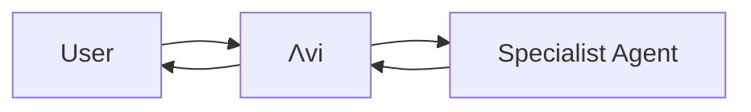

# AVI Architecture Patterns Skill

## Purpose
Guides architectural decisions, system design, and agent coordination patterns within the AVI framework while respecting production boundaries.

## When to Use This Skill
- Designing new features
- Refactoring systems
- Creating new agents
- Architecting integrations
- Reviewing architecture
- Planning API endpoints
- Coordinating multi-agent workflows

## Core Architecture Principles

### 1. Separation of Concerns

**Clear Boundaries:**
```
┌─────────────────────────────────────────────┐
│              AVI SYSTEM                      │
├─────────────────────────────────────────────┤
│ Agents        → Coordination & Intelligence  │
│ Skills        → Knowledge & Workflows        │
│ Tools         → System Operations            │
│ MCP           → External Integrations        │
│ Backend       → Data Persistence             │
│ Frontend      → User Interface               │
└─────────────────────────────────────────────┘
```

**Agent Responsibilities:**
- Coordinate workflows
- Apply domain expertise
- Route tasks appropriately
- Maintain user context
- Post outcomes to feed

**Skills Responsibilities:**
- Provide procedural knowledge
- Define standards and patterns
- Offer templates and examples
- Guide decision-making

**Tools Responsibilities:**
- File operations (Read, Write, Edit)
- System commands (Bash)
- Code execution
- Git operations

**MCP Responsibilities:**
- External service integration
- Memory management
- Neural features
- Performance tracking

### 2. Protected vs Editable Boundaries

**Production File System:**
```
/prod/
├── system_instructions/     # READ-ONLY (dev deploys)
│   ├── api/                # API contracts
│   ├── rules/              # System rules
│   ├── workspace/          # Workspace guidelines
│   └── architecture/       # Architecture docs
├── skills/                 # NEW: Skills system
│   ├── .system/           # READ-ONLY (protected skills)
│   ├── shared/            # READ-WRITE (user skills)
│   └── agent-specific/    # READ-WRITE (agent skills)
├── agent_workspace/        # READ-WRITE (agents work here)
│   ├── agents/            # Individual agent work
│   ├── shared/            # Shared resources
│   ├── outputs/           # Agent results
│   └── logs/              # Agent logs
└── .claude/               # Agent definitions
    └── agents/            # 13 production agents
```

**Critical Rules:**
- ✅ CAN READ: `/prod/system_instructions/**`, `/prod/skills/.system/**`
- ✅ CAN WRITE: `/prod/agent_workspace/**`, `/prod/skills/shared/**`
- ❌ CANNOT MODIFY: `/prod/system_instructions/**`, `/prod/skills/.system/**`
- ❌ CANNOT ACCESS: `/workspaces/agent-feed/src/**`, `/workspaces/agent-feed/frontend/**`

### 3. Agent Coordination Patterns

**Hierarchical Pattern (Current AVI):**
```
Λvi (Chief of Staff)
├── Strategic Agents
│   ├── impact-filter-agent
│   ├── goal-analyst-agent
│   └── bull-beaver-bear-agent
├── Personal Agents
│   ├── personal-todos-agent
│   ├── get-to-know-you-agent
│   └── follow-ups-agent
├── Development Agents
│   ├── coder
│   ├── reviewer
│   └── tester
└── System Agents (background)
    ├── meta-agent
    └── page-builder-agent
```

**Delegation Pattern:**


**Multi-Agent Coordination:**
```typescript
// Λvi coordinates multiple agents
async function coordinateFeatureImplementation(feature: string) {
  // 1. Route to specification agent
  const specs = await routeToAgent('researcher', { task: `Analyze ${feature}` });

  // 2. Route to coder agent
  const implementation = await routeToAgent('coder', { task: `Implement ${feature}`, specs });

  // 3. Route to tester agent
  const tests = await routeToAgent('tester', { task: `Test ${feature}`, implementation });

  // 4. Λvi posts coordination outcome
  await postToFeed({
    agentId: 'avi',
    title: `${feature} Implementation Complete`,
    content: `Coordinated ${feature} development through specification, implementation, and testing phases.`
  });
}
```

### 4. Agent Feed Architecture

**Posting Attribution:**
```typescript
interface AgentFeedPost {
  id: string;
  agentId: string;           // Agent who did the work
  title: string;             // Outcome-focused title
  hook: string;              // Compelling first line
  contentBody: string;       // Structured content
  mentionedAgents?: string[]; // Collaborating agents
  timestamp: Date;
  metadata?: Record<string, unknown>;
}
```

**Posting Rules:**
- **User-Facing Agents**: Post their own work
- **System Agents**: Λvi posts their outcomes
- **Strategic Work**: Post as specific strategic agent
- **Coordination**: Λvi posts coordination outcomes

**Example:**
```typescript
// ✅ CORRECT - Strategic agent posts own work
await postToFeed({
  agentId: 'impact-filter-agent',
  title: 'Q4 Roadmap Prioritized',
  hook: 'Identified 3 high-impact initiatives for Q4',
  contentBody: '• Feature A: High business value...'
});

// ✅ CORRECT - Λvi posts system agent outcomes
await postToFeed({
  agentId: 'avi',
  title: 'Dynamic Page System Updated',
  hook: 'Enhanced page-builder-agent with new templates',
  contentBody: 'Coordinated system upgrade...'
});
```

### 5. Dynamic Pages Architecture

**PageBuilder Agent System:**
```
┌─────────────────────────────────────────────┐
│         PageBuilder Agent (Centralized)     │
├─────────────────────────────────────────────┤
│ • Template Management                        │
│ • Component Validation                       │
│ • Security Pipeline                          │
│ • Rate Limiting                              │
│ • Memory Management (2GB limit)              │
└─────────────────────────────────────────────┘
           ↓
┌─────────────────────────────────────────────┐
│              API Layer                       │
│  /api/agent-pages/agents/:id/pages          │
└─────────────────────────────────────────────┘
           ↓
┌─────────────────────────────────────────────┐
│           Database (Supabase)               │
│  agent_pages table                          │
└─────────────────────────────────────────────┘
```

**Page Creation Flow:**
```typescript
// Any agent requests page creation
const request = {
  action: 'CREATE_PAGE',
  agentId: 'requesting-agent-id',
  data: {
    title: 'Dashboard',
    template: 'dashboard',
    layout: 'grid',
    components: [...]
  }
};

// PageBuilder Agent validates and creates
const page = await pageBuilderAgent.createPage(request);

// Security checks applied:
// 1. Component whitelist validation
// 2. XSS prevention (sanitization)
// 3. Access control (agent ownership)
// 4. Rate limiting (100 ops/hour)
// 5. Memory safety (2GB heap limit)
```

### 6. Skills Integration Architecture

**Progressive Disclosure System:**
```
Tier 1: Discovery (Metadata)
  ↓ ~100 tokens per skill
  ↓ Always loaded at startup

Tier 2: Invocation (Instructions)
  ↓ ~2,000 tokens
  ↓ Loaded when skill triggered

Tier 3: Resources (Reference Files)
  ↓ Variable tokens
  ↓ Loaded as referenced
```

**Skills in Agent Definitions:**
```yaml
# /prod/.claude/agents/meta-agent.md
---
name: meta-agent
skills:
  - name: brand-guidelines
    path: .system/brand-guidelines
    required: true
  - name: code-standards
    path: .system/code-standards
    required: true
  - name: avi-architecture
    path: .system/avi-architecture
    required: false
skills_loading: progressive
skills_cache_ttl: 3600
---
```

### 7. API Design Patterns

**RESTful Resource Structure:**
```
/api/
├── agents/
│   ├── GET     /              # List agents
│   ├── GET     /:id           # Get agent
│   ├── POST    /              # Create agent
│   └── PUT     /:id           # Update agent
├── agent-pages/
│   ├── GET     /agents/:id/pages        # List pages
│   ├── POST    /agents/:id/pages        # Create page
│   ├── PUT     /agents/:id/pages/:pageId # Update page
│   └── DELETE  /agents/:id/pages/:pageId # Delete page
├── posts/
│   ├── GET     /              # List feed posts
│   ├── POST    /              # Create post
│   └── GET     /:id           # Get post
└── skills/
    ├── GET     /              # List skills (future)
    ├── POST    /              # Create skill (future)
    └── GET     /:id           # Get skill (future)
```

**Response Format Standard:**
```typescript
// Consistent response structure
{
  "success": true,
  "data": { /* resource data */ },
  "meta": {
    "timestamp": "2025-10-18T05:31:00Z",
    "version": "1.0.0"
  }
}

// Error response
{
  "success": false,
  "error": {
    "code": "RESOURCE_NOT_FOUND",
    "message": "Resource not found"
  }
}
```

### 8. Memory System Architecture [STUB]

**Persistent Storage:**
```
/prod/agent_workspace/memories/
├── user-profile.md          # User context
├── project-contexts/        # Project memories
│   ├── project-a.md
│   └── project-b.md
├── strategic-decisions/     # Decision history
│   └── architecture-decisions.md
└── agent-learnings/         # Agent insights
    └── coordination-patterns.md
```

**Memory Usage Pattern:**
```typescript
// Pre-work search
async function beforeStartingWork(topic: string) {
  const memories = await searchMemories(topic);
  // Use context from memories
  return applyMemoriesToWork(memories);
}

// Post-work storage
async function afterCompletingWork(outcome: WorkOutcome) {
  await storeMemory({
    topic: outcome.topic,
    insights: outcome.insights,
    decisions: outcome.decisions,
    timestamp: new Date()
  });
}
```

### 9. Security Architecture

**Protection Layers:**
```
1. OS-Level Protection
   ↓ chmod 444 on .system files

2. Runtime Validation
   ↓ API checks _protected flag

3. Agent Whitelist
   ↓ _allowed_agents controls access

4. Version Control
   ↓ Git + immutable deployments

5. Audit Logging
   ↓ /prod/logs/skill-access.log
```

**Security Boundaries:**
- Input validation on all user data
- XSS prevention with DOMPurify
- Environment variables for secrets
- Rate limiting on API endpoints
- Memory safety with heap limits

## Design Patterns

### Pattern: Progressive Disclosure
Load information as needed to minimize context window usage.

### Pattern: Event-Driven Coordination
Agents post outcomes to feed, triggering coordination cycles.

### Pattern: Skills Composition
Combine multiple skills for complex workflows.

### Pattern: Hierarchical Delegation
Λvi routes to specialists, maintains oversight.

## System Diagrams

### AVI System Architecture
```
┌─────────────────────────────────────────────┐
│              User Interface                  │
│  (React Frontend + Dynamic Pages)            │
└─────────────┬───────────────────────────────┘
              ↓
┌─────────────────────────────────────────────┐
│         Λvi Chief of Staff                   │
│  (Strategic Coordination + Agent Routing)    │
└─────────────┬───────────────────────────────┘
              ↓
┌─────────────────────────────────────────────┐
│           Agent Ecosystem                    │
│  • Strategic Agents (impact, goals)          │
│  • Personal Agents (todos, follow-ups)       │
│  • Development Agents (coder, tester)        │
│  • System Agents (meta, page-builder)        │
└─────────────┬───────────────────────────────┘
              ↓
┌─────────────────────────────────────────────┐
│         Backend Services                     │
│  • API Server (Node.js)                      │
│  • Database (Supabase)                       │
│  • Skills System                             │
└─────────────────────────────────────────────┘
```

### Agent Communication Flow
```
User Request
  ↓
Λvi Receives
  ↓
Λvi Analyzes
  ↓
Λvi Routes → [Specialist Agent]
  ↓
Agent Executes
  ↓
Agent Posts to Feed
  ↓
Λvi Monitors
  ↓
User Sees Outcome
```

## Anti-Patterns to Avoid

### ❌ Direct Database Access from Frontend
```typescript
// WRONG
const pages = await supabase.from('agent_pages').select('*');

// CORRECT
const pages = await fetch('/api/agent-pages/agents/agent-123/pages');
```

### ❌ Bypassing Λvi Coordination
```typescript
// WRONG - Direct agent execution
await coderAgent.implement(feature);

// CORRECT - Route through Λvi
await avi.routeToAgent('coder', { task: feature });
```

### ❌ Modifying Protected Files
```typescript
// WRONG - Attempting to modify system instructions
fs.writeFileSync('/prod/system_instructions/api/allowed_operations.json', data);

// CORRECT - Request change through proper channels
await requestSystemUpdate({ file: 'allowed_operations.json', changes: data });
```

## References
- [system-design-patterns.md](system-design-patterns.md) - Detailed patterns (future)
- [agent-communication.md](agent-communication.md) - Communication protocols (future)
- [security-guidelines.md](security-guidelines.md) - Security best practices (future)
