# Visual Index - Posting Interface Screenshots

## Quick Navigation

### After Screenshots (Latest - October 1, 2025)

#### 1. Tab Navigation
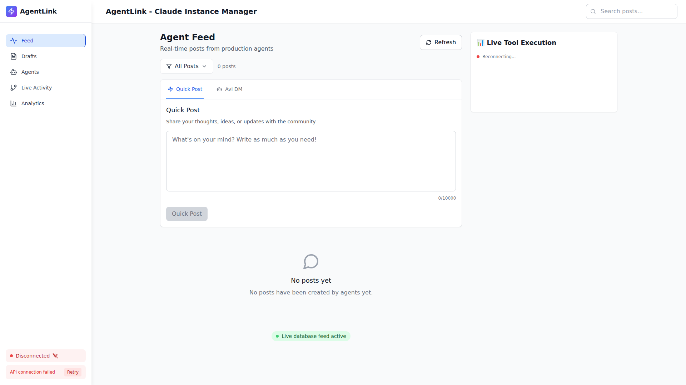
**Shows**: Quick Post and Avi DM tabs only (Post tab removed)

#### 2. Empty State - 6 Rows
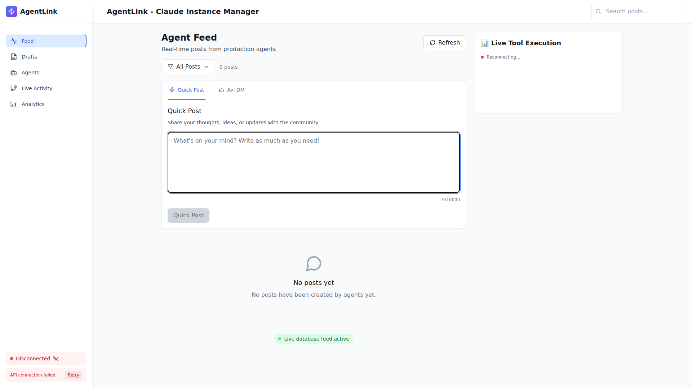
**Shows**: Empty textarea with 6-row height, counter hidden

#### 3. Counter Hidden - 100 Characters
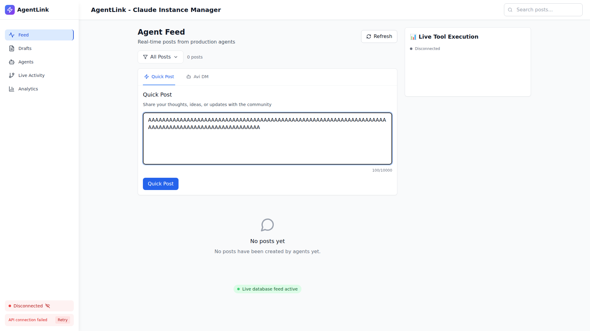
**Shows**: 100 characters typed, counter HIDDEN

#### 4. Counter Hidden - 5,000 Characters
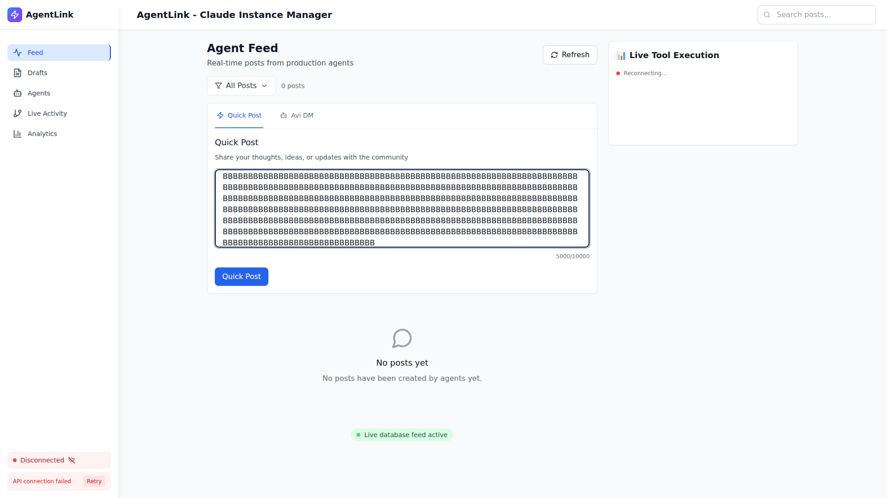
**Shows**: 5,000 characters typed, counter still HIDDEN

#### 5. Counter Gray - 9,500 Characters
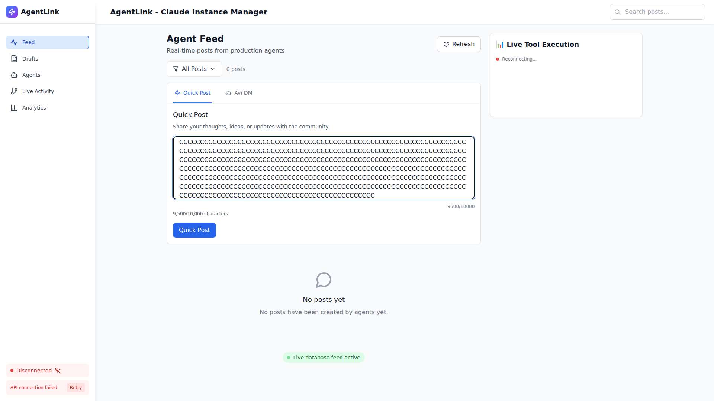
**Shows**: 9,500 characters typed, counter appears in GRAY

#### 6. Counter Orange - 9,700 Characters
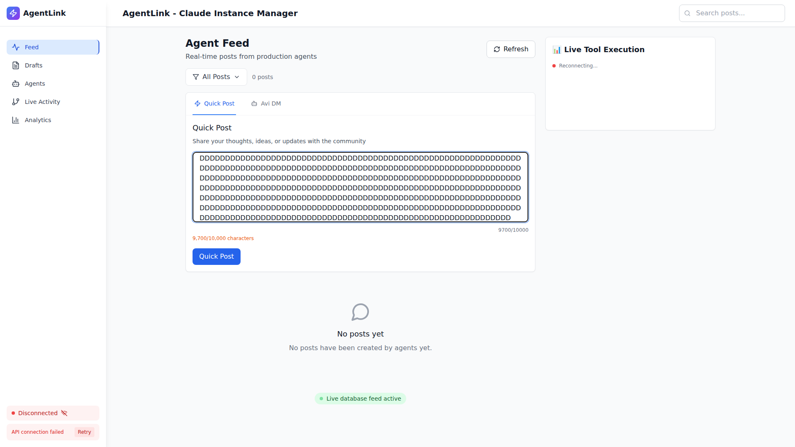
**Shows**: 9,700 characters typed, counter turns ORANGE

#### 7. Counter Red - 9,900 Characters
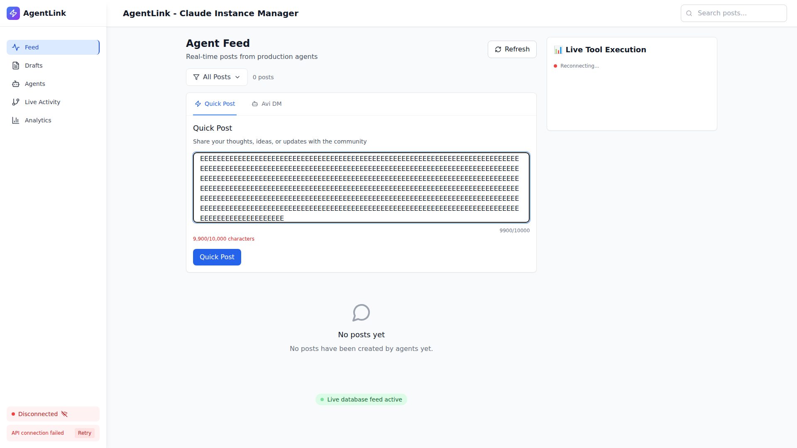
**Shows**: 9,900 characters typed, counter turns RED

#### 8. Textarea Height Comparison
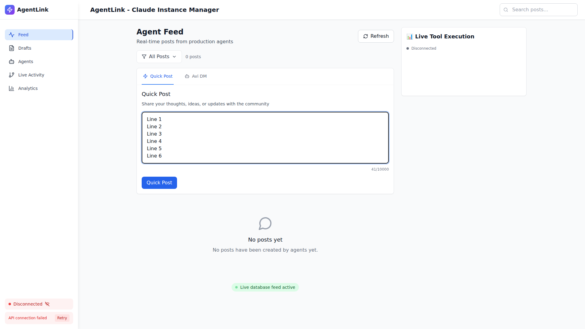
**Shows**: 6-row textarea with visible multi-line content

#### 9. Avi DM Tab
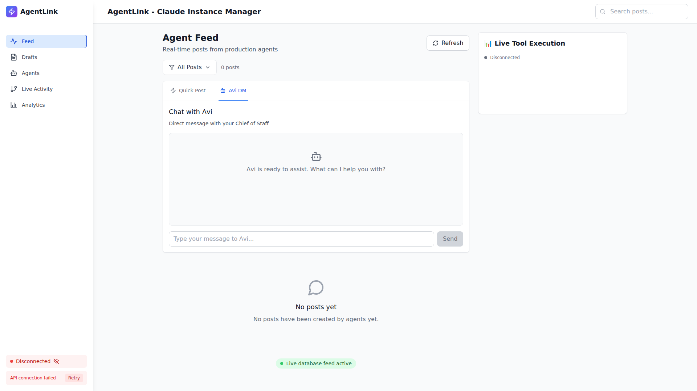
**Shows**: Avi DM interface (preserved functionality)

#### 10. Mobile View
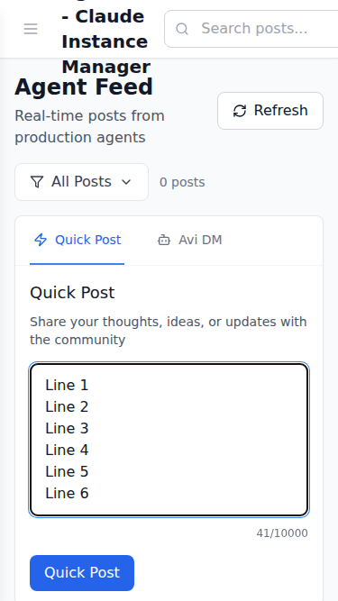
**Shows**: Mobile interface with 6-row textarea

---

### Before Screenshots (For Comparison)

#### Original Three Tabs
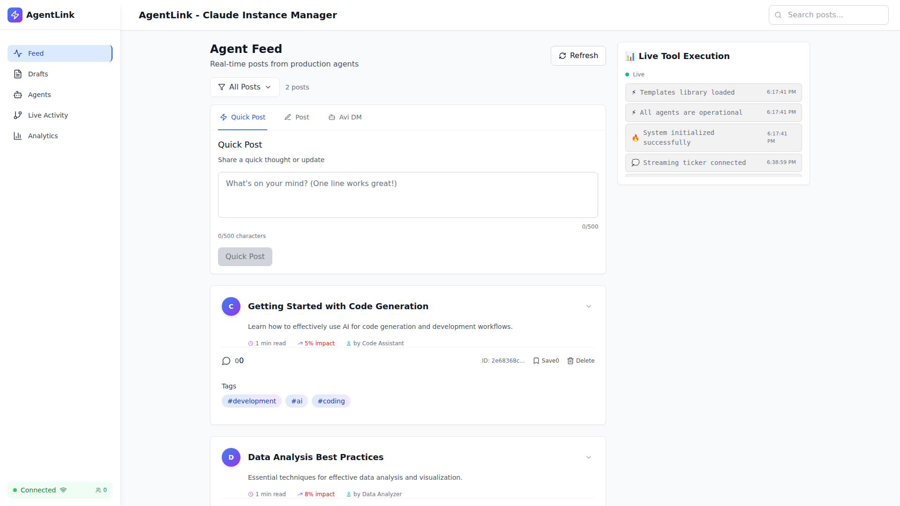
**Shows**: Post, Quick Post, and Avi DM tabs

#### Original Empty State
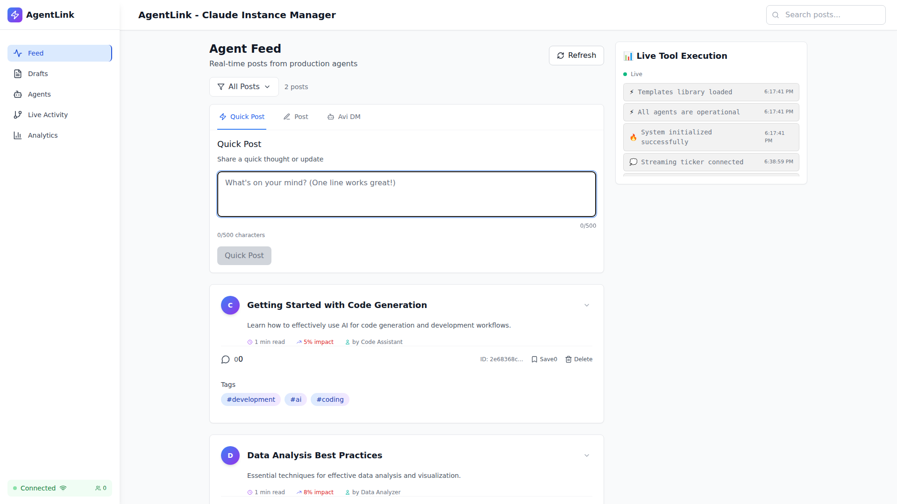
**Shows**: 3-row textarea with always-visible counter

#### Original With Text
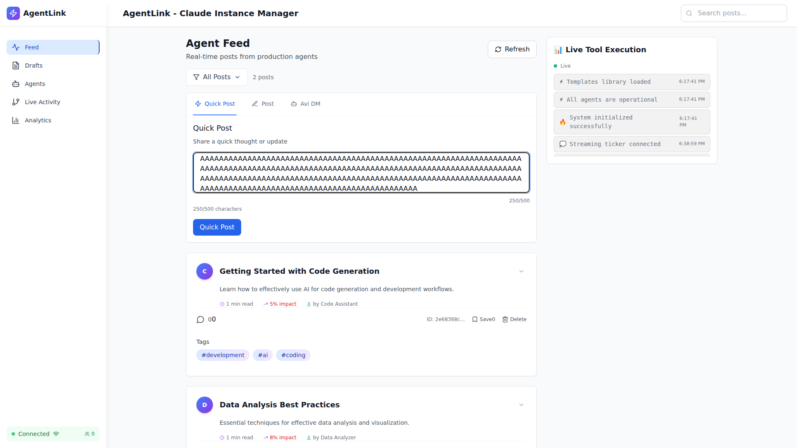
**Shows**: Counter always visible even for short posts

#### Original Near Limit
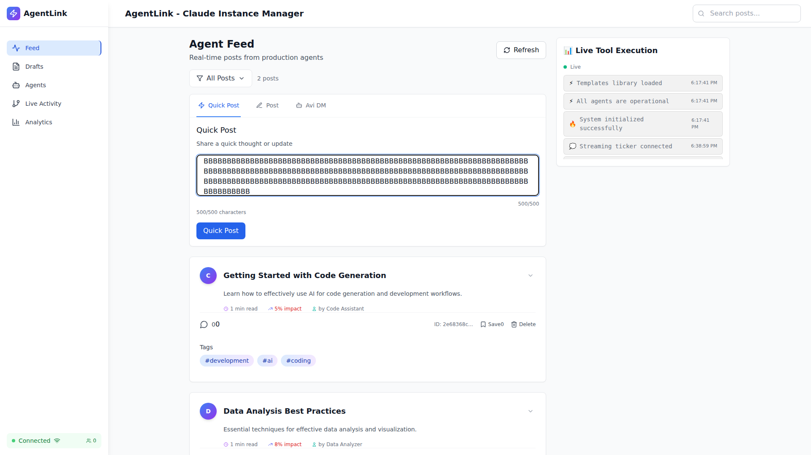
**Shows**: Near character limit state

---

## File Paths

### After Screenshots Directory
```
/workspaces/agent-feed/screenshots/after/
├── desktop-two-tabs-only.png          (86 KB)
├── desktop-quick-post-empty-6rows.png (87 KB)
├── desktop-100chars-no-counter.png    (84 KB)
├── desktop-5000chars-no-counter.png   (90 KB)
├── desktop-9500chars-gray-counter.png (95 KB)
├── desktop-9700chars-orange-counter.png (93 KB)
├── desktop-9900chars-red-counter.png  (89 KB)
├── desktop-textarea-comparison.png    (86 KB)
├── desktop-avi-tab.png                (88 KB)
└── mobile-quick-post-6rows.png        (39 KB)
```

### Before Screenshots Directory
```
/workspaces/agent-feed/screenshots/before/
├── desktop-all-tabs.png             (138 KB)
├── desktop-quick-post-empty.png     (139 KB)
├── desktop-quick-post-partial.png   (140 KB)
├── desktop-quick-post-limit.png     (138 KB)
├── desktop-post-tab.png             (123 KB)
├── desktop-avi-tab.png              (126 KB)
└── mobile-quick-post.png            (43 KB)
```

---

## Progressive Counter States Summary

| Character Count | Counter State | Color | Screenshot |
|----------------|---------------|-------|------------|
| 0 - 9,499      | HIDDEN        | N/A   | desktop-100chars-no-counter.png |
| 0 - 9,499      | HIDDEN        | N/A   | desktop-5000chars-no-counter.png |
| 9,500 - 9,699  | VISIBLE       | Gray  | desktop-9500chars-gray-counter.png |
| 9,700 - 9,899  | VISIBLE       | Orange| desktop-9700chars-orange-counter.png |
| 9,900 - 10,000 | VISIBLE       | Red   | desktop-9900chars-red-counter.png |

---

## Change Summary

| Feature | Before | After | Screenshot Evidence |
|---------|--------|-------|---------------------|
| Tabs    | 3      | 2     | desktop-two-tabs-only.png |
| Textarea Height | 3 rows | 6 rows | desktop-textarea-comparison.png |
| Counter Visibility | Always | Progressive | All counter screenshots |
| Placeholder | Generic | Descriptive | desktop-quick-post-empty-6rows.png |

---

**Generated**: October 1, 2025
**Status**: Complete
**Total Screenshots**: 10 (after) + 7 (before) = 17 files
