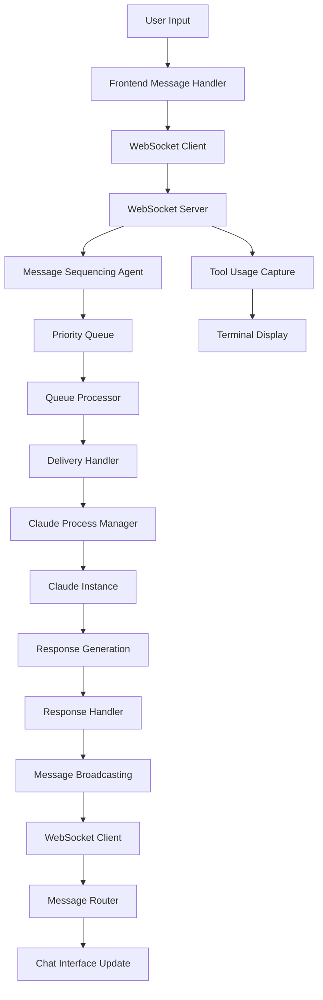
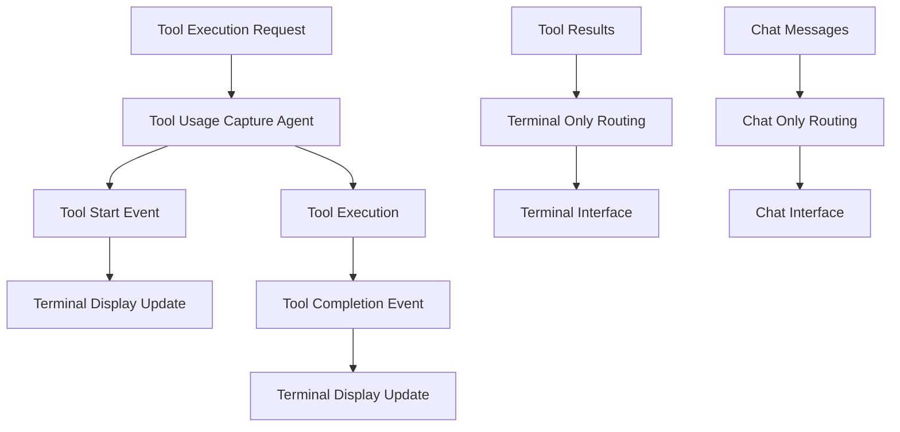

# SPARC Phase 3: Architecture - Enhanced WebSocket Communication System

## System Architecture Overview

### High-Level Architecture Diagram

```
┌─────────────────────────────────────────────────────────────────────────────────┐
│                          Claude Code Integration System                          │
├─────────────────────────────────────────────────────────────────────────────────┤
│                                Frontend Layer                                   │
│  ┌─────────────────┐  ┌─────────────────┐  ┌─────────────────┐                │
│  │   Chat View     │  │  Terminal View  │  │   Split View    │                │
│  │                 │  │                 │  │                 │                │
│  │ - Sequenced     │  │ - Tool Usage    │  │ - Both Views    │                │
│  │   Messages      │  │ - System Logs   │  │ - Independent   │                │
│  │ - Retry         │  │ - Error Output  │  │   Scrolling     │                │
│  │   Indicators    │  │ - Real-time     │  │                 │                │
│  └─────────────────┘  └─────────────────┘  └─────────────────┘                │
│                                    │                                            │
│  ┌─────────────────────────────────┴─────────────────────────────────┐        │
│  │                    Enhanced WebSocket Client                      │        │
│  │                                                                   │        │
│  │ - Connection Management        - Message Routing                  │        │
│  │ - Auto-reconnection           - Sequence Tracking                │        │
│  │ - Message Queueing            - Event Handling                   │        │
│  └─────────────────────────────────┬─────────────────────────────────┘        │
└─────────────────────────────────────┼─────────────────────────────────────────┘
                                      │
                                      │ WebSocket Connection
                                      │
┌─────────────────────────────────────┼─────────────────────────────────────────┐
│                                Backend Layer                                   │
│  ┌─────────────────────────────────┴─────────────────────────────────┐        │
│  │                Enhanced WebSocket Server                          │        │
│  │                                                                   │        │
│  │ - Socket.IO Server            - Room Management                   │        │
│  │ - Connection Pooling          - Message Broadcasting             │        │
│  │ - Event Routing               - Error Handling                   │        │
│  └─────────────────┬───────────────┬─────────────────┬───────────────┘        │
│                    │               │                 │                        │
│  ┌─────────────────┴──┐  ┌─────────┴─────────┐  ┌───┴─────────────────┐      │
│  │ Message Sequencing │  │ Tool Usage        │  │ Connection          │      │
│  │ Agent              │  │ Capture Agent     │  │ Manager             │      │
│  │                    │  │                   │  │                     │      │
│  │ - Sequence IDs     │  │ - Tool Tracking   │  │ - Health Checks     │      │
│  │ - Retry Logic      │  │ - Terminal        │  │ - Load Balancing    │      │
│  │ - Queue Management │  │   Display         │  │ - Failover          │      │
│  │ - Priority Handling│  │ - Event Capture   │  │                     │      │
│  └────────────────────┘  └───────────────────┘  └─────────────────────┘      │
│                                    │                                            │
│  ┌─────────────────────────────────┴─────────────────────────────────┐        │
│  │                    Claude Process Manager                         │        │
│  │                                                                   │        │
│  │ - Instance Lifecycle          - Process Monitoring               │        │
│  │ - Resource Management         - Health Monitoring                │        │
│  │ - Command Execution           - Performance Metrics              │        │
│  └───────────────────────────────────────────────────────────────────┘        │
└─────────────────────────────────────────────────────────────────────────────────┘
```

## Component Architecture

### 1. Enhanced WebSocket Server Architecture

```typescript
interface WebSocketServerArchitecture {
  // Core Components
  socketIOServer: SocketIOServer;
  messageSequencingAgent: BackendMessageSequencingAgent;
  toolUsageCaptureAgent: ToolUsageCaptureAgent;
  connectionManager: ConnectionManager;
  
  // Message Channels
  channels: {
    chat_messages: Channel;      // User/AI conversation
    system_messages: Channel;    // Status, errors, notifications
    tool_usage: Channel;         // Tool execution events
    heartbeat: Channel;          // Connection health
  };
  
  // Room Management
  rooms: {
    [instanceId: string]: {
      clients: Set<string>;
      messageQueue: MessageQueue;
      connectionPool: ConnectionPool;
    };
  };
  
  // Event System
  eventBus: EventEmitter;
  eventHandlers: Map<string, EventHandler>;
}
```

### 2. Message Sequencing Architecture

```typescript
interface MessageSequencingArchitecture {
  // Queue System
  queues: Map<string, PriorityQueue<SequencedMessage>>;
  processors: Map<string, QueueProcessor>;
  
  // Sequence Management
  sequenceCounters: Map<string, AtomicCounter>;
  sequenceTracking: Map<string, SequenceTracker>;
  
  // Retry System
  retryScheduler: ExponentialBackoffScheduler;
  maxRetries: number;
  retryIntervals: number[];
  
  // Delivery System
  deliveryHandlers: Map<MessageType, DeliveryHandler>;
  deliveryConfirmation: DeliveryConfirmationSystem;
  
  // Performance Monitoring
  metrics: {
    messagesProcessed: Counter;
    averageLatency: Histogram;
    failureRate: Gauge;
    queueDepth: Gauge;
  };
}
```

### 3. Frontend Client Architecture

```typescript
interface WebSocketClientArchitecture {
  // Connection Management
  socket: Socket;
  connectionState: ConnectionState;
  reconnectionStrategy: ReconnectionStrategy;
  
  // Message Management
  messageBuffer: CircularBuffer<Message>;
  sequenceTracker: ClientSequenceTracker;
  messageRouter: MessageRouter;
  
  // UI Integration
  chatInterface: ChatInterfaceController;
  terminalInterface: TerminalInterfaceController;
  splitViewManager: SplitViewManager;
  
  // State Management
  stateStore: ClientStateStore;
  eventDispatcher: EventDispatcher;
}
```

## Data Flow Architecture

### 1. Message Flow Diagram



### 2. Tool Usage Flow Diagram



## Interface Contracts

### 1. WebSocket Message Contracts

```typescript
// Chat Message Contract
interface ChatMessageContract {
  type: 'claude_message';
  instanceId: string;
  message: {
    id: string;
    sequenceId: number;
    type: 'user' | 'assistant' | 'system';
    content: string;
    timestamp: string;
    metadata?: {
      tokensUsed?: number;
      duration?: number;
      model?: string;
      retryCount?: number;
    };
  };
}

// Tool Usage Contract
interface ToolUsageContract {
  type: 'tool_usage';
  instanceId: string;
  toolId: string;
  toolName: string;
  operation: string;
  timestamp: string;
  status: 'started' | 'completed' | 'failed';
  result?: {
    success: boolean;
    output?: string;
    error?: string;
    duration: number;
  };
}

// System Message Contract
interface SystemMessageContract {
  type: 'system_message';
  instanceId: string;
  severity: 'info' | 'warning' | 'error';
  message: string;
  timestamp: string;
  metadata?: Record<string, any>;
}
```

### 2. Agent Interface Contracts

```typescript
// Message Sequencing Agent Interface
interface MessageSequencingAgentInterface {
  enqueueMessage(
    instanceId: string,
    type: MessageType,
    content: string,
    metadata?: MessageMetadata,
    callback?: (error?: Error) => void
  ): string;
  
  getQueueStats(instanceId?: string): QueueStatistics;
  shutdown(): void;
  
  // Events
  on(event: 'messageQueued', listener: (message: SequencedMessage) => void): void;
  on(event: 'messageDelivered', listener: (message: SequencedMessage) => void): void;
  on(event: 'messageFailed', listener: (message: SequencedMessage, error: Error) => void): void;
}

// Tool Usage Capture Agent Interface
interface ToolUsageCaptureAgentInterface {
  captureToolExecution(
    instanceId: string,
    toolName: string,
    operation: string,
    parameters?: Record<string, any>
  ): string;
  
  completeToolExecution(
    toolId: string,
    success: boolean,
    output?: string,
    error?: string,
    duration?: number
  ): void;
  
  registerTerminalDisplay(instanceId: string, display: TerminalDisplay): void;
  getToolStats(): ToolStatistics;
}
```

## Scalability Architecture

### 1. Horizontal Scaling Support

```typescript
interface ScalabilityArchitecture {
  // Load Balancing
  loadBalancer: LoadBalancer;
  serverPool: WebSocketServerPool;
  
  // Session Affinity
  sessionStore: RedisSessionStore;
  stickySession: StickySessionManager;
  
  // Message Distribution
  messageDistributor: MessageDistributor;
  shardingStrategy: ConsistentHashSharding;
  
  // Resource Management
  resourceMonitor: ResourceMonitor;
  autoScaler: AutoScaler;
}
```

### 2. Performance Optimization

```typescript
interface PerformanceArchitecture {
  // Connection Optimization
  connectionPooling: ConnectionPooling;
  keepAliveManager: KeepAliveManager;
  
  // Message Optimization
  messageBatching: MessageBatcher;
  compressionHandler: CompressionHandler;
  
  // Memory Management
  memoryPool: MemoryPool;
  garbageCollector: GarbageCollector;
  
  // Caching Layer
  messageCache: LRUCache;
  sequenceCache: SequenceCache;
}
```

## Security Architecture

### 1. Authentication & Authorization

```typescript
interface SecurityArchitecture {
  // Authentication
  authenticationProvider: AuthenticationProvider;
  tokenValidator: JWTTokenValidator;
  sessionManager: SessionManager;
  
  // Authorization
  permissionSystem: PermissionSystem;
  roleManager: RoleManager;
  
  // Security Measures
  rateLimiter: RateLimiter;
  ddosProtection: DDoSProtection;
  inputValidator: InputValidator;
  
  // Audit System
  auditLogger: AuditLogger;
  securityMonitor: SecurityMonitor;
}
```

## Error Handling Architecture

### 1. Error Recovery System

```typescript
interface ErrorHandlingArchitecture {
  // Error Classification
  errorClassifier: ErrorClassifier;
  errorSeverityAssigner: ErrorSeverityAssigner;
  
  // Recovery Strategies
  reconnectionStrategy: ExponentialBackoffStrategy;
  messageRecoveryStrategy: MessageRecoveryStrategy;
  failoverStrategy: FailoverStrategy;
  
  // Circuit Breaker
  circuitBreaker: CircuitBreaker;
  healthChecker: HealthChecker;
  
  // Monitoring & Alerting
  errorMonitor: ErrorMonitor;
  alertSystem: AlertSystem;
}
```

## Monitoring & Observability

### 1. Metrics Collection Architecture

```typescript
interface MonitoringArchitecture {
  // Metrics Collection
  metricsCollector: MetricsCollector;
  customMetrics: CustomMetrics;
  
  // Performance Monitoring
  performanceTracker: PerformanceTracker;
  latencyMonitor: LatencyMonitor;
  throughputMonitor: ThroughputMonitor;
  
  // Health Monitoring
  healthEndpoints: HealthEndpoints;
  systemHealthChecker: SystemHealthChecker;
  
  // Logging
  structuredLogger: StructuredLogger;
  logAggregator: LogAggregator;
  
  // Tracing
  distributedTracing: DistributedTracing;
  requestTracing: RequestTracing;
}
```

## Deployment Architecture

### 1. Container Architecture

```yaml
services:
  websocket-server:
    image: claude-code/websocket-server:latest
    replicas: 3
    resources:
      limits:
        memory: 1Gi
        cpu: 500m
      requests:
        memory: 512Mi
        cpu: 250m
    
  message-sequencing:
    image: claude-code/message-sequencing:latest
    replicas: 2
    resources:
      limits:
        memory: 512Mi
        cpu: 250m
        
  tool-capture:
    image: claude-code/tool-capture:latest
    replicas: 2
    resources:
      limits:
        memory: 256Mi
        cpu: 125m
        
  frontend:
    image: claude-code/frontend:latest
    replicas: 2
    resources:
      limits:
        memory: 256Mi
        cpu: 125m
```

### 2. Infrastructure Requirements

```typescript
interface InfrastructureRequirements {
  // Compute Resources
  minCPU: '2 cores per instance';
  minRAM: '4GB per instance';
  recommendedCPU: '4 cores per instance';
  recommendedRAM: '8GB per instance';
  
  // Network Requirements
  bandwidthPerInstance: '10 Mbps';
  latencyRequirement: '<50ms P95';
  
  // Storage Requirements
  logStorage: '10GB per month per instance';
  metricStorage: '1GB per month per instance';
  
  // High Availability
  minReplicas: 2;
  maxReplicas: 10;
  autoScalingThreshold: '70% CPU or Memory';
}
```

## Integration Points

### 1. External System Integration

```typescript
interface IntegrationArchitecture {
  // Claude Code Integration
  claudeProcessManager: ClaudeProcessManagerInterface;
  claudeInstanceAPI: ClaudeInstanceAPI;
  
  // Monitoring Integration
  prometheusMetrics: PrometheusMetricsExporter;
  grafanaDashboards: GrafanaDashboardConfig;
  
  // Logging Integration
  elasticsearchLogs: ElasticsearchLogShipper;
  kibanaVisualization: KibanaConfig;
  
  // Alert Integration
  slackNotifications: SlackNotificationService;
  pagerDutyAlerts: PagerDutyIntegration;
}
```

## Next Phase: Refinement Implementation
Proceed to TDD implementation and concurrent deployment of all SPARC components.